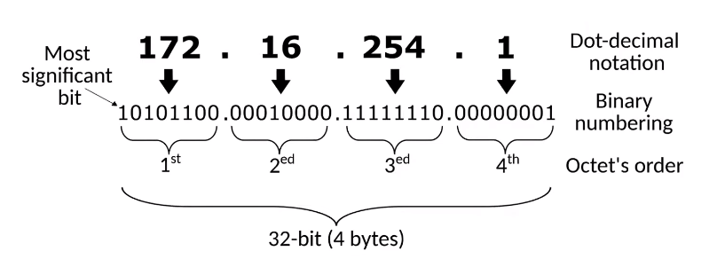
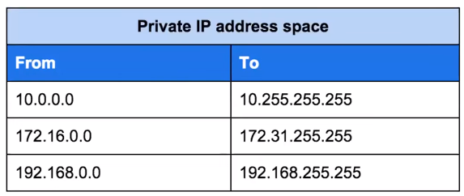
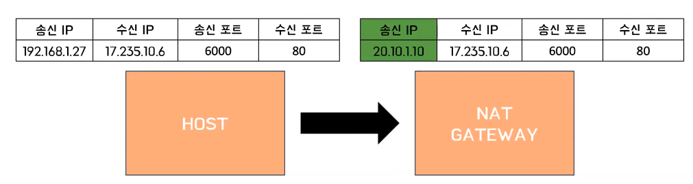
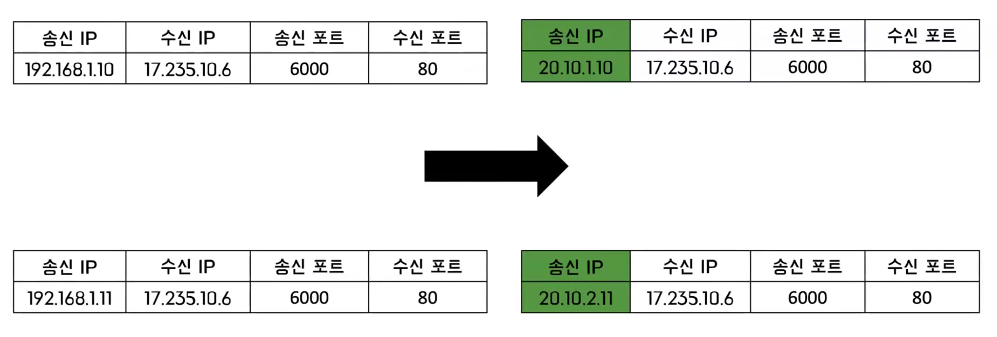
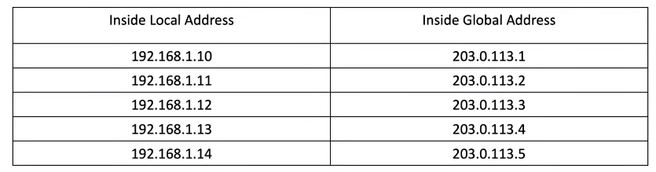
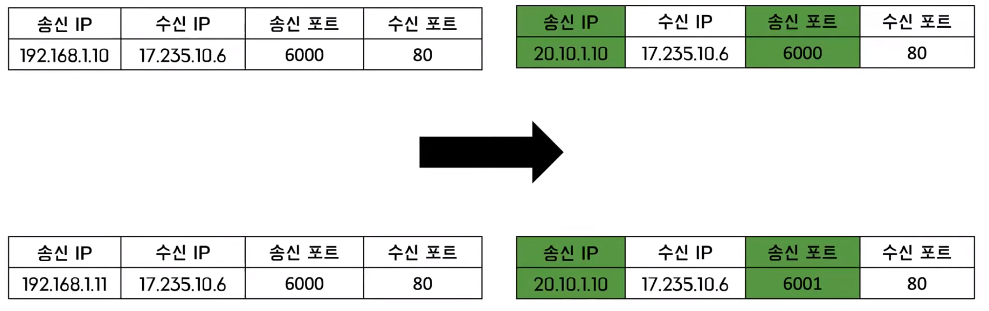
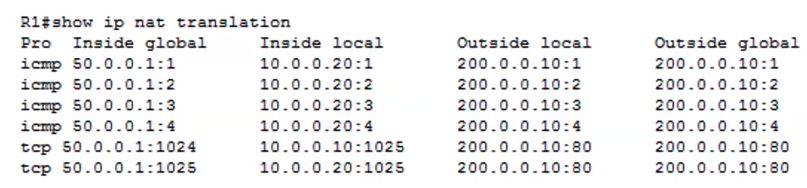

# 에밀의 IP
[https://youtu.be/dXhjPVDLCTg?si=yf6Qlw1JIx0K_iGh](https://youtu.be/dXhjPVDLCTg?si=yf6Qlw1JIx0K_iGh)

# 에밀의 IP
* toc
{:toc}

##  IPv4가 봉착한 문제
+ 
+ IPv4는 4개의 파트로 구성이 되어 있는데 각 파트당 8비트로 구성된다 그렇기 때문에 총 32비트가 나온다 그래서 총 2의 32승 개의 서로 다른 주소를 표현을 할 수가 있다
+ 대략 42억 9496만 7296개의 주소를 표현할 수 있다
+ 미국에 존재하는 총 네트워크 호스트의 개수
  + 계산 과정은 가정당 평균 호스트의 개수 * 곱하기 총 가정의 수이다
  + 가정당 평균 호스트의 개수가 제가 검색을 해보니까 대충 22개 정도 나온다 그리고 가정의 수가 대충 1억 2천 3백만개 정도 가정이 있으니까 두 개를 곱해보면 27억 개의 호스트 개수가 나온다
+ 42억 개 거기서 27억을 빼면 대충 15억이다 그리고 미국 인구가 3억이니까 78억에서 3억을 빼면 75억 그러면 75억 명이 15억 개의 주소를 나눠서 써야 된다라는 문제에 봉착을 하게된다
+ 그래서 이제 일부 주소를 빼놓고 그 주소는 이제 LAN 내부적으로만 사용을 하고 외부와 통신할 때만 퍼블릭 IP를 할당해주자 라는 아이디어를 내게된다
+ 
+ 여기서 말하는 일부 주소라는게 프라이빗 IP인데 이 IP 대역들은 랜 내부에서만 사용하는 용도로 사용하자 그러니까 랜끼리는 이제 중복이 되어도 되지만 랜 내부에서는 유니크 해야 된다 이런 용도로 사용하는 것이다
  그렇게 해서 사용되는 기술이 바로 NAT이다

## NAT
+ NAT는 IP 헤더에 있는 네트워크 주소 정보를 수정해서 다른 주소로 변환을 해주는 기술이다
+ 
+ 프라이빗 IP 로 패킷을 보내면 NAT Gateway라는 곳 이제 외부 네트워크와 통신을 하는 어떤 관문 같은 역할을 한다고 보면 된다
  거기서 주소를 자기한테 할당받은 아이피로 맵핑을 해준다 이것이 이제 Static NAT라는 것이다

## Static NAT
+ Static NAT는 하나의 퍼블릭 IP를 하나의 프라이빗 IP와 맵핑하는 기술이다
+ 1대1로 맵핑을 해버리게 되면은 주소를 전혀 줄이지를 못하고 주소 고갈 문제를 전혀 해결하지 못하는데 이걸 쓰는 이유는 바로 우리가 서버 호스트 서버는 IP가 변경되면 안된다 그럴 때 이제 호스트가 일정한
  IP주소를 할당받아야 될 때 사용하게 된다 

## Dynamic NAT
+ 여러 퍼블릭 IP를여러 프라이빗 IP와 동적으로 맵핑하는 기술
+ 
+ Nat Gateway에서 주소 풀이 있다 이 주소 풀에서 이제 네트워크에 참여하고 싶다 하는 호스트가 있을 때 선착순으로 하나씩 할당을 해 준다
+ 
+ 송신 IP가 위아래가 서로 다른 것을 확인할 수 있다 그리고 이것이 변환이 되어가지고 서로 다른 IP로 할당이 되었다 이렇게 변환이 되게 되면은 NAT 테이블이 나오게 된다
+ 
+ 이제 할당받은 public IP가 좀 충분하고 호스트가 고정 IP를 가질 필요가 없을 때 사용하게 된다
+ 그래도 이것도 좀 충분하지 않은 것 같다 만약 내가 IP를 하나만 할당받았으면 어떡해요? 라고 해서 나온 것이 바로 이 PAT이다

## PAT(Port Address Translation)
+ 이것은 여러 Private IP 주소를 하나의 IP 주소로 맵핑하는 기술이다
+ 하나의 IP 주소만 있는데 다른 호스트를 식별할 수 있는 이유는 포트를 다르게 함으로써 서로 다른 호스트를 식별할 수가 있다 
+ 
+ 다른 IP로 패킷을 보낸다 근데 송신 IP가 변환이 되고 나니까 같은 것을 확인할 수가 있다 다만 포트 번호가 달라졌다 이런 식으로 포트로 서로 다른 호스트를 식별을 하게 된다
+ 
+ NAT 테이블인데 여기 inside global이라고 적혀있는 부분이 이제 외부에 공개되는 public IP라고 보면 된다 
+ inside local이 이제 localhost의 private IP라고 보면 된다
+ public IP의 IP 주소가 전부 다 동일한 것을 확인할 수가 있다 포트 번호만 전부 다 다르게 할당이 되었다 이런 식으로 주소 변환을 하게 돼서 공개를 하게 된다
+ 이것은 굉장히 제한된 IP 주소만 가지고 있을 때 그리고 어떤 호스트도 고정 주소를 가질 필요가 없을 때 사용을 하게 된다 
