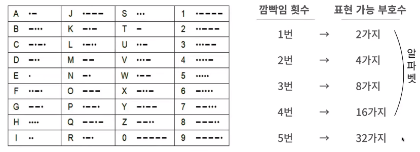
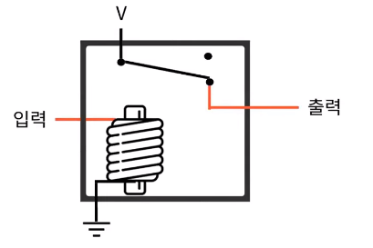
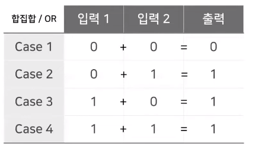
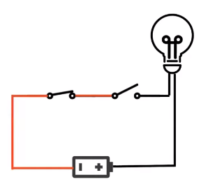
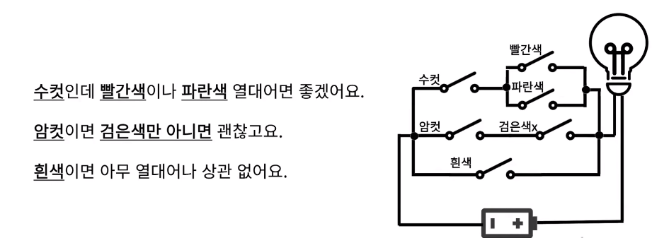
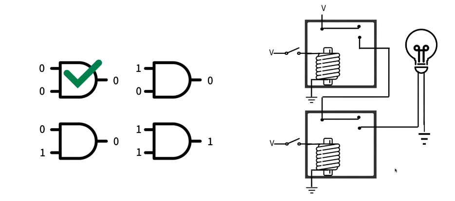
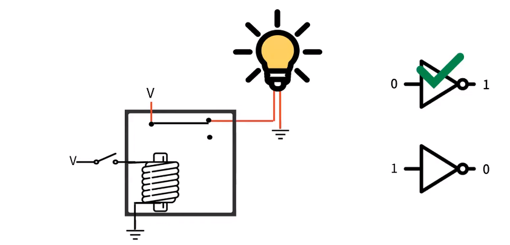
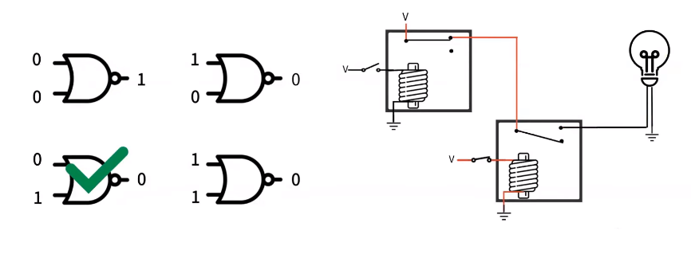

# 로이의 비트와 논리게이트
[https://youtu.be/GhEZlj3Kv9Y?si=Lk2AWPs4YTu4etXu](https://youtu.be/GhEZlj3Kv9Y?si=Lk2AWPs4YTu4etXu)

# 로이의 비트와 논리게이트
* toc
{:toc}

## 신호와 부호
+ 신호를 위키피디아에서 찾아보면 일정한 부호를 사용해서 떨어져 있는 사람끼리 통신하는 통신법
+ CODE(부호)란? 정보 전달 체계이다 
+ 정보 전달 체계는 상황에 따라서 달라질 수 있다 
  + 말이라는 부호로 소통
  + 건물 외벽에 있는 전구를 통해서 소통

### 전구로 신호 전달하기
+ 
+ 가장 쉽게 생각할 수 있는 부호 체계는 전등 한 번 깜빡일 때 A, 두 번 깜빡일 때 B  Z는 26번 이런 방식인데 이렇게 WATER를 표현하려면 총 67번을 깜빡여야 된다
+ 부호의 기호를 하나 더 늘려 보면 깜빡과 까암빡 이런 식으로 조합해서 사용하면 10번이면 WATER를 표현할 수 있다
+ 컴퓨터도 마찬가지다 1과 0 두 가지인데 이 두 가지의 힘이 생각보다 크다 이런 부호 체계를 모스 부호라고 한다

### 기호의 수와 그 조합
+ 
+ 한 번을 깜빡이면 두 가지 부호를 표현할 수 있다
+ 깜빡임 횟수를 두 번으로 늘리면 네 가지 부호를 표현할 수 있다
+ 횟수를 4번까지 확장하면 26가지 경우의 수, 알파벳을 모두 다 표현할 수 있다
+ 그러니까 한 번의 깜빡임으로는 고작 두 개의 부호밖에 표현을 못하지만 복잡한 정보를 표현하기 위해서는 이 깜빡임 횟수를 늘리면 된다
+ 컴퓨터가 이런 원리로 작동을 한다
+ 이 깜빡과 까암빡이라는 두 가지 기호를 숫자 체계로 대입하면 이진수가 된다 

## 이진수와 비트
+ 비트란 하나의 이진수를 말한다
+ 여기서는 이제 깜빡임 한 번 이다
+ 근데 이 비트의 의미를 부여하자면 정보 처리의 기본 단위라고 표현할 수가 있다

## 스위치, 전선, 전등 그리고 릴레이

### 스위치, 전선, 전등
+ 그럼 왜 컴퓨터는 굳이 십진수가 아니라 이진수를 선택했냐 회로로 표현하기 쉬워서 그렇다
  + 스위치가 열린다/닫힌다. 두가지
  + 전구가 꺼진다/켜진다. 두가지

### 릴레이
+ 
+ 기호를 하나 더 알아야 되는데 릴레이라는 기호이다 이거는 전자석의 원리를 이용해서 스위치를 사람 손이 아니라 자동으로 조정하는 기구이다
+ 쇠막대기에 전선이 감겨 있는데 여기 전류가 흐르게 되면 자석이 되고 그러면 이 위에 스위치가 딸려 내려오면서 출력부로 전류가 흐르는 형태이다

## 논리와 스위치
+ 부울 대수(Boolean algebra)
  + 부울 대수는 덧셈과 곱셈 같은 연산자를 숫자가 아니라 집합에 적용을 한 것이다 
  + 그래서 전체 집합은 1로 나타내고 공집합은 0으로 나타낸다
+ 연산자 + 
  + 
  + 덧셈 연산자는 이제 합집합과 OR 연산을 나타내는데 표에 보면 입력 1, 2랑 출력이 있다
  + 공집합 더하기 공집합은 공집합이고 공집합 더하기 전체 집합은 전체 집합이다
  + 전체 더하기 전체도 전체이다
  + 
  + OR연산 같은 경우는 둘 다 입력이 0일 경우에만 0이고 나머지 케이스는 다 1인 그런 체계를 나타낸다
+ 연산자 x 
  +  
  + 연산자 x 같은 경우에는 AND / 교집합을 나타낸다
  + Case 4 보시면 입력이 (1, 1)일 때 출력이 1이 나오고 나머지 케이스는 다 0이 나온다
  + 
  + 스위치를 하나만 닫았을 때는 불이 안 들어오는데 입력이 (1, 1)이 되면 출력도 1이 된다

### 논리 검사
+ 
+ 이렇게 복잡한 논리도 회로로 표현할 수가 있다
+ 근데 보면 스위치가 되게 많다 그래서 사람 손이 이렇게 한계가 있으니까 이걸 대체하기 위해 릴레이를 사용한다
+ 그래서 릴레이를 직렬과 병렬로 조합해서 논리를 표현하게 되면 그게 논리 게이트가 된다

## 논리 게이트

### AND 게이트
+ 
+ AND 게이트 보면 기호가 D의 모양처럼 생겼다
+ 왼쪽에 숫자 두 개는 입력이고 오른쪽 숫자 하나는 출력이다
+ 오른쪽 밑에 기호 보면은 (1, 1)일 때 1이고 나머지 출력은 다 0이다
+ 이거를 릴레이 두 개로 표현할 수가 있다 두 개 다 닫아야지만 불이 들어온다

### OR 게이트
+ 
+ OR 게이트는 여기 기호 왼쪽에 보면 이렇게 O자처럼 좀 둥글게 생겼다
+ 이거는 릴레이 두 개를 병렬로 연결하면 만들 수 있다
+ 스위치 두 개가 열려 있을 때는 불이 안 들어오다가하나만 닫더라도 불이 들어오게된다

### 인버터
+ 
+ 인버터는 이 입력과 출력을 스위칭시키는 역할을 한다
+ 아까 전에 이 출력부에 있는 이 전구의 선이 이 밑에 점에 달려 있었다 근데 지금은 위에 점으로 올라간 게 특징이다
+ 그래서 스위치를 닫았음에도 지금 불이 안 들어온다 이게 1 -> 0의 상태이다
+ 반대로 스위치를 떼버리면 불이 들어온다 이건 0 -> 1의 상태이다 

### NOR 게이트 
+ 
+ 이러한 논리 구조, 릴레이를 가지고 NOR와 NAND 게이트도 만들 수 있는데 NOR는 NOT OR입니다, OR의 정반대라고 보면 된다
+ OR 같은 경우에는 맨 왼쪽 위에 보면은 그 기호에, OR 기호에 동그라미가 하나 붙어 있다
+ 그래서 OR는 입력 (0, 0)일 때 0이었는데 NOR는 반대로 1이 된다
+ 그리고 나머지는 0이 되는 구조이다
+ 이거는 아까 인버터에 나왔던 릴레이 두 개를 직렬로 연결하면 된다 
+ 스위치 두 개 다 열려 있을 때 불이 들어오고 하나만 닫아 버려도 불이 꺼진다 두 개 다 닫아도 불이 꺼진다

### NAND 게이트
+ 
+ AND가 (1, 1)일 때 원래 1이었다 근데 NAND는 정반대입니다 0이고 나머지 케이스의 출력은 다 1이 되는 구조이다
+ 이거는 인버터에서 나왔던 릴레이 두개를 병렬로 연결하면 된다
+ (0, 0)일 때 불이 켜져있고 하나만 스위치를 닫더라도 불은 유지가 되고 둘 다 닫아 버리면 이제 불이 꺼지는 그런 회로 구조이다

