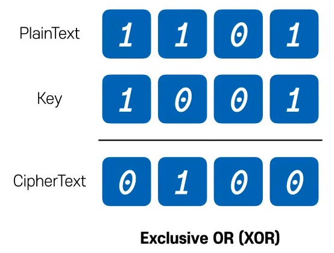
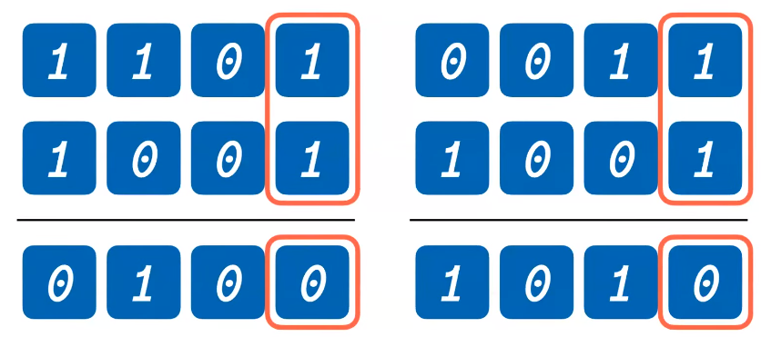

# 에코의 암호 ( 고급 암호화 표준 AES )
[https://youtu.be/lAiUkGB9VSo?si=6I52Dqhhal4dtGkK](https://youtu.be/lAiUkGB9VSo?si=6I52Dqhhal4dtGkK)

# 에코의 암호 ( 고급 암호화 표준 AES )
* toc
{:toc}

## AES (Advanced Encryption Standard)
+ AES는 2001년 11월 미국 표준 기술 연구소에서 FIPS 197, AES라는 이름으로 Rijndael 알고리즘을 표준으로 선정했다
+ Rijndael 알고리즘이 곧 AES라고 생각면 된다
+ NSA 미국 국가안보국에서도 AES를 기밀 정보 암호화에 사용을 승인했다 이 의미는 그만큼 안전하다 이 뜻이다

+  암호 용어 설명
  + 암호에는 PlainText 평문, Key 키가 있고 이 두 가지를 섞어서 암호문을 만들 수 있다 CipherText라고 한다

## 간단한 암호화
+ 
+ 플레인텍스트에 4비트 1101이 있다 그리고 똑같은 키 1001 4비트가 있는데 이를 어떤 연산을 통하면 사이퍼 텍스트를 구할 수 있다
+ 이거는 Exclusive OR, XOR 연산을 통해서 사용을 하는데 암호문에서는 많은 경우 XOR 연산을한다
+ 그 이유는 A XOR 연산 B를 할 경우 0나오면 이때 A, B에 가능한 경우의 수는 11, 00 두가지이다 마찬가지 1일 경우에 A, B를 보면은 10, 01 두가지인데 이 각각이 결국 두가지씩 나오기 때문에 입력값의 확률이 50% 이다
  + AND와 OR의 경우는 그렇지 않다 AND 경우에는 1일 경우에는 11이고 OR 같은 경우에는 0일 경우 00이다 확정되기 때문에 이 암호문으로부터 평문을 유추할 수 있는데 XOR은 그렇지 않다
  + 따라서 암호문으로부터 원문과 키를 비교적 유추하기 어렵다는 성질 때문에 XOR을 사용하고 있다
+ 두 번째는 A XOR B를 해서 C가 나올 경우 이 C를 한 번 더 B와 XOR 연산해 줄 경우 A가 나온다 이 의미는 무엇이냐면 두 번 연산하면 원래 값으로 돌아오고
  또한 암호문의 키를 XOR 연산하면 원문을 얻을 수 있다 이 의미는 복호화하기 매우 쉽다 그래서 XOR을 주로 사용을 한다
+ CipherText 암호문이 0100일 때 PainText와 키의 조합의 가지수는 16가지이다 2의 4승배고 이게 늘어나면 늘어갈수록 2의 N승만큼 늘어난다
+ 그리고 CipherText를 키와 연산할 경우 PlainText 1101을 얻을 수 있음을 알 수 있다 이렇게 때문에 암호화에서 XOR를 되게 많이 사용한다

## XOR 암호화 취약점
+ 다만 XOR만으로 암호화하기는 어렵다

### 예시
+ 
+ 같은 키 1001을 다른 평문 0011을 암호화한다 이때 결과값은 1010인데 이 암호문 두 개만 보면 한 가지를 예측할 수 있다 
+ 바로 마지막 비트를 보면 같은데 이 비트가 같기 때문에 키도 같고 그러면 평론의 마지막 비트도 같겠구나를 예측할 수 있다 
+ 그렇기 때문에 이는 같은 키를 사용하면 원문의 정보를 알 수 있다는 것이다 그래서 암호문으로서는 적합하지 않다

## 안전한 암호화란?
+ 정보 이론으로 유명한 클라우드 쉐넌은 안전한 암호의 두 가지 성질이 필요하다고 한다 바로 혼돈과 확산, Confusion과 Diffusion이다
+ 혼돈의 경우 암호문으로부터 평문을 예측하기 어렵게 한다는 의미고 Diffusion의 경우 암호문으로부터 패턴을 알기 어렵게 하는 것이다
+ 패턴을 알기 어렵게 한다는 게 무엇이냐 하면 평문에 예를 들어서 단어나 어떤 문장이 반복해서 나올 경우에 암호문에서도 그 패턴이 동일하게 나타난다 그렇기 때문에 암호문에서 이 패턴을 숨겨야 되는데 평문을 예측하기 어렵게는
  어떻게 하냐? 치환을 이용한다 Substitution이고 패턴을 알기 어렵게는 Permutation 재배열이다 
+ 그래서 치환의 경우 그냥 다른 값으로 바꿔주는 연산이고 재배열의 경우는 순서를 바꿔준다
+ 이 두 가지를 각각만 사용하는 것은 또 안전하지 않다 이 두 가지를 적절하게 섞어서 키를 마지막에 더해주면 안전해지는데 근데 이 한 번도 사실 그렇게 안전하지 않다 이를 N번 반복해줘야 한다
+ N번 반복하는 것을 N Round라고 하는데 N Round를 사용하는 것이 이제 Substitution-Permutation Network라는 방식이다 이를 줄여서 SP Network라고도 하고 SPN이라고도 한다

## AES 암호화 알고리즘
+ AES 암호화 알고리즘에는 크게 3가지 요소가 있다
+ 첫 번째는 키이다
  + 키 같은 경우는 아까 그 암호화, 복호화 하는데 사용하는 키인데 128 비트, 192 비트, 256 비트 이게 다 각각의 키의 길이인데 AES에서는 이 세 가지 키 길이를 사용한다 256bit로 갈수록 안전해진다는 의미고
    이걸 따서 AES-128, AES-192, AES-256 이렇게 붙은 이름을 가지고 있다
  + 다만 암호화키를 매번 라운드마다 똑같이 사용하는 것은 또한 안전하지 않다 암호문에서 유출을 할 수 있기 때문인데 이 때문에 키를 확장을 시켜줘야한다
  + 키를 어떻게 보면 계속 늘려 나가야 되는데 이 늘려 나가는 방식을 AES Key Schedule이라고 하며 키를 늘려 나갈 때도 치환과 재배열을 통해서 키를 적절하게 늘릴 수 있다 그리고 이 과정을 Key Expansion 과정이라 한다
  + 그래서 AES-128의 경우에는 11개의 키가 나오고 192의 경우 13개 256의 경우 15개의 키가 나온다 이 각각은 라운드 수라고 생각하면 된다
+ AES에는 블럭 사이퍼, 블럭 암호이다
  + 따라서 평문을 128비트의 크기로 쪼개서 암호화를 진행을 하는데 이때 비트를 바이트로 바꾸어 한 칸당 4X4의 그리드로 나타내면 이게 AES에서는 상태라고 부르는 값이다
  + 이 AES 상태에다가 각 연산들을 하게 되는데 이 연산들을 하는 과정을 통해서 암호화를 진행시켜 나갈 것이다
+ SPN
  + SPN은 여러가지 과정이 들어간다
  + KeyExpansion은 키를 아까 확장시켜준다 했는데 라운드를 늘리기 위해서이다 키를 확장을 시켜주고 이 첫 번째 상태, 평문에다가 첫 번째 키를 더해준다 그래서 암호화를 한다
  + SubBytes 이거는 치환 과정이다 S-box라고 불리는 이 박스에다가 값을 넣어서 바꾸는데 이 S-box는 어떻게 생각하면 Lookup Table이라고 보면 된다 이미 값들이 지정이 되어 있고, 맵핑이 되어 있다 1대1 맵핑이며, 비선형 연산이라고도 한다
    그래서 값을 바꾸는데 나머지 값들도 다 한번에 바꿔준다 그래서 상태를 변경시켜 준다
  + 재배열 ShiftRows 이 두 번째 행의 경우 왼쪽으로 한 칸, 세 번째 행의 경우 두 칸, 네 번째 행의 경우 세 칸을 이동시켜서 이 행들의 값들을 재배열 시켜준다 근데 이렇게 행만 값을 바꾸면은 열 값이 섞이지가 않아서 또 안전하지 않다고 하는데
    그래서 MixColumns를 통해 이 열을 섞어줘야 된다 이 열을 섞을 때 어떻게 섞냐면 P-box, AS에서는 이 간단한 행렬을 사용하는데 결과값으로 똑같은 크기의 다른 값들을 가진 열을 하나 만들어 준다고 생각하면 된다
    다만 이 연산 과정에서 곱셈 연산이 들어가는데 이 곱셈 연산은 0 에서 255 범위 즉 8바이트 범위 내에 있다 이 연산에 대해서 조금 더 자세히 알고 싶으면
    Finite Field, Galois Field 라고 해서 유한체에 대해서 검색해 보면은 이 연산에 대해서 조금 더 자세히 알 수 있다
  + 이렇게 행을 다 섞어주고 이 섞은 state 에다가 마지막으로 key를 더해주면은 라운드 하나가 끝난다 
  + 그래서 이거를 SubBytes 부터 ArrRoundKey까지 라운드를 반복해주고 다만 마지막에는 MixColumns를 빼주는데 이유는 이제 암호화를 크게 안전하게 하진 않지만 행열 연산이기 때문에 비용이 조금 더 발생하기 때문에 이를 빼준다고한다 

## AES 복호화
+ 복호화 과정도 XOR 연산을 기반으로 하기 때문에 되게 간단하다 그냥 역으로 실행시켜 주면 된다
+ 그렇기 때문에 이 대칭키 암호화가 빠른 이유이기도 하다

## AES
+ 이 AES를 어떤 한 블럭에 대해서 암호화를 하는 건 됐지만 이 블럭들을 어떻게 암호화할지 이 여러 블럭들을 어떻게 암호화해야 될 지에 대해선 아직 얘기를 하지 않았다
+ 일단 블럭으로 나눌 때 딱 길이가 정해져 있지 않다 만약에 조금 남거나 아니면 꽉 차거나 할 경우에는 그 나머지 값들을 채워줘야 된다 이때 채우는 방식이 Padding 이라고 하고 주로 PKCS 5번, PKCS 7번 이런 식으로 해서
  그 정의된 규약에 따라서 이 패딩을 채워준다 
+ 그 다음은 이제 여러 블럭들이 있을텐데 평문을 쪼갰으니까 이 여러 블럭들을 어떻게 암호화해야 될지를 생각해야 된다 블럭 하나를 AES를 통해서 암호화를 하지만 이 여러 블럭들은 또 다 AES를 어떻게 운영해야 될지 그 운영 방식에 대한 것인데 대표적으로는 ECB, Electronic Codebook 그 다음에 CBC, Cipher Block Chaining 그 다음에 CTR, Counter
  이런 식으로 있다
+ 각각 ECB 같은 경우에는 블럭들을 병렬로 암호화하고 CBC 같은 경우에는 그 이전에 암호화한 블럭을 다음 블럭을 암호화할 때 사용하는 방식이다
+ 카운터는 계속해서 증가하는 값을 암호화해가지고 어떤 난수랑 섞어서 암호화한 다음 그 암호문을 평문이랑 암호화하는 방식으로 사용을한다 
+ 이 각각의 장단점이 있지만 보안상과 성능상의 이유로 요즘은 CTR을 많이 사용한다 

## 예상 답변
+ 속도 문제 없는가?
  + 네, 별로 없습니다 왜냐하면 CPU에 이미 연산셋이 구현되어 있어가지고 되게 빠른 속도로 처리를 할 수 있고 아까 XOR 연산이기 때문에 비대칭키와 비교했을 때도 엄청나게 빠른 속도를 낸다
+ Java는 어떻게 되느냐?
  + 자바는 JEP 164에 의해서 JAVA 8부터 이 AES Instruction set을 사용하고 있다
+ mix columns 연산을 마지막에 왜 빼냐
  + 연산 비용이 비교적 비싸서 마지막에 보안적으로 차이가 없어서 뺀다고 한다
