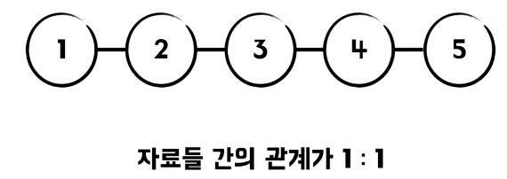
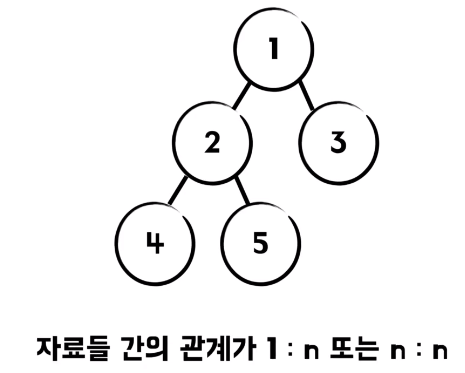
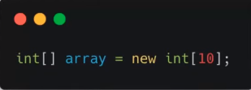
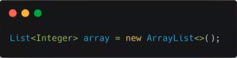
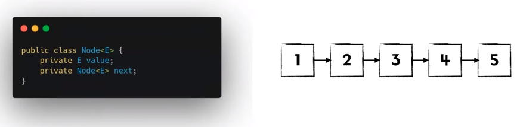
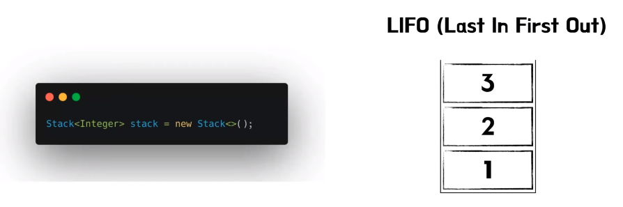
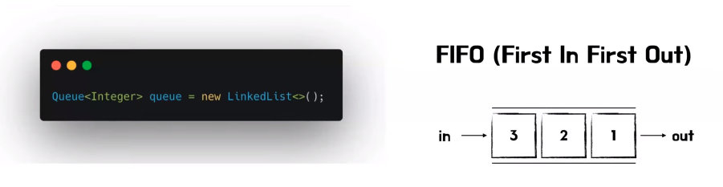
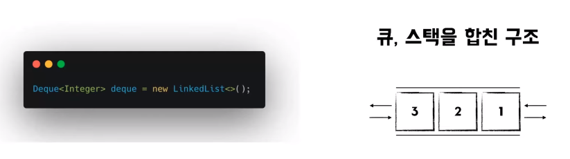

# 매튜의 선형 자료구조
[https://youtu.be/LQL8tXPaQCs?si=_Ywjb5_OdMjl3EhW](https://youtu.be/LQL8tXPaQCs?si=_Ywjb5_OdMjl3EhW)

# 매튜의 선형 자료구조
* toc
{:toc}

## 선형자료구조의 의미
+ 자료구조란 컴퓨터 과학에서 효율적인 접근 및 수정을 가능하게 하는 자료의 조직
  + 우리가 개발할 때 다른 데에 신경을 쓰지 않고 쉽게 개발할 수 있게 도와주는 도구
+ 
+ 자료들 간의 관계가 1대1인 자료구조를 선형 자료구조라고 칭하고 있다
+ 
+ 비선형 자료구조는 자료들 간의 관계가 1 : n 또는 n : n인 자료구조를 말하고 있다

## 선형자료구조 종류 및 설명
+ 그래서 자료 구조의 종류로는 배열, 스택, 큐, 덱 등이 있다

### 배열
+ 
+ 연속적인 메모리 공간을 차지하게 된다
+ 배열의 종류로는 정적 배열과 동적 배열이 존재한다

### 동적 배열
+ 
+ 동적 배열은 내부 필드로 정적 배열을 가지고 있고 동적으로 배열 사이즈를 조절해 주는 자료 구조이다
+ 근데 내부 구현은 사실 정적 배열을 가지고 있고 사이즈가 어느 정도 차게 되면 사이즈를 조금 더 늘려서 선언해 주는 방식을 진행하고 있다
+ 근데 배열을 조회 하기 위해서는 일단 인덱스를 통해서 index array.get 하고 index를 넣어주면 그 해당 번째 요소를 조회하게 된다 그리고 값 수정도 동일한 메커니즘으로 동작하게 된다
+ index를 통하여 접근하면 되기 때문에 조회가 굉장히 빠르다는 장점이 있다
  + 연산당 시간 복잡도가 O(1)
+ 삭제를 살펴보면 remove 하고 똑같이 index를 해주시면 삭제했는데 빈 공간이 생겼다 그리고 삽입했을 때는 빈 공간이 없는데 삽입하려고 한다 이런 경우 빈 공간을 다시 채워주거나
  혹은 이제 공간을 다시 재할당해야 되기 때문에 삽입 삭제 후 혹은 삽입 전에 배열을 다시 선언해야 되기 때문에 배열은 삽입 삭제가 굉장히 느리다 
  + 연산당 시간 복잡도가 O(N)

### 연결 리스트 
+ 
+ 연결 리스트의 구조는 각 노드 안에 요소가 있고 그 다음에 이제 이 노드는 다음 노드를 참조하게 된다
+ 세 번째 요소 삭제해 달라고 하면은 일단 첫 번째로 3번을 지우고 그 다음에 2, 4번을 연결하는 형식으로 연결 리스트는 삭제가 이루어지고 그리고 삽입도 동일한 메커니즘으로 이루어진다
+ 배열과 다르게 앞뒤 노드만 신경 쓰면 되기 때문에 삽입 삭제가 굉장히 빠르다는 장점이 있다
  + 연산당 시간 복잡도가 O(1)
+ 조회를 보면 다섯 번째 요소를 조회해줘 하나 둘 셋 넷 하고서 조회하는데도 오래 걸린다, 그리고 그거랑 동일한 메커니즘으로 다섯 번째 요소 값을 6으로 변경하는데도 굉장히 오랜 시간이 걸리는 것을 볼 수 있다
+ 배열과 다르게 특정 요소에 접근하는 데 오래 걸리기 때문에 조회나 혹은 값 수정에 시간 복잡도 O(N)이 들어가게 된다 
+ 연결 리스트를 활용한 자료 구조로는 스택, 큐, 덱 등이 있고 연결 리스트의 특징을 그대로 이어받아 삽입 삭제는 굉장히 빠르고 조회랑 값 수정이 굉장히 느리다는 특징이 있다

### 스택
+ 
+ Last in First Out 후입 선출의 특징을 가지게 된다
+ 삽입은 스택의 맨 위에 요소를 삽입하는 형식으로 이루어지고 삭제는 맨 위에 요소를 삭제하는 방식으로 이루어진다
+ 그리고 조회는 스택의 맨 위에 요소를 조회하는 걸로 이루어진다
+ 조회를 할 때 조금 유의해야 되는 점이 만약에 1을 조회하고 싶다 그러면 3과 2를 전부 다 뺀 다음에 조회해야 되기 때문에 시간 복잡도 O(N)

### 큐
+ 
+ First in First Out 선입선출의 개념을 가지고 있다
+ 삽입을 할 때는 큐의 맨 뒷부분에 삽입을 하고 삭제를 할 때는 큐의 맨 앞부분에서 삭제를 진행하게 된다
+ 피크는 삭제와 동일한 메커니즘으로 맨 앞에 있는 요소를 조회하게 된다 

### 덱 
+ 
+ 덱은 큐,스택을 합친 구조
+ 삽입은 뒤, 앞으로 다 가능한데 뒤로는 addLast 그리고 앞으로 삽입하기 위해선 addFirst를 사용하면 된다
+ 삭제는 pollLast, pollFirst를 이용하면 된다 
+ 조회도 동일한 메커니즘으로 진행이 된다 

## 상황에 맞는 자료구조 선택
+ 순서를 가진 숫자가 주어지고 범위가 주어졌을 때 합을 구하라는 문제가 있다 여기서 만약에 현재는 1, 2, 3, 4, 5 이지만 만약에 숫자가 훨씬 더 많고 그리고 범위가 주어지는 횟수가 한 번이 아니라 여러 번이라면
  일일이 더하면 이제 범위가 주어질 때마다 그 범위에 있는 요소들의 합을 다 구해야 되기 때문에 시간 복잡도는 N제곱이 되게 된다 그래서 먼저 누적합을 계산할 수 있다. 1, 2를 더해서 3으로 만들어주고
  3, 3을 더해서 6. 6, 4를 더해서 10 그리고 10, 5를 더해서 15로 만들어 준다 그리고 이렇게 계산한 누적합을 가지고 만약에 첫 번째부터 네 번째 요소까지 합을 구하라고 한다면 ```arr[4] - arr[1]```을 하면 이 부분
  합을 굉장히 빨리 구할 수 있다
  + 이를 통해서 배열의 값 수정과 조회가 빠르다는 장점을 이용해서 이런 식으로 누적합을 사용하여 풀 수 있다
+ 다음 괄호 수식이 올바른 수식인지 검증 하시오 이런 문제는 스택으로 풀 수 있고 그리고 어떤 원리로 풀 수 있냐면 열린 괄호가 오면 닫힌 괄호가 와야 된다라는 원리로 풀 수 있는 문제이다
  열린 괄호가 왔을 땐 스택에다 넣어주고 닫힌 괄호가 왔을 땐 빼주고 그리고 열린 괄호 다친 괄호, 그리고 마지막에 다친 괄호가 와서 유효하지 않은 수식이라는 걸 알 수 있다
+ 세 번째로 큐를 활용한 문제를 한번 살펴보면 1번 정점에서 6번 정점까지 가는 최단 경로를 구하시오 이 문제 같은 경우는 각 간선의 비용이 다 1이기 때문에 큐의 선입선출를 활용한 BFS를 통해 최단 경로를 찾아낼 수 있다
  
