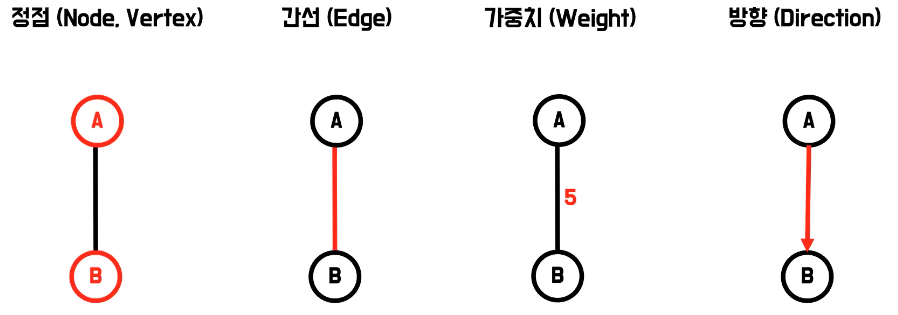
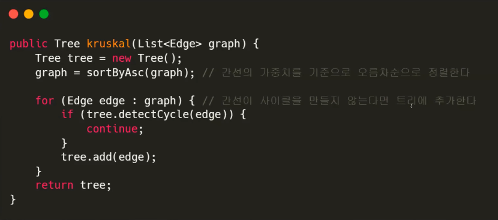
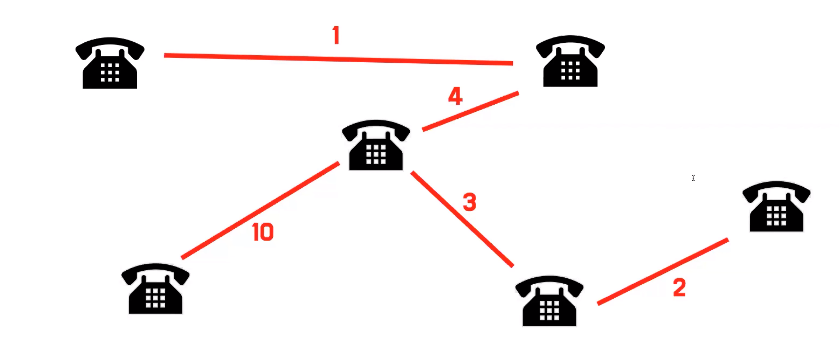
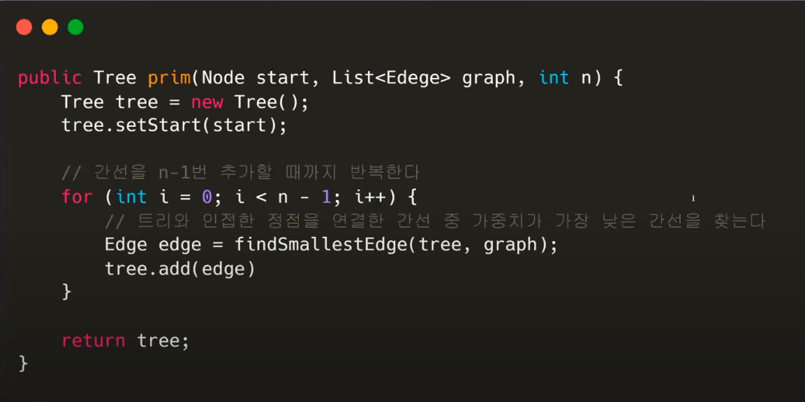
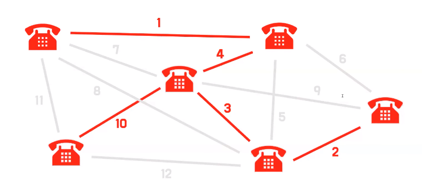
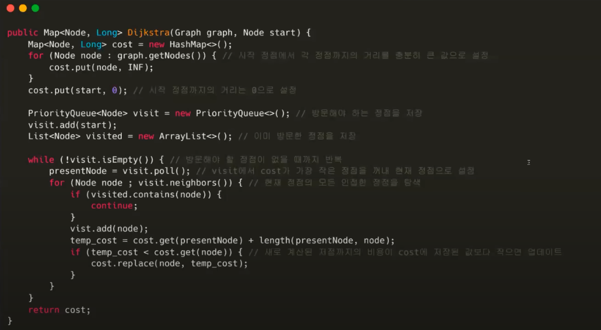
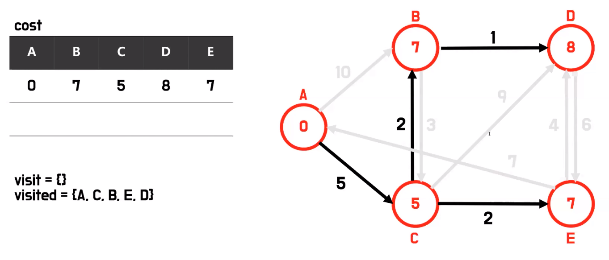
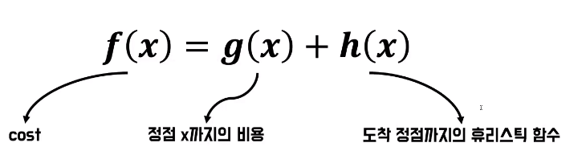
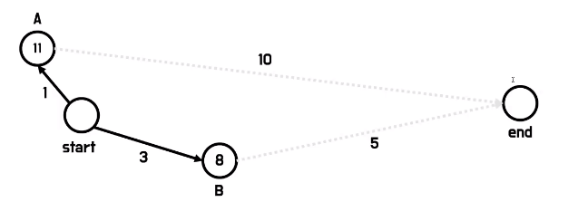

# 썬샷의 최소 신장 트리와 최단 경로 알고리즘
[https://youtu.be/QOWgP2_kGYQ?si=KkgC74cB4GH2wd5R](https://youtu.be/QOWgP2_kGYQ?si=KkgC74cB4GH2wd5R)

# 썬샷의 최소 신장 트리와 최단 경로 알고리즘
* toc
{:toc}

## 그래프 이론 용어
+ 
+ 그래프는 정점과 간선의 집합이다
+ 정점은 스스로 존재할 수 있는 객체를 의미
+ 간선은 이 정점을 잇는 객체, 그래서 간선이 존재하려면 정점 2개를 반드시 필요로 하다
+ 만약 간선이 어떤 값을 갖는다면 그걸 가중치라고 표현하는데 보통 이 간선을 이용하는데 드는 비용을 의미
+ 간선이 어떤 방향성이 있다라는 걸 나타내기 위해서 화살표로 표시하기도 하는데 이는 그 간선을 이용할 때 그 방향에 제한이 있다라는 의미로 생각하면 된다

## 최소 신장 트리 (Minimum Spanning Tree, MST)
+ 신장은 늘리다, 뻗어나가다 라는 의미를 가지고 있는데 그래서 최소 신장 트리란 어떤 하나의 정점에서 뻗어나가서 최소 비용으로 그래프의 모든 정점을 연결하는 트리이다
+ 실생활을 예로 들어보자면 이렇게 여러 기지국들이 있는데 최소 비용의 전선을 깔면서 이 모든 기지국을 연결하고 싶으면 다양하게 전선을 깔 수 있지만 어떻게 최소 비용으로 깔 수 있을까 그 방법을 찾는 것이 이런 알고리즘을 이용하면 풀 수 있다

### 크루스칼 알고리즘
+ 첫 번째로 그래프의 간선들 중 가장 낮은 가중치의 간선을 선택한다
+ 해당 간선이 사이클을 만들지 않는다면 트리에 추가한다
+ 이 과정을 모든 간선들에 대해서 반복하거나 아니면 트리의 특성상 모든 정점의 개수 빼기 하나만큼의 간선만 가지면 되기 때문에 거기까지만 반복해주면 조금 더 시간 복잡도를 줄일 수 있다
+ 
+ 

### 프림 알고리즘
+ 먼저 시작 정점 한 개를 트리에 추가 한다
+ 트리가 처음에 구성이 되었을 때 이 트리와 연결된 간선들 중에서 최소 가중치를 가지는 간선을 계속해서 찾아서 트리 집합에 포함한다
+ 간선이 N-1개만큼 선택될 때까지 반복해 주면 된다
+ 
+ 

## 최단 경로 알고리즘
+ 어떤 가중치 그래프에서 두 정점을 가장 적은 비용으로 연결하는 간선들을 찾는 문제

### 다익스트라 알고리즘
+ 두 가지 용어 정의
  + 알고리즘 과정 중에 중간값들을 저장하기 위해서 cost와 visit을 사용
  + cost는 시작 정점부터 현재 정점까지의 비용들을 저장해놓고 있는 값
  + visit은 내가 방문해야 될 정점들을 저장하고 있는 값
+ 처음에 cost에다가 시작 정점에서 다른 정점까지의 거리를 충분히 큰 값으로 저장
+ 시작 정점을 visit에 추가
+ visit에서 가장 비용이 작은 정점을 꺼내서 현재 정점으로 선택
+ 현재 정점과 인접한 정점들에 도달하는 비용을 cost 내부에 저장돼 있는 값과 비교해서 최소값으로 계속해서 갱신 그리고 꺼내진 인접 정점들이 visit에 담겨 있지 않다면 visit에 추가
+ visit에 담긴 정점이 없을 때까지 반복
+ 
+ 

### A* 알고리즘
+ A* 알고리즘이 다익스트라 알고리즘을 개선했다
+ 
+ 사실 A* 알고리즘은 식만 알면 된다
+ f(x)는 어떤 정점 x의 최종 코스트를 의미
+ 그럼 최종 코스트라면 각각이 또 다른 비용이라는 건데 g(x)가 아까 다익스트라 알고리즘에서의 그 cost를 의미 정점 x까지 가는 비용을 의미
+ h(x)는 정점 x부터 도착 정점까지 거리를 계산하는 휴리스틱 함수
+ 휴리스틱이란
  + 브라우저에 캐싱 만료 시간을 따로 설정해주지 않아도 휴리스틱 캐싱을 통해서 자동으로 캐싱 만료 시간을 설정해준다
  + 휴리스틱이 경험적인 값이라는 것을 의미
+ 왼쪽 위 정점에서 오른쪽 아래 정점까지의 거리 비용을 구하고 싶을때
  + 직선 거리를 사용하는 게 유클리디안
  + 마치 도시의 블럭에서 길을 찾아갈 때처럼 가로 길이, 세로 길이를 더하는 방식이 맨하탄 거리
  + 대표적으로 요런 두 가지 방식을 그냥 사용하시면 대체적으로 잘 나올 것이다
+ 휴리스틱 함수를 왜 사용하는 이유
  + 
  + 다익스트라 알고리즘을 사용하면 A가 더 낮은 비용을 가지고 있으니까 A를 먼저 가는데 A는 오히려 도착지점으로까지 더 멀어지는 것을 알 수 있다
  + 그래서 휴리스틱 함수를 통해서 내가 가려고 하는 정점이 도착지점까지 얼마나 더 가까워지는지 여부를 고려해 주는 것이라고 생각하면 된다
  + 이런 식이면 이제 휴리스틱 함수 h(x)까지 더한 값이 B가 더 작기 때문에 B부터 탐색을 하게 되는 방식이다
  + 그래서 A* 알고리즘에서 h(x)가 0일 때 다익스트라 알고리즘과 똑같은 결과를 나타내는 걸 볼 수 있다
+ A* 알고리즘이 실제로 어떻게 사용되냐면 스타크래프트와 같은 어떤 유닛들이 자동으로 길을 찾아야 되는 로직을 할 때 사용되기도 하고 라이더분들 배차 알고리즘 계산할 때 A* 알고리즘을 사용하기도 했다 요즘은 좀 더 개선된 알고리즘인 ch 알고리즘을 사용한다

