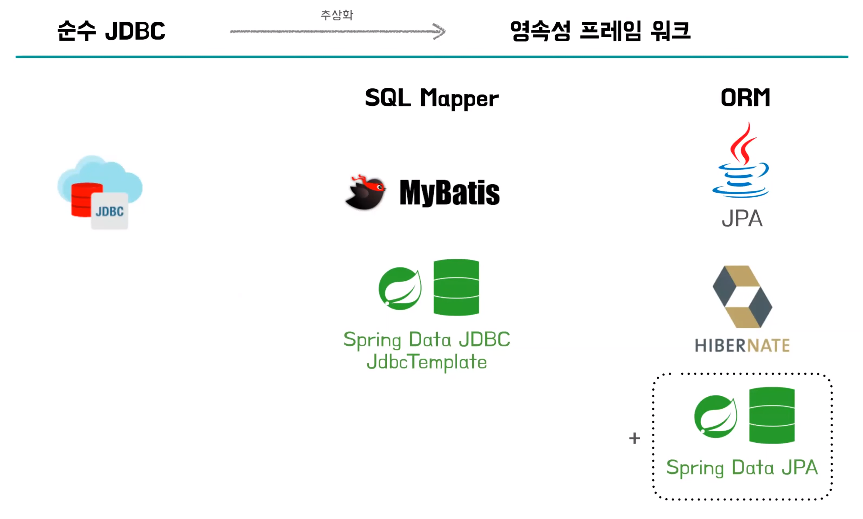
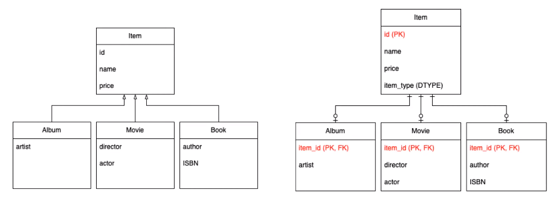
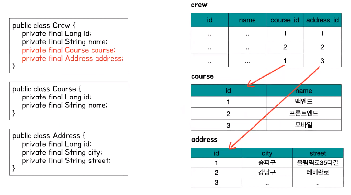
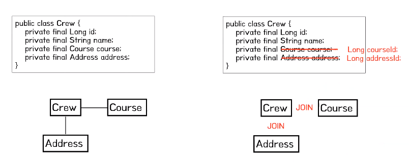
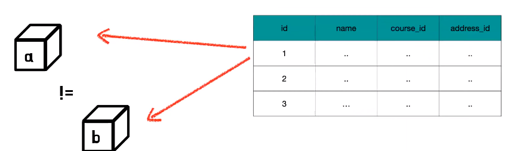
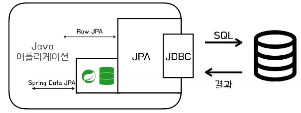
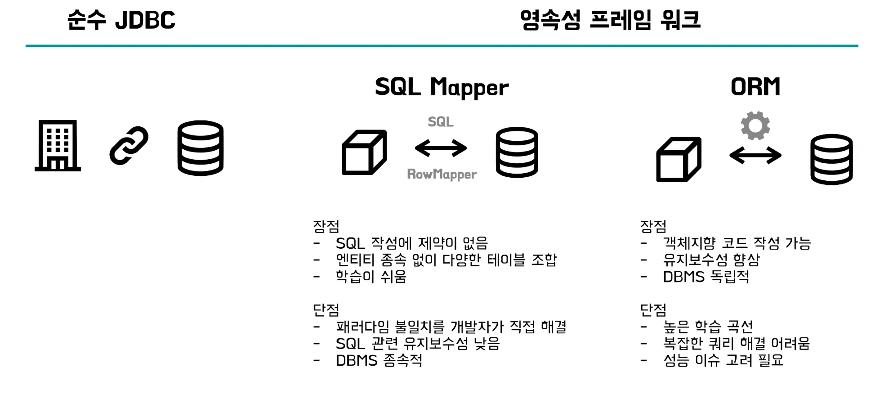

# 도이의 JDBC vs SQL Mapper vs ORM
[https://youtu.be/RWFtuQUx3fo?si=_Rmca_Rcwr-h6As0](https://youtu.be/RWFtuQUx3fo?si=_Rmca_Rcwr-h6As0)

# 도이의 JDBC vs SQL Mapper vs ORM
* toc
{:toc}

## 영속성 
+ 어떤 프로그램이 생성한 데이터가 프로그램이 종료되어도 계속해서 남아 있는 데이터의 특성을 말한다
+ 레이어드 아키텍처에서 영속계층은 이 두 곳의 상호 작용을 하는 계층이다 

## JDBC
+ JDBC는 DB 연결 그리고 SQL 맵핑과 실행 그리고 결과를 반환하기까지의 인터페이스를 제공해준다
+ 그래서 우리는 순수 JDBC만으로도 DB 액세스를 할 수 있다
+ 하지만 이 일련의 과정이 매번 반복됐기 때문에 중독코드가 굉장히 많아진다 그래서 영속성 프레임워크란 이 반복적인 작업들을 추상화하고 편리함을 제공해주는 기술이다
+ SQL Mapper와 ORM은 영속성 프레임워크의 일종으로 각기 다른 방식으로 영속계층을 구현하는 기술이다
+ 
+ 내부적으로는 JDBC를 사용하고 있다

## SQL Mapper
+ 먼저 SQL Mapper는 직접 작성한 SQL문과 필드를 매핑하고 조회 결과의 행들을 객체화해주는 프레임워크이다

### JdbcTemplate
+ JdbcTemplate도 스프링 데이터에서 제공해주는 SQL Mapper이다
+ 기존에 이런 불편함이 많이 느껴지던 코드 중복을 개선했다
+ RowMapper와 같은 함수형 인터페이스를 제공해서 이를 재사용할 수 있다

### MyBatis
+ MyBatis는 더 나아가서 프로그램 코드와 SQL의 분리에 집중한다
+ Xml 파일이나 어노테이션에 이렇게 SQL문을 저장한다
+ JdbcTemplate과 달리 동적 쿼리를 쉽게 작성할 수 있다

### 하지만
+ JdbcTemplate을 써도 DB 액세스 작업을 할 때 굉장히 번거롭게 느껴진다

#### SQL 의존적인 개발
+ 개발자가 비즈니스 로직보다는 SQL 작성이나 수정에 너무 많은 시간을 사용해야한다
+ 반복적인 CRUD SQL 작성
+ 객체 필드가 변경될 때마다 SQL 수정

#### 패러다임 불일치
+ 객체와 테이블 간의 패러다임의 불일치가 있기 때문에 이를 해결하기 위한 소모 비용 또한 너무 크다
+ 상속
  + 
  + 객체에서는 상속이라는 개념이 있지만 테이블에는 상속이 없기 때문에 이를 표현하려면 슈퍼타입과 서브타입 방식으로 표현하거나 다른 방식들을 써야 한다
+ 연관관계
  + 
  + 연관 관계에 있어서는 객체는 이제 주소값으로 참조를 해서 연관 관계를 맺는다 하지만 테이블에서는 외래키를 통해서 연관 관계를 맺고 있다
+ 객체 그래프 탐색
  + 
  + Crew라는 객체가 Course나 Address를 참조하고 있어서 자신이 참조하는 다른 객체들을 탐색할 수 있는 것을 그래프 탐색이라고 하는데 테이블 설계에 맞추어서 ID같은 식별자로 객체에 연관관계를 가지게 만든다면 SQL문에서 Crew에 대한 정보를 조회할 때
    Course와 조인한 SQL일 때만 Course 정보를 알 수 있기 때문에 객체 그래프 탐색을 자유롭게 할 수 없다
+ 비교
  +  
  + 테이블에서는 각 행의 기본 키로 데이터를 식별을 하는데 객체는 인스턴스 주소로 동일성을 판단하기 때문에 같은 id 1번의 데이터를 두 번 조회했을 때 받아온 각각의 객체를 우리가 항상 동일하다고 확신을 할 수가 없다

## ORM (Object-Relational Mapping)
+ ORM을 통해서 개발자는 객체지향 패러다임을 크게 바꾸지 않고도 관계형 데이터베이스로 작업을 할 수 있게 된다
+ 객체와 데이터베이스의 관계를 자동으로 매핑하는 기술
+ 패러다임 불일치 문제를 객체 - DB 사이에서 해결
+ 개발자는 객체지향 패러다임을 크게 변경하지 않고도, 관계형 데이터베이스로 작업할 수 있다

### JPA
+ 
+ JPA 진영의 ORM 기술 표준
+ JAVA Collection을 사용하는 것처럼 DB에 객체를 저장, 조회할 수 있다
+ 대표적인 구현체: Hibernate, EclipseLink
+ Spring Data JPA는 JPA를 쉽고 편하게 사용할 수 있도록 하는 모듈 
+ 조금 헷갈릴 수 있는 부분은 대표적인 구현체로 Hibernate랑 EclipseLink가 있는데 스프링 데이터 JPA는 Hibernate같은 구현체는 아니고 JPA 구현체를 기반으로 또 JPA를 더 쉽게 편하게 사용할 수 있는 더 높은 차원의 추상화를 하는 모듈이다

#### 저장 & 조회
+ JPA에서 만약에 저장을 한다고 하면 저장을 위한 메서드에 이 Entity 객체를 전달을 한다 그러면 JPA에서는 이 객체의 참조를 외래키로 변환해서 적절한 SQL문을 DB에게 전달해주는데 SQL문이나 Getter를 호출하는 코드를 직접 작성할 필요가 없어지는 것이다
+ 조회에서도 상속이나 참조 관계에 대한 테이블 조인 그리고 반환하는 객체에 대한 조립을 내부적으로 해결을 해준다
+ 모든 테이블의 정보를 다 가져오고 싶지 않을때 지연 로딩이라고 해서 영어로 Lazy Loading인데 지연 로딩도 지원을 하기 때문에 항상 모든 것을 조인하지 않아도 된다
+ 트랜잭션에서 조회한 Entity의 동일성을 보장해준다 그래서 같은 트랜잭션 내에 있으면 두 번 조회하더라도 이는 같은 동일한 Entity로 보기 때문에 비교 문제가 해결된다

#### 단점
+ 학습곡선이 높다
+ SQL을 직접 작성하지 않고 내부적으로 실행이 되기 때문에 다른 방법도 있는데 그런 복잡한 쿼리를 해결하는데 더 노력이 필요하다
+ 성능 이슈에 대해서 많이 조심하고 고려해야 될 점이 많다

## 정리
+ 

  
  

