# 말랑의 스프링 이벤트 (이벤트를 통해 의존성 개선하기)
[https://youtu.be/TJUIkLFpgGo?si=cC97yNak5qRPd1n6](https://youtu.be/TJUIkLFpgGo?si=cC97yNak5qRPd1n6)

# 말랑의 스프링 이벤트 (이벤트를 통해 의존성 개선하기)
* toc
{:toc}

## 의존성 사이클
+ 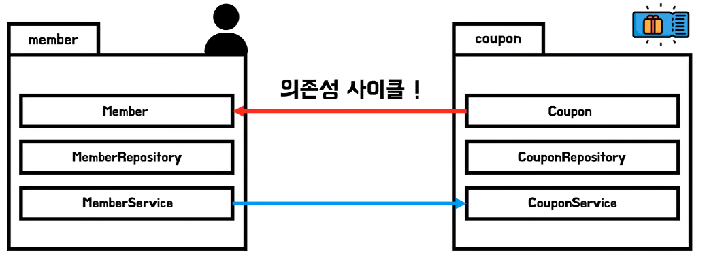
+ 의존성 사이클을 해결하는 방법은 되게 여러가지가 있는데 인터페이스를 통한 의존성 역전을 통해서 의존성 사이클을 해결할 수 있고 이벤트를 사용하는 방법도 있다

## 이벤트
+ 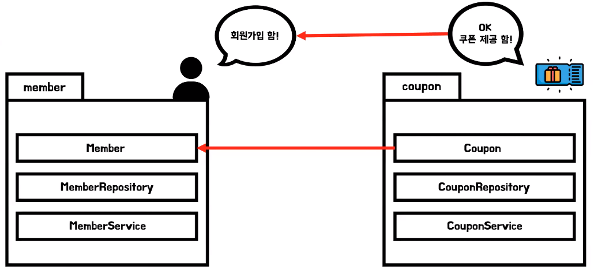
+ 멤버 서비스에서 쿠폰서비스를 직접 호출하고 있는데 이벤트를 사용하게 되면은 더 이상 직접 호출을 하지 않고 회원 가입을 했다는 이벤트를 발송하게 된다 누가 이걸 처리할지는 모르겠지만 일단 멤버 패키지에서는 회원 가입을 했다는 이벤트만 발행한다
  그리고 나서 해당 이벤트를 받아서 쿠폰을 회원에게 제공하도록 쿠폰 패키지 내부에서 이를 처리하는 코드를 작성해 주면 된다 이때 화살표의 방향을 보면 의존성 사이클이 해결되게 된다

### 기존
+ 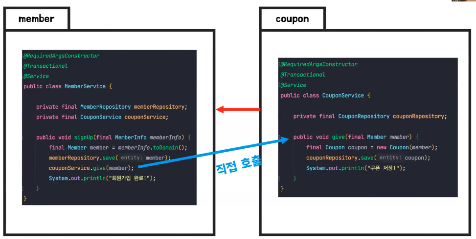
+ 의존성 사이클이 발생하는 코드

### 변경
+ 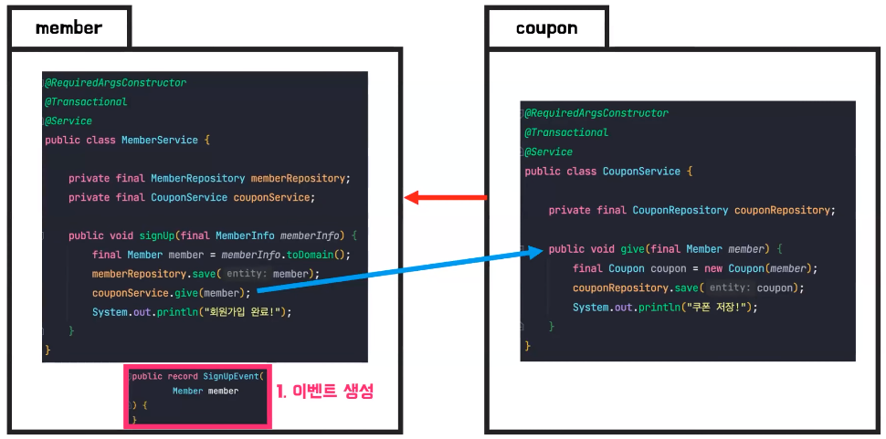
+ 이벤트를 생성 이 코드는 그냥 클래스 라고 봐주면 된다

+ 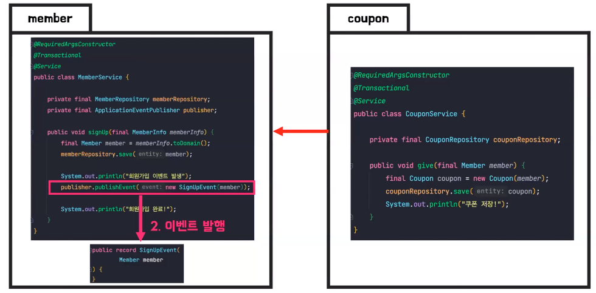
+ 멤버 서비스는 쿠폰 서비스를 직접 호출하는 게 아니라 이벤트를 발행
+ 이때 이벤트를 발행할 때는 스프링에서 제공해주는 ApplicationEventPublisher라는 것을 통해서 다음과 같이 이벤트를 발행할 수 있다

+ 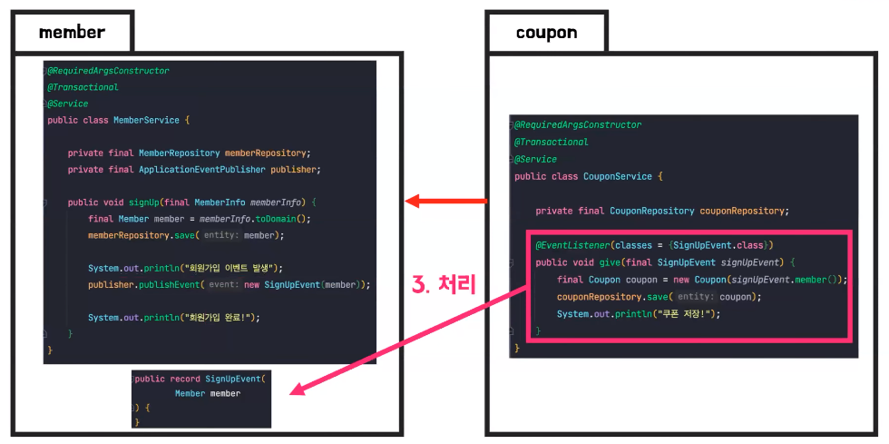
+ 이벤트를 처리하는 방법은 @EventListener라는 어노테이션을 통해서 이 SignUp 이벤트를 처리 할거야 라고 알려주면 된다
+ 이렇게 함으로써 멤버 서비스 에서는 회원 가입 이후에 회원과 이벤트를 발행하고 쿠폰 서비스는 해당 이벤트를 받아서 쿠폰을 제공하도록 기능을 작성할 수 있고 의존성 사이클이 해결된 것을 알 수 있다
  
  

## 인터페이스 VS 이벤트

### 인테페이스 사용
+ 인터페이스를 통해서 의존성 사이클을 해결할 때 크게 두 가지 방법이 있을 수 있는데 그 방법에 따라서 조금씩 차이점이 달라진다

#### 첫번째 방법
+ 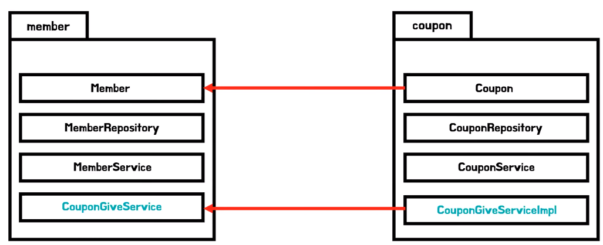
+ 멤버 회원가입 이후에 쿠폰을 발급해야 되기 때문에 멤버 패키지 내부에 CouponGiveService라는 인터페이스를 작성 그리고 쿠폰 패키지 내부에서 해당 인터페이스의 구현체인 CouponGiveServiceImpl를 작성
  그러면은 다음과 같이 의존성이 쿠폰에서 멤버로만 향하게 된다

##### 문제점
+ 회원 가입 이후에 메일을 전송해야 된다는 추가적인 요구 사항 추가
+ 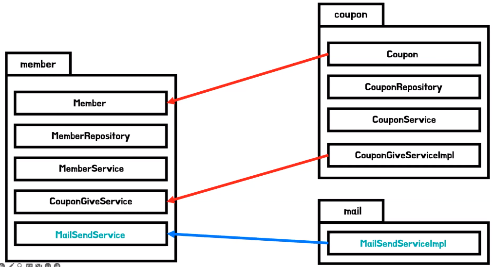
+ CouponGiveService와 비슷하게 MailSendService를 만들어야 되고 또 이제 메일 패키지에서는 해당 인터페이스를 구현해야 되는데 이게 어떻게 문제가 되냐면 추가적인 로직이 계속해서 추가된다고 가정을 하면 다음과 같은 코드가 탄생된다
+ 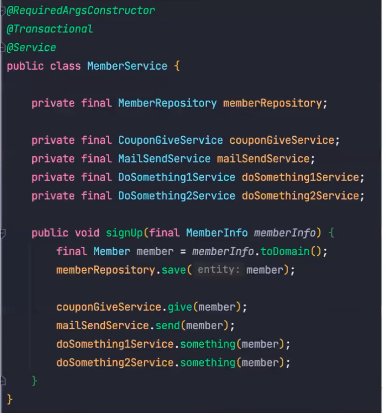
+ 먼저 회원 가입이라는 주 기능에 집중하기가 조금 힘들어진다 왜냐하면 쿠폰도 제공하고 메일도 제공 해주는
  다른 부가적인 기능이 코드에 붙기 때문에 주 기능에 집중하기 힘들다
+ 멤버 서비스가 의존하는 것들이 되게 많아진다 그래서 멤버 서비스의 결합도가 높아지는 단점이 있다
+ 쿠폰이랑 메일 패키지로의 코드상에서의 사이클은 해결되었지만 논리적으로는 계속 회원 가입 이후에 쿠폰도 제공 해야 되고 메일도 전송해야 되기 때문에 논리적인 의존성은 여전히 존재하는 문제가 있다 
+ 이벤트를 통해서 처리를 하면 이벤트 하나만 발송하면 되는데 간편하게 처리할 수 있는 것들을 인터페이스를 쓰면 조금 복잡하게 처리가 된다는 문제가 있다
+ 

#### 두번째 방법
+ 회원 가입 이후에 처리할 로직들을 인터페이스로 정의
+ 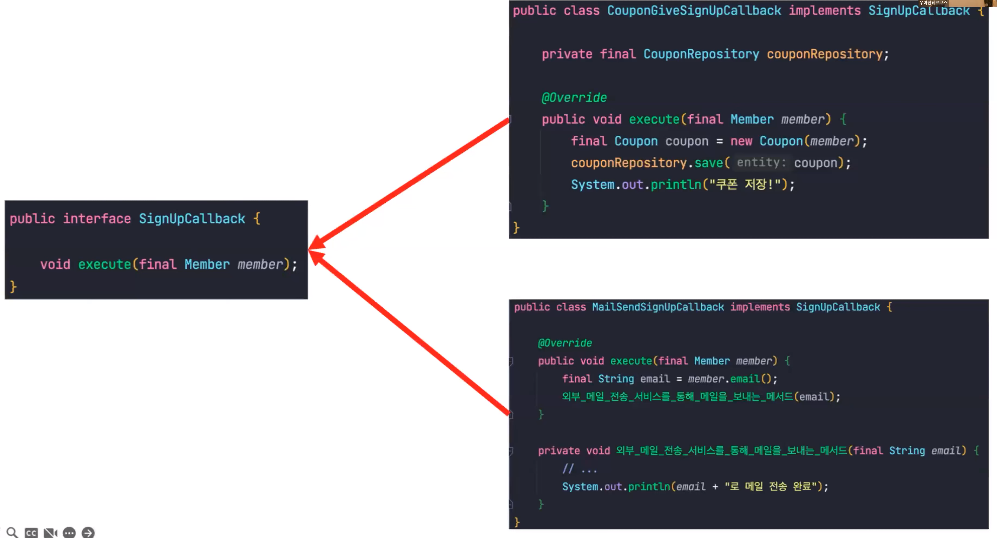
+ 쿠폰을 제공하기 위해서는 CouponGiveSignUpCallback 클래스를 작성해서 회원 가입 이후에 쿠폰을 작성하는 기능을 작성해주면 되고
  메일을 전송해야 한다면 MailSendSignUpCallback이라는 클래스를 작성해주면 된다
+ 첫번째 방법과 비교해서 인터페이스는 하나만 만들어도 되고 구현체들이 많아지니까 의존성이 많아진다는 문제를 해결할 수 있다
+ 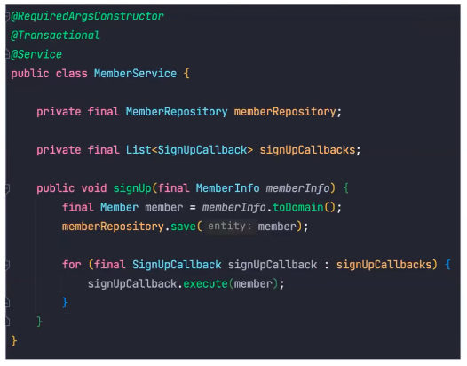
+ 사용할 때 멤버 서비스에서는 SignUpCallBack이라는 이 인터페이스를 구현한 구현체들을 리스트로 의존성 주입을 받고 회원 가입 이후에 이들을 반복문으로 수행을 하면서 하나 하나씩 호출을 해주게 되는데 이는 이벤트와 되게 유사해 보이지만
  우선 리스트로 받아야 되고 포문을 돌려야 되고 또 인터페이스를 구현할 때 이 해당 implements XXX을 계속 작성해 줘야 되기 때문에 이벤트에 비해서 조금 더 복잡해 진다
+ 회원 가입 외에 다른 기능이 있다면 의존하는 인터페이스가 많아질 수 있는데 예를 들어서 회원 가입 말고도
   회원의 정보를 업데이트하는 기능이 추가될 때 회원 수정이후에 어떤 로직들을 처리하기 위해서는 MemberUpdateCallback이라는 인터페이스가 또 추가되어야 된다 
+ 이벤트는 트랜잭션과 관련해서 추가로 제공 해주는 기능이 있다 TransactionalEventListener

## 이벤트 단점
+ 반환 타입이 필요한 경우에 사용이 불가능하다 
+ 예를 들어서 회원 서비스에서 회원 가입 이후에 쿠폰을 제공하고 그 메서드에 반환 타입을 다시 회원 서비스에서 사용하는 경우 벤트를 사용할 수 없다 그래서 그런 경우에는 인터페이스를 사용해야 되고 
+ 로직의 흐름이 명확하지 않다는 단점이 있는데 이벤트를 사용한 코드는 이벤트를 발송하기만 할 뿐 에서 어떤 로직이 처리되는지를 알기가 어렵다
