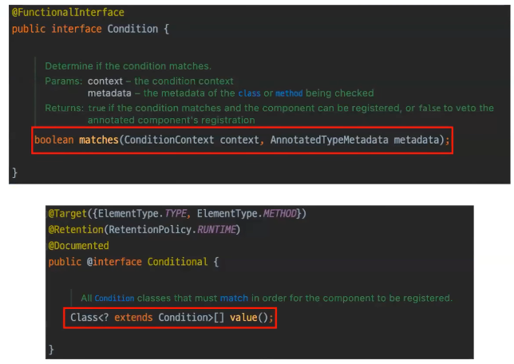
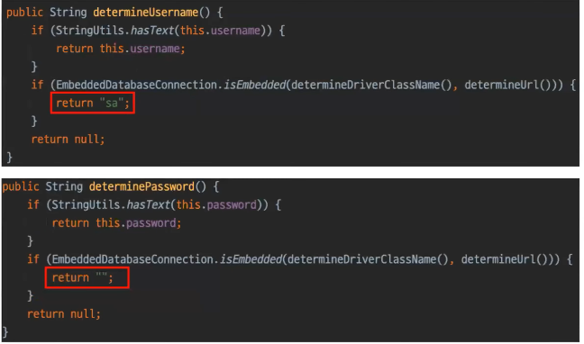

# 지토의 Auto Configuration
[https://youtu.be/TSCHTPZ3PSQ?si=oMVsMJPoBldXddMZ](https://youtu.be/TSCHTPZ3PSQ?si=oMVsMJPoBldXddMZ)

# 지토의 Auto Configuration
* toc
{:toc}

## Auto Configuration?
+ 
+ 스프링 부트를 사용하기 이전에는 데이터베이스 와 연동을 하기 위해서 직접 코드를 작성을 해주어야 했다
+ 스프링 부트를 사용하는 지금은 코드를 굳이 작성할 필요 없이 필요한 설정 만을 기입을 해주면 데이터베이스와의 연동이 가능하다 이러한 일은 바로 스프링부트로 인해서 발생하는 일이다
+ 스프링 부트를 사용하게 되면 드라이버 매니저 대신  커넥션을 얻어오는 과정을 추상화한 데이터 소스를 사용하게 되는데 데이터 소스는 스프링 부트가 애플리케이션 환경에 따라
  자동으로 생성을 해주고 빈으로 등록하게된다 이런 것이 Auto Configuration이다
+ 즉 Auto Configuration이란 필요한 빈을 자동으로 구성하는 기능이다 라고 할 수 있다
+ 이를 통해 개발자는 편리하고 쉽고 일관성 있는 웹 애플리케이션을 개발할 할 수 있게 된 것이다

## @SpringBootApplication부터 따라가보기
+ 

### @SpringBootApplication
+ 
+ @Configuration, @EnableAutoConfiguration, @ComponentScan의 세 가지 어노테이션을 가지고 있는데 이 중 Auto Configuration과 관련 있는 것은 이름에서부터 알 수 있듯이 @EnableAutoConfiguration 이다

### @EnableAutoConfiguration은
+ @EnableAutoConfiguration은 @AutoConfiguration이란 어노테이션이 붙은 모든 클래스를 스캔을 하고 애플리케이션 환경에 따라서 이를 필터링해서 전달하겠다는 것을 의미하는 어노테이션이다
+ 
+ 내부를 확인하면은 AutoConfigurationImportSelector 라는 것을 @Import로 지정을 할 수 있는 걸 확인할 수 있는데 이 AutoConfigurationImportSelector 가 Auto Configuration의 모든 후보들을 조회하고 필터링을 하게 된다.

### @Import & ImportSelector
+ @Import는 이름 그대로 Import할 하나 이상의 대상을 지정할 수 있는 어노테이션이다
+ Auto Configuration에서는 이 @Import는 ImportSelector를 지정을 해서 빈들을 동적으로 읽어들이게 된다
+ 
+ ImportSelector 같은 경우는 Import로 등록할 대상을 동적으로 구성할 수 있는 인터페이스이다

### AutoConfigurationImportSelector
+ 
+ ImportSelector와 동일하게 후보들을 조건에 맞춰서 필터링해서 반환해주는 역할을 수행을 한다 
+ 다만 그 대상이 AutoConfiguration의 후보들과 그리고 Conditional을 통해서 특정 빈이 등록할 수 있는 조건에 따라서 필터링을 하고 그 대상을 반환할 뿐이다

### AutoConfiguration.imposts
+ 
+ AutoConfigurationImportSelector가 어느 파일을 조회하냐 하면은 autoconfigure 라는 라이브러리 내부의 AutoConfiguration의 imports라는 외부 파일에서 142개의 Auto Configuration 후보들을
  명시돼 있는 것을 조회 하는 것을 확인할 수 있다

### 정리
+ Auto Configuration에서 142개의 클래스 명을 조회를 한 다음에 AutoConfigurationImportSelector가 내부적으로 필터링을 하고 현재 애플리케이션의 환경에 맞는 후보들만을 반환을 하게 되는 것이다

## Annotation 살펴보기
+ 

### @AutoConfiguration
+ 
+ 이 어노테이션은 스프링 부터에서 Auto Configuration으로 처리될 수 있는 후보를 명시하는 역할을 담당하고 있다
+ 이 어노테이션에는 before와 after라는 속성이 있는데 이를 통해서 Auto Configuration이 어떤 순서로 동작할지를 제어할 수가 있다
+ 그래서 이제 AutoConfigurationImportSelector 는 이 @AutoConfiguration이 붙은 클래스만 조회를 하게 된다

### Condition과 @Conditional
+ 
+ Conditional 인터페이스는 함수형 인터페이스이다
+ 이것은 이제 빈으로 등록할 대상이 반드시 만족해야 되는 단일 조건을 의미 한다
+ 그래서 match 메소드를 통해서 반환값에 따라서 해당 빈이 등록이 될지 등록이 되지 않을지를 판단을 하게 된다
+ 이러한 Condition 인터페이스를 사용하기 위해서는 @Conditional을 같이 사용을 해줘야 된다
+ @Conditional 어노테이션은 클래스 레벨과 메소드 레벨에 모두 붙일 수 있고 여러 개의 Condition을 등록을 할 수가 있다
+ 여러 개 Condition을 등록하는 경우 모든 Condition이 true를 반환을 해야지 해당 빈이 등록된다고 볼 수 있다

### @ConditionOn*
+ 
+ 그런데 이제 이렇게 Condition 인터페이스에 구현체를 매번 생성 하는 것은 개발자 입장에서도 불편할 것이고 이를 분석하는 사용자 입장에서도 매번 분석을 해야 돼서 불편할 것이다
+ 스프링 부트는 이러한 불편함을 해소하기 위해서 자주 쓰는 Condition 구현체들을 @Conditional을 미리 붙인 @ConditionOn이라는 어노테이션을 지원을 해준다
+ 
+ 이 어노테이션들은 총 20개가 존재하는데 모든 어노테이션을 알 필요는 없고 자주 사용되는 것들만 알면 된다
  + 지금 현재 빈이 등록되어 있느냐 등록되어 있지 않느냐
  + 클래스 의존성이 있냐 없냐
  + 특정 Property가 존재하냐 그렇지 않으냐
  + 특정 빈이 단 하나만 존재하냐

### @ConfigurationProperties
+ 
+ 이 어노테이션은 application.properties와 같은 외부 파일에 명시한 설정을 자바 객체로 바인딩하기 위한 어노테이션이다
+ 
+ @ConfigurationProperties의 접두사를 표현할 수 있어 설정을 그룹화해서 관리할 수 있고 자바 객체로 바인딩할 수 있기 때문에 타입 안전하다는 장점을 가지고 있다

### @EnableConfigurationProperties
+ 
+ 이렇게 만들어준 Auto Configuration Properties는 @EnableConfigurationProperties를 통해서 지정을 해줘야지 실제 클래스에서 주입 받아서 사용할 수 있게된다

## DataSourceAutoConfiguration 살펴보기
+ 
+ DataSourceAutoConfiguration은 클래스 레벨에 다섯 개의 애노테이션이 있다 

### @AutoConfiguration
+ 이 어노테이션은 당연히 Auto Configuration의 후보임을 명시하기 위해서 지정하고 것이다
+ 속성을 보면 before로 SqlInitializationAutoConfiguration을 지정을 하고 있다
+ 이 Auto Configuration은 이제 data.sql 이나 schema.sql을 통해서 데이터베이스를 초기화하는 역할을 담당을 하고 있는데 이렇게 초기화 하기 위해서는
  DataSource를 통해서 커넥션을 얻어오는 과정이 필요하기 때문에 당연히 SqlInitializationAutoConfiguration이 동작하기 전에
  DataSourceAutoConfiguration이 동작하도록 명시했다고 볼 수 있다

### @ConditionalOnClass
+ DataSource는 당연히 등록해야 될 대상이기 때문에 반드시 필요하고 그 다음에 이제 EmbeddedDatabaseType을 확인할 수 있는데 이거는 내부에서 확인해 보면 임베디드 데이터베이스로 사용될 수 있는
  세 가지 종류의 리스트를 Enum으로 관리하고 있는 것을 확인하실 수 있다
+ 

### @EnableConfigurationProperties
+ DataSourceProperties라는 것을 주입을 받겠다고 명시가 되어 있다 그래서s DataSourceProperties를 확인해 보면 Configuration Properties에 접두사로 spring.datasource가 명시되어 있는 것을 확인할 수 있다
+ 
+ 필드 같은 경우에도 driverClassName, url, username, parssword와 같이 항상 명시 해주는 것을 확인을 할 수가 있다 
+ 
+ 해당 클래스 내부에서는 이렇게 임베디드 데이터베이스를 사용할 경우 username과 password를 등록하지 않으면 각각 sa와 Null String을 반환해서 왜 username과 password를 등록하지 않아도
  자동으로 username과 password가 등록 되는지를 확인할 수가 있습니다
+ 

## 왜 학습해야 할까?
+ 효율적인 빈 커스터마이징
+ 빈 커스터마이징시 발생할 수 있는 문제를 대응하기 위해

