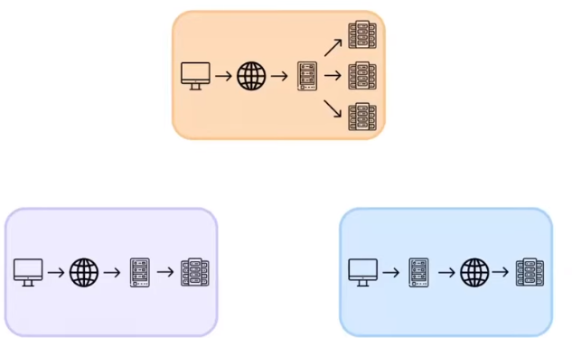
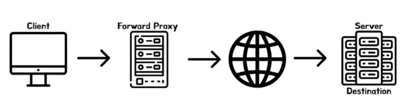
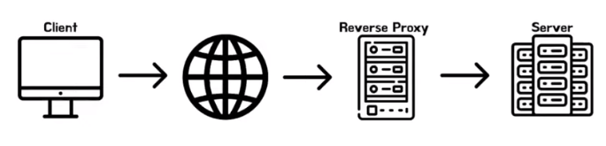
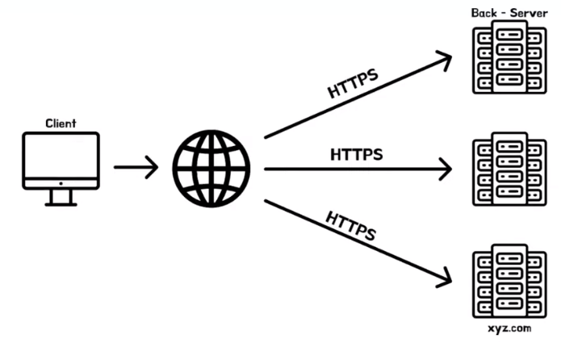
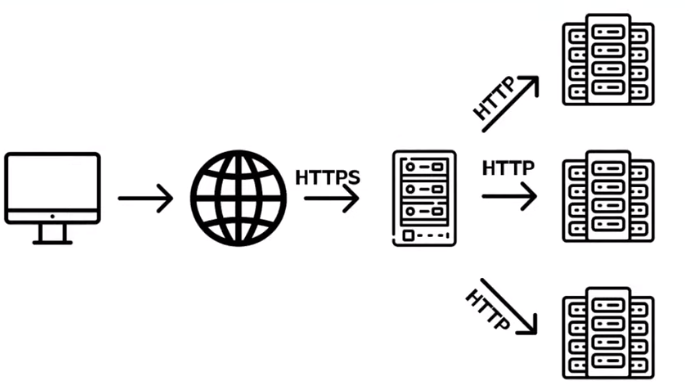
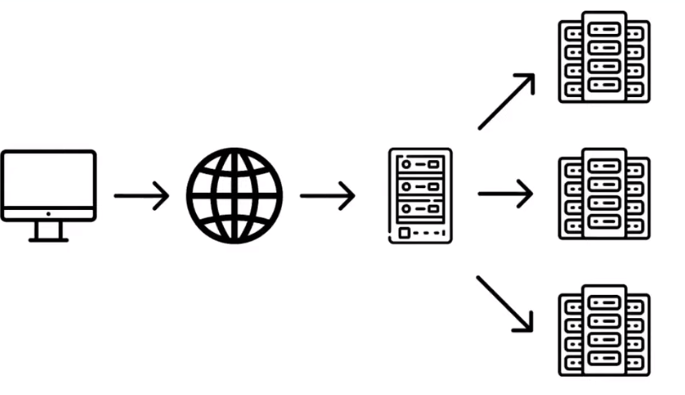

# 폴로의 Forward proxy vs Reverse proxy vs Load Balancer
[https://youtu.be/JqCgJI-Nk88?si=EjOk6SOFmtVsSzlj](https://youtu.be/JqCgJI-Nk88?si=EjOk6SOFmtVsSzlj)

# 폴로의 Forward proxy vs Reverse proxy vs Load Balancer
* toc
{:toc}

## 세 주제의 공통점
+ 
+ 세가지 키워드들의 공통점은  클라이언트와 서버 사이에 징검다리를 해주는 서버가 하나 있다 이런 서버를 프록시 서버라고 부르기로 했다
+ 포워드 프록시, 리버스 프록시, 로드 밸런싱은 모두 프록시서버로 행할 수 있는 기능이다
+ 프록시서버를 한번 정리를 해보자면 클라이언트와 서버 사이에서 대리인의 역할을 하는 서버 정도로 간략하게 정리를 해 볼 수가 있다

## Forward Proxy
+ 
+ 포워드 프록시는 클라이언트의 역할을 하는 프록시 서버

### 장점 
+ 캐싱 기능을 이용할 수 있다
  + 포워드 프록시는 클라이언트의 요청 정보와 서버의 응답 정보를 매칭하여 자신에게 맵핑을 해줄 수 있다
  + 클라이언트가 동일한 서버에 동일한 요청을 보내게 되면 캐싱되어 있는 응답을 전달해줄수가 있다
+ 익명성을 유지할 수 있다
  + 서버에서는 자신에게 보낸 요청의 주체가 누구인지 정확하게 알 수가 없다
  + 서버 입장에서는 자신에게 요청을 보낸 주체가 포워드 프록시로 인지를 한다 클라이언트가 요청을 보냈는지는 알 수가 없다
  + 그렇기 때문에 클라이언트의 익명성을 유지하기 위해서 포워드 프록시를 사용하는 경우도 종종 있다
+ 콘텐츠 필터링 기능을 이용하기 위해서
  + 응답을 프록시 서버에서는 응답을 읽어서 특정 콘텐츠가 있다는 것을 확인한 뒤 해당 응답을 클라이언트에게 전달하지 않고 자체적인 응답을 보내 줄 수가 있다
+ 접근 제한 기능
  +  프록시 서버는 클라이언트 요청을 확인하고 해당 서버에는 특정 컨텐츠가 많다는 것을 확인한 뒤 해당 접근을 차단해버릴수가 있다 그리고 자신이 만들어 낸 응답을 자체적으로 돌려줄 수 있다

## Reverse Proxy
+ 
+ 리버스 프록시의 프록시 서버는 서버 개발자가 설정을 한다는 것이다
+ 즉 클라이언트의 요청을 프록시 서버가 받는 것은 동일하지만 클라이언트를 대신하여 요청을 보내는 것이 아니라 서버를 대신하여 클라이언트의 요청을 받는다는 점이다

### 장점
+ 캐싱 기능을 이용할 수 있다
  + Forward Proxy와 같다
+ 보안
  + 익명성과 굉장히 비슷한 개념이다
  + 클라이언트의 입장에서는 자신이 요청을 보내는 주소가 즉, 아이피와 포트 번호가 리버스 프록시로 연결이 되어 있다
    뒤에 있는 서버의 아이피 주소와 포트는 웹으로 들어가지 않는다 보안쪽으로 조금 더 우수하다고 할 수 있다
+ SSL 중앙화 관리
  + 
  + 클라이언트의 요청을 https로 받기로 했는데 각각의 서버마다 ssl 인증서를 관리를 해줘야 될 필요가 있을것이다 굉장히 번거로운 일이다
  + 
  + 그렇기 때문에 중간에 프록시 서버 즉, 리버스 프록시를 두어서 리버스 프록시 통신 할 때만 https로 통신을 하고 그리고 개벌적인 서버와 통신을 할 때는 http로만 통신을 해서 ssl 인증서를 리버스 프록시에서만 관리할 수 있게 조금 편안하게 ssl 인증서를 관리할 수 있게 해 줄 수가 있다
+ 로드 밸런싱
  + 로드 밸런싱 같은 경우에는 로드 밸런싱을 해주는 로드 밸런서 라는 서버를 이용해서 할 수도 있지만 그것 뿐만 아니라 리버스 프록시 자체적으로도 가능하기 때문이다
  + 
  + 서버의 부하를 분산해주는 기능이다 
  + 확장에는 두 가지 방식이 있는데 첫 번째 방식은 스케일 업 방식이다 스케일 업 방식은 하나의 서버를 하드웨어적으로 업그레이드 하는 방식인데 이 확장의 방식에는 사실 큰 문제점이 하나 있다 바로 비용적인 부분이다
  + 스케일 아웃 방식은 하나의 서버를 하드웨어적으로 업그레이드 하는 것이 아닌 여러 개의 서버를 두어서 부하를 분산해주는 방식으로 확장하는 방식인데 하나의 문제점이 존재한다 바로 클라이언트의 요청을 어떻게 분배해줄것인가 인데 이 역할을 해주는 것이 바로 로드 밸런싱
  

