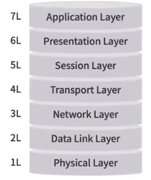

# 이오의 OSI 7계층
[https://youtu.be/wuOzMvNEzAg?si=eTEzNtO58RKaPNij](https://youtu.be/wuOzMvNEzAg?si=eTEzNtO58RKaPNij)

# 이오의 OSI 7계층
* toc
{:toc}

## OSI 7계층은 왜 만들어졌을까?
+ OSI 7계층은 Open System Interconnection으로 국제표준화기구 ISO가 정의한 국제 통신 표준 규약을 의미한다
+ 통신 접속에서부터 완료까지의 과정을 총 7가지 단계로 구분지어서 설명하고 있다
+ ISO가 OSI 7계층 발표 과정
  + 1900년대 중반 네트워크가 시작
  + 이전에는 컴퓨터 사이에서 데이터를 주고받을 수 있는 수단이 없었기 때문에 어떤 연산을 수행할 때 컴퓨터 하나의 본체 안에서만 수행을 했다
  + 그렇기 때문에 컴퓨터가 연산할 수 있는 양에는 한계가 있었고 멀리 떨어져 있는 컴퓨터에 데이터를 전달하기 위해서는 하드디스크에 담아서 직접 이송을 해줘야 된다던가하는 어려움이 있었다
  + 이 때 네트워크가 만들어지게 되면서 멀리 떨어져 있는 컴퓨터들 사이에서 데이터를 주고받을 수 있게 되었고 더 많은 연산들을 서로 공통적으로 할 수 있게 되면서 비약적인 발전이 시작되었다
  + 그러면서 자연스럽게 프로토콜이 발전하였다 프로토콜은 컴퓨터와 컴퓨터 사이에서 서로 데이터를 송신하는 과정을 의미하는데 여러 각각의 컴퓨터 회사에서 독자적으로 프로토콜을 개발하면서
    서로 경쟁하며 발전하기 시작하였다
  + 문제가 한 가지 발생했었는데 바로 통일된 규정이 없었다는 것이다 이 문제는 사람으로 치면 서로 다른 언어를 사용하는 사람들끼리 대화를 시도하는 상황인데 만약에 서로 다른 언어를 사용하는 사람들이 대화를 시도할 경우
    아무리 자기가 가진 정보를 주고 싶어도 이해를 할 수 없으니 대화가 성립하지 않는다 그렇기 때문에 국제표준기구인 ISO에서 표준 규약인 OSI를 발표하게 된 것이다
  + 이제 공용어가 탄생하면서 사람들은 서로 같은 규칙의 같은 언어를 사용하면서 데이터를 주고받는 것이 가능해졌다
+ OSI는 Open System Interconnection의 약자로 서로 다른 컴퓨터들이 데이터를 주고받을 수 있도록 표준화된 규칙을 의미한다

## OSI 7계층 어떻게 동작할까?
+ 
+ 가장 밑에서부터 물리계층, 두 번째 데이터 링크 계층, 세 번째 네트워크 계층, 네 번째 전송계층, 다섯 번째 세션계층과 여섯 번째 표현계층, 마지막으로 가장 많이 인접해 있는 어플리케이션 응용계층으로 이루어져 있다

### Application Layer (응용 계층)
+ 사용자와 직접 연결되어 네트워크에 접근을 돕는 계층
+ 데이터 전송을 위한 인터페이스 제공
+ 이용자로부터 입력받은 정보를 바로 아래층, 표현계층에서 주고받을 수 있도록 하는 기능을 제공

### Presentation Layer (표현 계층)
+ 데이터를 응용계층에서 사용하는 어떤 문자로 이루어진 데이터와 컴퓨터가 이해할 수 있는 표현 사이에서 서로의 표현을 변환해주는 역할을 수행 그렇기 때문에 표현계층이라고 불리고 있다
+ 이 안에서 데이터의 인코딩과 디코딩 모두가 이루어진다

### Session Layer (세션 계층)
+ 세션이란 컴퓨터와 컴퓨터 사이에서 통신을 하기 위해 연결되어지는 과정과 그 연결되어 있는 상태, 기간들을 모두 포함하는 의미이다
+ Session Layer에서는 컴퓨터간 연결인 세션을 생성하고 유지하고 관리하는 역할을 통합적으로 수행한다
+ 또한 이 과정에서 오류가 있을 시 이 오류를 복구하는 역할 또한 맡고 있다

### Transport Layer (전송 계층)
+ 전송계층은 데이터를 신뢰성 있게 전송하기 위한 계층
+ 데이터를 만약에 전달한다고 할 때 큰 규모의 데이터를 모두 한 번에 전달한다면 이건 상당히 비효율적이고 불합리한 구조를 만들 수 밖에 없기 때문에 이런 데이터를 잘게 쪼개 패킷으로 나누고 전송하는 과정을 수행한다
+ 이때 여러 개로 쪼개어진 패킷들이 정상적으로 잘 전달이 되었는지 아니면 그 패킷이 유실되거나 문제가 생기지 않았는지 이를 파악하고 만약에 유실된 패킷이 있을 경우 이를 다시 재전송해주는 역할까지 Transport Layer에서 수행한다
+ TCP와 UDP 이런 프로토콜들이 Transport Layer 내부에 포함되어 있는 개념이단

### Network Layer (네트워크 계층)
+ Network Layer에서는 데이터에 전송하는 경로와 순서들을 결정하는 계층이다
+ 경로들은 굉장히 많지만 이 중에 모든 경로들을 사용하지는 않고 가장 빠른, 가장 효율적인 경로를 사용하고 싶을텐데 이런 것들을 파악하고 결정해 주는 것을 바로 Network Layer에서 수행한다
+ Network Layer에서는 데이터를 패킷 단위로 분할하여 송신하고 또 만약에 반대로 수신하는 측의 경우 이 분할 되어 있는 패킷을 하나로 합쳐주는 역할을 수행한다
+ 또한 이때 네트워크 기기들 사이의 목적지를 찾을 때는 IP주소를 기반으로 해서 목적지를 파악하고 전송을 수행한다

### Data Link Layer (데이터 링크 계층)
+ Data Link 계층에서는 물리적인 기기들 사이에서 데이터를 전송하는 역할을 수행한다
+ Network Layer는 끝에서 끝까지 오는 전체적인 경로에 관한 개념이었다면 Data Link Layer는 이 기기와 기기 사이에서 물리적으로 연결되어 있는 기기 사이의 전송을 담당하는 계층이라고 할 수 있다
+ 그래서 여기서는 앞서 나눴던 패킷을 프레임으로 다시 재구성하고 각 프레임에 대한 에러 검사와 또 문제가 없는지 이런 검사와 수정을 진행한다
+ 또한 여기서는 MAC 주소를 사용하여 기기와 기기를 구분하고 목적지를 설정, 그리고 전송을 수행한다

### Physical Layer (물리 계층)
+ Physical Layer에서는 데이터를 물리적인 신호로 변환을 해주는데 단순히 전달만 수행하기 때문에 이 데이터가 과연 올바른 데이터인지, 아니면 문제가 있는 건 아닌지, 이런 파악 같은 건 전혀 하지 않는다
+ 그래서 이 데이터를 단순히 물리적인 비트 단위 신호로 변경을 해주는데 비트 단위라고 하면 저희같은 개발자에게는 1과 0으로 이루어진 그런 숫자가 더 익숙하시겠지만
  실제로 이는 물리 계층이기 때문에 on과 off로 이루어진 전기적인 신호로 데이터를 전달해 준다

### 흐름 정리 
+ 어떤 클라이언트가 "Hi"라는 메시지를 보내고 싶다
+ Application Layer에서 그 데이터를 받고 Presentation Layer에서 이 "Hi"라는 표현을 컴퓨터가 이해할 수 있는 아스키 코드로 변환을 한다
+ Session Layer에서 다른 컴퓨터와의 연결을 담당하는 세션을 열고 그 열려있는 세션 사이에서 Transport Layer가 그 데이터를 각각의 패킷으로 분할해 전송을 시작한다
+ 이때 이 전송을 할 때는 Network Layer가 올바른 경로를 탐색을 해주고 그에 따라서 Data Link Layer가 기기와 기기 사이에서 데이터를 전송한다
+ 이때 이 기기와 기기 사이에서 전송되는 데이터는 Physical Layer에서 전기적인 신호로 변경되어 전달이 되게 된다
+ 이 과정을 통틀어서 캡슐화라고 부른다
+ 수신자의 컴퓨터로 다시 번역이 되게 되는데 이때 다시 비트에서 "Hi"로 변경되는 이 과정을 역캡슐화라고 부른다

## 왜 우리는 OSI 7계층을 알아야 할까?
+ OSI 7계층은 네트워크 프로토콜을 나타내는 표준 규약이다
+ 그래서 네트워크의 총 계층은 7가지로 모듈화 되어 있다
  + 각 계층은 특정한 역할을과 기능을 수행한다.
  + 각 계층은 다른 계층과 독립적으로 동작한다
  + 각 계층은 인접한 계층과만 통신하며, 다른 계층에 미치는 영향을 최소화한다.
+ 이런 7가지 계층을 단계적으로 이해함으로써 후에 네트워크와 관련된 시스템을 개발할 때 이걸 기반으로 시스템을 설계할 수 있다는 장점이 있다
+ 각 계층의 역할과 그리고 그런 계층별로 어떤 문제가 발생할 수 있는지를 명확하게 파악함으로써 개발을 하다가 오류가 발생했을 때 어디서 오류가 나는 것인지 원인을 빠르게 파악하고 해결할 수 있다는 특징이 있다
