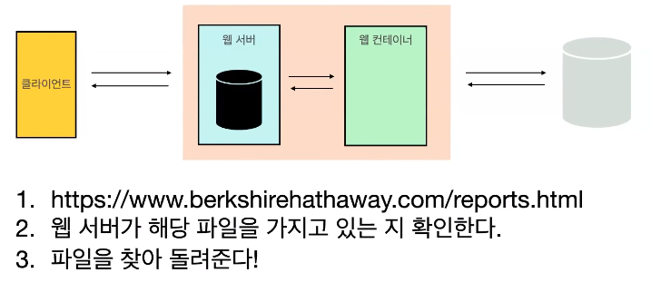
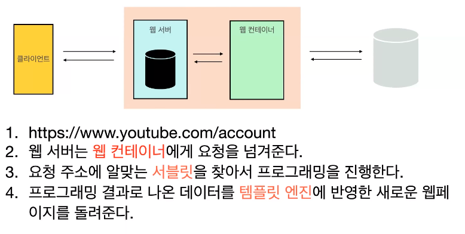

# 여우의 Web Server와 WAS 
[https://youtu.be/31tKPguQ1sk?si=E0dg97IKPz3iY7-O](https://youtu.be/31tKPguQ1sk?si=E0dg97IKPz3iY7-O)

# 여우의 Web Server와 WAS
* toc
{:toc}

## Web Server
+ 웹 서버란 HTTP 요청을 받고, 사용자가 필요한 자료를 HTTP로 보내는 컴퓨터

## WAS
+ 사용자가 언제 어디서 요청을 하든 똑같은 내용을 보여주는 페이지를 우리는 정적 페이지, 똑같은 내용을 보여주는 페이지를 우리는 정적 페이지,그리고 요청을 보내는 사용자에 따라 뒤에서 어떤 연산이나 프로그램을 진행한 후에
  그 결과를 반영한 웹페이지를 보내준다면 이는 동적 페이지 또는 웹 애플리케이션 이렇게 부른다
+ 정적 페이지
  + 
+ 동적페이지
  + 
+ 웹 서버와 웹 컨테이너를 둘러싼 이 분홍색 배경 이게 WAS이다 
+ 웹 애플리케이션 서버 (Web Application Server) WAS가 웹 컨테이너 실질적인 작업을 수행하는 이 컨테이너를 가지고 있기 때문에 동적인 컨텐츠를 다룬다 
+ 트래픽이 많지 않은 우리의 프로젝트라던가 작은 어플리케이션의 경우에는 트래픽이 많지 않으므로 과부하가 걸릴 일이 없다 하지만 사용자가 많아지고 서버에 과부하가 걸릴 일이 많아지면 서버를 분산해야 되는데
  이때 웹 서버는 동작이 가벼우니까 부하가 걸릴 일이 별로 없다 웹 컨테이너가 대부분의, 99%의 과부하를 책임지게 될 텐데 그럴 때는 웹 서버를 WAS로부터 뺀 다음에 웹 컨테이너만 가지고 있는 WAS를 증설하면
  대규모 트래픽에도 안정적으로 대응할 수 있게 된다
+ 이렇게 되면 클라이언트와 다수의 WAS 사이에 웹 서버가 중간다리 역할을 하게 되는데 그럼 자연스럽게 웹 서버의 역할이 엄청나게 많아지게 된다 이때부터는 이 웹 서버는 서버라기보다는 하나의 어댑터처럼 된다
  + 캐싱(Caching), 이미지 같은 정적인것은 웹 서버가 가지고 있다가 똑같은 요청이 들어오면은 전달해 준다
  + 로드 밸런싱(Load Balancing), WAS가 늘어났다고 해서 트래픽이 자동으로 분산되지는 않는다 웹서버 해준다
  + Health Check, 수명이 있다 언젠간 죽는다 그러면 분산을 할 때 죽은 서버는 빼고 보내줄 수 있어야 한다 
  + 리버스 프록시(Reverse Proxy), 웹 서버가 뻔히 있는데 클라이언트가 자기 마음대로 웹 컨테이너로 바로 직격탄을 쏠 수도 있다 그걸 방지하려면 무조건 웹 서버를 통해서만 상호작용할 수 있게 하고
    웹 컨테이너의 주소나 존재를 클라이언트로부터 숨겨야 한다 그 역할을 리버스 프록시로써 행하게 된다
