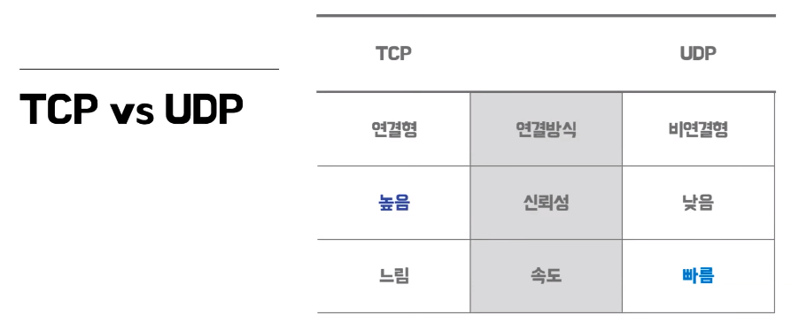
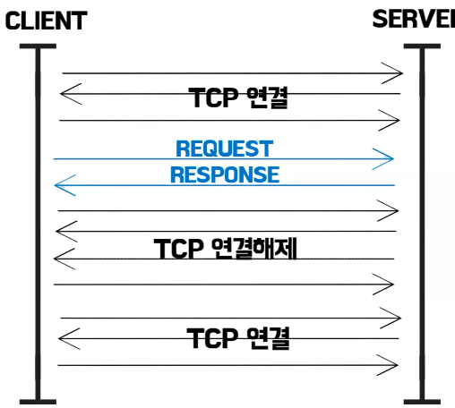
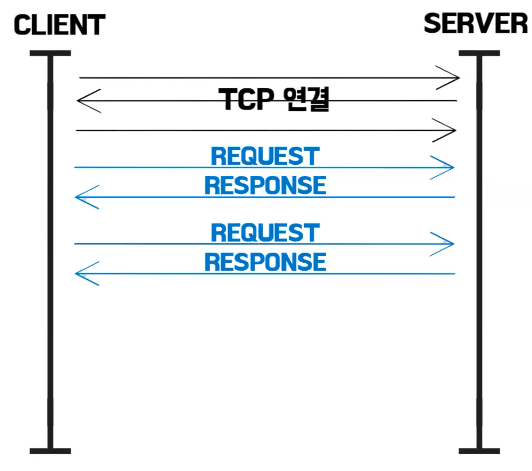
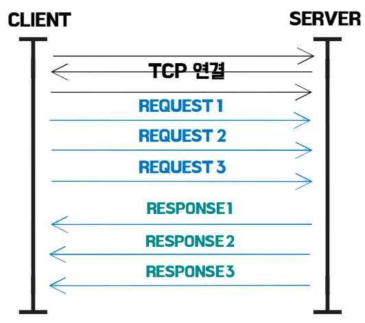
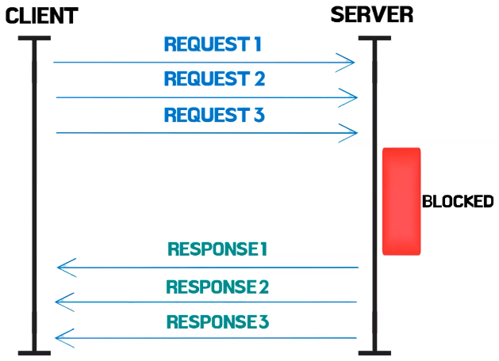
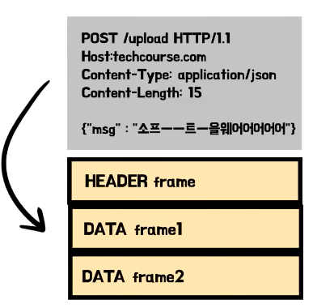
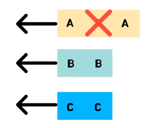
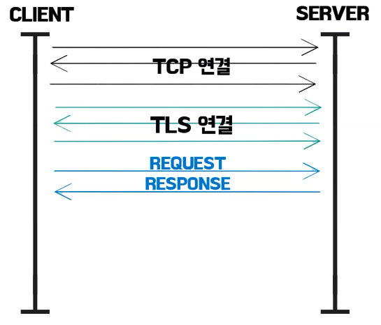
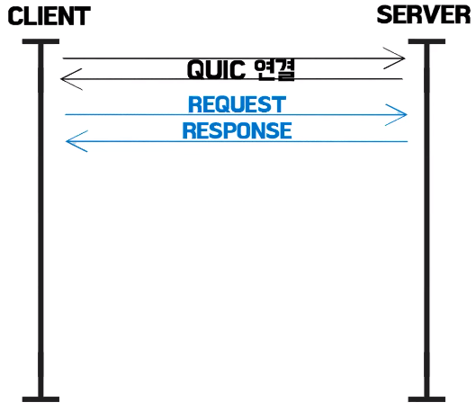

# 포이의 HTTP1.1, HTTP2, 그리고 QUIC
[https://youtu.be/Zyv1Sj43ykw?si=TGu20lM7T_9wnJS3](https://youtu.be/Zyv1Sj43ykw?si=TGu20lM7T_9wnJS3)

# 포이의 HTTP1.1, HTTP2, 그리고 QUIC
* toc
{:toc}

## HTTP란 무엇일까?
+ Hypertext Transfer Protocol에 줄임말인데 하이퍼 미디어 문서를 전송하기 위한 애플리케이션 레이어의 프로토콜
+ 하이퍼 미디어 문서란 웹상에서 돌아다니는 정보들, HTML이 될 수도 있고,이미지 파일이 될 수도 있고,CS 파일이 될 수도 있다
+ 
    + 네트워크를 4개층으로 나눈 TCP/IP 4계층이다
    + 어플리케이션 레이어 같은 경우에는 최상층에 위치해 있는데 정보를 주고, 받고 하기 위해서는 하위계층을 반드시 지나야한다
+ 전송 계층
    + 
    + TCP 같은 경우는 연결형의 연결 방식을 택하고 있다 데이터를 주고받기 전에 서버랑 잘 연결이 됐는지 연결을 확인하는 과정을 거친다 (3 Way-Handshake)
    + UDP 같은 경우는 이런 연결 과정이 하나도 없다
    + TCP는 이런 연결과정 덕분에 데이터 전송의 신뢰성이 상대적으로 높지만 속도는 낮다고 할 수 있고 UDP는 TCP와 반대로 신뢰성은 낮은 대신 어느 정도 속도를 보장해줄 수 있다

## HTTP1.1
+ HTTP 1.1는 전송계층 프로토콜 중에 TCP를 사용
+ HTTP 1.0의 문제를 해결하기 위해 출시 2.0이 출시되기 전까지 약 15년이나 사용될 정도로 되게 안정적인 프로토콜로 평가받고 있다
+ 
  + 1.0 같은 경우는 기본적으로 tcp 연결 과정 한 번을 하면은 정보를 주고받고 다시 연결을 해제해야 하는 이런 구조를 가지고 있다 한 연결에 하나의 요청과 응답이 왔다 갔다 한다
  + 이게 무슨 문제가 있냐면 우리가 웹페이지를 로딩을 하면 html 파일을 얘를 보고 싶어서 요청을 하고 응답을 받았는데 얘를 보려고 하니까 이미지 파일이 필요한 경우 다시 연결을 또 하고 이미지를 받고 또 연결을 해제하고 받았는데
    글씨체도 달라야 돼서 CSS도 받아야하면 또 연결하고 또 해제하고 이런 비효율적인 과정이 있었다.
+ HTTP 1.1에서는 지속적인 연결이라는 걸 기본으로 채택을 한다
  + 
  + 연결 한 번에 HTML도 받고 받고 보니까 이미지도 필요하면 이미지도 받고 이렇게 한 번에 받을 수 있게 됬다
+ 파이프라이닝이라는 기법
  + 
  + HTML도 필요하고 이미지도 필요하고 CSS도 필요해서 요청을 한번에 서버에 보내면 서버가 차례대로 이렇게 응답을 해준다

### 문제점
+ 
  + 파이프라이닝 때문에 발생하는 문제인데 Head Of Line Blocking 앞 글자를 따서 HOL Blocking이라고 부르는 문제이다
  + 이미지, CSS, HTML 요청을 한 번에 보냈을때 근데 1번 요청에 대한 응답이 서버에서 처리하는데 엄청 오래 걸려서 한 10초가 걸린다고 생각해보고 근데 반대로 2번, 3번은 0.1초면 바로 보내줄 수 있을 때 2번, 3번을 먼저 보내는게 TCP는 안된다
    그냥 블록을 한참 해놨다가 1번 응답이 될 때까지 10초 지나고 응답되면 그제서야 보내줄 수 있는 이런 비효율적인 문제가 있었다
+ HTTP 헤더에는 중복되는 자료들이 되게 많은데 다른 요청일 때 중복된 헤더를 계속 똑같이 보낸다 
+ 문제를 해결하는 2.0 15년에 등장하게 된다

## HTTP2.0
+ 
  + 바이너리 프레이밍 이라는 걸 이용을 한다 1.1은 텍스트로 모든 정보를 왔다 갔다 했는데 얘를 바이너리로 인코딩을 했다 당연히 컴퓨터가 더 좋아하는 텍스트보다는 바이너리니까 처리 속도가 빨라질 수밖에 없다
+ 
  + 바이너리로 프레이밍이 된 거를 여러 개의 프레임으로 쪼갠다 멀티플렉싱이 가능해 진다
  + A응답은 크고 블록이 한 6개, 7개로 나눠져 있어서 이걸 나눠서 보내야 되는데 그러면 6개, 7개를 한 번에 보내는 게 아니고 B랑 C가 예를 들어서 2개의 블록으로 나눠져 있는 게 끝이면
    A 보내고 B 보내고 C 보내고 A 2개 보내주고 C 보내고 B 보내고 이런 식으로 보냈다 여기까지 갔을 때 B랑 C에 대한 응답은 클라이언트 입장에서 완료가 된것이다 이렇게 HOL Blocking을 해결을다
+ 내가 어떤 정보를 사전에 보냈는지 정적 테이블에 미리 받고 있어요 캐싱을 해서 필요하고 안 겹치는 정보만 빼서 얘만 전송해서 중복 헤더 문제도 해결을 했다 
+ 허프만 코딩이라는 방법으로 인코딩을 해서 한 번 더 크기를 줄인다 1.1에 비해서 2.0은 헤더의 크기가 약 85%나 줄어들었다
+ 근데 이렇게 2.0이 사실 1.1을 완전히 대체하자 라고 나온 건 아니고 1.1의 성능을 향상시켜 보자, 지연을 줄여 보자 라고 나왔는데 막 지연이 잘 안 준다 왜그러냐면 TCP에서 동작을 한다.
+ TCP에서도 HOL Blocking이라는 문제가 똑같이 발생한다 아까 HTTP 계층에서 발생했던 거랑 비슷한 문제인데 TCP에서 멀티플랙싱 돼서 가고 있을때 응답에 대한 이 요청 패킷이 하나가 손실이 됐을때
  TCP는 신뢰성을 되게 중요시하는 프로토콜이라서 얘를 재전송을 해야 되서 재전송할 때까지 얘네도 다같이 기다리고 있는다 비효율적으로 기다리고 있는다
+ TCP 자체의 문제다 이거는 HTTP로는 해결을 못한다 해서 구글에서 아예 전송계층 프로토콜을 새로 만들어 버린게 QUIC 이다

## QUIC
+ UDP 위에서 동작하는 전송계층 프로토콜이다
+ 요청별로 다른 스트림 쓰면 되지 하고 나눠버린다
  + 
  + A응답이 블록이 돼도 다른 스트림으로 클라이언트가 받을 수 있다 
+ HTTP 말고 HTTPS 많이쓴다 HTTPS는 CLS 연결 과정이 한 번 더 필요하다
  +  
+ 
+ QUIC 입장에서는 HTTP를 안쓰고 보안 있는 HTTPS를 쓰니깐 탑재를한다 첫 연결에 CLS 연결까지 한다 
+ Connection ID를 클라이언트한테 연결을 한 번 하면 부여를 해준다 기존의 TCP는 IP랑 포트번호로 클라이언트랑 서버가 서로 구별을 한다
  그러다 보니까 서울에서 인터넷을 쓰다가 KTX 타고 부산 광주 내려왔을 때 인터넷 권역이 바뀌면서 IP랑 포트번호가 바뀐다 그러면 서버 입장에서는 다시 연결해서 TLS 정보 다시 달라고 하고 연결 과정을 똑같이 체결을한다
  근데 QUIC은 Connection ID로 구별을 해서 인터넷이 바뀌어도 그냥 이 패킷에 아이디를 헤더에 같이 실어서 보낸다 그러면 신뢰성있다고 생각하고 응답을 보낸다
+ 이과정을 한 번 쓰고 버리지 않는다 캐싱을 한다 클라이언트가 그래서 다음 요청부터는 연결 과정이 아예 필요 없다
