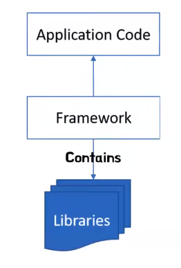
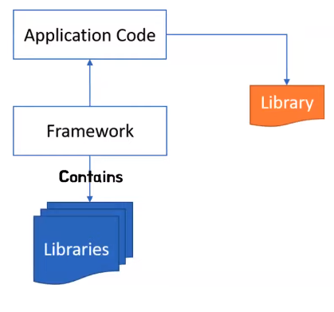
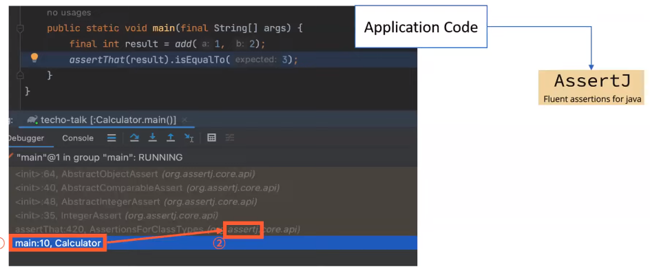
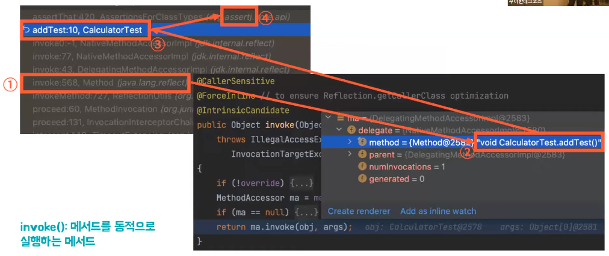
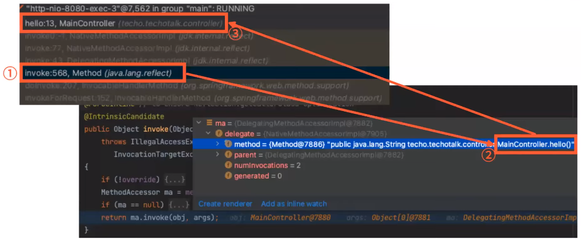
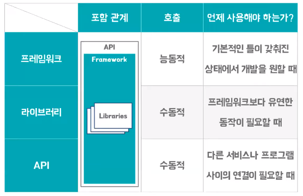

# 제리의 프레임워크 vs 라이브러리 vs API
[https://youtu.be/yKEwNVbAFC0?si=z-aJVhEy6rlK8jF_](https://youtu.be/yKEwNVbAFC0?si=z-aJVhEy6rlK8jF_)

# 제리의 프레임워크 vs 라이브러리 vs API
* toc
{:toc}

## 프레임워크
+ 프레임워크는 라이브러리의의 모음 모일일 수 있다.
+ 프레임워크는 액션을 호출할 수 있는 제어권을 가지고 있다.(제어의 역전)
+ 
  + 제어권을 갖고 우리의 코드나 라이브러리 코드를 호출

## 라이브러리
+ 라이브러리는 컴퓨터 프로그램에서 사용할 수 있는 재사용 가능한 동작의 모음
+ 리소스가 필요한 경우 프로그램이 라이브러리를 호출한다 
+ 
  + 프레임워크는 제어권을 갖고 우리의 코드나 라이브러리의 코드를 호출하고 있고 우리의 코드는 필요한 기능이 있을 경우 라이브러리를 호출해서 필요한 기능을 수행

## 제어권 - 라이브럴리 (AssertJ)
+ 
+ 호출 스택을 보면 우리가 실행한 메인 메서드가 실행이 되고 메인 메서드에서 필요한 라이브러리인 AssertJ 라이브러리를 호출 한다

## 제어권 - 프레임워크 (JUnit 5)
+ 
+ JUnit이라는 프레임워크를 사용해서 단위 테스트를 진행한 호출 스택인데 여기서 invoke 메서드는 정말 간단히 말해서
  메서드를 실행하는 메서드다 invoke가 실행하고 있는 메서드가 뭔지 따라가 봤더니 CalculatorTest라는 클래스에 addTest() 라는 메서드를 담고 있다
+ 결과적으로 invoke가 실행되어 addTest() 메서드가 실행이 됐고 그리고 이 addTest()에서는 값을 검증하기 위해서 AssertJ라는 라이브러리를 호출하고 있다

## 제어권 - Spring
+ 
+ 컨트롤러에 요청이 들어왔을 때 어떻게 동작하는지에 대해서 기록한 호출 스택인데 invoke라는 메서드가 호출되고 있다
+ invoke라는 메서드가 호출되고 있습니다 MainController.hello()라는 메서드를 실행하고 있다

## API (Application Programming Interface)
+ API (어플리케이션 프로그래밍 인터페이스)는 애플리케이션 소프트웨어와 서비스를 통합하기 위한 도구, 정의및 프로토콜의 집합이다.
+ Application은 우리가 만드는 응용 프로그램이나 어떤 서비스를 의미하므로 Application은 응용 프로그램
  그리고 Programming의 경우에는 Programming은 개발로 Interface는 사전을 찾아보니까 접점, 경계면
+ 이것을 잘 이어붙여서 응용 프로그램 개발에 쓰이는 접점
+ 일반적으로는 서로 다른 서비스 혹은 서로 다른 응용 프로그램 간에 생기는 접점을 API라고 한다

## 정리
+ 
