# 달리의 WEB의 응답과 요청 과정
[https://youtu.be/y8j59bEy4kQ?si=jWjcRDB4-3gP5uhg](https://youtu.be/y8j59bEy4kQ?si=jWjcRDB4-3gP5uhg)

# 달리의 WEB의 응답과 요청 과정
* toc
{:toc}

## 도메인 이름과 IP
+ 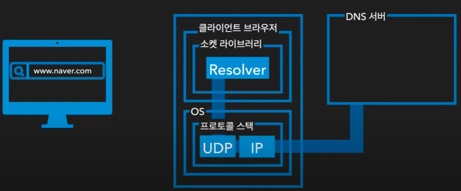
+ 데이터를 보낼 때 주소에 해당되는 IP가 필요 보통 주소창에 데이터를 보낼 때에는 도메인 이름을 적게 된다
+ 브라우저에 도메인 주소를 입력했을 때 내부에 있는 소켓 라이브러리의 Resolver를 통해 OS에 요청을 하게 돼서 UDP IP 프로토콜 을 통해 DNS 서버에 접속하여 IP를 가져오게 된다 
+ 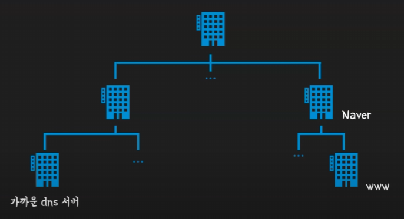
  + DNS란 도메인 네임시스템으로 브라우저에 주소를 입력하였을 때 가까운 DNS 서버에 접속을 하여 타고 타고 올라가서 이와 매칭이 되는 IP를 가져오게 되는 시스템

## 접속
+ 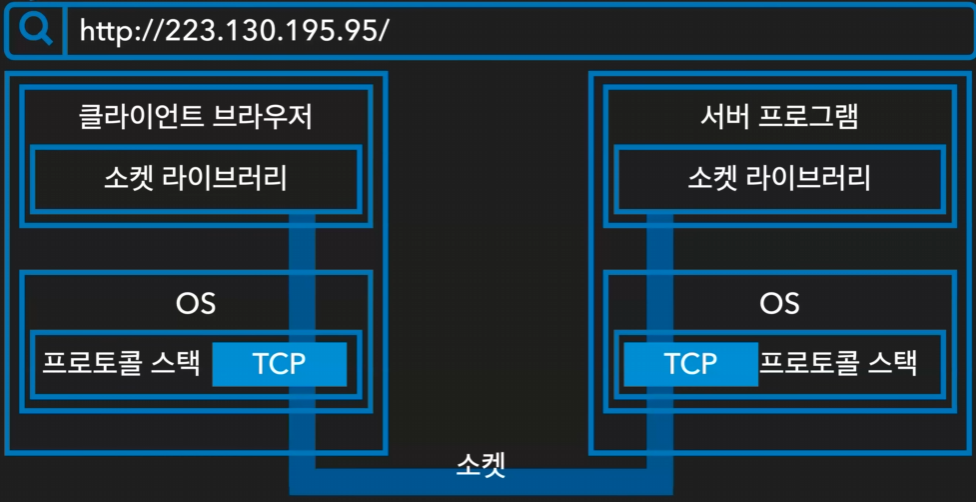
+ IP주소를 얻게 되었고 데이터를 보내기 전에 그 데이터를 보낼 터널을 연결해야 된다 그것을 소켓이라고 부르는데 이 소켓은 클라이언트 브라우저에 있는 소켓 라이브를 통해 연결되게 된다
+ 클라이언트 브라우저가 다시 한번 OS에 프로토콜 스택을 TCP 프로토콜을 통해 서버에 연결하여 소켓을 연결하게 되는 과정을 거친다 
+ 이때 소켓은 다음과 같은 것들이 필요하다
  + 첫번째로 디스크립터는 어플리케이션내에서 소켓을 식별하기 위한 요소
  + 두 번째 포트 번호는 OS에서 소켓을 식별 
  + 마지막으로 IP및 MAC 주소는 허브 및 라우터에서 소켓을 식별
  + 이 세 가지를 통해 소켓을 식별하고 데이터를 담아 보내게 되는 과정

### 소켓을 연결하는 과정
+ 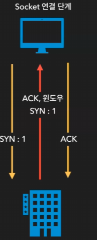
+ 우선 클라이언트에서 서버 에게 SYN을 보낸다
+ 서버는 이걸 알았다는 의미의 본인의 SYN도 보내게 된다
+ 응답으로 다시 클라이언트에서 서버에 보내는 세가지 단계를 거쳐 소켓을 연결하게 된다

## 데이터 보내기 
+ 소켓에 많은 데이터를 한 번에 보낸다면 그 과정에서 이 데이터가 말소되면 많은 데이터를 한 번에 또 다시 보내야 된다는 불상사가 생긴다
+ 때문에 데이터를 잘라서 보내게 되는데 자른 하나하나를 패킷이라고 부른다 
+ 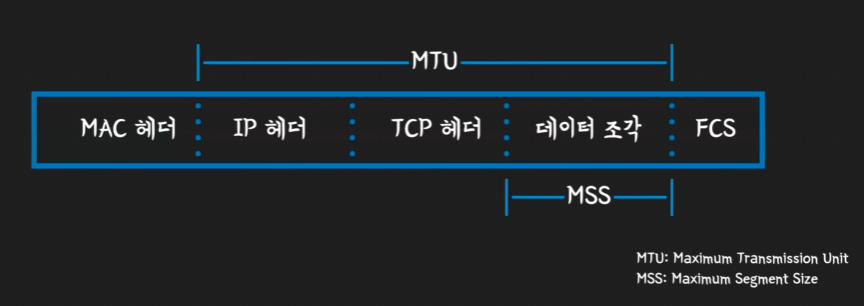
  + 패킷의 구조
  + 가운데 보이는 데이터 조각에 해당되는 MSS가 Maximum Segment Size의 약자로 한 패킷에 담기는 데이터의 단위
  + 만약 보낼 데이터가 이 MSS가 클 경우에는 이것을 잘라 패킷에 담고 다음 데이터는 그 패킷을 잘라서 다음 패킷에 담아서 보내게 되는 과정을 거친다

### 패킷의 구조
+ 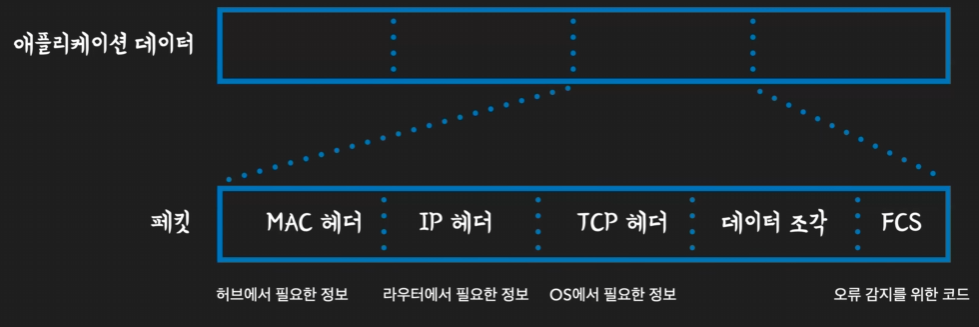
+ 패킷은 다음과 같이 다섯 가지 구조를 가지고 있는데
+ MAC 헤더에는 허브에 필요한 정보를 담는다
+ IP에는 라우트에 필요한 정보를 담는다
+ TCP 헤더에는 OS에서 필요한 정보를 담는다
+ 데이터를 담은 다음에 마지막으로 오류 감지를 위한 코드에 담아서 이 패킷을 보내게 된다

### 클라이언트와 서버

+ 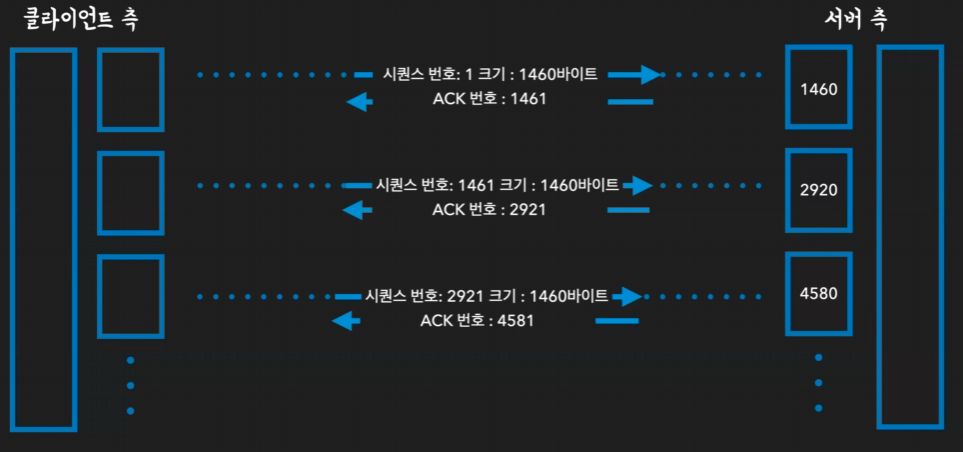
+ 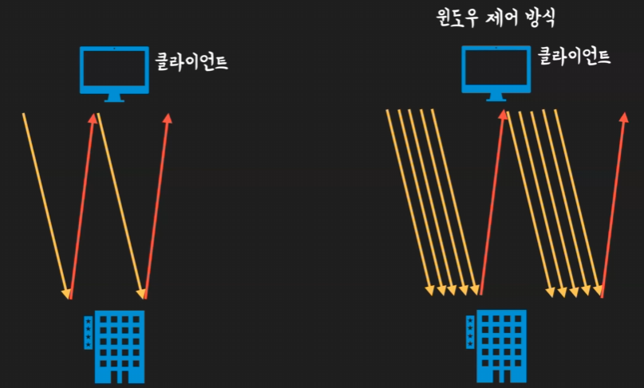
+ 클라이언트측에서 데이터를 보낸 다음에 서버 측에서 다시 데이터를 받으려면 응답이 올 때까지 기다려야 된다 만약 근데 이 과정을 패킷마다 반복을 한다면 모든 패킷마다 이 대기 시간이 있으면 너무 과정이 길어진다
  이걸 해결하기 위해서 윈도우 제어 방식을 선택하게 된다 
+ 윈도우 제어 방식은 서버가 수용할 수 있는 데이터 용량을 설정해놓고 그만큼의 데이터를 한 번에 받고
  그 단위마다 응답을 보내게 되는 방식을 말한다 

### 윈도우 제어 방식 
+ 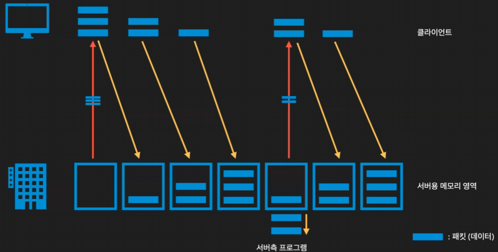
+ 데이터를 보낼 때 서버측에서 클라이언트측에 나는 이만큼의 정보를 받을 수 있어 라는 걸 먼저 공지하게 된다
+ 클라이언트에서는 그 데이터를 기억해놓고 이 데이터 만큼 계속 정보를 보내게된다
+ 서버가 더 이상 받을 수 없겠구나 를 알게 되면 클라이언트측은 대기를 하게 된다
+ 서버 측에서는 이 데이터 서버용 메모리 영역에서 그 데이터를 처리하고 받을 수 있는 영역을 확보하게 된다 
+ 그 이후에 다시 클라이언트측의 응답으로 난 이만큼 더 받을 수 있어를 알리게 되고 이 과정을 반복하면서 데이터를 주고받으면서 응답을 주고받는 횟수를 줄여서 좀 더 효율적인 송수신을 하게 되는 것이다

### 연결 끊기 
+ 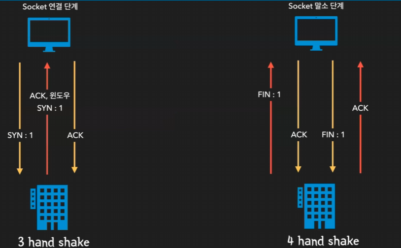
+ 단순하게 클라이언트측과 서버 측이 서로 난 보낼 거 다 보냈어 너는 다 보냈니?라고 묻는 과정
+ 우선은 서버 측에서 나는 할 일 다 끝냈어 라는 의미의 FIN을 보내게 되면 클라이언트측에서 알았어 라고 대답을 하는 것이다 
+ 그 이후에 나도 끝났어 라고 클라이언트가 말하게 되면 너 끝났구나라고 알리는 과정의 네 가지 단계를 거치게 된다
+ 이 단계는 이제 앞서 소켓 연결 단계와 많은 비교를 하게 되는데 소켓 연결 단계는 세 가지 단계를 거치기 때문에 3 hand shake라고 부르게 되고
  연결을 끊는 과정은 네 단계를 거치기 때문에 4 hand shake라고 부르게된다 

## 요약
+ 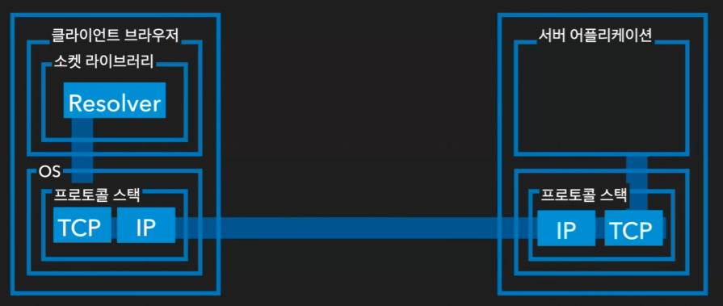
+ 클라이언트의 주소창에 입력했을 때 소켓 라이브러리의 Resolver를 통해 OS에 요청
+ UDP IP 프로토콜을 통해 DNS 서버에 접속하여 IP를 가져오게 된다
+ IP를 통해 다시 OS의 프로토콜 스택에 있는 TCP IP 프로토콜 통해 서버에 접속을 하여 데이터를 송수신하게 되면서 이 긴 과정이 마치게 되는 것이다
