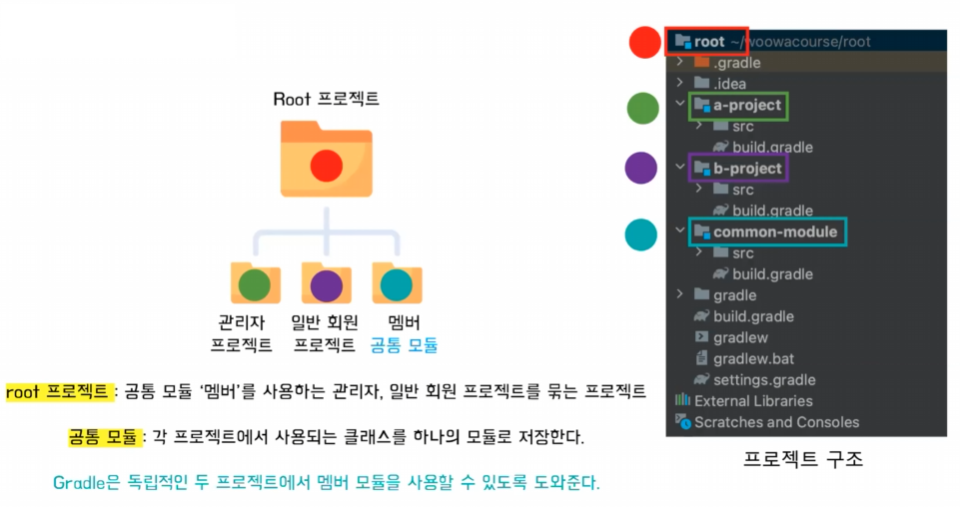
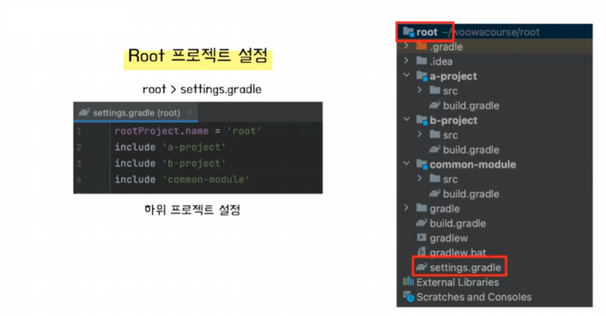
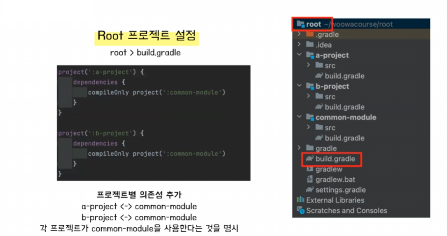
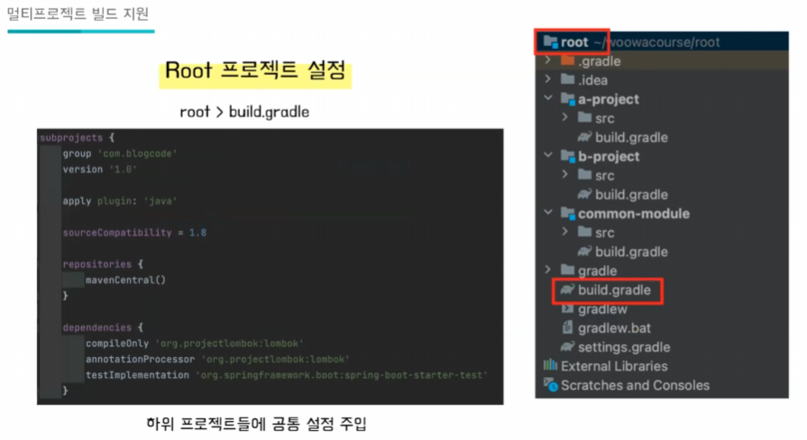
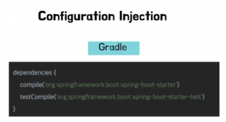
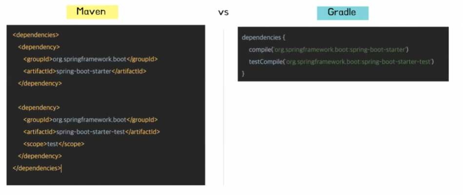
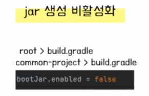

# 메리의 Gradle
[https://youtu.be/V4knLFDG-ZM?si=1-tBQELrs9Djm1fx](https://youtu.be/V4knLFDG-ZM?si=1-tBQELrs9Djm1fx)

# 메리의 Gradle
* toc
{:toc}

## Gradle 이란?
+ Gradle 공식문서에 따르면 Gradle을 유연한 빌드 자동화 도구라고 설명한다

### 빌드란?
+ 소스코드를 실행해 달라고 하면 컴퓨터는 이해하지 못한다 소스 코드를 컴파일하고 의존성을 추가해서 실행 가능한 파일 jar나 war로 패키징을해 줘야지 실행을 할 수 있다
+ 그래서 소스코드를 실행 가능한 파일로 변환 해 줘야 하는데 이 과정을 빌드 라고 한다

### 빌드 도구의 역할
+ 빌드도구는 코드를 실행 가능한 파일로 만들어 주는 과정 즉, 빌드를 하고 추가적으로 라이브러리도 관리해주고 테스팅도 해주고 배포도 해 준다 그리고 이러한 과정을 자동화하여 수행하는 역할을 한다

### 빌드 도구의 필요성
+ 빌드 도구를 사용하지 않았을 때 문제점
  + 빌드 도구를 사용하지 않았을 때는 반복적인 작업을 수작업으로 진행 해야 되기 때문에 비효율적이고 실수를 할 가능성이 높다
  + 라이브러리를 직접 다운로드 해야 되고 버전도 업데이트를 계속 매번 해 줘야 되기 때문에 버전 동기화에도 어려움이 생길 수 있다
  + 프로젝트 의존성을 파악하기 어렵다

## 빌드도구의 역사 
+ ANT
  + ANT는 기본적인 컴파일이나 패키징, 배포 작업 수행이 가능한 빌드 도구
  + XML 기반의 스크립트 사용
  + 스크립트를 사용한 언어였기 때문에 유연성을 가졌지만 의존 관계를 정의하는 구조가 없다
  + 유지보수가 어렵다는 단점이 있다
+ Maven
  + Maven은 정혜진 라이프 사이클에 따라서 빌드를 진행
  + 라이브러리 의존성을 자동으로 관리해주는 기능도 추가되었지만 가독성이 좋지 않다는 치명적인 단점이 있다
  + pom.xml 파일 사용
  + XML 파일 기반으로 가독성이 좋지 않다
  + 상속구조를 이용한 멀티 모듈 구현
  + 의존관꼐가 복잡한 프로젝트에는 부적절
+ Gradle
  + ANT와 Maven의 장점을 채택한 Gradle이 탄생
  + Gradle은 Groovy 기반의 스크립트 언어이다 스크립트 언어이기 때문에 동적으로 실행이 가능하고 또 스크립트 언어이니까 추가 하고 싶은 로직을 작성을 하고 싶을 때 스크립트 로직을 직접 작성할 수 있다
  + 플러그인을 호출할 수도 있다 Groovy 기반의 DSL 언어이기 때문에 자바와 유사한 문법 구조를 가져서  자바 개발자들한테는 딱 좋은 빌드 도구 이며 또 자바와의 호환성도 좋다

## Gradle 빌드 스크립트

### Plugins 
+ 예를 들어 자바를 빌드를 하고 싶으면 컴파일을 하고 dependency를 추가하고 테스트를 하고 이런 과정이 반복되어 작성이 되어야한다
+ 자바파일을 만들 때마다 이런 과정들을 계속 Gradle에 추가를 해 준다면 엄청 번거롭게 된다 그래서 자주 쓰는 애들을 플러그인으로 task들의 묶음으로 만들었다
+ 그래서 플러그인을 추가를 하면 빌드를 수행 해주는 task들을 사용할 수 있게 된다

### 의존성 관리
+ 프로젝트에서 사용하는 라이브러리나 패키지를 의존성이라고 한다
+ 프로젝트별로 어떤 의존성을 갖는지를 명시해 주어야 한다
+ 라이브러리를 추가하는 시점을 설정할 수 있다 특정 시점에 불필요한 라이브러리를 추가하게 된다면 리소스가 낭비될 수 있다 그래서 필요한 시점에 라이브러리를 추가 하기 위해서 Dependencies Configuration 을 써서
  라이브러리가 추가되는 시점을 설정해 줄 수 있다
+ 종류 
  + Implementation: 런타임 + 컴파일 시점 모두에서 사용
  + compileOnly: 컴파일할 때만 사용되고 런타임 때는 미사용
  + runtimeOnly: 런타임 때문 사용
  + testImplementation: 테스트할 때에만 사용

### Repositories
+ Repositories는 앞서 dependency 에서 사용한다고 추가했던 라이브러리가 저장된 위치를 정의한다
+ 대표적으로는 Maven Central(), Jcenter(), Google Android() 가 있다
+ 라이브러리의 저장소를 명시해주면 Gradle이 해당 저장소에서 필요한 라이브러리를 가져온다 

## Gradle의 특징 및 주요 기능
+ Gradle은 유연성을 가지고 성능적인 측면에서도 뛰어나다
+ 멀티프로젝트 빌드를 지원하고 설정 주입 방식을 사용한다

### 성능
+ 빌드 캐시를 사용 
+ 점진적 빌드 
+ 데몬 프로세스를 사용

#### 빌드 캐시
+ 빌드 캐시는 빌드 결과물을 캐싱하여 재사용 한다는 것 
+ 한번 빌드한 결과물을 캐싱 해주기 때문에 반복적으로 빌드를 할 필요가 없어져서 시간이 단축될 수 있다
+ 반복적으로 빌드를 할 필요가 없어져서 시간이 단축될 수 있다

#### 점진적 빌드 
+ 마지막 빌드 호출 이후에 변경된 부분만을 빌드
+ 변경 되지 않은 부분은 캐시에서 저장한 그 결과를 검색해서 재사용하게 되고 변경된 부분만 추가적으로 빌드를 하게 된다
+ 태스크의 입력과 출력이 변경 되지 않았을 때 UP-TO-DATE를 표시하고 해당 태스크를 실행하지 않는다

#### 데몬 프로세스
+ 다음 빌드 작업을 위해서 백그라운드에서 대기하는 프로세스를 데몬 프로세스라고 하는데 초기 빌드를 한 이후에는 다시 초기화 작업을 거치지 않기 때문에 성능이 더 좋아진다
+ 맨 처음에 초기 빌드를 진행한 결과물을 데몬 프로세스에 저장을 하고 그 이후에 빌드를 진행할때는 데몬 프로세스에서 결과물을 가지고 와서 재사용하기 때문에 다음 빌드 부터는 매우 적은 시간만 소요가된다
+ 초기 빌드를 실행 했을 때는 Starting Gradle daemon이 출력되고 이 때 데몬 프로세스가 시작이 되고 두 번째 빌드를 했을 때는 뜨지 않는다
+ 시간도 마찬가지로 초기 빌드를 실행 했을 때는 두 번째 빌드를 실행했을 때보다 훨씬 더 오래 걸린다

### 멀티 프로젝트의 필요성
+ 관리자 프로젝트랑 일반 회원 프로젝트의 두 독립적인 프로젝트가 있다고 했을 때 각 프로젝트에서 멤버 클래스라는 모듈을 둘 다 사용한다고 가정을 하자 그러면 만약에 멤버 클래스의 변경 일어났으면
  관리자 프로젝트 있는 멤버 클래스도 변경해 주어야 되고 일반 회원 프로젝트 있는 멤버클래스도 변경을 해주어야 된다 그러면 유지보수가 어려워지고 관리가 어렵다는 단점이 있다
+ 이 때 Gradle을 활용해서 공통 모듈을 관리할 수 있도록 할 수 있다 

#### 멀티 프로젝트 빌드 지원
+ 멀티 프로젝트란 공통되는 도메인을 사용하는 프로젝트를 하나의 프로젝트로 묶어서 관리 하는 것인데 Gradle은 각 프로젝트가 공통으로 사용하는 클래스를 모듈로 만들어서 두 프로젝트가 사용할 수 있도록 의존성을 주입해 주기 때문에 사용할 수 있다
+ 
+ 먼저 두 프로젝트를 포함하는 Root 프로젝트를 생성 그리고 그 Root 프로젝트 안에 공통되는 클래스인 멤버 클래스를 넣고 얘를 모듈화 시켜 놓는다 그러면 이 Root 프로젝트는 두 개의 프로젝트와 하나의 공통되는 모듈을 갖고 있기 때문에 위치를 알고 있고
  그 위치를 알고 있기 때문에 의존성을 추가해줘서 서로 사용할 수 있게 만들어 줄 수 있다
+ 
  +  root 프로젝트의 settings.gradle에 들어가서 하위 프로젝트를 넣어주고 공통 모듈도 추가
+ 
  + 각 프로젝트가 어떤 모듈을 사용하고 있는지를 의존성을 추가
+ 
  + 공통적으로 필요한 애들은 서브 프로젝트 안에서도 관리해 줄 수 있다
  + 
  + 이게 가능한 이유는 Configuration Injection 방식 사용하기 때문인데 필요한 정보를 직접 프로젝트에 주입하는 방식으로
    공통되는 정보는 묶어서 주입이 가능하고 다른 것은 프로젝트별로 설정을 다르게 주입이 가능하다는 것
  + 
  + Maven과 비교해 봤을 때 가독성 측면에서도 훨씬 더 유리하다
+ 
  + 멀티 프로젝트를 관리하기 위해서 bootJar를 enable 해 줘야한다 
  + 멤버 클래스와 루트 프로젝트는 실행 가능한 파일이 없다 그래서 얘네들이 실행 가능한 파일이 아니라는 것을 명시해 주기 위해서 이런 코드를 추가해 줘야한다

### 정리
+ Gradle은 프로그래머가 작성한 코드를 실행 가능한 파일로 변환
+ 라이브러리, 테스트, 배포 등을 자동화하여 관리해주는 빌드 자동화 도구
+ Groovy 기반의 스크립트 언어로 유연성을 갖는다
+ 성능 측면에서 유리한 빌드 도구이다
+ Configuration Injection 방식을 통해 편리한 멀티프로젝트 빌드를 지원한다

