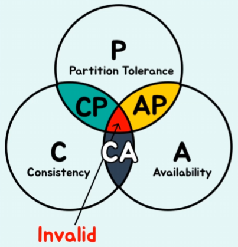

# 스플릿, 애쉬의 SQL과 NoSQL
[https://youtu.be/cnPRFqukzek?si=ZkJ_FN4LFKcN5JY4](https://youtu.be/cnPRFqukzek?si=ZkJ_FN4LFKcN5JY4)

# 스플릿, 애쉬의 SQL과 NoSQL
* toc
{:toc}

## Query Language
+ Query Language는 DBMS에서 DB를 다루기 위해 사용되는 언어

### Database 란? 
+ 데이터베이스는 여러 사람이 공유하여 사용할 목적으로 체계화해 통합, 관리하는 데이터의 집합
  + 여기서 키포인트는 한 사용자가 아니라 여러 사용자가 공유해서 데이터를 사용할 수 있다는 점이다

### Data Base Managemet System이란?
+ 사용자는 DB한테 직접 요청을 보내는 게 아니라 DBMS에게 요청을 보내서 해당 DBMS가 DB에게 사용자 요청을 전달하고 또 DB에서 전달받은 데이터를 사용자에게 넘겨준다 
+ DBMS 즉 데이터 베이스 매니지먼트 시스템은다수의 사용자들이 데이터베이스 내의 데이터를 접근할 수 있도록 도와주는 소프트웨어 도구 집합이다
+ 사용자는 Query Language를 통해서 DBMS에게 요청을 보낸다 

### Query Language의 특징
+ Query Language는 비절차장 언어 라는 특징이 있다
  + 비절차적 언어의 특징은 원하는 결과에 대한 내용(What)만 명세하고 겨과를 얻는 내부 방식에 대한 내용(HOW)은 없다  

## SQL
+ SQL은 Structured Query Language의 줄임말로 RDBMS에서 사용되는 표준 질의언어이다
+ 사용자는 SQL을 통해서 RDBMS에게 요청을 보내고 RDBMS는 사용자의 요청을 통해 DB에서 데이터를 꺼내서 사용자에게 테이블 형식으로 데이터를 보내준다

### RDBMS
+ DBMS는 사용자의 요청을 해서 데이터 베이스에게 접근하는거라 했는데 RDMBS는 DMBS의 한 종류로 관계형 데이터베이스 관리 시스템이다
+ Relational Data Base Management System의 줄임말 

### RDBMS의 특징

#### 정해진 스키마에 따라 테이블이 구성된다
+ 스키마란 데이터베이스에서 사용되는 데이터 구조를 정의하는 개체
+ 사용자는 스키마를 통해서 구성 요소간 제약조건도 지정할 수 있다
+ RDBMS에서는 데이터를 행과 열로 구성된 표 형태로 저장하게 되는데 테이블이 바로 RDBMS에서 데이터를 구성하는 가장 기본적인 단위
+ 테이블의 열, 즉 Column이란 특정 유형의 데이터를 저장하기 위한 속성
+ Row, 행은 테이블에서 한 행을 뜻한다 이는 흔히 튜플 혹은 레코드로도 불린다
+ 제약조건의 종류로는 Not Null, Unique, Default, Primary key, Foreign Key 등등이 있다

#### RDBMS에서는 실세계 데이터를 테이블 간의 관계로 인해서 정의 한다
+ 즉 테이블끼리 관계를 가질 수 있다
+ 관계의 종류로는 일대일, 일대다, 다대다가 있다

#### 트랜잭션을 사용한다 
+ 트랜잭션이란 데이터베이스의 상태를 변화시키기 위해서 수행하는 논리적 작업 단위

##### 트랜잭션의 특징은 대표적으로 ACID가 있다
+ 원자성,일관성,고립성,지속성이다
+ Atomicity, 원자성은 트랜잭션은 모두 수행되거나 모두 수행되지 않는다 이 두 가지를 보장하게 되는데 만약에 트랜잭션 안에서 단 하나의 작업이라도 실패하게 되면 이 전체를 롤백하여 원자성을 보장하게 된다
+ Consistency 일관성 하나의 트랜잭션 이후에 데이터베이스의 상태는 이전과 같이 유효해야 한다 트랜잭션이 일어난 이후에도 이전처럼 데이터베이스의 전체적인 데이터들이 데이터베이스에 제약이나 규칙을 만족하는 상태를 유지한다 
+ Isolation 격리성이고 트랜잭션이 수행중에는 다른 트랜잭션의 작업이 끼어들지 못하게 만든다 이를 통해서 트랜잭션 간에는 서로 독립적으로 수행하게 되는데 이 격리성을 제공하기 위해서 Isolation Level 이라는 게 있다
+ Durability 영속성은 트랜잭션이 성공하면 적용된 결과는 영구적으로 지속된다 시스템이 다운되거나 기타 문제가 발생해도 트랜잭션의 결과는 똑같이 유지되어한다

##### Isolation Level
+ Read Uncommitted (가장 낮은 격리 수준)
  + 커밋 되지 않은 내용도 다른 트랜잭션이 읽을 수 있다
+ Read Committed
  + 다른 트랜잭션이 커밋한 데이터만 읽을 수 있다
  + 즉, 다른 트랜잭션이 커밋되기 전까지는 해당 데이터에 대한 변경 내용을 읽을 수 없다.
+ Repeatable Read
  + 트랜잭션이 시작되면 자기가 읽고 있는 데이터의 데이터를 잠금으로써 다른 트랜잭션이 수정할 수 없게 만드는 단계이다
+ Serializable (가장 높은 격리 수준)
  + 모든 데이터를 잠궈놓아서 다른 트랜잭션이 해당 데이터에 접근하는 것을 막는다
  + 이를 통하여 동시성 처리 속도는 낮아지지만 데이터에 일관성과 무결성을 보장할 수 있는 단계

### 그외 특징
+ 인덱스
  + 인덱스란 테이블에 대한 검색 속도를 높여주는 자료 구조로서 책에서 목차같은 역할을 하게 된다
  + 테이블 내에 1개의 컬럼, 또는 여러 개의 컬럼을 이용하여 생성하고 사용하게 된다
+ 다중 작업 지원
  + 다중 작업 지원은 Isolation Level을 통해서 이루어진다
+ 데이터 백업
  + 데이터 복사본을 생성하여 데이터 손실을 보호
+ 데이터 복구
  + 시스템 장애난 인위적인 문제 발생시 데이터를 이전 상태로 복원하여 보호

### SQL의 분류
+ SQL은 크게 세 분류로 나눌 수 있는데 DDL, DML, 그 외인 DCL과 TCL이 있다

#### DDL
+ DDL은 Data Definition Language로 테이블을 생성하고, 수정하고, 초기화하고, 삭제하는 역할을 갖고 있다
+ Create 구문을 통해서 Create table을 통해서 테이블을 만들 수 있다
+ ALTER 수정을 통해서 테이블 안에 있는 속성을 추가, 수정 혹은 삭제도 가능하다
+ Truncate는 초기화인데 테이블이 갖고 있는 모든 데이터는 삭제하고 테이블 틀 자체는 놔두게 되는 구문이다
+ Drop은 테이블 자체를 삭제해 버리는 구문이다

#### DML
+ DML은 Data Manipulation Lanugae로 데이터를 생성, 조회, 갱신, 삭제하게 된다
+ insert 구문을 통해서 새로운 데이터를 테이블 안에 삽입
+ Select 구문을 통해서 원하는 테이블에서 원하는 속성값을 조회
+ Update를 통해서 원하는 테이블에 Where 구문을 사용하여 특정 조건을 충족하는 행을 검색하여 그 행을 자기가 원하는 값으로 업데이트
+ Delete로 이것도 Where 구문을 사용하여 원하는 행을 찾아 그 데이터를 삭제

### DCL, TCL
+ DCL은 Data Control Language로 Grant와 Revoke를 통하여 권한을 부여하고 권한을 회수하게된다
+ TCL은 Transaction Control Language로 트랜잭션이 커밋될건지 롤백될 건지 이 두 개를 조절할 수 있다

## NoSQL

### NoSQL의 등장 배경
+ 2009년에 페이스북, 트위터, 구글 애널리틱스 등에서 사용자가 급격하게 증가하면서 데이터도 폭발적으로 증가하게 된다
+ 단일 서버에 이제 모든 데이터를 넣을 수 없어져서 서버의 확장이 불가피해졌다
+ 이렇게 서버 확장의 종류로는 두 가지가 있는데 서버의 사양을 높여서 한 대의 서버에 조금 더 많은 데이터를 담는 수직적 확장과 서버의 대수를 늘려서 데이터를 여러 서버에 분산시켜서 저장하는 수평적 확장이 있다
+ 기존의 RDBMS는 확장의 한계를 가졌는데 수직적 확장, 즉 서버의 사양을 높이는 것은 정말 가격이 비싸고 사양을 무한히 높일 수도 없다 그래서 사양을 높여봤자 폭발하는 데이터를 모두 다 담지 못한다
  그러면 수평적 확장을 해야 될 텐데 RDBMS는 처음에 만들어질 때 단일서버에서 돌아갈 거라는 가정을 가지고 만들어진 데이터 베이스 시스템 이기 때문에 기술적으로 어렵고 한계도 존재한다
+ 이러한 RDBMS의 수평적 확장 한계를 극복하기 위해서 NoSQL 데이터베이스가 등장한다

### NoSQL 데이터베이스 특징

#### 유연한 데이터 모델을 가진다
+ RDBMS는 스키마을 가지고 고정된 데이터 모델에 데이터를 넣을 수 있다고 했는데 NoSQL 데이터베이스는 RDBMS와 달리 고정된 스키마가 없다
+ 즉 데이터를 유연하게 추가하거나 삭제하거나 수정할 수도 있고 데이터 모델의 변화에 대한 대응이 용이해졌다
+ 만약에 주문 서비스를 RDBMS로 만드는데 배송지를 처음에는 국내 서비스만 제공을 했다 그래서 대한민국의 맞는 시,도,구,동,번지,건물번호,아파트,세부주소만 있었는데
  서비스를 확장하게 되면서 글로벌 서비스 미국에게도 배송을 보낼 수 있게 됐다 그런데 미국의 주소 체계는 대한민국과 다르다 주가 있다 그래서 테이블에 주라는 컬럼을 또 추가 해야 된다
  그런데 또 다른 나라가 추가 되면 또 다른 데이터 구조가 들어가야된다 이렇게 한 나라가 추가될 때마다 데이터 모델이 변화해야 한다 NoSQL은 나라별로 다른 데이터 모델을 가진 데이터를 저장할 수 있다
+ 관계형 데이터 베이스는 데이터를 테이블에 맞게 쪼개서 저장해야 된다 했는데 어플리케이션단에서 데이터 구조에 맞게 매핑을 해줘야 한다 NoSQL에서는 유연하기 때문에 이러한 노력이 필요 없어졌다
+ NoSQL에는 실제로 다양한 데이터 모델이 있는데 크게 Column, Graph, Key-Value, Document가 있다 이들은 모두 다 다른 특성을 가져서 사용자가 자신의 목적에 따라서 데이터 모델을 선택해서 사용할 수 있다
+ 데이터 모델별 대표적 예시로는 Column에는 cassandra, graph에는 neo4j key-value에는 redis, Document에는 mongoDB가 있다

#### 저렴한 비용
+ NoSQL 데이터베이스는 오픈소스제품이 많아서 저렴하며 무료로 사용할 수 있는 제품도 많다
+ 데이터 가용성을 보장하기 위해서 노드를 추가할 수 있다 즉 수평적 확장이 용이하기 때문에 하드웨어 비용도 상대적으로 낮다는 장점이 있다
+ RDBMS와 NoSQL의 가격을 비교하면 NoSQL이 두 배 정도 저렴하다

#### 분산 시스템
+ 분산 시스템은 데이터를 여러 대의 컴퓨터 노드에 분산하여 저장하고 처리하는 시스템이다
+ 이제 분산 시스템을 이용하면 새로운 노드를 추가하는 아까 말했던 scale-out에 굉장히 용이하고 또한 노드 중 하나가 다운되더라도 시스템 전체가 중단되지 않도록 하기 때문에 시스템의 가용성 또한 올라간다
+ 또한 각 노드는 자기가 갖고 있는 데이터만 처리하고 여러 노드가 병렬처리가 가능하기 때문에 빠른 처리 또한 가능하게 된다

##### 분산 시스템 설계 원칙 CAP
+ 분산시스템 설계 원칙 CAP가 등장하게 된다
+ CAP의 C는 Consistency(일관성) 로 모든 클라이언트가 같은 시간에 같은 데이터를 볼 수 있다
+ Availability(가용성)로 노드 중 하나 이상의 노드가 실패하더라도 정상적으로 요청을 처리해야 하는 기능을 제공해야
+ Partition tolerance(장애 내성) 
  + Partition: 여러 개의 노드가 분산되어 이루어져 있기 때문에 이중의 몇 개의 노드가 서로 통신이 일시적으로 불가능해지는 상황 
  + 즉 네트워크 장애 또는 서버 다운과 같은 분할 상황이 발생하더라도 시스템 전체는 작동해야 한다
+ 
  + 교집합들로 CP, CA, AP가 존재하게 된다
  + CA는 애초에 장애 내성을 고려하지 않는 분류이다 그렇기 때문에 만약에 노드간 통신이 일시적으로 불가능해지면 시스템 전체가 다운되기 때문에 이 CA, 일관성, 가용성은 항상 이제 분산 시스템이 제대로 정상 작동하는 와중에는 보장이 되기 때문에 항상 CA를 갖게된다
  + CP
    + 같은 경우는 대표적으로 몽고디비가 있는데 몽고디비 같은 경우는 프라이머리 노드에서 모든 데이터에 대한 권한을 갖고 있다 그리고 세컨더리 노드는 이 프라이머리 노드의 트랜잭션 로그를 활용해서 똑같은 데이터를 갖고 있게 되는데
      이제 장애 내성 같은 경우는 프라이머리 노드에서 장애가 생길 경우 프라이머리 노드가 내려가고 세컨더리 노드가 프라이머리 노드로 올라오면서 다시 복구를 가능하기 때문에 잠깐 동안 이 가용성 부분은 포기가 되지만 장애 내성을 통해서 시스템이 복구된다
    + 프라이머리 노드만 데이터 권한을 갖고 있기 때문에 모든 클라이언트가 같은 시간에 같은 데이터를 볼 수 있는 CP에 해당된다
  + AP
    + AP 같은 경우에는 가용성과 장애 내성을 갖고 있는 설계인데 가용성을 가지려면 노드 중 하나 이상의 노드가 실패하더라도 정상적으로 요청을 처리해야한다 그 뜻은 각 노드가 자기 데이터에 대한 권한이 있어야 된다는 말과 동일한데
      각 노드가 자신의 데이터에 대한 권한이 있을 경우 데이터가 변경되면 각 노드와의 통신을 통해서 동기화를 해야 된다
    + 하지만 이 동기화가 되는 시간에서 이 일관성 모든 클라이언트가 같은 시간에 같은 데이터를 볼 수 있다는 보장되지 않기 때문에 A를 갖게 되고 이제 각각 노드가 자신의 권한이 있기 때문에 장애가 생길 경우 그 노드를 제외한 나머지 노드가 요청을 처리한 뒤에 
    복구가 되면 동기화하는 과정을 통해서 이제 AP 설계를 할 수 있다
+ 이 과정에서 CA 같은 경우는 분산시스템임에도 불구하고 분산 시스템에서 장애가 생기면 시스템이 다운되게 된다 그래서 나온 말이 그러면 이게 분산 시스템이 진짜 되는 거냐 그리고 분산 시스템에서 이런 장애가 없을 수가 있느냐
  라는 질문이 많이 나왔고 그 후 나중에 등장한게 PACELC이다

##### 분산 시스템 설계 원칙 PACELC
+ 
+ 이 설계원칙 같은 경우는 애초에 Partition 장애와 Else는 정상 작동이다 두 개 자체를 나눴다
+ 이제 장애일때는 가용성을 택하느냐 그리고 일관성을 택하느냐 하나를 고르게 된다 
+ Consistency는 같은 시간에 같은 데이터를 봐야 한다 근데 여기서 이제 Latency는 같은 시간에 같은 데이터를 보지 않을 수 있다
  하지만 이 시간 지연을 통해서 결국에는 일관성을 보장한다는 내용이다
  + 분산 시스템에서는 노드끼리 서로 통신하면서 동기화하기 때문에 그 과정이 다 지나면은 일관성을 보장한다 그래서 바로 일관성을 보장할거냐 이 Latency를 기다려서라도 일관성을 보장할거냐 이 두 개로 나뉘게 된다
  + 보기에는 Latency라는 말 때문에 이게 좀 더 오래 걸릴 것 같지만 실제로는 Consistency 일관성을 보장하기 위해서는 노드끼리 다 통신을 하고 모두가 같은 데이터가 있는지도 확인해야 되는 과정이 요청에서 들어가기 때문에 이게 더 오래 걸리고 Latency가 좀 더 빠르게 처리되는 특징을 갖고 있다

#### BASE
+ NoSQL은 BASE를 가지게 된다 BASE는 분산시스템의 특징이고 데이터 일관성을 유지하고 시스템 가용성을 유지하는 특징이다

##### Basically Available (BA)
+ BA는 Basically Available로 데이터베이스가 일부 노드에서 실패하더라도 적절한 레플리케이션과 그리고 분산시스템을 사용하여 전체적인 시스템의 가용성을 유지하게 된다 즉 일부 노드에서 데이터베이스 서비스가 중단되어도 다른 노드에서는 계속하여 서비스를 제공하게 된다

##### Soft State
+ 분산시스템에서 발생하는 네트워크 지연, 노드 간 통신 문제로 인해 데이터 베이스의 상태는 시간에 따라 변할 수 있다는 내용이다
+ 데이터 베이스가 능동적으로 상태를 조정하여 데이터 일관성을 유지하는 특성을 가지고 있다

##### Eventually Consistent
+ Latency와 비슷한 개념이다 
+ 데이터 일관성이 모든 노드에서 즉시 유지되지 않을 수 있지만 일정 시간 이내에 결국 데이터 일관성이 유지된다

