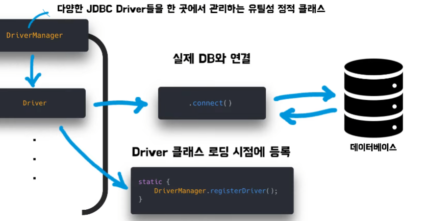
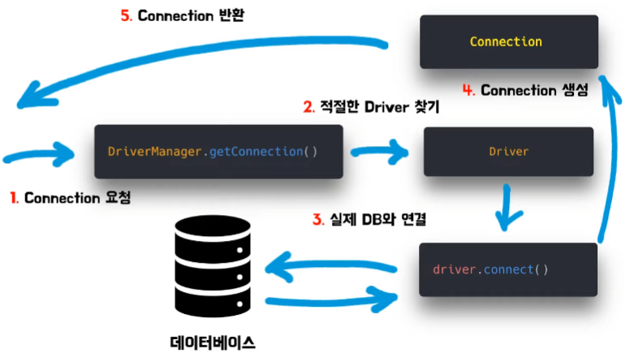
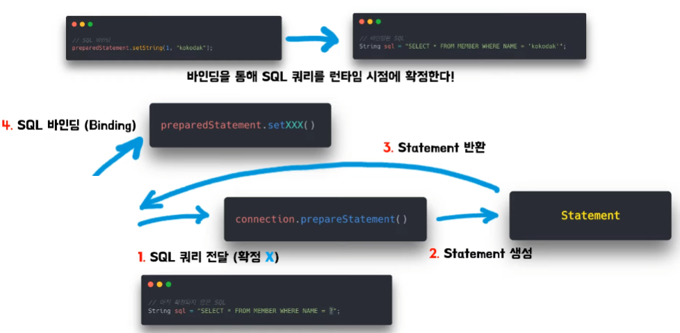
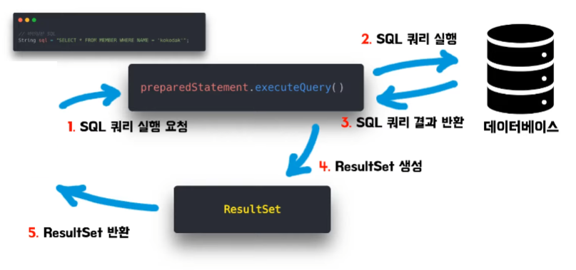
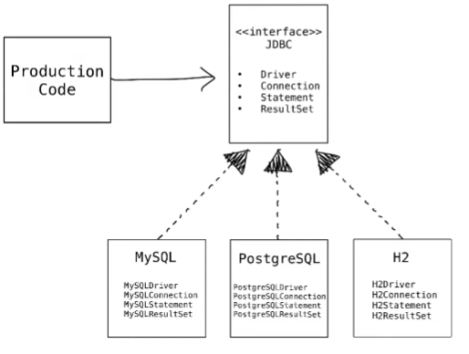

# 코코닥의 JDBC
[https://youtu.be/ONYVhJGl48U?si=TEbc1YQvARJT8xOM](https://youtu.be/ONYVhJGl48U?si=TEbc1YQvARJT8xOM)

# 코코닥의 JDBC
* toc
{:toc}

## JDBC란
+ 자바 언어를 이용해서 데이터베이스에 접근할 수 있도록 도와주는 자바 표준 API
+ 즉 자바 언어를 사용해서 데이터베이스를 접근할 수도 있고 SQL 쿼리를 실행할 수도 있다
+ 오늘날의 JDBC API는 정말 많이 사용이 되고 있는데 DB 접근 기술들 중 하나인 SQL Mapper 그리고 ORM 기술들 모두 로우 레벨단에서는 JDBC API가 동작하고 있다
+ 즉 이제 자바를 이용해서 하는 DB 접근 기술들은 JDBC API가 가 필수적이다

## JDBC 필요성
+ 새로운 데이터베이스의 사용법을 배워야 한다
  + 각 데이터베이스마다 사용법이 다르다
  + 학습의 몫은 개발자에게 있다
+ 프로덕션 코드의 변경 범위가 커질 수 있다
  + DIP(의존성 역전 원칙) 위배
  + 기대하는 기능은 같아도, 코드 변경 범위가 클 수 있다 

## JDBC 등장
+ JDBC는 DB 접근을 위한 기능 총 네 가지를 추상화 한다

### Driver
+ 
+ 드라이버 객체를 통해 커넥트 메서드를 실행시켜서 데이터베이스와 연결을 한다
+ 주의할 점은 클라이언트가 직접적으로 드라이버 API를 사용하진 않는다
+ 직접적으로 API를 사용하지 않고 드라이버 매니저라는 API을 통해 드라이버 API를 간접적으로 호출하게 된다
+ 드라이버 매니저는 다양한 JDBC 드라이버들을 한 곳에 묶어 관리하는 유틸성 정적클래스
+ 구체 드라이버 클래스 로딩 시점에 스태틱 블록에 있는 메서드를 통해 드라이버 매니저에 등록이 된다
+ 드라이버 매니저는 내부 array list로 다양한 구체 클래스들을 관리할 수 있다
  
### Connerction
+ 
+ 데이터베이스와의 연결 정보를 가진다
+ 드라이버 매니저 내부적으로 커넥션 요청을 처리할 수 있는 드라이버를 찾는다 
+ 구체 드라이버가 찾아지면 이 드라이버의 커넥트 메서드들을 통해 데이터베이스가 연결이 된다
+ 데이터베이스 연결에 대한 정보를 가지고 커넥션 객체를 생성해서 클라이언트에게 반환한다

### Statement
+ 
+ SQL 쿼리 관리 및 실행을 담당
+ 클라이언트가 확정되지 않은 SQL 쿼리문을 하나 준비
  + 이때 확정되지 않았다라는 의미는 물음표가 들어가 있는 SQL 쿼리문을 의미
+ SQL 쿼리문을 커넥션 스테이트먼트 메서드를 통해 전달을 하게 되면 내부적으로 이 쿼리를 관리하는 스테이트먼트 객체가 생성 이를 클라이언트에게 반환
+ SQL 쿼리, 물음표에 원하는 값을 지정해주는 이 행위를 SQL 바인딩이라고 한다
+ SQL 바인딩은 스테이트먼트 객체의 세터 메서드를 통해 바인딩할 수 있다

### ResultSet
+ 
+ 실행한 SQL 쿼리 결과를 가져올 때 사용
+ 쿼리문을 스테이트먼트 execute 쿼리 메서드를 통해 실어서 주면 내부적으로 데이터베이스에서 쿼리를 실행
+ 데이터베이스에서 쿼리를 실행하면 이에 대한 쿼리결과를 반환
+ 반환한 결과를 가지고 ResultSet 객체로 포장을 시켜서 그것을 클라이언트에게 반환

### 요약
+ 
+ 처음에 드라이버 매니저 API를 통해 드라이버 API를 간접적으로 호출
+ 드라이버의 커넥트 메서드를 통해서 DB와 연결
+ 그에 대한 정보를 커넥션 객체로 생성해서 클라이언트에게 반환
+ 커넥션 객체에 원하는 SQL 쿼리문을 넘겨줘서 그에 대한 스테이트먼트 인스턴스를 생성
+ 스테이트먼트 객체를 통해 이제 SQL 쿼리를 실행하게 되면 그에 대한 실행 결과인 ResultSet으로 나오게 되는 것

## 해결된 문제들
+ 새로운 데이터베이스를 더 이상 배우지 않아도 된다
  + 개발자들은 이 추상화된 JDBC API의 사용법만 숙지하고 있다면 어떤 데이터베이스가 와도 동일한 기능을 할 것이라고 기대할 수 있다
+ 프로덕션 코드의 변경 범위를 최소화할 수 있다
  + 
  + 프로덕션 코드는 더 이상 각각의 구체클래스에 의존하지 않는다 추상화된 JDBC에만 의존하고 있다 때문에 구체 클래스가 바뀌더라도 프로덕션 코드는 추상화된 추상 클래스에만 의존하기 때문에
    프로덕션 코드는 바뀌지 않는다
  + DIP 원칙을 만족한 설계
