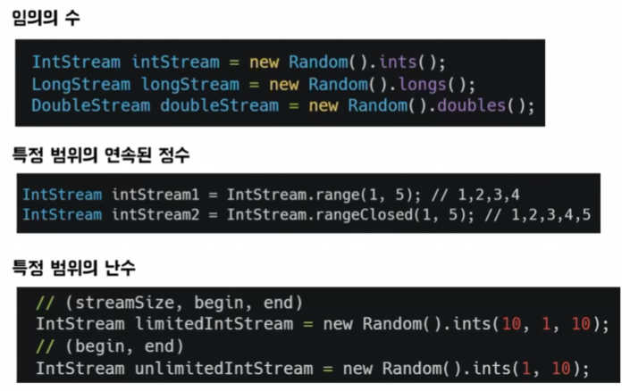
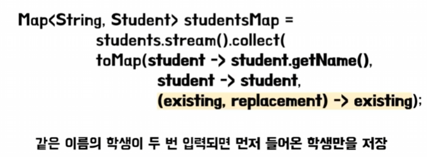

# 깃짱, 이리내의 람다와 스트림 
[https://youtu.be/4ZtKiSvZNu4?si=UP8Wco0XD9G4fhDE](https://youtu.be/4ZtKiSvZNu4?si=UP8Wco0XD9G4fhDE)

# 깃짱, 이리내의 람다와 스트림
* toc
{:toc}

## 람다

### 람다식이 뭐야?
+ 람다는 메서드를 하나의 식으로 표현한 것
+ 
+ 


### 람다식은 함수형 인터페이스를 구현한 인스턴스라고?
+ 람다식을 변수로 추출하면 Runnable이라고 하는 함수형 인터페이스가 나온다
+ 함수형 인터페이스는 추상 메서드가 딱 한 개만 있는 인터페이스이다 여기서 default 메서드나 static 메서드는 존재할 수 있다
+ 인터페이스로 인스턴스를 만들려면 추상 메서드를 오버라이딩할 수 있는 클래스를 만들어야 한다 그리고 이 클래스로부터 인스턴스를 생성할 수 있다
+ 인스턴스를 좀 더 간단하게 생성할 수 있는 방법이 있는데 람다식을 사용해 인스턴스를 만드는 것이다
+ 추상 메서드를 오버라이딩하는 클래스를 만들어서 인스턴스를 생성해야 했는데 그 과정을 람다식이 대체할 수 있다.
+ 함수형 인터페이스 딱 하나 있는 추상 메서드를 람다식을 사용해서 표현하게 되면은 함수형 인터페이스에 있는 딱 하나 미설계인 것이 람다식과 일대일로 매칭이 되면서 바로 인스턴스가 만들어지게 된다


### 남이 잘 만들어놓은 표준 함수형 인터페이스를 쓰는걸 추천해
+ 
+ 매개변수가 없고 반환 값이 없을 때는 Runnable
+ 매개변수가 없고 반환값이 있을 때는 Supplier
+ 매개변수가 있고 반환값이 없을 때는 Consumer
+ 매개 변수가 있고 반환 값이 있을 때는 Function
+ 매개 변수가 있고 반환값이 boolean일 때는 Predicate
+ 그 외에도 java.util.function 패키지에 많은 표준 함수형 인터페이스들이 이미 만들어져 있다
+ 표준 함수형 인터페이스를 쓰면 default 메서드를 제공해서 다른 코드와의 상호운용성이 좋아진다 
+ Predicate라는 함수형 인터페이스를 예를 들면 이 안에는 and(), negate(), or()과 같은 default 메서드들이 정리되어 있기 때문에 여러 Predicate를 조합해서 새로운 Predicate로 결합할 수 있다


### 메서드 참조를 하면 좀 더 코드가 깔끔해 질껄?
+ 람다식이 하나의 메서드만 호출하는 경우에는 메서드 참조로 람다식을 간략히 할 수 있다
+ ```클래스 이름 :: 메서드 이름``` 또는 ```참조 변수 :: 매서드 이름``` 로 바꿀 수 있다
+ 

## 스트림

### 스트림은 뭐하는거야?
+ 스트림(Stream)은 개울, 시내, 물줄기, 계속 이어진 줄 이런 영어 뜻을 갖고 있는데 줄줄이 이어져 있어서 연속된 정보를 처리하기 위해서 사용되는 것
+ 'Modern Java in Action'에서는 "데이터 처리 연산을 지원하도록 소스에서 추출된 연속된 요소"라고 표현하는데 스트림은 JAVA 8부터 다량의 데이터 처리 작업을 돕기 위해서 추가되었고 그래서 보면 스트림은 데이터 소스가 다르더라도
  일단 스트림을 딱 생성까지만 하게 된다면 과거에 그 데이터가 무엇이었던 같은 방식으로 다룰 수 있게 되어서 코드의 재사용성이 높아진다는 장점이 있다
+ 
  + 배열과 리스트로 초기에 데이터 형태가 달랐는데 한번 스트림을 만들게 되면 출력하는 과정을 동일하게 처리할 수 있는 것을 확인할 수 있다

### 스트림은 생성, 중간연산, 최종연산으로 이루어져 있어
+ 
+ 스트림은 생성, 중간 연산, 최종 연산이라는 과정으로 이루어진다
+ 먼저 데이터 소스로부터 스트림을 생성해야 한다 
+ 생성된 스트림을 원하는 형태로 가공을 해야 되는데 이것을 중간 연산이라하고 중간 연산은 여러 개를 이어 붙일 수 있다
+ 최종적으로는 원하는 형태로 데이터를 반환할 수 있다

### 데이터 소스로부터 스트림을 생성해보자
+ 컬렉션
  + 
+ 배열
  + 
+ 숫자 
  + 
+ 람다식
  + 

### 중간연산으로 데이터를 입맛에 맞게 가공해보자
+ distinct()는 스트림에서 중복된 데이터를 제거
+ filter() 조건을 만족하는 데이터만 남기고 나머지는 제외
+ sorted() 스트림을 지정된 Comparator로 정렬하게 되는데 안에 아무것도 안 들어가면 기본 정렬 기준으로 정렬
+ map()은 원하는 필드만 뽑아내거나, 특정 형태로 반환하는 메서드이다
+ flapMap()을 쓰면 'Stream' 형태의 1차원을 볼 수 있다 2차원을 1차원으로 펴 주는 과정을 "평탄화"라고 한다

### 최종연산으로 스트림을 닫아보자 
+ 최종 연산은 한번 하면 데이터가 소모되어 스트림이 닫혀 버리게 때문에 만약 최종 연산을 여러 번 하고 싶다면 스트림을 여러 번 생성해야 한다
+ forEach()는 스트림의 데이터를 소모하며 주로 출력하는 용도로 사용
+ Predicate의 모든 요소가 일치하면 allMatch()는 true를 반환
+ anyMatch()는 하나의 요소라도 일치하면 true를 반환
+ noneMatch()는 모든 요소가 불일치하면 true를 반환
+ findFirst()는 조건에 일치하는 첫 번째 요소를 반환
+ findAny()는 조건에 일치하는 요소를 하나 반환
+ collect()는 스트림의 요소를 수집해서 원하는 형태로 반환
  + collect() 스트림의 최종 연산으로 Collector를 파라미터로 받는다
  + Collector는 인터페이스이다 이거 외에도 엄청 많은 추상 메서드가 정의되어 있는데 이거를 다 구현하면 collect()의 파라미터로 사용할 수 있게 된다
  + Collectors는 다 정의할 수 없으니까 이미 정의된 Collector를 static 메서드로 제공하는 클래스이다
    + toList() 데이터를 수집해서 리스트 형태로 반환
    + toMap() 첫 번째 파라미터로는 key를 매핑하는 keyMapper 두 번째 파라미터로는 value를 매핑하는 valueMapper를 받고 있다
      + 중복 키가 발생하면 예외가 발생하는데 이걸 해결하기 위해서 오버로딩된 메서드가 아주 많은데 세 번째 파라미터는 mergeFunction을 제공 이거는 이제 BinaryOperator여서 두 가지 파라미터를 받고 그 파라미터들과 동일한 타입으로 반환을 해 주면 된다
      + 
    + groupingBy()는 이제 스트림의 데이터들을 카테고리별로 그룹화할 수 있도록 도와준다
      + 반환 형태는, 이제 value는 반드시 리스트가 된다 만약에 "리스트가 마음에 안 든다" 하면은 추가적인 파라미터를 넘겨서 Set으로 반환할 수도 있고 "리스트에 있는 요소들의 개수가 궁금하다" 하면은  Counting()을 넣어서 Long으로 반환받을 수도 있다
      + 
      + 
    + joining()은 스트림의 요소들을 묶어서 반환
      + 
    + reduce()는 데이터를 줄여나가면서 연산을 수행하고 최종 결과를 반환
      + 
        + 여기 있는 2개의 스트림은 위쪽에서는 스트림의 데이터를 줄여나가면서 연산을 수행하고 요소들의 합을 계산하는 코드고 아래는 요소들에 있는 개수를 계산하는 코드
        + 원소들은 1, 2, 3, 4, 5가 있다 여기서 먼저 앞에 있는 두 개를 먼저 람다식처럼 덧셈을 수행 3이고 3과 다음에 있는 숫자인 3을 더하면 6 이런 식으로 더하다 보면 15가 나와서 sum이 나오게 된다
      + 
        + 합이나 갯수를 구하는 다른 방법으로 기본형 특화 스트림이 있다
        + Int형, Double형, Long형일 때는 IntStream, DoubleStream, LongSteram을 이용할 수 있다
        + 여기 있는 두 개의 코드는 모두 이제 카드에 있는 정수들의 합을 구하는 코드이다
        + 위에 경우에는 reduce()를 이용해서 계산하는 코드이고 아래는 중간에 IntStream으로써 바꿔 줌으로써 sum()을 계산하는 코드이다
        + 위에를 보시면 이제 중간에 'Stream'이 반환되는 것을 볼 수 있고 여기(아래)는 IntStream이 반환되는 것을 확인할 수 있다
        + 위 과정에서는 이제 스트림을 만들기 위해서 int를 Integer로 박싱을 하는 과정을 거친 다음에 sum()이라는 연산을 하기 위해 Integer를 다시 int로 언박싱을 하는 상황을 거친다
        + 아래는 처음부터 끝까지 연산을 int로 진행한다 박싱과 언박싱을 거치는 것보다는 한결같이 int로 연산을 하는 게 좀 더 효율적이라 볼 수 있다
        + 기본형인 int, double, long으로 연산을 수행하는 경우에는 기본형 특화 스트림을 이용하는 것을 추천한다 

### 스트림은 언제 사용해야 될까?
+ 반복문이랑 스트림 스트림은 반복문을 대체하기 위해 나온 건 아니지만 데이터 처리 작업이라는 게 워낙 반복적인 것이 많다 보니까 사용 범위가 좀 겹칠 때가 많은데 반복문은 스트림이 할 수 없는 일을 할 수 있다
+ 반복문
  + 지역변수를 읽고 수정해야 할 때
  + return, break, continue를 사용해야 할 때
+ 스트림
  + 연속된 데이터를 일관되게 변환할 때
  + 연속된 데이터를 필터링 할 때
  + 연속된 데이터를 하나의 연산으로 합칠 때
  + 연속된 데이터에서 특정 조건을 만족하는 데이터를 찾을 때 

