# 디노의 제네릭
[https://youtu.be/m9aw5a50aDw?si=Eil8IejopKreDn8Q](https://youtu.be/m9aw5a50aDw?si=Eil8IejopKreDn8Q)

# 디노의 제네릭
* toc
{:toc}

## 제네릭이란?
+ 제네릭이란 클래스나 메서드에서 사용할 내부 데이터 타입을 외부에서 지정하는 방법.
+ ```<>``` (다이아몬드 꺾쇠) 안에 타입 매개 변수를 선언하는 방식으로 사용하고 해당 객체의 타입은 컴파일 타임에 지정된다는 특징이 있다
+ 제네릭을 사용하면 먼저 특정 타입으로 제한함으로써 타입 안정성을 제공
+ 타입 체크, 형변환 같은 것을 생략할 수 있으므로 코드가 간결해진다

## 제네릭 클래스와 제네릭 메서드

### 제네릭 클래스

+ 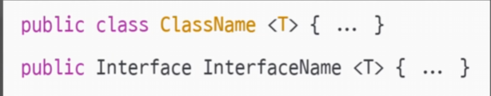
+ 제네릭 클래스의 선언 방법은 클래스 이름 뒤에 타입 매개 변수를 위치시키는 방식으로 선언을 하게 된다
+ 선언된 T 타입은 해당 클래스 내에서 자유롭게 사용이 가능해진다
+ 타입 매개변수에는 보통 T, E, K, V 등의 시그니처들을 많이 사용하지만 굳이 따르지 않아도 된다 
+ 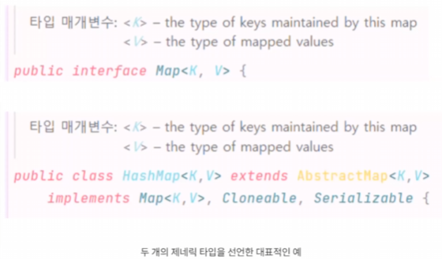
+ 또한 클래스를 선언할 때 두 개 이상의 제네릭 타입을 선언할 수 있다

### 제네릭 메서드
+ 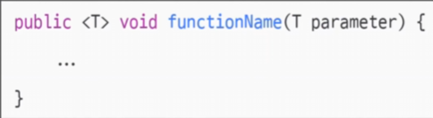
+ 제네릭 메서드의 선언 방법은 반환 타입 사이에 T 타입 매개변수를 위치시키는 방식으로 선언을 한다
+ 마찬가지로 이제 함수 내에서 선언된 T 타입은 해당 함수 내에서 자유롭게 사용이 가능해진다
+ 클래스에 선언된 제네릭과 메서드에 선언된 제네릭의 시그니처가 동일하게 T로 같으면 컴파일 에러가 발생하는데 '타입 매개변수 T가 타입 매개변수 T를 숨깁니다' 라는 경고 메시지를 보낸다 
+ 같은 시그니처의 타입 매개변수가 있다면 클래스보다 함수의 타입이 우선시된다는 것을 확인할 수 있다

## 제한된 제네릭
+ 제한된 제네릭을 설정하면 사용 가능한 타입에 대해 제한을 걸어줄 수 있으므로 더욱 유연한 클래스와 함수의 사용이 가능해짐을 볼 수 있다

### 상한 경계 제네릭
+ 상한 경계 제네릭은 ```<T extends Type>``` 의 형태로 선언 한다 이는 "Type과 이의 자손 타입만 가능하도록 제한을 가한다"라는 의미를 가진다 
+ ```<T extends Number>``` 형태로 제네릭을 제한
  + 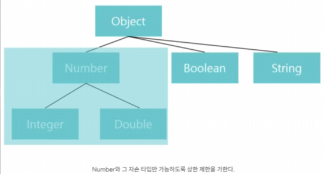
+ 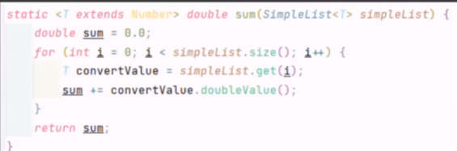
  + Number와 그 자손 타입이 보장이 되기 때문에 함수 내에서 T 타입 변수는 Number에 구현된 모든 함수를 사용 가능하다 T 타입으로 선언한 convertValue는
    Number 클래스에서 구현되어있는 doubleValue 함수를 사용할 수 있게 된다

### 하한 경계 제네릭
+ 상한 경계와 정반대되는 개념
+ ```<T super Type>``` 형태로 선언  이는 "Type과 이의 조상 타입만 대입 가능하도록 제한을 가한다"라는 의미를 가진다
+ ```<T super Number>``` 형태로 제네릭을 제한
  + 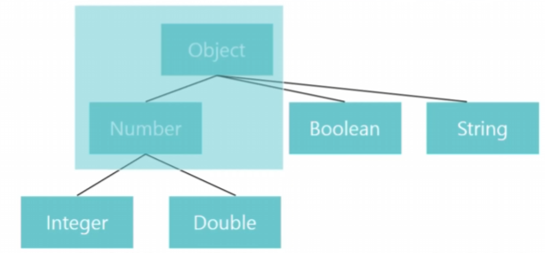


## 와일드카드 
+ 와일드카드란 꺾쇠 안에 물음표 기호 ```<?>``` 를 사용해 나타내며 이는 '알 수 없는 타입', 물음표 타입을 의미
+ 생성된 객체의 타입이 확정되지 않았기 때문에 와일드카드 형태에서는 값에 대입이 불가능하다
+ 와일드카드도 앞에서 살펴봤던 제한된 제네릭의 형태처럼 경계를 설정해 주었을 때 제 기능을 발휘할 수 있다
+ 와일드카드에도 마찬가지로 상한 경계와 하한 경계 와일드카드가 존재하게 되는데 형태도 제한된 제네릭에서의 T 대신 ? 기호를 넣어주는 방식으로 선언을 하게 된다 
+ ```<? extends Type>``` 은 Number와 그 하위 타입임은 무조건 보장이 되지만 구체적으로 어떤 타입인지는 확정이 불가능하다"라는 의미를 가진다고 볼 수 있다
  + 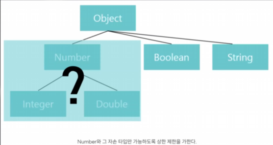
+ 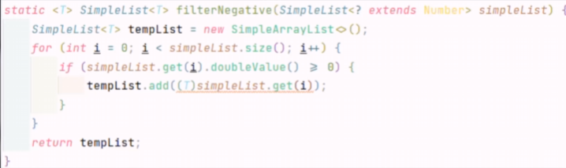
  + 매개변수 SimpleList는 타입이 Number로 상한 경계를 설정한 와일드카드 타입의 객체이다
  + 그리고 제네릭 함수를 적용해서 반환 타입이 SimpleList T 형태를 가지도록 설정이 되어 있다
  + 와일드카드 타입은 getter를 사용 가능하고 SimpleList는 타입이 T이기만 하면은 삽입을 허용하니까 T로 타입 캐스팅을 진행해 add를 문제없이 사용할 수 있게 된다 
+ 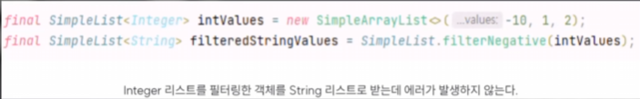
  + 경계 와일드카드에는 선언한 부분에 한정해서만 제약을 부여하는데 반환 타입에 아무런 제약조건이 걸려 있지 않기 때문에 문법적으로 오류가 없게 된다 그래서 String 타입으로 받아도 전혀 에러가 발생하지 않는 모습을 볼 수 있다
  런타임 에러가 발생한다 
+ 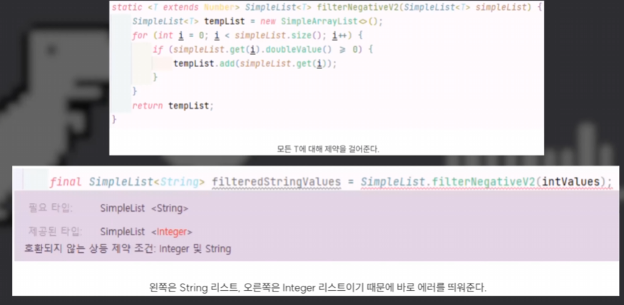
  + 제한된 제네릭을 사용하면은 함수 내에서 사용되는 T의 범위를 매개변수뿐만이 아니라 리턴타입에도 적용시켜 주게 된다 그래서 이를 사용하면은 실행할 때 애초에 컴파일 에러를 일으키게 되는 모습을 볼 수 있다
+ 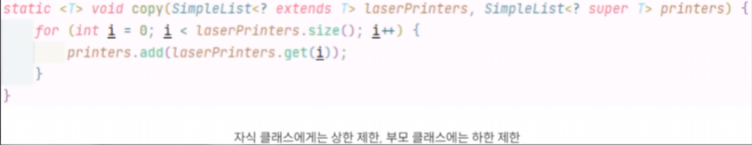
  + 자식 클래스, laserPrinters에서는 T 상한 제한 부모 클래스인 printers에서는 T 하한 제한을 부여해 주었다
  + 와일드카드는 getter를 사용 가능하므로 값을 꺼내올 수 있고 SimpleList의 add 함수는 해당 리스트의 타입과 같거나 자식 타입인 값들은 문제없이 삽입할 수 있다
  + 따라서 laserPrinters의 값을 추출해 printers에 삽입하는데 아무런 문제가 없어지게 되는 것이다
  + 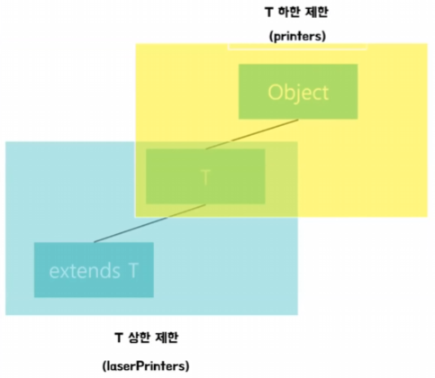
  + laserPrinters의 값들은 무조건 T 이하로 고정이 되게 되고 printers는 무조건 T 조상 타입 T나 T 조상 타입으로 한정이 되기 때문에 무조건 laserPrinters에 있는 값들은 printers보다 한 단계 아래 클래스, 아래 타입이라는 것이 보장이 된다
  + 그래서 문제없이 printers에 add가 될 수 있는 상황이다 
+ 와일드카드는 제한된 제네릭보다 조금 약한 제약의 강도를 보이지만 매개 변수나 반환 타입이나 한쪽만 이렇게 제한하는데 이 특성을 활용해 제네릭과 결합한다면 더욱 복잡한 제약조건을 부여할 수 있게 된다
  따라서 제한된 제네릭과 와일드카드의 차이점을 명확하게 이해한 뒤, 특정 상황에 어떤 방식을 사용해야 할 지 파악하는 능력을 기르는 게 가장 중요하다 

