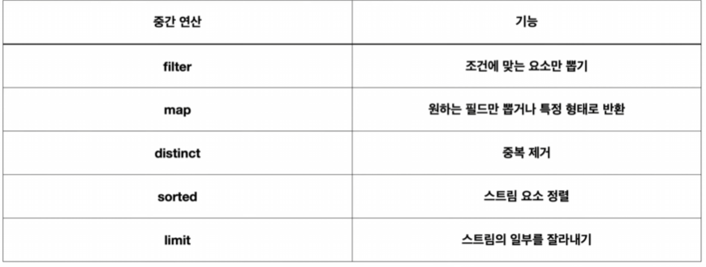
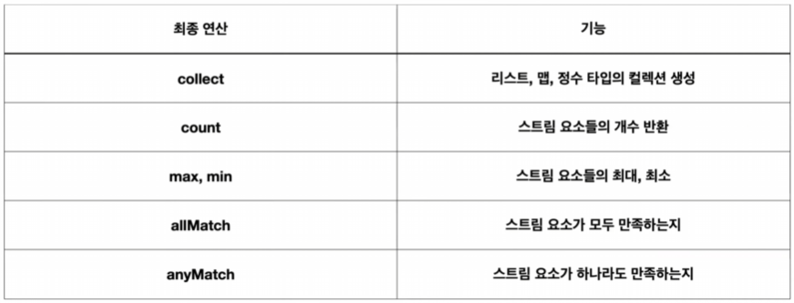
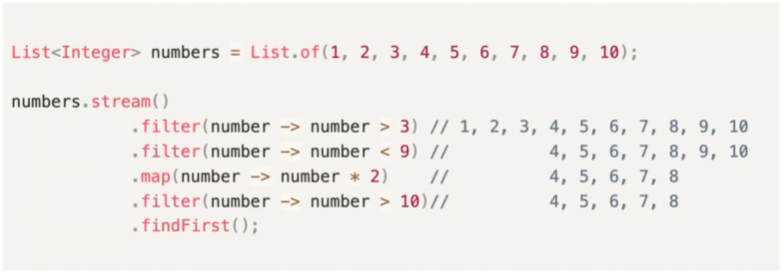
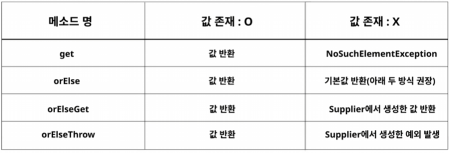
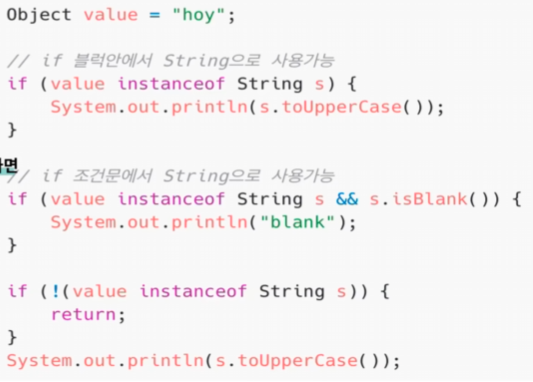

# 그레이, 호이의 Modern Java
[https://youtu.be/veJO12VV-Mg?si=_HZn6DpaRO1UPm5r](https://youtu.be/veJO12VV-Mg?si=_HZn6DpaRO1UPm5r)

# 그레이, 호이의 Modern Java
* toc
{:toc}

## 모던 자바란?
+ 모던 자바는 이전 자바와는 완전히 다르다는 뜻으로 자바 8 이후에 자바를 모던 자바라고 말한다
+ 좀 쉽게 얘기하면 자바 8 이후에 나온 새로운 기능을 활용하는 개발 패러다임이다

### 모던 자바의 주요 변화
+ 람다와 스트림이 도입
  + 람다와 스트림이 도입되어 자바에서도 함수형 프로그래밍을 지원할 수 있게 되었다
+ 멀티코어 환경에 대응
  + 스트림를 API를 이용해 병렬 처리를 할 수 있기 때문에 멀티코어 환경에도 충분히 대응할 수 있게 되었다
+ 높은 안정성
  + 자바 8 이전에는 null을 다루는 객체가 없어서 개발자가 NullPointerException에서 좀 다뤄야 되는 상황이 생겼는데 Optional을 도입해서 좀 더 안전하게 null을 다룰 수 있게 되었다

## 람다

> 백엔드 크루만 찾아줘 라는 요구사항이 있을 때 백엔드 크루가 일치하는지 확인해서 결과를 담아서 반환한다 
> 다음으로 프론트엔드 크루도 찾아달라는 요청이 들어오면 파라미터로 Course를 추가해서 Course에 해당하는 값을 받아서 반환한다
> 다음으로 또 요구사항이 백엔드 크루면서 남자인 크루만 찾아줘 라는 요구사항을 줘서 파라미터를 또 추가한다 
> 그러면은 요구사항이 계속 늘어나면은 파라미터를 계속 추가하고 함수를 또 새로 생산하고 불필요한 코드가 반복된다
> 그래서 인터페이스를 떠올리고 인터페이스를 정의해서 인터페이스를 구현하는 구현체의 해당 로직을 추가해서
> 인자로 인터페이스를 구현한 구현체를 넘겨준다 이 과정을 동작구에 넘겨준다고 해서 동작파라미터화라고 하는데 그러면 요구 사항이 늘어날 때마다 구현하는 클래스를 계속 생성 해야 되나
> 백 개의 요구사항이 생긴다면 백 개의 클래스를 생성 해야 되나 라는 의문이 생길 수 있다 그래서 등장한 것이 익명 함수이다

+ 익명 함수는 클래스를 새로 생성 하지 않고 파라미터로 넘겨준 부분에서 익명 클래스를 정의해서 파라미터로 넘겨줄 수 있다 근데 익명 클래스는 길다
  그래서 줄이고 싶어서 람다식이 등장한다
+ 람다식은 한 줄로 코드로 어떤 동작을 할지 명확하게 전달할 수 있다 람다식은 메서드를 하나의 식으로 표현한다 그럼으로 코드가 간결해지고 명확해진다 
+ 람다식은 파라미터, 화살표, 바디로 구성된다 파라미터로 어떤 값이 들어가면 바디로 어떤 결과물이 나온다 라고 이해하면 된다
+ 코드의 가독성과 의도를 명확하게 한다 
+ 리턴 타입과 이름도 없기 때문에 익명 함수 또는 익명 객체라고도 할 수 있다
+ 람다식은 변수에 할당하거나 함수형 인터페이스를 인수로 받는 메서드로 전달할 수 있다
+ 람다식은 함수형 인터페이스의 인스턴스로 취급된다 라고 할 수 있다
+ 자바에서 모든 메서드는 클래스 내에 포함되어야 되기 때문에 람다식은 익명 클래스 객체와 동등하다 라고 할 수 있다
+ 람다식을 다루기 위한 인터페이스가 함수형 인터페이스다 라고 정의할 수도 있다
+ 자바 8 에서부터 FuntionalInterface라는 어노테이션에 추가되어서 명시적으로 함수형 인터페이스 라고 사용하겠다 라고 선언할 수 있다

## 스트림

> 크루 중에 나이가 20 살보다 작은 크루의 이름을 찾아줘 라는 요구사항이 생겼고 이름 순으로 정렬까지 해달라 라는 것이 생겼다
> 그래서 크루들이 자바 8 이전에는 먼저 크루중에 나이가 스무 살보다 작은 크루를 리스트로 분리해야 된다  
> 분리하고 분리한 리스트에서 getName을 써서 이름을 담아야한다 
> 담은 이름을 정렬해서 반환을 해야 된다 세 개의 일련의 과정을 거쳐야 되는데
> 스트림이 도입된 이후부터는 좀 더 명확하게 한 줄로 어떤 행위를 나타낼 수 있다

+ 스트림은 컬렉션 처리를 위한 새로운 API이다 라고 정의할 수 있다
+ 스트림은 데이터베이스 쿼리를 작성하듯이 직관적인 코드를 제공한다
+ 스트림은 초기 데이터, 중간 연산, 최종 연산 구조로 이루어져 있다
+ 즉 메서드 체이닝 방식을 이용한다
+ 
+ 
+ 스트림의 특징으로 지연 연산을 수행한다 쉽게 얘기하면 최종 연산을 하기 전까지 실질적인 연산을 수행하지 않는다는 것이다

> 1부터 10사이의 자연수 중에서 3보다 크고 9보다 작은 값 중에서 2을 곱했을 때 10보다 큰 가장 작은 수를 찾아줘 라는 요구사항이 생겼다

+ 일반 for문으로 작성하면
  + 
  + 1부터 10 까지의 수를 차례대로 내려오면서 브레이크 걸릴 때까지 수행되는 연산이 15번이다
+ 스트림으로 표현
  + 
  + 스트림은 한 스트림이 돌 때마다 스트림 결과가 반환되고 다음 스트림으로 넘어가는 체이닝 구조로 연결돼 있는데 그럼 단순하게 생각해 보면 스트림이 for문보다 연산 횟수가 더 많지 않겠냐 라고 생각할 수 있다
  + 결론적으로 스트림은 for문과 동일하게 15번 수행
  + 스트림은 자체적으로 지연 수행한다는 것이다 최종 연산이 호출될 때서야 비로소 연산이 평가가 되고 최종 연산에 필요 없는 데이터는 쓰지 않는다는 것이다
+ 스트림은 기본적으로 다 순차적으로 처리되는데 명시적으로 병렬로 처리하겠다 라고 표현하면 병렬 처리도 할 수 있다 그래서 parallelStream을 사용할 수 있는데 병렬 처리와 같은 부분은 성능적인 이슈가 중요하기 때문에 잘 고려해서 사용하면 좋다

## Optional
+ 메서드가 특정 조건에서 값을 반환할 수 없다면 예외 처리나 null 반환을 생각해 볼 수 있다
+ 예외 처리의 경우 Stack Trace를 캡쳐해야 하기 때문에 예외 생성 비용이 발생한다
+ null 반환의 경우 클라이언트입장에서 이 null인지 알기 힘들다 그리고 nullPointException이 발생하지 않도록 null 처리 코드를 추가로 작성해 줘야한다
+ 자바 8부터 Optional 클래스가 도입됐는데 Optional 클래스는 값을 최대 한 개 가질 수 있는 컨테이너 클래스라고 보면 된다 값을 가질 수도 있고 가지지 않을 수도 있다
+ Optional이 또 Optional을 감싸는 경우 map 대신 flatMap을 사용하면 Optional을 한번 감싸도록 사용할 수 있다

### 장단점
+ 장점
  + Optional 클래스를 사용하면 메서드에 명시적으로 null 가능성을 표현 가능 그러면 클라이언트 입장에서 메서드 시그니처만 보고 이게 null이 될 수 있다 생각할 수 있고 코드 가독성도 올릴 수 있다
  + null이 될 수 있는 클래스가 아닌 Optional를 사용함으로써 NullPointException을 방지할 수 있다
+ 단점
  + Optional이라는 클래스를 생성 해야 되기 때문에 객체 생성 비용이 발생
  + 만약 클래스에 필두로 Optional을 사용한다면 직렬화를 지원하지 않기 때문에 직렬화 문제도 발생

### 사용법
+ 생성
  + 
+ 값 접근
  + 

### 언제 사용하면 좋을까? 언제 사용하면 안될까?
+ 언제 사용하면 좋을까?
  + 반환할 결과값이 '없음'을 명백하게 표현할 필요가 있는 곳에서 제한적으로 사용할 수 있는 메커니즘을 제공하는 것이 Optional의 의도
+ 언제 사용하면 안될까?
  + 단순히 값을 얻으려는 목적으로 사용하는 경우 Optional을 쓰기보다 그냥 if문이나 이 안에서 if문으로 기본 값을 처리해 주거나 예외를 던져주는게 낫다
  + 파라미터등으로 Optional를 사용하는 경우는 메서드에 Optional을 또 처리해 주는 로직을 짜야 하는데 이 경우 이 메서드에 책임이 맞나 한번 고려해 볼 필요가 있다
  + 필드나 Getter에 사용하는 경우 필드에는 직렬화 문제가 발생하기 때문에 사용하지 않는 것이 좋고 Getter의 경우 클래스 필드의 이 필드가 진짜 필요한지 아니면 Getter가 필요한지 한번 고려해 볼 필요가 있다
  + 컬렉션을 사용하는 경우는 컬렉션을 Optional로 감싸기보다는 컬렉션의 emptyList로 빈 컬렉션을 반환해 주는 게 좋다
+ 정리하자면 Optional을 사용하는 클라이언트 시점에서는 orElseGet을 사용해서 기본값을 정하거나
  orElseThrow를 이용해 값이 없을 시 예외를 던지시면 되고 Optional을 사용한 메서드를 작성하고 싶으면 작성한 메서드가 반환값이 없을 수 있으며
  클라이언트가 이 상황을 특별하게 처리해야 한다면 메서드의 반환타입으로만 Optional를 한번 고려해 보는 게 좋다

## 자바 8 이후 추가된 기능 
+ 자바 10의 로컬 변수 타입 추론을 사용할 수 있는 var 타입이 추가되었다
+ 자바 11에서부터는 스트링 클래스에 유용한 메서드가 추가되었는데 isBlank를 사용하면 스트링이 공백 문자만 포함됐는지 확인할 수 있고 lines라는 메서드를 사용하면 개행을 기준으로 쪼개서 스트림으로 제공해 준다
  repeat를 사용하면 문자열를 반복해서 하나의 문자열로 반환해 준다
+ 자바 15 에서는 포맷팅 관련 추가 기능이 있는데 formatted 라는 걸 사용하면 코드가 조금 더 간결해질 수 있다
  + 
+ 자바 16 에서는 스트림추가 기능이 있는데 리스트로 반환하고 싶으면 Collectors.toList()를 많이 사용하는데 toList()만 사용해주면 똑같이 리스트를 반환해 준다 그리고 instanceof와 패턴 매칭이라는 게 있는데 value의 타입이 오브젝트인데 오브젝트가 만약 스트링의 instanceof라면
  if 블록안에서 스트링처럼 스트링 메서드를 사용할 수 있다
  + 
+ 자바 16의 record 클래스가 추가되었는데 DTO를 작성할 때 거의 비슷한 패턴으로 작성된다 게터, hashCode, equlas, toString 이런걸 많이 작성해주는데 필드도 private final 인데 이걸 record 클래스를 사용하면 필드를 파라미터처럼 작성해서 같은 효과를 가질 수 있다
  + 특징으로 필드를 파라미터처럼 선언하고 불변 클래스로 암시적 파이널 선언이다 
  + 각 필드는 private final 또 다른 클래스는 상속이 불가능하다
+ 자바 17에서는 sealed 타입이 추가되었는데 클래스나 인터페이스를 sealed 타입으로 선언해주면 상속할 수 있는 타입을 제한할 수 있다
  + 

