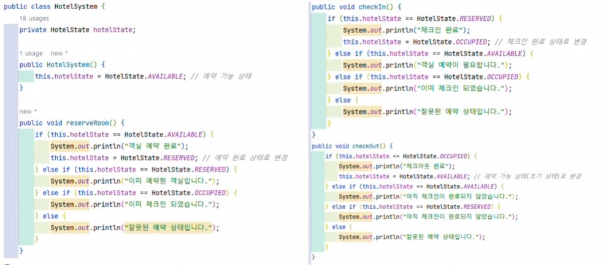
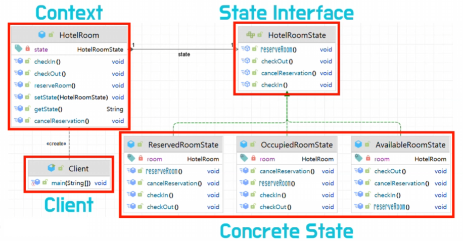

# 아벨의 상태 패턴
[https://youtu.be/BeoiIfvAmpE?si=1mZyz-N2AHJz0Sh2](https://youtu.be/BeoiIfvAmpE?si=1mZyz-N2AHJz0Sh2)

# 아벨의 상태 패턴
* toc
{:toc}

## 디자인 패턴
+ 과거에 시간이 지나면서 소프트웨어의 개발이 복잡해진다 그래서 소프트웨어의 개발자들은 공통적으로 발생하는 문제에 대한 해결책을 찾기 위해 노력하게 된다 그 노력의 결과물 중 하나가 바로 디자인 패턴이다
+ 즉 디자인 패턴 이란 공통적으로 발생하는 문제에 대한 해결책을 재사용 가능한 형태로 정리한 것이다
+ 디자인 패턴의 효과로는 소프트웨어의 유지 보수성 확장성 재사용성 등을 향상시킬 수 있다고 하는데 디자인 패턴도 세 가지의 종류로 다시 나눌 수가 있다 생성 패턴과 구조 패턴 그리고 행동 패턴이다
+ 상태 패턴은 행동 패턴에 속하게 된다
+ 행동 패턴은 객체 들이 서로 상호 작용하는 방법과 책임을 분산하는 방법에 대한 문제를 해결하는 패턴이다

## 상태 패턴
+ 상태 패턴이란 객체의 내부 상태에 따라서 객체의 동작이 달라지는 패턴이다
+ 상태 패턴 적용 전 
  + 
+ 상태 패턴 구조 
  + 
+ 상태 패턴 장점
  + SRP 즉, 단일책임의 원칙 모든 클래스는 각각 하나의 책임만 가져야 한다는 SOLID의 원칙 중 하나
    + 상태의 전이를 더욱 명확하게 한다 
    + 높은 응집도로 인해 각 상태 로직의 수정이 용이하다
  + 개방-폐쇄의 원칙 확장에는 열려있고 수정에는 닫혀있어야 한다는 SOLID 원칙 중 하나이다
    + 새롭게 생긴 상태에 대한 구현체를 하나 추가만 해주면 될 뿐 기존의 코드는 거의 변경이 되지 않는다 
  + 테스트의 용이성 
    +  각 상태의 구현체들이 다 나뉘어져 있기 때문에 이 각각의 상태에 대한 테스트를 가질 수 있게 된다
  + 장점들을 종합을 해보면 유지 보수성의 향상이다 
+ 상태 패턴을 사용하는데 주의할 사항은 상태에 변화가 적은 간단한 로직인 경우에도 굳이 상태 패턴을 적용하려고 하면 비효율적일 수 있다

