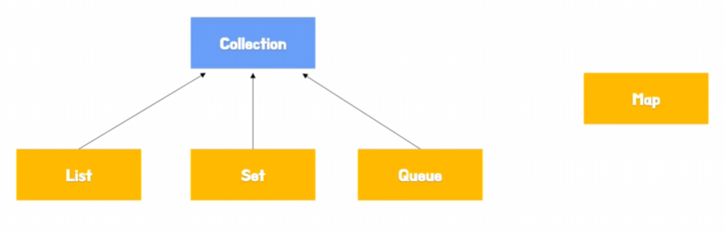

# 마코의 JCF
[https://youtu.be/OI5fF2wGVxA?si=gPXjHdeqwedpa2dK](https://youtu.be/OI5fF2wGVxA?si=gPXjHdeqwedpa2dK)

# 마코의 JCF
* toc
{:toc}

## JCF란?
+ 자바 컬렉션 프레임워크의 약자
+ 컬렉션은 데이터의 그룹
+ 프레임워크는 표준화된 프로그래밍방식
+ 자바에서 데이터 구조를 구현하고 관리하기 위한 클래스와 인터페이스의 모음
+ 데이터를 다루는 데에만 집중할 수 있기 때문에 데이터 구조를 쉽게 사용할 수 있게 된다 
+ JCF에는 같은 자료 구조여도 여러 가지 다양한 알고리즘으로 구현이 되어 있어 상황에 따라서 구현체를 선택해서 잘 사용한다면 성능 향상도 기대해볼 수 있다

## JCF의 종류
+ List에는 ArrayList와 LinkedList
+ Set에는 HashSet과 TreeSet
+ Queue는 PriorityQueue
+ Map은 HashMap과 TreeMap
+ List
  + 중복을 허용하고 저장순서가 유지
+ Set
  + 중복을 허용하지 않고 저장순서가 유지되지 않는다
+ Queue
  + First-in-First-Out의 구조를 따른다
+ Map
  + Key와 Value로 구성된 데이터의 집합
  + Key는 중복될 수 없고 저장순서도 유지되지 않는다 그리고 Value는 중복이 될 수 있다

## JCF 계층 구조
+ 
+ List와 Set과 Queue는 Collection 인터페이스를 상속하고 있다 하지만 Map은 아니다
+ Map은 컬렉션 인터페이스를 상속하지는 않지만 JCF의 컬렉션 중 하나이다 
+ Collection 인터페이스는 Iterable 인터페이스를 상속하고 있다 Iterable 인터페이스는 요소들을 순차적으로 순회할 수 있는 기능을 제공하는 인터페이스인데 따라서 이 Iterable 인터페이스를 구현하면 요소들을 순차적으로 탐색하거나 삭제하거나 그런 작업들을 할 수 있다
+ Map같은 경우에는 아까 Key와 Val로 이루어진 자료 구조 그래서 Key를 먼저 순회할지 밸류를 먼저 순회할지 정할 수 없기 때문에 Map은 컬렉션 인터페이스를 상속하지 않는다

## ArrayList와 LinkedList의 차이

### ArrayList
+ ArrayList는 내부적으로 Obejct배열을 사용하고 있다 그래서 크기를 처음에 지정을 안 해주면 초기 용량이 10인 배열을 생성 하게 된다
+ 공간이 부족할 때마다 1.5배씩 공간을 늘리게 된다 그리고 물리적으로 연결되어있고 배열로 이루어져 있기 때문에 배열의 인덱스로 바로 접근해서 데이터를 찾을 수 있다
+ ArrayList는 중간에서 데이터의 추가나 삭제가 많이 일어날 경우에 앞으로 당기고 뒤로 미는 과정이 많이 일어나기 때문에 중간에서 데이터를 추가, 삭제하기에 비용이 많이 든다고 할 수 있다
+ 

### LinkedList
+ 데이터와 다른 요소를 참조하는 노드라는 요소로 이루어져 있다
+ 다음 노드에 대한 참조를 계속 따라가면서 데이터에 접근할 수 있다
+ 논리적으로 연결되어 있다고 하는데 불연속적으로 데이터가 할당이 되어 있고 서로 연결만 되어 있기 때문에 논리적으로 연결되어 있다
+ LinkedList는 실제로는 Deque 인터페이스를 구현해서 DoubleLinkedList의 형태로 되어 있다 
+ LinkedList에서 검색을 할 때는 참조를 타고 타고 타고 이동해서 검색을 해야 된다

### 정리
+ 데이터를 검색할 때는 ArrayList는 인덱스를 바로 접근하기 때문에 빠르다
+ LinkedList는 참조를 계속 반복하면서 탐색하기 때문에 느리다
+ 데이터 추가, 삭제 에서는 ArrayList는 배열에 마지막에 데이터를 추가하는 것은 빨르다  순차적으로 데이터를 추가하거나 삭제할 때는 빠르다 하지만 중간에 추가하는 것은 느리다 
+ LinkedList는 중간에 데이터를 추가 하더라도 요소를 연결만 해주면 되기 때문에 중간에 추가 하더라도 빠르다
+ ArrayList는 공간이 부족할 때마다 새로운 배열생성을 해가지고 거기에 데이터를 복사하는 과정들이 있다 그래서 ArrayList는 크기가 정적 일 때 유리하고 동적 일 때는 불리하다 
+ 그 반대로 LinkedList는 요소를 생성 해서 연결만 해주면 되기 때문에 동적 일 때 유리하다 
+ 따라서 ArrayList는 검색이 잦을 때 순차적으로 데이터를 추가 삭제를 할 때 리스트의 크기가 정적일 때 사용하면 된다
+ LinkedList는 중간에 데이터를 추가 삭제할 때 리스트의 크기가 동적일 때 사용하면 된다 
