# 메이슨, 아토의 Java Thread
[https://youtu.be/OHJJF1_NkD0?si=fBiOaM-JyihCjHuL](https://youtu.be/OHJJF1_NkD0?si=fBiOaM-JyihCjHuL)

# 메이슨, 아토의 Java Thread
* toc
{:toc}

## Thread

### Thread란?
+ 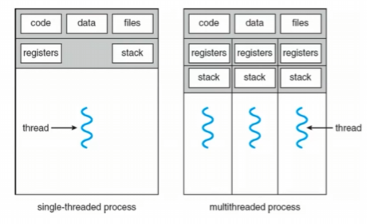
+ 한 프로세스 내부에서 작업을 수행하는 주체
+ 코드, 데이터, 힙 영역을 공유
+ 스택과 레지스터 영역은 각 Thread마다 독립적으로 관리 그래서 Thread 간 작업 전환 시 컨텍스트 스위칭이 발생하게 된다
+ java의 thread는 os의 thread와 1대1로 맵핑
+ jvm에서 os의 thread와 맵핑 요청

### Thread의 생명주기
+ 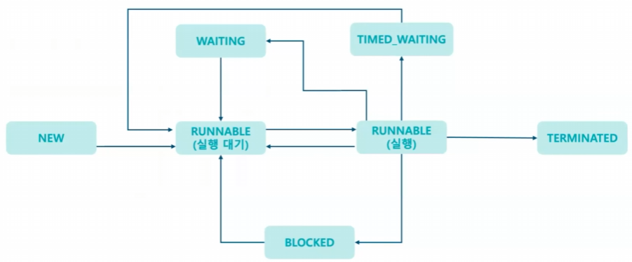

#### NEW
+ Thread 객체를 생성한 상태
+ 아직 start() 메서드를 호출하지 않음
+ new Thread()를 통해서 Thread 객체 만든다 
+ 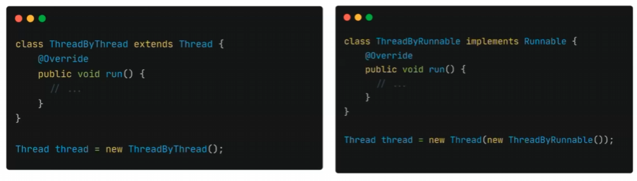
  + 왼쪽 방법은 Thread 객체를 상속 받아서 구현하는 방식 오른쪽은 Runnable Interface를 구현하는 방식 자바에서는 클래스의 다중 상속이 불가능하니까 Runnable 인터페이스를 구현하는 것이 더 좋다
  + 다중 상속 불가 -> Runnable 인테페이스 구현으로 유연한 설계

#### RUNNABLE(실행 대기)
+ 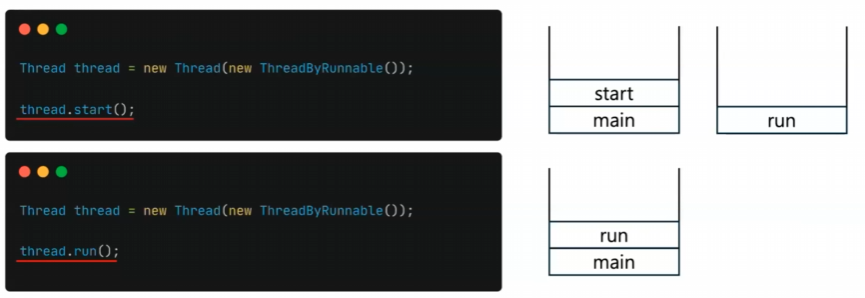
+ start()하면 상태는 runnable로 바뀐다
+ run() 메서드도 있다
+ run() 메서드는 현재 실행중인 Thread 내에서 단순히 선언만 된 메서드를 호출하는 것일 뿐 새로 Thread를 생성하지 않는다 또 현재 실행중인 Thread 내에서 단순히 선언 현재 실행중인
  Thread의 스택 영역을 차지해서 실행이 끝날 때까지 다른 메서드를 호출할 수 없다
+ start()는 운영체제에 요청하여 새 Thread를 생성하는데 이후 jvm scheduling에 의해서 new에서 running 상태로 변경된다 
+ 병렬로 실행하기 위한 start 메서드를 호출해야한다

#### RUNNABLE(실행)
+ 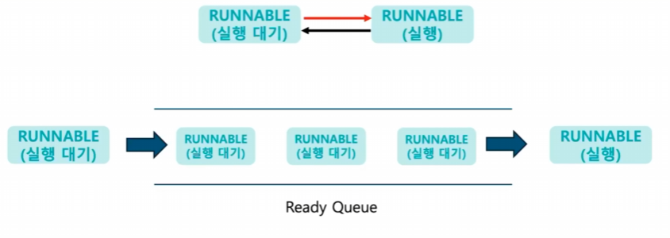
+ 실행 대기 상태는 아직 CPU를 할당받지 않은 상태라서 실행을 하지 않은 상태
+ 스케줄러에 의해서 할당받게 되면 run 메서드를 실행하게 된다 
+ CPU의 자원은 한정적이라서 모든 스레드가 자원을 할당받을 수 없다 그런 경우 Ready Queue에서 대기하고 후에 (자원이) 할당되면 그때 실행하게된다
+ 실행 중인 상태에서 실행 대기로 변경될 수도 있다 각 스레드에 할당된 실행 시간이 모두 지나가거나 yield() 메서드가 실행되게 되면 실행 대기 상태로 변경된다
+ yield() 메서드는 현재 실행 중인 스레드가 자신에게 할당된 실행 시간을 포기하고 실행 대기 상태로 변경하게된다

#### BLOCKED
+ 실행 중인 스레드가 다른 실행 중인 스레드에 의해서 점유되고 있는 객체에 접근한다면 Synchronized를 사용해서 명시적 락이 걸린 자원에 접근한 경우가 있다 이런 경우 락이 해제될 때까지
  Blocked 상태로 기다리게된다
+ Blocked 상태인 Thread는 CPU가 전혀 활동되지 않으면서 접근하려는 자원에 락이 해제된다면 다시 Runnable 상태로 돌아가서 CPU의 활동을 기다린다

#### WAITING
+ Waiting 상태도 Blocked와 비슷한 기능을 하는데 두 상태 모두 스레드 동기화를 위해 필요하다
+ Blocked 같은 경우는 다른 스레드가 점유 중인 자원에 접근했을 때 접근을 시도하는 스레드가 대기하는 상태이지만
  Waiting은 현재 모니터락을 획득한 스레드 즉, Synchronized 블록 안에 있는 코드를 실행하는 스레드를 재운 형태이다
+ CPU 자원을 사용하지 않고 특정 조건이 발생할 때까지 무기한 대기하게 되는 것이다 이때 사용하는 메서드가 wait이다
+ wait이 호출된 스레드는 락을 해제하고 대기한다 notify나 notifyAll 메서드가 호출되어야 Waiting 상태로 대기하는 스레드가 Runnable로 바뀌게 된다
+ wait이 호출된 스레드는 각 객체마다 존재하는 이 waiting pool 안에서 대기하게 되는데 notify 메서드는 이 waiting pool에서 대기하는 스레드 중 임의로 하나를 선택해서 runnable로 바꿔준다
+ 그래서 어떤 스레드가 다시 runnable로 될지는 알 수가 없고 notifyAll()을 실행하게 되면 여기 안에 모든 스레드들이 다 runnable로 바뀐다 그 과정에서 경쟁의 상태가 다시 발생할 수 있다
+ wait()와 notify()를 사용하는 예시는 보통 생산자와 소비자 패턴에서 많이 쓰는데 자원을 생성하는 스레드와 자원을 소비하는 스레드가 번갈아가면서 작동할 수 있도록 해준다
+ 주문이 없을 경우 소비자 역할을 하는 스레드가 대기를 하고 주문이 추가되면 생산자 역할을 하는 스레드가 notify()를 호출하여서 대기 중인 소비자 역할 스레드를 깨워 주문을 처리할 수 있도록 해준다
+ join() 메서드도 스레드의 상태를 Waiting으로 바꿔주는데 한 스레드가 다른 스레드의 종료를 기다리는 상황에서 조인 메서드를 호출하면 현재 스레드는 대상 스레드가 종료될 때까지 대기하게 된다 대상 스레드가 종료되면 Waiting 상태에서 벗어나서 다시 실행을 한다 
중간에 스레드를 중단시키거나 다른 스레드가 끝날 때까지 기다리는 등의 제어가 필요할 때 쓸 수 있다

#### TIMED_WAITING
+ sleep 메소드로 인해 변경되는 상태
+ sleep하는 시간이 지나면 다시 runnable 상태가 된다
+ sleep 같은 경우는 내부 구현을 보면 native라는 키워드가 보이는데 native라는 키워드는 자바 바깥에 있는 코드를 수행하기 위해서
  만들어진 키워드이다 JVM이 OS의 대기 메커니즘을 활용하여서 수립할 수 있도록 native 키워드를 달아놓았다

#### TERMINATED
+ Thread가 종료된 상태 
+ Thread 내의 모든 코드가 실행이 완료되거나 waiting, timed waiting, blocked 상태에서 설명했던 interrupt 를 통해 도달할 수 있는 상태
+ terminate된 Thread는 다시 실행할 수 없고 다시 start하려고 하면 IllegalThreadStateException 같은 예외를 발생
+ stop이라는 Deprecated 된 메서드가 있는데 사용하면 안되고 공유 변수와 인터럽트를 발생시켜 가지고 안전하게 Thread를 종료할 수 있는 방법도 있다

### Thread 사용 시 주의해야 할 점
+ 스레드를 과도하게 많이 생성하게 되면 컨텍스트 스위칭이 많이 발생하게된다 그러면 스레드 성능이 저하될 수 있기 때문에 스레드 풀과 같이 적당한 개수를 생성하도록 제한하는 게 좋다
+ 레이스 컨디션과 서로가 자원의 락을 획득한 상태에서 대기하면서 데드락이 발생할 수 있기 때문에 주의
+ 우선순위가 높은 Thread들만 수행하게 되면 낮은 Thread들은 수행이 안 된다 그래서 기아 상태가 발생할 수 있다
+ suspend(), resume(), stop(), distroy() Deprecated 된 메서드인데 사용하시면 데드락이 발생할 수 있기 때문에 삼가는 게 좋다

## Thread Dump

### Thread Dump란?
+ Thread dump는 현재 JVM에서 실행 중인 모든 Thread의 상태를 기록한 정보
+ 각 Thread가 어떤 작업을 수행 중인지 그리고 어떤 상태에 있는지를 추적할 수 있게 해 준다
+ Thread dump에는 각 Thread의 상태랑 그리고 Stack trace가 포함되어 있다
+ 각 스레드가 지금 현재 어떤 메소드를 실행 중인지 그리고 그 메소드가 어떻게 호출이 되었는지를 알 수 있다
+ 스레드 덤프는 특히나 성능 문제나 아니면 데드락 같은 게 의심될 때 유용하게 사용할 수 있다
+ 예를 들어서 서버가 응답이 없다거나 아니면 CPU 사용량이 비정상적으로 좀 높다거나 이럴 때 이 파일을 통해서 어떤 스레드가 병목을 일으키고 있는지 그리고 어떤 스레드가 무슨 자원을 기다리고 있는지 이런 것들을 확인할 수 있다

#### 생성 방법
+ 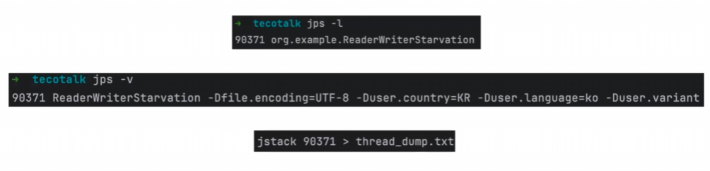
+ Thread dump는 jstack이라는 명령어를 통해서 쉽게 생성을 할 수가 있다
+ 현재 JVM에 실행 중인 모든 Thread의 정보를 파일로 Thread dump라는 텍스트 파일로 저장할 수 있다 이렇게 생성된 Thread dump 파일이 각 Thread의 상태를 보여줄 수 있게된다 
+ runnable이나 blocked, waiting 이런 것들을 알 수 있게 된다
+ 이거를 사용하기 위해서는 JSTACK 뒤에 프로세스 아이디를 입력을 해주면 된다

### Thread Dump 분석
+ 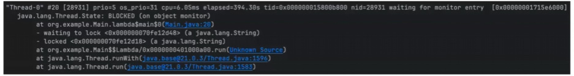
+ 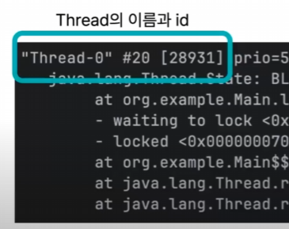
  + 스레드의 이름이랑 아이디를 표시해주는 부분
  + 제일 처음으로 있는 부분이 스레드의 이름 기본적으로 Thread가 생성이 되면 이름이 붙어서 표현이 되어 있는 거고 그 뒤에 있는 게 Thread의 ID인데 숫자가 두 개가 앞에 있는 게 JVM에서 부여한 ID고 뒤에 있는 숫자가 운영체제에서 부여한 ID이다 Native Thread ID라고 표현을 한다
+ 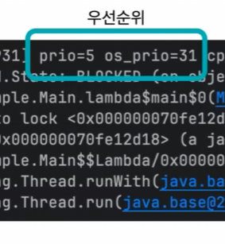
  + 앞이 자바스레드의 우선순위
  + 뒤가 운영체제에서 할당한 우선순위 그래서 뒤에 있는 숫자는 운영체제를 뭘 쓰냐에 따라서 달라질 수 있다
  + 우선순위 설정을 잘못하게 되면 starvation 문제가 발생할 수 있다 그래서 그 경우를 이 숫자들로 확인을 할 수 있다
+ 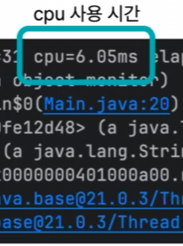
  + CPU 사용시간을 나타내는데요 이 숫자를 보시면 이 스레드가 총 6.05ms 동안 CPU를 사용했다는 것을 알 수 있다
  + 이 숫자를 통해서 한 스레드가 CPU를 과하게 사용하고 있는지 확인을 할 수가 있다
+ 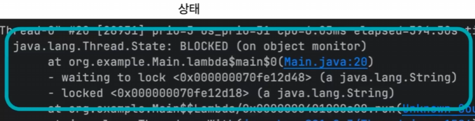
  + 제일 첫 줄을 보면 이 스레드가 Blocked 상태라는 것을 알 수가 있다 그러니까 다른 자원을 기다리고 있다는 뜻으로 해석을 할 수가 있다
  + 뒤에 문자를 보면 on object monitor라는 게 쓰여 있다 이걸 보면 스레드가 자원을 잠그기 위해서 오브젝트 모니터를 대기하고 있다는 것을 알 수 있다 그러니까 synchronized 블록에 진입하기 위해서 기다리고 있다는 것이다
  + 그 밑에 줄을 보면 이 Thread가 실행을 시도하고 있는 메서드 그리고 위치를 알려주고 있다 Main.java라는 클래스에서 20번째 줄을 실행하려고 하고있다는 뜻이다 그리고 그 옆에 보면 lambda$main$0라고 써있는 메서드를 실행하려고 하고 있다는 것을 알 수 있다
  + 바로 밑에 줄을 보면 이 스레드가 락을 기다리고 있다는 정보 또한 알 수 있다 어떤 락을 기다리고 있는지가 바로 뒤에 메모리 주소 정보로 알려지고 있다 그리고 뒤에 이게 String 객체 함께 알려주고 있다
  + 바로 밑에 이 스레드가 락을 잡고 있다는 정보 또한 줄 수 있다 뒤에 있는 게 어떤 메모리에 있는 락을 잡고 있는지를 알 수 있다

### Thread Dump 활용

#### 데드락 감지 
+ 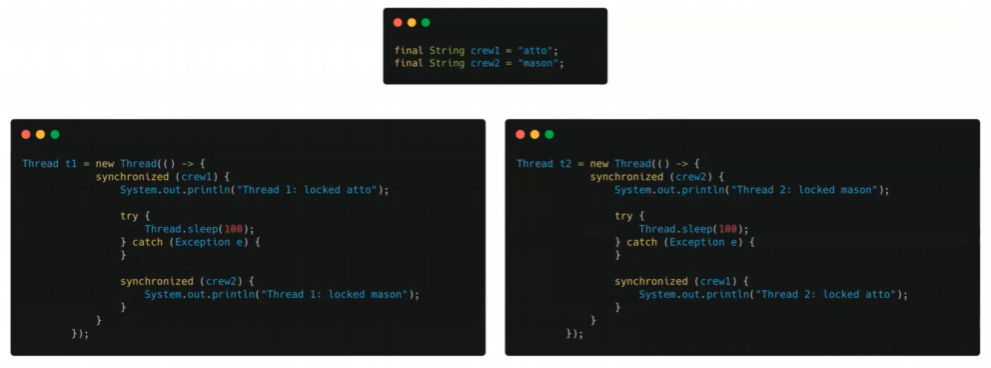
  + T1 Thread는 Atto라는 객체에 대해서 락을 먼저 잡고 Mason이라는 락을 요청
  + T2 Thread는 반대로 Mason이라는 락을 먼저 잡고 Atto 락을 요청
  + 이 상태에서 이렇게 두 Thread를 start()를 하게 되면 Thread1이 Atto Lock을 잡고 Thread2가 Mason Lock을 잡은 상태에서 더 이상 아무 일도 하지 못하고 가만히 대기하고 있는 상태가 된다 왜냐하면 두 Thread가 서로가 Lock을 걸고 있는 자원을 기다리고 있게 되기 때문이다 이런 상태를 우리가 DeadLock이라고 부른다
+ 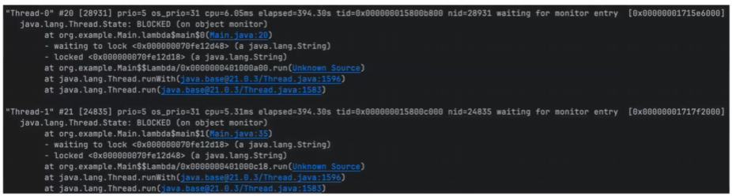
  + Thread가 현재는 두 개밖에 없지만 좀 많은 Thread가 진행되고 있다고 하면 확인이 좀 더 어렵다 
+ 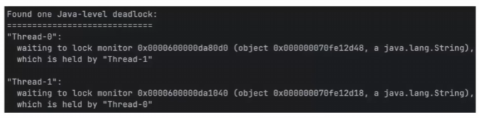
  + 그래서 ThreadDump는 이런 기능을 제공을 한다
  + 파일의 첫 줄에 Found one Java level deadlock 이라는 메시지가 출력이 된 것을 볼 수가 있는데 데드락이 발생했다는 것을 알려주고 있다
  + 데드락이 발생한 Thread의 이름을 알 수 있고 그리고 그 Thread가 어떤 Thread의 락을 기다리고 있는지도 알 수 있게 된다 
  + 이 어플리케이션이 원하는 기능을 하지 못하고 있을 때 어디가 문제인지를 확인을 해 볼 수가 있게 되겠고 어디를 변경해야 될지를 좀 더 잘 알 수 있게 된다

#### starvation 감지
+ 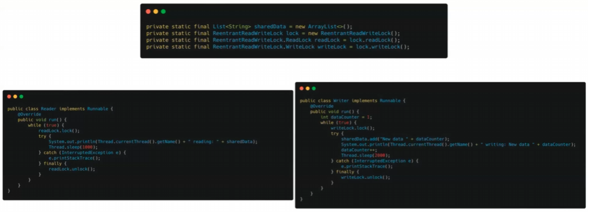
  + 공유하는 자원, shared data라는 게 있다
  + 리더는 read lock을 잡고 그 자원의 내용을 읽을 거고, writer는 write lock을 잡고 그 자원의 내용을 수정하려고한다
  + read lock은 동시에 잡을 수 있지만, write lock은 동시에 못 잡는다 
  + 운영체제에 따라서 조금 다른 결과가 나올 수 있겠지만 라이터만 계속 락을 잡고 리더는 기능을 하지 못하는 상태이다 
+ 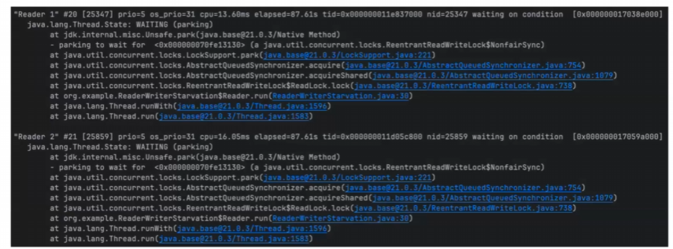
  + Reader1과 Reader2 스레드가 계속 웨이팅 상태인 것을 확인을 할 수가 있다
  + 스레드 덤프가 스냅샷이라서 딱 그 순간의 상태를 알려주는 거라서 이것만 가지고는 계속 대기 중이다 확실하게 확인하기는 좀 어렵다
    그래서 좀 확인을 제대로 하기 위해서는 주기적으로 덤프 파일을 생성을 해서 Thread의 상태를 꾸준히 확인을 하면 좀 더 확실하게 알 수 있다
