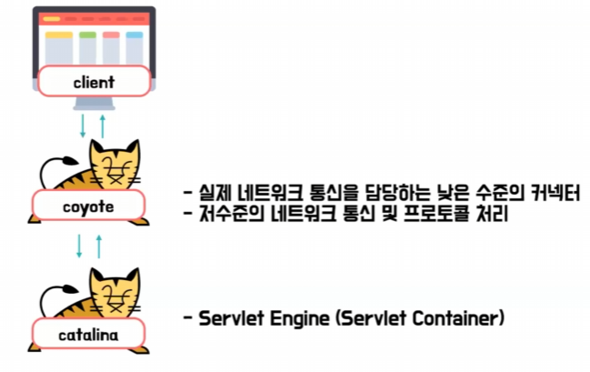
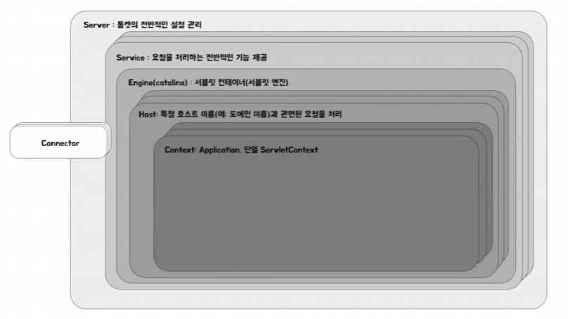
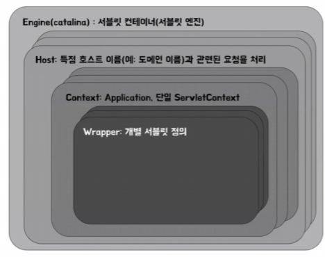
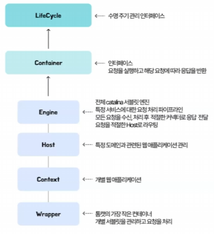

# 리브의 스프링 부트 내장 톰캣
[https://youtu.be/UlF6o3Wbi2k?si=WonQQbW_CYjcaBFz](https://youtu.be/UlF6o3Wbi2k?si=WonQQbW_CYjcaBFz)

# 리브의 스프링 부트 내장 톰캣
* toc
{:toc}

## 톰캣이 뭘까?
+ 웹 애플리케이션의 일반적인 처리 흐름
  + 클라이언트가 요청을 보내면 웹서버가 정적 콘텐츠를 처리하거나 WAS로 요청을 전달 그리고 WAS에서 동적 콘텐츠를 생성하거나
    비즈니스를 수행한 뒤에 다시 웹 서버 클라이언트를 거쳐서 전달하는 방식
+ WAS는 클라이언트 요청을 받아서 동적 콘텐츠를 생성하거나 아니면 비즈니스 로직을 수행하는 역할을 한다
+ WAS의 표준 스펙은 Jakarta EE에서 정의되어 있다
+ WAS는 Jakarta EE 표준 스펙을 구현을 해야 한다 하지만 톰캣 공식 문서에서 자바 EE 표준 스펙을 플랫폼의 일부만을 구현한다고 되어 있어 완벽한 WAS라 보기는 어렵다라는 의견을 찾아볼 수가 있다
+ 톰캣 공식 문서에서도 톰캣을 Sublet Engine, Sublet Container라고 소개를 하고 있다 그래서 톰캣을 Sublet Container이지만 WAS 역할도 할 수 있는 소프트웨어이다

## 스프링 부트는 왜 톰캣을 내장했을까?
+ 스프링 프레임워크가 나오고 나서 개발의 편의성이 많이 좋아졌지만 의존성 버전도 관리해야 하고 별도로 서버도 직접 설치를 해야 되고 초기 설정도 일일이 해야 해서 번거롭다는 의견이 있었다 그래서 이런 단점을 보완하기 위해 스프링 부트가 나왔다
+ 스프링 부트는 최소한의 설정으로 스프링 기반의 애플리케이션을 독립 실행할 수 있도록 돕는 프레임워크이다 그리고 이런 프레임워크가 되기 위해서 톰캣을 내장했다
+ 이 사실은 Gradle의 Dependency에서도 보실 수가 있는데 spring-boot-starter-web에 톰캣이 들어있다 의존성들을 하나씩 들어가 보면 spring-boot-starter-tomcat이 있다

## 내장 톰캣 없이 어떻게 배포했을까?
+ 톰켓이 내장되어 있지 않을 때는 톰캣을 운영체제에 직접 설치를 하고 WAR 파일로 패키징을 한 다음 톰캣의 webapps라는 디렉토리에 저장하면 톰캣이 그것을 언패킹해서 웹 애플리케이션으로 실행하는 과정을 거쳤어야 했다 그래서 운영 서버나 개발 서버 등 서버가 늘어나면 늘어나게 될수록
  관리해야 할 포인트가 늘어나게 되는 것이다
+ 스프링 부트에서는 jar 파일을 사용한다 jar 파일 구조를 보면 BOOT-INF 디렉토리에 lib 디렉토리 안에 의존성들의 jar 파일이 있는데 내장 톰캣 관련 jar 파일도 확인 할 수가 있다 그래서 복잡한 과정이 없이 java runtime 환경만 있으면 간단한 명령어로 웹 애플리케이션을 실행할 수가 있게 되었다

## 스프링 부트는 어떤 과정을 거쳐서 톰캣을 실행할까?
+ SpringApplication 인스턴스가 생성이 되면 run() 메소드 내부에서는 현재 애플리케이션에 적합한 컨텍스트를 생성하는 createApplicationContext() 메소드를 실행한다 이 메소드에서는 내장 웹서버를 설정하고 구동하는 역할을 하는 인스턴스를 생성을 한다
+ 우리는 일반적인 스프링 어플리케이션을 실행시켰기 때문에 ServletWebServerApplicationContext를 생성을 하게 된다
+ ServletWebServerApplicationContext에서는 createWebServer() 메서드가 실행이 되고 그 메서드 내에서 우리는 톰캣을 사용하기 때문에 TomcatServletWebServerFactory를 생성을 한다 그리고 Factory의 getWebServer() 메서드를 호출을 하게 되면  Tomcat 인스턴스가 생성이 된다
Tomcat 관련해서 LifecycleListener나 Connector 같은 기본 설정을 한다
+ Tomcat 인스턴스가 생성되었다고 끝이 나는 건 아니고 Tomcat 인스턴스를 실행하고 종료 같은 것을 관리할 객체가 필요하기 때문에 TomcatWebServer 인스턴스를 만드는데 아까 생성했던 Tomcat 인스턴스를 주입을 해서 만들어준다 웹서버의 초기화 메서드에서 Tomcat.start()가 시작이 되면서 본격적으로 Tomcat 서버가 실행이 된다


## 톰캣 구조를 알아보자
+ 
+ 톰캣을 좀 큰 구조로 바라보면은 클라이언트의 요청을 코요테라는 저수준의 네트워크 통신을 하는 커넥터에서 받아서 카탈리나라고 하는 서블릿 컨테이너로 전달을 하고 응답을 받아서 다시 코요테 클라이언트 순으로 전달되는 방식이다
+ 
+ ```Connector```
  + 가장 왼쪽의 커넥터는 코요테랑 카탈리나의 다리 역할을 한다
  + 코요테로부터 받은 리퀘스트 객체를 카탈리나에 전달한다
  + 카탈리나가 처리한 응답을 다시 코요테로 전달을 하는 역할을 한다
+ ```Server```
  + 톰캣 서버 최상위 요소
  + 톰캣 서버의 구성과 관리를 담당
+ ```Service```
  + 커넥터로부터 요청을 수신하고 엔진에 전달
  + 엔진에서 응답을 받아서 커넥터로 전달
+ 
+ 컨테이너 계층 구조로 되어 있어서 요청을 단계별로 처리한다
+ 
+ 컴포넌트들은 모두 컨테이너 인터페이스를 구현하고 있는데 컨테이너 인터페이스는 라이프 사이클이라고 하는 인터페이스를 구현해서 컨테이너들이 자신의 생명 주기를 관리할 수 있도록 공통된 메커니즘을 가질 수 있게 해준다
+ 상위 컨테이너가 하위에 있는 컨테이너를 자식으로 가질 수 있고 이 엔진을 카탈리나, 서블릿 컨테이너라고 부른다
