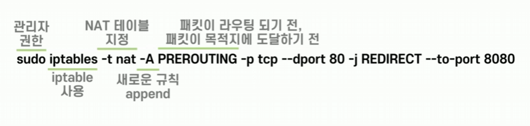
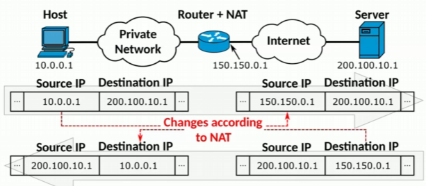
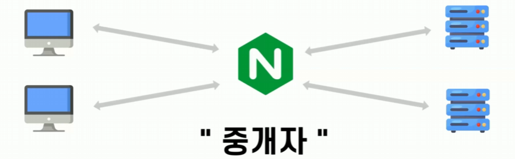

# 시소의 포트포워딩 그랬구나
[https://youtu.be/uZdUO9Oi7DA?si=3FkTaAv86yYqYDf8](https://youtu.be/uZdUO9Oi7DA?si=3FkTaAv86yYqYDf8)

# 시소의 포트포워딩 그랬구나
* toc
{:toc}

## 포트포워딩
+ 포트를 전달하다 라는 의미
+ 하나의 IP 주소와 포트 번호 결합의 통신 요청을 다른 곳으로 넘겨 주는 네트워크 주소 변환의 응용 요약해 보자면 통신 요청을 다른 곳으로 넘겨 주는 것

## iptable
+ EC2에서 할 수 있는 포트포워딩 방법 중 대표적인 것은 두 가지가 있는데 먼저 OSI Layer에서 Transport Layer와 Network Layer에서 동작하는 iptable의 방법
+ iptable이란 규칙 집합을 정의할 수 있는 일반 방화벽 소프트웨어인데 Linux 커널에서 동작하는 프레임워크인 netfilter의 인터페이스로 동작을 한다
+ 
  + iptable로 포트포워딩을 설정하려면 다음과 같은 명령어를 수행하면 된다 
  + sudo, 관리자 권한으로 iptable을 사용하여 nat 테이블을 지정한다는 의미를 담고 있다 이때 -A 옵션을 사용해서 새로운 규칙을 append 하게 되는데 이때 -D 옵션을 사용하면 delete 한다는 의미를 담을 수도 있다
  + PREROUTING 옵션을 사용해서 패킷이 라우팅 되기 전 즉, 패킷이 목적지에 도달하기 전에 뒤에 명령어를 수행하게 되는데 -p 옵션을 통해 tcp 프로토콜을 지정하고 --dport, destination 포트 즉, 목적지 포트가 80인 규칙이 맞다면 redirect할 대상 포트인 8080 포트로
    패킷을 전달하게 된다

## NAT (NETWORK ACCESS TRANSLATION)
+ 여기서 반복적으로 등장하는 nat 키워드가 있는데 NAT에 대해서 조금 더 살펴보자
+ NAT는 Network Access Translation의 약자로 IP 주소를 다른 IP 주소로 변환해 라우팅을 원활히 해주는 기술이다
+ 
+ IPv4 고갈 문제 그리고 내부 IP를 외부로부터 숨기는 등 보안 문제로 인해서 Private IP와 Public IP를 분리해서 사용하곤 하는데 이것을 가능하게 해주는 것이 바로 이 NAT 기술이다
+ NAT는 NAT 테이블을 통해서 private IP와 public IP를 변환하고 이것을 역변환까지 가능하게 해준다
+ 동작흐름을 보면 요청이 들어왔을 때 PREROUTING 체인에서는 NAT 테이블을 참고하여 IP 주소 혹은 포트를 변경하게 된다 이렇게 변경된 IP는 FORWARD 체인의 방화벽 규칙이 적용되는데 EC2의 보안 그룹과 방화벽 규칙은 다르게 작동한다 이렇게 방화벽 규칙까지 통과한 패킷은 서버에 전달이 된다

## Nginx
+ application layer에서 작동
+ Nginx는 웹서버 소프트웨어로 주로 HTTP 서버, 리버스 프록시 서버, 로드밸런서 등으로 사용된다
+ HTTP로 포트 포워딩을 설정하려면 설정 파일에서 80포트에 대해 8080포트로 proxy_pass를 작성하면 된다
+ 
  + proxy_pass란 리버스 프록시 개념을 알아야 하는데 리버스 프록시 역할을 한다는 것은 중개자 역할을 한다는 것이다
  + 클라이언트부터 받은 요청을 대신 받아서 다른 서버에 전달한 뒤 그 서버의 응답을 클라이언트에게 다시 전달하는 역할을 하는 것
+ 동작흐름을 보면 80 포트로 들어온 요청을 Nginx가 받은 뒤 8080 포트로 변환하여 스프링 서버로 전송하게 되고 스프링 서버로부터 응답이 오면 그것의 반대의 과정을 거치게 된다

## iptable로는 안되고 Nginx로는 됬던 이유
+ -i eth0 옵션을 넣은 것을 볼 수 있는데 이것은 네트워크 인터페이스에 대한 것을 추가적으로 설정해 준 것인데 이것은 이더넷 0 인터페이스에 대해서만 포트포워딩을 진행하겠다는 뜻이다
+ 하지만 요청을 보내는 네트워크 인터페이스가 이더넷 0이 아니기 때문에 포트 포워딩이 적용되지 않은 것이다

## netfilter의 iptable과 Nginx의 방법 중 뭘 택해야 할까
+ Nginx를 선택할 것이다
  + iptable은 명령어 설정 실수를 하기 쉽다 
  + Nginx의 관리 포인트 줄이기 측면 기존에 iptable을 선택했던 이유는 iptable은 리눅스에 기본적으로 내장되어 있고 Nginx는 따로 다운로드를 받아야 한다 그래서 포트 포워딩을 위해서
    Nginx를 다운로드 받을 필요가 없다 생각하고 iptable로 진행을 했었는데요 프로젝트를 진행하면서 Nginx로 포트 포워딩 뿐만 아니라 로드 밸런싱 등 다양한 역할을 수행하게된다
    이때 포트포워딩은 iptable로 하고 로드 밸런싱은 Nginx로 하는 것은 관리 포인트를 증가시키는 행위이기 때문에 Nginx를 좀 더 추천
  + iptable은 재실행 시에 번거로움이 있다 EC2를 중단하고 재실행하게 되면 iptable의 경우에는 내용이 날아가서 터미널 명령으로 모든 것을 다시 입력해 줘야 한다 하지만 Nginx의 경우 설정 파일에 남아있는 정보들이 있기 때문에
    Nginx만 재실행하게 되면 해당 설정들을 입력해 줄 수 있다
