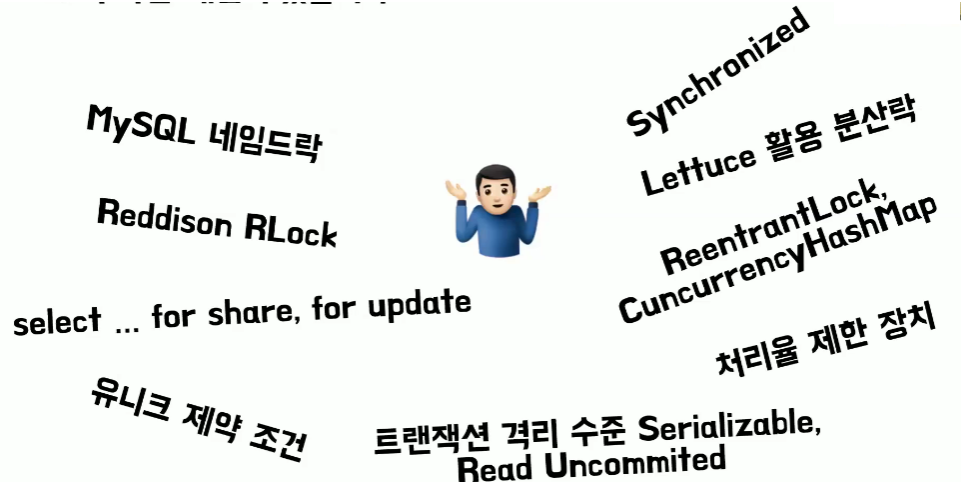

# 버건디, 아톰의 프론트엔드와 백엔드의 API 중복 호출 해결기
[https://youtu.be/FEP2BzNzoRw?si=MaMwdolrBaWSMtpD](https://youtu.be/FEP2BzNzoRw?si=MaMwdolrBaWSMtpD)

# 버건디, 아톰의 프론트엔드와 백엔드의 API 중복 호출 해결기
* toc
{:toc}

## 프론트엔드 
+ 리액트의 상태 업데이트 메커니즘 중 하나인 Batching Update로 인해서 리액트에선 리렌더링 최적화를 위해서 한 번의 리렌더링 당시에 상태 업데이트 그 컴포넌트 내부에 존재하는 상태 업데이트들을 여러 개를 모아서 한 번에 처리 그 한 번에 처리하는 걸 Batching Update라고 한다
+ 디바운스 한번 적용해보면 되지 않을까? 디바운스란 지정한 시간 안에서 연속적으로 이벤트가 발생한다면 마지막 이벤트만 호출하도록 하는 방법인데
  하지만 API 응답이 늦게 오게 된다면 디바운스 타이머를 걸어주는 것 자체에서 기능적인 한계가 어느 정도 존재한다 쓰로틀링도 마찬가지고 디바운스나 쓰로틀의 목적은 과도한 API 호출을 막는 것에 있는 거지 중복 호출 그 자체를 막기 위한 용도는 아니다
+ API 호출이 올 때마다 이 식별값을 확인해서 중복 호출 여부를 판별해 볼 수 있지 않을까 그래서 useRef를 활용해서 식별 id 값만 넣어준다면 중복 호출을 어느 정도 방지해 볼 수 있다
+ 사실 이런 문제가 진짜 발생할까? 라고 생각을 할수도 있다 일반적인 사용자는 그냥 어플리케이션 이용하는 걸 텐데 중복 호출을 하자고
  그렇게 할까? 라고 생각하실 수도 있다 그리고 만약에 문제가 발생한다고 한들 엔드에서 처리해주면 되는 거 아닐까? 라고 생각을 해볼 수도 있다 다만 좋은 개발자, 잘하는 개발자는 결국에는 기능 구현을 넘어서서 기능 구현 안에 있는 디테일한 부분들을 얼마나 챙길 수 있는가
  거기서 경쟁력 있는 개발자, 잘하는 개발자가 될 수 있는 발돋움할 수 있다 이어서 기술의 발전으로 인해서 영역 구분 없이 즉, 이거는 프론트 거고 저거는 백엔드 거야 이렇게 나누기보다 백엔드랑 프론트랑 같이 힘을 합쳐서
  하나의 문제 해결 자체에 집중을 한다면 더 나은 프로덕트, 더 나은 어플리케이션을 만들 수 있다
+ 만약에 여러 브라우저에서 동시에 동일한 API를 호출한다면 사실 이는 클라이언트 단에서 막아볼 수 있는 방법은 한계가 있다 그래서 이는 자연스럽게 백엔드 단에서 처리를 해줘야 된다

## 백엔드 
+ 자바 동기화 도구, 분산락, 유니크 제약 조건, 트랜잭션 격리 수준, 또 데이터베이스 잠금, 기타 등등으로 풀어볼 수 있다

### Synchronized
+ Synchronized는 특정 영역 메서드에 한 명씩 들어와 라고 하는 키워드이다 암묵적 락이라고도 한다 자바에서 제공하는 기능이다
+ Synchronized 키워드를 붙이게 되면 두 개를 동시에 실행해도 순서를 보장하게 할 수 있다
+ 하지만 트랜잭션 AOP 프록시 때문에 프록시가 요청을 대신 받아서 데이터베이스 트랜잭션을 진행하고 실제 객체를 호출합니다 그래서 Synchronized가 끝난 다음에 데이터베이스 트랜잭션이 커밋되기 때문에 중복된다 
  + 프록시가 요청을 받아 DB 트랜잭션을 진행하고 실제 객체를 호출한다.
  + Synchronized가 끝나고 DB 트랜잭션이 커밋된다
  + 다른 DB 트랜잭션이 커밋되기 이전에 영역에 들온다
  + 중복된다 
  + 이를 해결하기 위해서는 @Transactional annotation을 없애면 되긴 한다
+ 하지만  synchronized 키워드는 한계가 있는데 브라우저 2개가 동시에 요청을 보낼때 하나는 사용자 1번 쿠폰 발급이고
  두 번째는 사용자 2번에 대한 쿠폰 발급 요청 이때 첫 번째 요청은 통과를 하고 두 번째 요청은 대기를 하게된다 하지만 사용자 1번 쿠폰 발급 요청과
  사용자 2번 쿠폰 발급 요청은 중복 호출이 아님에도 불구하고 대기하게 되니까 비효율이 발생한다
+ 또 쿠폰 API 서버가 두 개일 때 각각의 서버는 두 번째 요청은 대기를 할 수 있다 근데 첫 번째 요청은 통과를 하니 두 요청이 중복 호출이 되어서 결과적으론 사용자가 쿠폰을 한 개 이상 발급할 수 있게 된다
+ 이를 해결하기 위해선 분산락을 사용해 볼 수가 있는데 다양한 프로세스가 공유 자원을 상호 배타적으로 사용하는 경우에 유용하게 사용된다

### MySQL 네임드 락
+ MySQL 네임드 락은 분산락을 구현해볼 수가 있다
+ MySQL에서 네임드 락은 임의의 문자열에 잠금을 설정하는 기능인데 get_lock 메서드로 잠금을 획득할 수 있고 is_free_lock, is_used_lock 메서드로 잠금을 사용할 수 있는지 체크할 수 있다
  그리고 release_lock, release_all_locks라는 메서드로 잠금을 해제할 수 있다
+ 네임드 락은 특징을 가지고 있는데 ```한 세션에서 잠금을 유지하고 있으면 다른 세션에서 해당 잠금을 획득할 수가 없다``` 그리고 ```획득한 잠금은 트랜잭션이 종료되어도 해제되지 않는다``` 또한 ```현재 세션에서 획득한 잠금만 릴리즈할 수 있다```

### 고민해볼 지점
+ 진짜 적용할 지
  + 우선 동시 처리 능력을 희생하는 방법들은 병목 지점을 만들 수도 있다
  + 상황에 따라 데드락이 발생할 수도 있다
  + 추가 인프라 구축 비용을 요구할 수도 있다
  + 코드의 복잡도를 올릴 수도 있다
  + 막지 않아도 되는 경우도 있다
+ 더 나은 대안이 있을거야
  + ReentrantLock과 CuncurrencyHashMap으로 풀어볼 수도 있다
  + 네임드 락, 또 Redis를 활용한 분산락을 사용해볼 수도 있다
  + 
