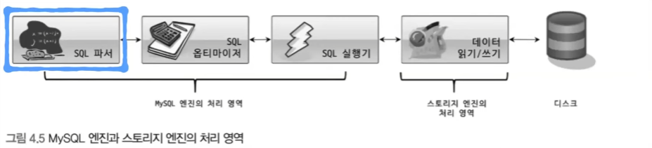
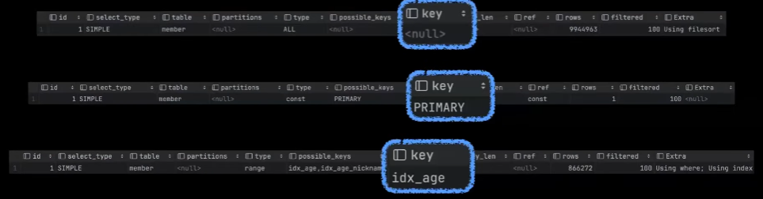
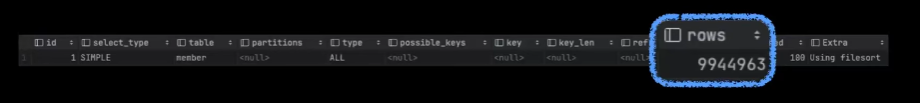
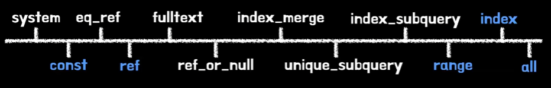
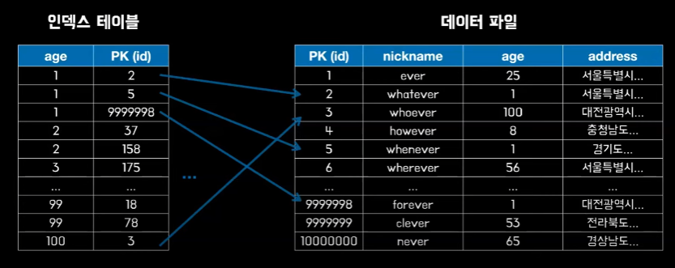

# 에버의 Mysql 옵티마이저 
[https://youtu.be/gcsu7ni3tBc?si=7TChSPcKUFrjESEJ](https://youtu.be/gcsu7ni3tBc?si=7TChSPcKUFrjESEJ)

# 에버의 Mysql 옵티마이저
* toc
{:toc}

## MySQL 아키텍처
+ MySQL 서버는 MySQL 엔진과 스토리지 엔진으로 구성이 되어 있다
+ MySQL 엔진은 SQL 문장을 분석하고 최적화하는 두뇌같은 역할을 맡고 있다
+ 스토리지 엔진은 데이터를 저장하고 조회하는 손과 발 같은 역할을 맡고 있다
+ 실행 계획을 수립하는 옵티마이저의 경우에는 두 엔진 중에 MySQL 엔진에 해당이 될 것이다

### 쿼리 실행 과정
+ MySQL 서버는 쿼리 실행을 세가지 단계로 나누어서 살펴볼 수 있다
+ 
+ 먼저 SQL 파서가 주어진 SQL문을 잘게 쪼개서 MySQL 서버가 이해할 수 있는 수준으로 분리한다 이때 생성되는 것이 파스 트리라고 불린다.
+ 파스 트리를 바탕으로 쿼리를 최적화하고 옵티마이저는 이 시점에 실행 계획을 수립하게된다
+ MySQL 엔진이 열심히 처리한 정보를 바탕으로 스토리지 엔진에서 필요한 데이터를 가져오게 된다

## 실행 계획 이란?
+ 실행 계획이란 세 가지 단계 중에 두 번째 단계에서 옵티마이저가 결정한 최적의 쿼리 실행 방법을 의미한다
+ 실행계획을 확인하고싶은 쿼리 앞쪽에 explain 명령어를 붙이면 쉽게 실행 계획을 확인하실 수 있다

## 실행 계획 분석

### key
+ 
+ 퍼시브 키스(possible_keys)라는 컬럼에는 주어진 쿼리에 걸릴 수 있는 후보 인덱스들의 목록이 표시된다
+ 그 중에서 옵티마이저가 최종적으로 선택하는 인덱스를 키(key) 컬럼에 표시하게 된다

### rows
+ 
+ 쿼리를 실행하기 위해 조사해야 하는 행의 수
+ rows 컬럼의 수가 높아질수록 성능은 저하되는데 그래서 rows 값을 줄이는 것이 쿼리 튜닝의 핵심이라고도 볼 수 있다
+ rows 값은 옵티마이저가 통계 정보를 바탕으로 추정해낸 값이기 때문에 100% 정확하다고 볼 수는 없다

### type
+ type 컬럼은 각 테이블의 레코드를 어떤 방식으로 조회했는지에 대해 소개
+ 타입 컬럼의 종류에는 여러가지가 있는데 표를 보면 오른쪽에 위치할수록 성능이 낮은 타입이라고 생각하면 된다
  + 
  + 이 중에서도 const, ref, range, index, all 은 흔하게 볼 수 있다
+ const
  + const 타입은 조건절의 기본키 혹은 유니크 컬럼을 이용해서 일치하는 행이 오직 하나일 경우에 수립이 되는 실행 계획이다
  + 행이 하나이기 때문에 그 행이 결정이 되는 순간 결론까지 확정이 되는 구조이다
  + 성능이 매우 빠른 타입이다
+ ref
  + ref 타입은 기본키 그리고 유니크키가 아닌 컬럼의 인덱스에 대해서 동등(equal) 조건으로 검색할 때 선택이 되는 접근 방법이다
+ range
  + range 타입은 인덱스 레인지 스캔이라고 생각면 된다 이것을 간단하게 정리하자면 인덱스를 활용해서 범위 형태의 데이터를 조회한 경우를 뜻한다
+ index
  + 인덱스라는 이름만 보았을 때는 인덱스가 효율적으로 잘 걸리는 방식인가라고 생각을 할 수 있는데 사실은 그렇게 효율적인 방식은 아니고 인덱스 테이블의 처음부터 끝까지를 전체 탐색하는
    인덱스 테이블 풀 스캔 방식이다
  + 인덱스에 포함된 컬럼만으로 처리할 수 있는 커버링 인덱스를 사용하거나 인덱스를 사용해서 테이블 전체를 스캔하는 경우 선택되는 타입이다
+ all
  + all 타입은 실제 테이블의 처음부터 끝까지를 전체 탐색하는 테이블 풀 스캔 방식
  + 성능이 매우 좋지 않은 방식이다 하지만 인덱스 추가를 통해서 all 타입은 피할 수가 있기 때문에 인덱스를 효율적으로 거는 것이 매우 중요해진다

### extra
+ 
+ 엑스트라 컬럼은 주로 내부적인 처리 알고리즘에 대해서 조금 더 깊이 있는 내용을 소개하고 싶을 때 사용하는 컬럼이다
+ Using filesort
  + 정렬을 처리하기 위한 적절한 인덱스를 찾지 못한 경우에는 filesort 방식으로 정렬이 진행된다는 뜻이다
+ Using temporary 
  + 새로운 공간이 필요할 때 그 공간을 사용했다는 뜻
+ Using index
  + usingIndex 방식은 Covering Index라고 생각하면 된다
  + Covering Index는 실제 데이터 파일을 읽지 않고 인덱스 테이블만 읽어서 쿼리를 처리할 수 있을 때의 방식
  + 
