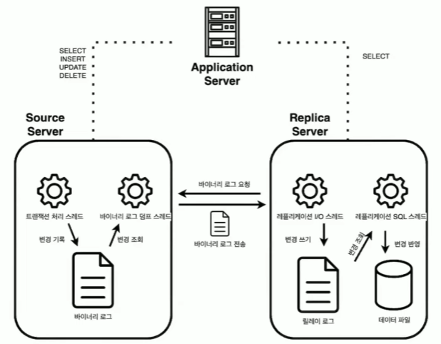
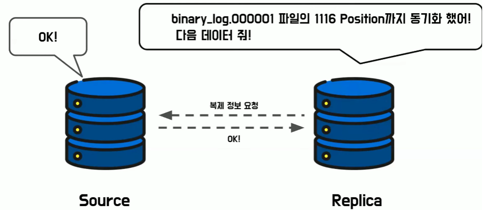
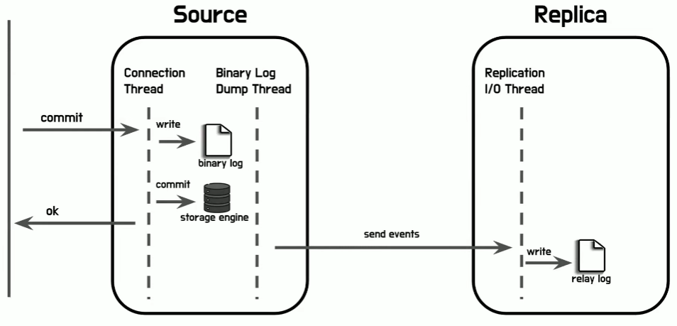
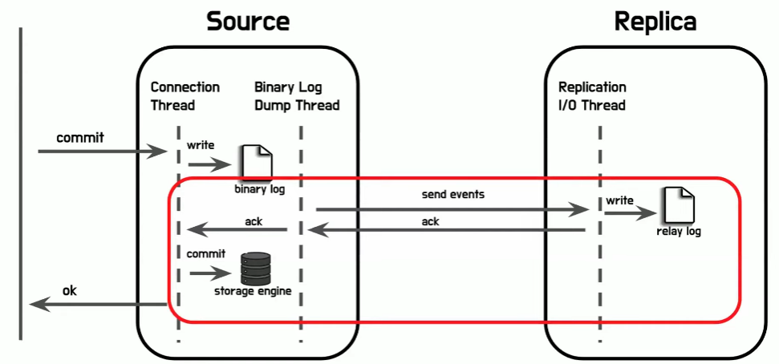

# 리비의 DB Replication
[https://youtu.be/7DwxuWyCNHA?si=TsyRJTX61IgKPHF-](https://youtu.be/7DwxuWyCNHA?si=TsyRJTX61IgKPHF-)

# 리비의 DB Replication
* toc
{:toc}

## DB Replication 개념
+ DB Replication은 한 데이터베이스에서 다른 데이터베이스로 데이터가 동기화되는 것
+ 원본 데이터를 소장하고 있는 데이터베이스를 source 데이터베이스라고 하고 복제된 데이터를 소장하고 있는 쪽이 replica 데이터베이스이다
+ DB 레플리케이션을 사용해서 SOURCE 데이터베이스와 REPLICA 데이터베이스로 이중화 되어 트래픽이 많은 상황에서도 부하 분산을 통한 고가용성을 확보할 수 있다
+ DB Replication을 적용하는 것은 부하 분산이 아니더라도 다양한 상황에서의 고가용성을 위함이다 꼭 트래픽과 관련된 것이 아니더라도 데이터베이스가 많이 죽으면 복제를 이용해서 예비용 서버를 만드실 수도 있고 분석이나 데이터 백업 같은 무거운 작업을 처리하는
  전용 서버를 구축할 수도 있다
+ 사용자와 가까운 곳에 DB를 복제해서 위치시켜서 지리적으로 분산하는 고가용성도 챙기실 수가 있다 
+ DB Replication의 고가용성이 응용 범위가 굉장히 넓다
+ 복제 시스템 구성
  + Source 서버 하나에 Replica 서버가 하나 있는 ```Single Replica``` 구조
  + Source 서버 하나에 Replica가 두 개 이상이 위치하는 ```Multi Replica``` 구조
  + 이외에도 체인 복제 구성이나 듀얼 소스 복제 구성,멀티 소스 복제 구성처럼 DB Replication 시스템의 구성 방식은 굉장히 다양하다
  + 제일 많이 사용되는 구성은 Single, Multi Replica 구조이다

## 복제 아키텍처
+ 복제 아키텍처에 대해서 이해를 하시려면 제일 먼저 Binary Log에 대해서 이해를 해야한다
+ Binary Log는 MySQL 서버에서 발생하는 모든 변경사항이 기록되는 파일이다 수행된 DML, 그리고 수행된 DDL, 그리고 사용자 권한 변경 같은 데이터베이스 메타데이터 변경까지 모두 Binary Log에 기록이 되게 된다 기록되는 포맷은 설정에 따라서
  SQL 그 자체가 저장이 되기도 하고 변경된 데이터 Row들이 저장되기도 한다
+ 
  + Binary Log를 이용하는 것이 복제 과정의 큰 핵심이다
  + 소스의 변경 사항이 로그에 기록
  + 로그 내용이 replica에게 전송되는 것이 복제 과정의 큰 흐름
+ 
  + 스레드들이 협력을 하면서 복제 과정이 수행 된다
  1. 먼저 소스 서버에 변경이 발생
  2. 트랜잭션 처리 스레드가 Binary Log에 변경을 기록
  3. 레플리카에서 소스 서버로 복제 정보를 요청
  4. 복제 정보 요청을 받은 Binary Log dump Thread가
  5. Binary Log에서 변경 내용을 조회한 후에 레플리카 서버에게 Binary Log를 전송
  6. Binary Log를 전송받은 Replication IO Thread가 릴레이 로그에 변경을 기록
  7. Replication SQL Thread가 변경을 조회한 후에 데이터 파일의 변경을 반영

## 복제 타입
+ 복제를 식별하는 방식을 복제 타입이라고 한다
+ 복제를 위해서 레플리카는 소스 데이터베이스에 복제 정보를 요청해야한다
+ 레플리카 서버는 복제를 요청할 때 약속된 타입의 데이터로 요청을 해야 한다
+ 복제 요청은 꼭 약속된 타입으로 진행이 되어야 한다
+ MySQL에서 제공하는 복제 타입이 크게 두 가지가 있다
  + Binary Log File 위치 기반 복제
  + Global Transaction ID 기반 복제

### Binary Log File 위치 기반 복제
+ 특정 Binary Log File과 Position의 조합으로 복제 정보를 요청하는 방식
+ 
  + 레플리카 서버가 특정 Binary Log File에 특정 Position까지 동기화를 완료했으니 데이터를 달라고 요청
  + 소스 서버는 어떤 복제 데이터를 요청하는 건지 이해를 할 수가 있게 되고 응답을 할 수가 있다
+ Binary Log File 위치 기반 복제를 사용하게 되면 문제점이 있다 소스 서버에 장애가 발생했을 때 문제가 있을 수가 있게 된다
  1. 소스 서버에 장애가 발생을 하면 레플리카 서버 중에 소스 서버와 동기화가 완벽히 이루어진 레플리카 서버가 소스 서버로 승격이 되게 된다
  2. 새로운 소스 서버가 생겼고 레플리카 서버가 이 새로운 소스 서버에게 복제 데이터를 요청할 때 새로운 소스 서버는 요청온 파일이 없다고 하고 Binary Log 파일은 1번밖에 없고 응답한다
  3. 이런 문제점은 특정 복제 이벤트가 다른 데이터베이스에서 동일한 Binary Log 파일의 동일한 위치에 저장되는 것이 보장되지 않기 때문이다
  4. 예를 들어서 소스 서버의 Binary Log의 10000번째 포지션에는 A라고 적혀 있는데 레플리카 서버의 바이너리 로그의 10000번째 포지션에는 B라고 이렇게 다른 데이터가 저장이 되어 있을 수가 있다
  5. 이런 바이너리 로그 파일 위치 기반 복제의 특징은 소스 서버에 장애가 발생하면 복구를 어렵게 한다는 점도 있다
+ 복제 시스템 내에 모든 DB가 복제 이벤트를 동일하게 식별할 수 없을까 이러한 생각을 바탕으로 만들어진 것이 글로벌 트랜잭션 아이디 기반 복제 타입이다

### 글로벌 트랜잭션 아이디 기반 복제
+ GTID라고 줄여서 말한다
  + 복제 시스템 내에 모든 DB가 공유하는 유니크한 트랜잭션 아이디 
  + 소스 서버의 유니크한 아이디 값과 트랜잭션 아이디 값의 조합으로 만들어지는 것이 GTID
+ GTID를 사용하게 되면 모든 데이터베이스에서 하나의 이벤트를 동일한 식별자로 알게 될 수 있다
+ 여러가지의 데이터베이스가 있어도 해당 이벤트를 가르키라고 하면 모두가 같은 이벤트를 가르킬 수가 있게 되는 것이다
+ 바이너리 로그 파일 위치 기반 타입은 파일명과 위치를 기반으로 하는 물리적인 방식을 사용하고 있고 GTID는 유니크한 식별자 매핑을 통해서 논리적인 방식을 사용하고 있다
 
## 복제 동기화 방식 
+ 복제 이벤트를 얼마나 기다릴 것인지가 복제동기화 방식
+ 복제동기화 방식에는 크게 비동기 복제 방식하고 반동기 복제 방식이 있다

### 비동기 복제
+ 
+ 비동기 복제의 핵심은 복제 이벤트를 전달만 할 뿐 응답을 확인하지 않는다는 것이다
+ 복제 이벤트를 Replica 서버에 전송하기 이전에 storage engine에 변경 내용이 commit 되고 있다
+ 즉, 복제 이벤트 전파를 확인하지 않고 변경을 저장하고 있는 것이 비동기 복제 방식

### 반동기 복제 
+ 
+ 반동기 복제 방식의 핵심은 복제 이벤트를 전달을 하고 릴레이 로그에 쓰여지는 것을 확인하는 것이다
+ 변경이 일어난 후에 레플리카 서버에게 먼저 복제 이벤트를 전달을 하고 응답이 올 때까지 storage engine에 commit을 하지 않는다
+ 즉, 복제 이벤트의 전파가 릴레이 로그에 전파되는 것을 확인 후 변경을 저장한다는 특징을 가지고 있다
+ 주의해야 될 점은 이 반동기 복제라는게 복제가 완료될 때까지 기다리지는 않는다 릴레이 로그에 쓰여지는 것까지만 기다리는데 이게 바로 완전 동기 복제가 아닌 반동기 복제라고 명명된 이유이다
