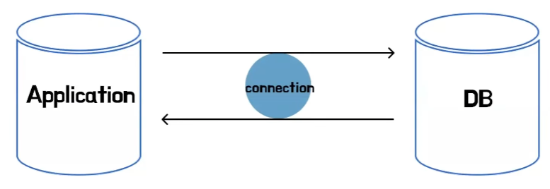
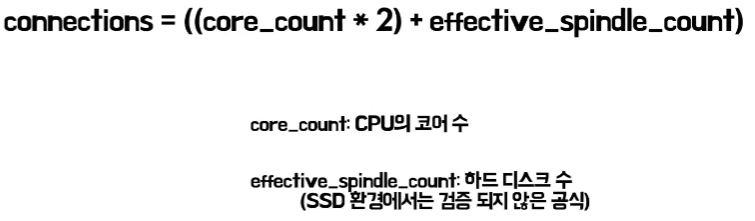
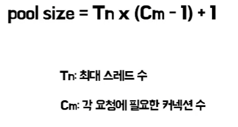
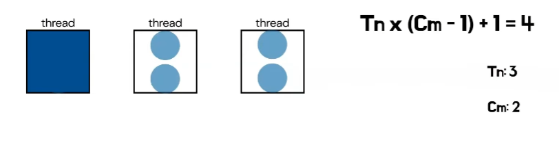

# 폰드의 커넥션 풀
[https://youtu.be/kNAIvfFolAs?si=ZzUIsJPB0J5-EnFY](https://youtu.be/kNAIvfFolAs?si=ZzUIsJPB0J5-EnFY)

# 폰드의 커넥션 풀
* toc
{:toc}

## 개념 및 필요성

+ 애플리케이션 서버와 데이터베이스 서버는 통신하기 위해서 커넥션이 필요하다
+ 커넥션을 효율적으로 관리하기 위해 커넥션 풀이라는 개념이 등장했다
+ 커넥션 풀은 이름 그대로 커넥션을 담아두는 일종의 저장소이다
+ 애플리케이션이 시작될 때 미리 DB와 커넥션을 생성해놓고 이들을 커넥션 풀이라는 컨테이너에 보관한다
+ 실제 요청이 들어오면 이미 만들어진 커넥션을 제공하는 방식으로 동작한다
+ 사용이 끝나면 재사용할 수 있게 커넥션 풀에 반환한다 
+ 커넥션 풀이 커넥션을 효율적으로 관리한다는 것의 의미
  + 첫째, 성능 관점이다 DB와의 연결은 TCP 기반 통신으로 연결을 맺고 끊을 때마다 3-way 핸드쉐이크, 4-way 핸드쉐이크 등의 과정이 필요하다 MySQL 공식 문서에 따르면
    이러한 데이터베이스 연결 과정은 상당한 시간이 소요되는 것을 명시하고 있다 커넥션 풀을 사용하면 이미 생성된 커넥션을 재사용함으로써 이러한 네트워크 연결 비용을 크게 줄일 수 있다
  + 둘째, 데이터베이스 보호 관점이다 커넥션 풀이 없는 환경을 예로 들어보면 애플리케이션에 버그가 있거나 예외 사항이 발생하여 커넥션이 제대로 반환되지 않는다면 데이터베이스는 계속해서 새로운 커넥션을 생성하게된다
    결국 데이터베이스의 리소스가 고갈되어 심각한 장애로 이어질 수 있다 반면 커넥션 풀을 사용하면 이러한 위험을 방지할 수 있다 커넥션 풀은 미리 제한된 리소스 내에서만 커넥션을 생성하고 관리하므로
    설령 애플리케이션에 문제가 있더라도 데이터베이스의 치명적인 영향을 주지 않는다
  + 결론적으로 애플리케이션의 성능 개선과 데이터베이스의 안정성 보장을 위해 사용될 수 있다

## 설정 및 고려사항
+ 커넥션 풀을 효율적으로 사용하기 위해 여러 설정들을 고려해야한다

### maximumPoolSize 
+ Maximum 풀 사이즈는 커넥션 풀이 가질 수 있는 최대 커넥션 수를 의미한다 이는 곧 현재 사용 중인 커넥션과 대기 중인 커넥션의 총합이다
+ Hikari CP 문서에서는 컨텍스트 스위칭 비용을 언급하면서 더 많은 커넥션은 더 좋은 성능이라는 통념이 잘못되었다고 지적한다 다만, Thread가 IO 작업으로 블록되는 동안 CPU가 다른 작업을 처리할 수 있으므로 물리적인 코어수보다 약간 더 많은 수의
  커넥션을 유지하는 것을 언급하고 있으며 두 가지 공식을 제시했다
+ 
  + 첫 번째 공식은 하드웨어 사양을 고려한 실험식이다 이 공식은 여러 벤치마크를 통해 검증되었지만 SSD 환경에서는 아직 충분한 검증이 이루어지지 않았다 따라서 이 공식은 절대적인 기준이 아닌
    풀사이즈 설정을 위한 시작점으로 참고하면 좋다
+ 
  + 두 번째 공식은 데드락 방지를 위한 것이다
  + 여기서 인자 두 개가 있는데 T는 최대 쓰레드 수, C는 각 요청에 필요한 커넥션 수를 의미한다
  + 각 Thread가 필요한 커넥션보다 적은 수를 할당받고 마지막 한 개의 커넥션이 추가된 형태이다
  + 이렇게 하면 데드락 없이 각 Thread가 순차적으로 작업을 완료할 수 있다
  + 
  + 첫 번째 스레드가 마지막 커넥션을 획득하여 작업을 수행 후 할당받은 커넥션들을 반환하면 나머지 스레드들은 반환된 커넥션으로 작업을 완료할 수 있다 이렇게 하나의 여분 커넥션을 둠으로써 각 스레드는 연쇄적으로 남은 작업을 완료할 수 있고,
    데드락 없이 모든 작업이 처리된다

### minimumIdle 
+ 풀에 유지되는 유휴 커넥션의 최소 개수를 의미
+ 현재 사용되지 않는 유휴 커넥션의 수가 minimumIdle보다 작고 전체 Connection 수가 maximumPoolSize보다 작을 때 새로운 Connection을 생성
+ 예를 들어 minimumIdle이 3, maximumPoolSize가 5라고 가정하면 현재 총 커넥션이 3개이고 그 중 유휴 커넥션이 1개라면 커넥션 풀은 새로운 커넥션 2개를 생성하여 유휴 커넥션을 3개로 맞추려고 시도한다
+ 한 가지 유의해야 할 점은 maximumPoolSize의 우선순위가 더 높기 때문에 유휴 커넥션이 minimumIdle보다 작더라도 풀사이즈를 벗어나지 않는 범위에서만 새로운 커넥션이 생성된다
+ Hikari CP의 기본 값은 maximumPoolSize와 동일하게 설정되어 있고 공식 문서에서도 최적의 성능을 원한다면 해당 값을 따로 설정하지 않는 것을 추천한다
+ 그 이유는 트래픽이 갑자기 몰리는 상황에서 새로운 커넥션을 생성하는 비용이 상당한 부담이 될 수 있기 때문이다
+ 다만 트래픽이 적은 시간대에는 minimumIdle를 낮게 설정하여 데이터베이스 자원을 최적화할 수도 있다
+ 커넥션은 애플리케이션과 데이터베이스 간의 연결이므로 양쪽의 설정을 모두 고려해야 한다

### max_connections
+ max_connections는 데이터베이스 서버 설정이다
+ 이는 데이터베이스가 동시에 맺을 수 있는 최대 커넥션 수를 의미한다
+ 해당 설정은 애플리케이션 서버를 스케일 아웃할 때 고려할 수 있다 
+ 예를 들어 데이터베이스의 max_connections가 10으로 설정되어 있고 애플리케이션 서버의 커넥션 풀 사이즈가 5라고 가정
  + 이 경우 애플리케이션 서버는 최대 2대까지만 안정하게 운영할 수 있다 만약 3대의 서버를 운영하려고 하면 총 필요한 커넥션 수가
    데이터베이스의 max_connections 제한을 초과하게 되어 커넥션을 더 받아올 수 없다
  + 따라서 애플리케이션 서버를 스케일아웃할 계획이 있다면 데이터베이스의 max_connections 설정을 미리 고려하여 적절히 조정해야한다

### maxLifeTime, wait_timeout
+ maxLifeTime은 커넥션 풀 쪽 설정이며 wait_timeout은 DB 서버 쪽 설정이다
+ 이 두 설정은 모두 커넥션 수명을 관리하며 설정된 시간을 초과하면 커넥션을 제거하는 역할을 한다
+ maxLifeTime은 커넥션 풀에서 살아있을 수 있는 커넥션의 최대 수명 시간을 의미한다 커넥션 생성 이후 해당 시간을 초과하면 커넥션을 풀에서 제거하게 된다
  + 커넥션 풀에서 대량으로 커넥션들이 제거되는 것을 방지하기 위해 커넥션별로 설정되어 있으며 2.5% 정도의 변화를 주어 값이 계산된다
  + 해당 설정 값은 커넥션이 오래 유지된다면 네트워크 장비 타임아웃으로 연결이 끊길 수도 있고 또는 메모리 누수 문제가 발생할 수도 있다 때문에 이러한 문제들을 예방하기 위해 커넥션을 주기적으로 갱신해주는 것이다
+ wait_timeout은 비활성 상태인 커넥션을 닫기 전까지 서버가 대기하는 시간이다 해당 시간을 초과하면 DB 서버는 해당 커넥션을 닫는다
  + 때문에 비정상적인 커넥션을 감지하고 커넥션을 무한정 열어두는 것으로 인한 리소스 낭비를 방지하는 역할을한다
  + 만약 설정한 시간 안에 커넥션의 요청이 들어온다면 해당 값은 0으로 초기화된다 
  + 그 설정에 관련하여 maxLifeTime은 반드시 wait_timeout 아웃보다 작게 설정해야 한다는 유의사항이 있다
  + 커넥션 풀은 데이터베이스측에서 제거한 커넥션의 상태를 실제로 사용하기 전까지는 알 수 없기 때문이다 
  + 만약 데이터베이스가 wait_timeout으로 인해 커넥션을 닫았는데 애플리케이션에서 이 커넥션을 사용하려고 한다면 오류가 발생하게된다
  + 이러한 이유로 maxLifeTime은 반드시 wait_timeout보다 작게 설정해야한다
  + 예를 들어 wait_timeout이 60초, maxLifeTime을 70초로 가정하면 
    + 만약 어떤 커넥션이 60초 동안 사용되지 않았다면 wait_timeout에 의해 60초가 지난 시점에는 DB 서버가 해당 커넥션을 제거된다
    + 하지만 커넥션 풀은 아직 maxLifeTime이 남았다고 판단하여 이 커넥션이 유효하다고 생각한다 이후 이 커넥션을 사용하려고 하면 이미 제거된 커넥션이므로 오류가 발생하게된다 
    + 따라서 maxLifeTime을 wait_timeout보다 작게 설정해서 데이터베이스가 커넥션을 제거하기 전에 커넥션 풀에서 먼저 커넥션을 제거하고 새로운 커넥션을 생성할 수 있다
    + 이를 통해 커넥션 누수를 방지하고 안정적인 커넥션 관리가 가능해진다

### connectionTimeout
+ 만약 사용 가능한 커넥션이 없는 경우 새로운 요청은 대기 상태에 들어가게된다  
+ 이때 커넥션 타임아웃 설정이 중요한 역할을 하는데 이는 커넥션을 얻기 전까지 기다리는 최대 시간을 의미하기 때문이다
+ 따라서 서비스의 특성과 사용자 경험을 고려하여 커넥션 타임아웃을 적절히 설정하는 것이 중요하다
+ 예를 들어 실시간성이 중요한 서비스라면 타임아웃을 짧게 설정하고 데이터 정확성이 더 중요한 서비스라면 좀 더 긴 타임아웃을 설정할 수 있다
