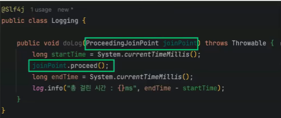
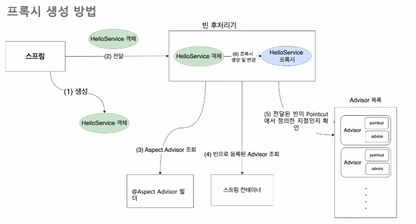
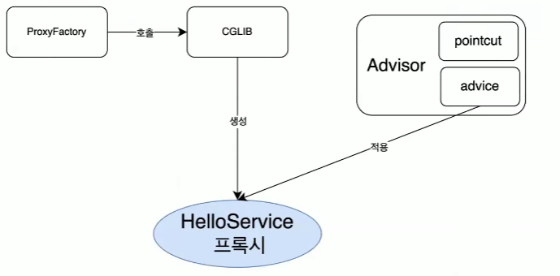

# 배키의 AOP와 Spring Aop
[https://youtu.be/hdO_V7EMU4s?si=Enx4uzuhi-0ScmLn](https://youtu.be/hdO_V7EMU4s?si=Enx4uzuhi-0ScmLn)

# 배키의 AOP와 Spring Aop
* toc
{:toc}

## AOP 개념
+ AOP는 Aspect Oriented Programming의 약자
+ 위키백과에 따르면 횡단 관심사의 분리를 허용해서 모듈성을 증가시키는 것이 목적인 프로그래밍 패러다임
+ 횡단 관심사란 여러 모듈이나 클래스에서 공통으로 필요하지만 모듈 자체의 핵심 기능과 직접적인 관련이 없는 관심사를 말한다 예를 들어서 로깅이나 트랜잭션 등이 있다

## AOP 등장 배경
+ AOP는 핵심 비즈니스 로직과 부가 기능을 분리해가지고 변경 지점이 하나가 되도록 모듈화하는 것이 핵심이다
+ AOP라는 개념에서 Aspect라는 용어를 사용하는데 Aspect는 Advice하고 Pointcut을 합친 것을 의미한다
+ Advice는 말 그대로 부가 기능을 의미한다
+ 즉, Aspect는 어떤 로직을 어디에다 지정할지를 얘기하는 것이다

## Spring AOP 적용
+ Spring AOP에서 Aspect 개념을 Advisor라고 이야기 한다 
+ 
  + ProceedingJoinPoint라는 매개변수에서 proceed를 호출하면 핵심 비즈니스 로직을 호출할 수 있게 된다 이런 식으로 Advice를 정의할 수 있다
+ 
  + Advice를 정의한 다음에는 어디에다 지정할지를 설정해야 되는데 그것을 Pointcut이라고 하고 Pointcut은 Around annotation을 사용해가지고 지정할 수 있다
  + Pointcut 하고 Advice를 다 정의를 했으니 Aspect라는 어노테이션을 설정해서 로깅이라는 클래스가 Advisor라고 설정 

## Spring AOP 원리 
+ Spring AOP가 이렇게 클래스를 분리했는데도 같이 부가 기능하고 핵심 비즈니스를 같이 실행할 수 있는 방법은 런타임시 위빙이다
+ 위빙이라는 의미는 옷감을 짜다, 직조하다라는 뜻이다 조금 더 자세히 살펴보면 위빙은 부가 기능과 핵심 기능을 연결하는 작업이라고 얘기할 수 있다
+ 부가 기능 그리고 핵심 비즈니스 로직을 연결하는 작업을 이야기하고 런타임은 당연히 스프링이 실행되는 시점이다 그래서 런타임 시 위빙은 스프링이 실행되는 시점에 우리가 정의한 Advice와 핵심 비즈니스 로직을 연결하는 작업이라 볼 수 있다
+ 
  1. 먼저 AOP를 적용하면 스프링이 HelloService 객체를 생성하고 그 다음에 바로 DI 컨테이너, 스프링 컨테이너에 넣는 게 아니라 빈 후처리기라는 곳에 이 빈을 전달
  2. 빈 후처리기는 Aspect Advisor를 조회하고 Advisor들을 싹 다 모두 다 가져온다 
  3. 조회를 한 다음에 Advisor 목록들을 가져와서 Advisor를 하나하나 체크한 다음에 HelloService가 프록시의 대상인지 아닌지를 확인 pointcut을 확인해서 체크
  4. pointcut을 advice에 가져와서 적용한 proxy가 생성
+ 
  + 빈 후처리기는 proxyFactory라는 것을 사용해서 proxy를 동적으로 생성하는데 결국에는 전달된 빈을 가지고 이 빈이 pointcut에 해당되는지 확인하고
    pointcut에 해당된다면 그 advice를 적용한 HelloService 프록시를 만들게 되는 것이다 
+ 
  + proxy를 생성한 다음에 스프링 컨테이너에 proxy를 저장
