# 트레의 스프링에서 STOMP로 채팅 구현하기
[https://youtu.be/hdO_V7EMU4s?si=Enx4uzuhi-0ScmLn](https://youtu.be/hdO_V7EMU4s?si=Enx4uzuhi-0ScmLn)

# 트레의 스프링에서 STOMP로 채팅 구현하기
* toc
{:toc}

## 들어가기 전 

### 일반적인 HTTP 요청
+ 
+ 일반적인 HTTP 요청은 클라이언트가 요청을 보내야만 서버에서 응답을 받을 수 있는 구조

### WebSocket
+ 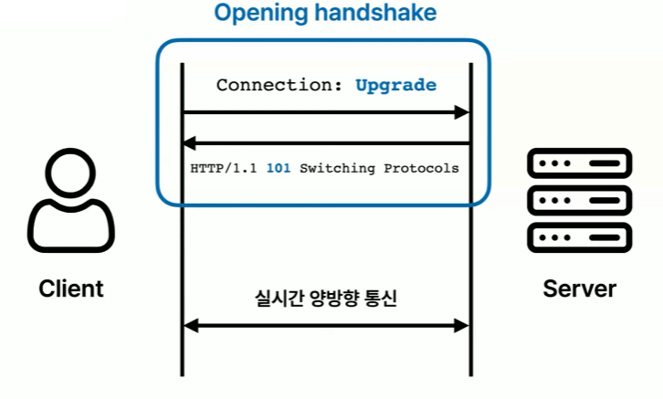
+ 웹소켓을 사용하면 사용자가 요청을 따로 보내지 않아도 데이터를 받을 수 있는데 Upgrade라는 헤더를 포함해서 요청을 보내고 101 응답을 받게 되면 연결이 지속되어 실시간으로 양방향 통신을 할 수 있는 상태가 된다
+ 웹소켓에서는 메시지라는 것을 서로 주고받으면서 통신을 한다 이 메시지는 HTTP랑 다르게 정해진 명세가 따로 없어 아무 문자열이나 주고받을 수 있다 하지만 STOMP라는 프로토콜을 사용하면 형식에 맞게 메시지를 주고받을 수 있다
+ 웹소켓에서는 publish, subscribe라는 용어가 자주 등장하는데 publish는 말 그대로 메시지를 전송하는 행위이고, subscribe는 메시지를 받기 위해서 구독하는 행위이다 

## WebSocket 구현
+ 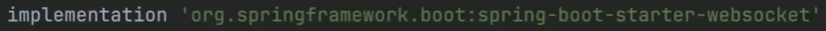
  + 의존성을 추가
+ 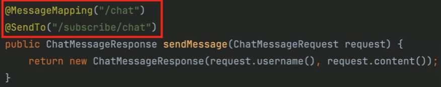
  + MessageMapping이랑 SendTo라는 어노테이션을 사용
  + chat이라는 주소로 발행된 메시지를 chat이라는 주소로 메시지를 전송하겠다는 요청이 들어오면 해당 메서드가 호출
  + 해당 메시지는 subscribe/chat을  구독하고 있는 모든 사용자에게 전달
+ 
  + Configuration 클래스를 작성
  + 메시지 브로커는 메시지 전송을 중개하는 역할을 한다 중간에 메시지 브로커를 두게 되면 관심사를 분리할 수 있다는 장점이 있는데
    먼저 메시지를 보내는 쪽에서는 publish만 잘 해주면 된다 수신자가 메시지를 잘 받았는지 수신자가 몇 명인지 등의 대한 정보는 알 필요가 없고
    마찬가지로 메시지를 받는 쪽에서도 메시지를 보내는 사람이 누군지 어떠한 주소로 메시지를 보내는지 등에 대해서는 관심이 없고 구독만 잘 하고 있으면 된다 
  + 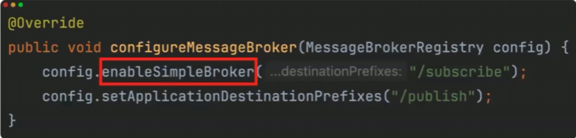
    + enableSimpleBroker라는 것은 스프링이 제공하는 인메모리 브로커를 사용하겠다는 설정이다 
    + 구독할 주소 prefix와 메시지를 publish하는 주소의 prefix를 지정
  + 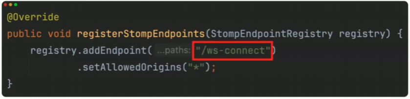
    + 초기 연결 과정을 설정하는 메서드를 작성
    + 오프닝 핸드쉐이크에서 사용하는 엔드포인트를 지정하는 설정이고 예제에서는 ws-connect라는 URI로 지정
      또 CORS를 허용하는 설정까지 해주면 구현은 끝이다

## 클라이언트 코드 

### 오프닝 핸드셰이크
+ 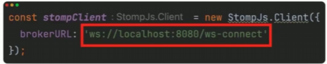
+ 클라이언트에서는 다음과 같은 주소로 초기 웹소켓 연결을 요청
+ ws라는 웹소켓 전용 프로토콜을 사용하고 있다 HTTPS를 사용하고 싶다면 ```WSS://``` 로 연결을 해주면 된다

### 메시지 발생
+ 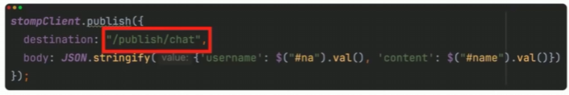
+ publish/chat이라는 주소로 메시지를 발행
+ MesssageMapping 어노테이션 안에는 prefix를 제외한 형태로 작성

### 구독 
+ 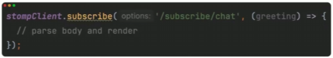
+ 클라이언트는 subscribe/chat이라는 주소를 구독
+ 클라이언트가 잘 구독을 해주고 있기 때문에 맨 처음에 작성한 컨트롤러 메서드가 호출될 때마다 클라이언트는 메시지를 잘 전달받을 수 있게 된다

## 채팅방 개념 도입
+ 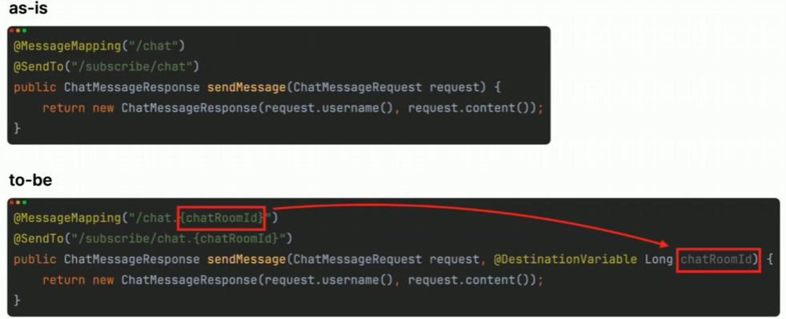
+ chatRoomId라는 식별자를 추가
+ chatRoomId를 메서드의 인자로 가져올 수도 있고  SendTo 어노테이션 안에 값을 다시 전달해 줄 수도 있다
+ 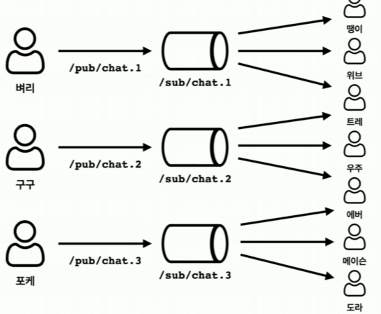
+ 3개의 채팅방이 존재하는 경우 구독 주소도 3개가 존재하게 되고 한 명이 여러 개의 채팅방에 구독하는 것 또한 가능 지금까지의 방식은 분산 환경에서 문제가 발생 한다

## 분산 환경에서의 문제점 
+ 인메모리 메시지 브로커를 사용하고 있는데 만약에 WAS가 한 대만 존재한다면 메시지는 아무런 문제 없이 잘 전달이 되겠지만
  scale-out을 한다고 가정을 해보면 같은 서버를 바라보고 있는 사용자에게만 메시지가 전달이 되게 된다
  그래서 이 경우에는 외부 메시징 서버를 따로 두고 그 안에 메시지 브로커를 두면 되는데 RabbitMQ나 Kafka 같은
  메시지 브로커를 설치하셔서 해결할 수 있다

## 웹소켓 예외처리
+ 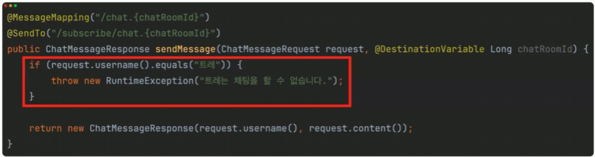
+ 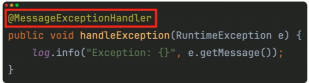
+ 일반적인 HTTP에서는 ExceptionHandler라는 어노테이션을 사용하는데 웹소켓에서는 MessageExceptionHandler라는 것을 사용해야 된다 
+ 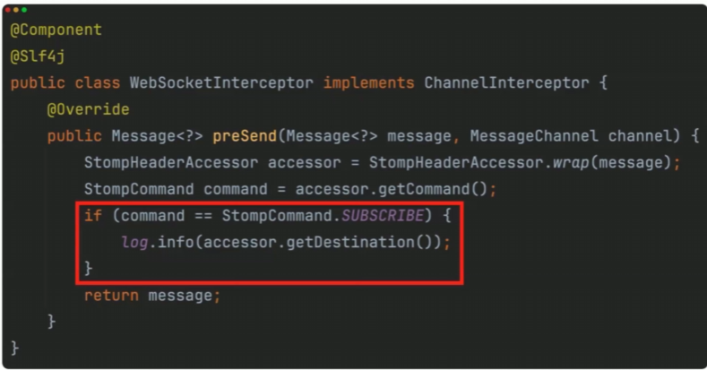
+ 구독 과정에서 예외 처리는 HTTP 요청을 가로챌 수 있는 인터셉터가 존재하는 것처럼 STOMP 메시지도 가로채서 특별한 로직을 추가해 줄 수 있다

