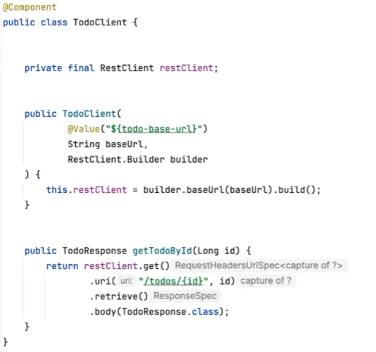
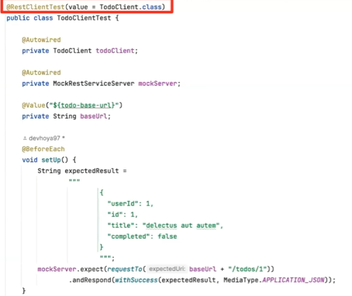

# 카고의 SpringBoot 외부 API 테스트
[https://youtu.be/xKX70lsdRss?si=Nny8FnUp0vFzBQS_](https://youtu.be/xKX70lsdRss?si=Nny8FnUp0vFzBQS_)

# 카고의 SpringBoot 외부 API 테스트
* toc
{:toc}

## E2E 테스트
+ E2E 테스트에서 외부 서버에게 실제로 요청을 보내지 않는 이유
  1. 우리 서버 로직이 잘 작동하는지에 대해 테스트하고 싶은데 로직에 문제가 없더라도 네트워크 또는 외부 서버 문제로 테스트가 실패할 수 있다
  2. 외부 서버에 실제로 요청을 보낸다는 것은 인터넷 네트워크를 탄다 그래서 테스트 코드의 속도가 다른 테스트 코드와 비교하면 느려질 것이다
  3. 외부 서버가 테스트 API를 제공한다면 다행이겠지만 그렇지 않다면 진짜 요청을 날리는 것은 좋은 선택이 아닐 것이다

## 외부 서버를 대체할 다른 어떤 페이크 서버를 만들면 되지 않을까? 
+ API 스펙에 맞게 요청과 응답을 처리할 수 있는 일종의 페이크 서버를 도커로 띄우면 테스트 코드가 통과할 수 있다 그리고
  세 가지 문제도 어느 정도 해결할 수도 있을 것다 근데 도커를 꼭 띄워야만 테스트 코드가 통과한다는 점이 좀 부담스럽다 

## 스프링 부트 테스트에서 제공하는 내장 톰켓을 활용해보는 건 어떨까? 
  + 스프링 부트에서는 이미 테스트용 내장 톰켓을 제공하고 있다 그래서 이를 활용하면 도커로 서버를 띄울 필요 없이 테스트를 할 수 있다
  + SpringBootTest에서 webEnvironment를 설정해주지 않으면 디폴트로는 내장 톰캣이 뜨지 않기 때문에 디파인 포트나 랜덤 포트로 지정해줘야 된다
  + 외부 API 호출 시 타임아웃 처리나 각종 예외 처리 그리고 검증해야 하는 요청 케이스가 세분화되어 있다면 이에 대해 E2E 테스트를 각각 작성해야 될까?
  + 외부 API 호출이 발생할 수 있는 여러 시나리오를 테스트하기 위해서 E2E 테스트에 케이스가 너무 많아진다면
    과연 바람직한 E2E 테스트가 맞는지 의문 든다 
  + OOO 클라이언트에 대한 단위 테스트에서 수행되어야 되는 거 아닐까? 
    + 이 단위 테스트만 잘 작성되어 있고 신뢰할 수 있다면 E2E 테스트에서는 OOO 클라이언트에 대한 단위 테스트를 믿고 OOO 클라이언트 자체를 MockBean으로 처리하고
      E2E 테스트에서 원하는 로직들을 더 자세하게 검증할 수 있다 
    + OOO 클라이언트에 대한 단위 테스트는 어떻게 수행할까? Spring Boot 테스트를 활용해서
      OOO 클라이언트에 대한 단위 테스트 코드를 따로 작성해서 단위 테스트를 진행 그런데 그러면 내장 톰켓을 실행해야 해서
      다른 내장 톰켓을 실행하지 않는 다른 단위 테스트와 비교했을 때 테스트 코드 실행 속도가 많이 느릴 것 같다 
    + 다시 저희가 원하는 것은 동적인 응답이 아니다 RestClient가 어떤 특정한 요청을 보냈을 때
      외부 API 응답 스펙을 보고 그 예시 중 하나로 어떤 정적인 응답만 내려주길 바란다 그러면 굳이 동적인 응답을 해줄 수 있는
      내장 톰켓을 사용하기보다는 정적으로 응답해줄 목서버가 있다면 좋을 것 같다 그러면 테스트 코드 속도도 올라간다 
    + Spring Boot에서 제공하는 RestClientTest라는 어노테이션을 사용하면 이러한 목서버를 쉽게 제공받을 수 있다

## RestClientTest
+ 
+ REST 클라이언트를 사용하고 있고 운영 환경에서 보내는 URL과 테스트 환경에서 보내는 URL을 yml 파일을 사용해서 분리
+ 생성자의 파라미터를 보면 RestClient를 직접 받지 않고 RestClient.Builder를 받고 있는데 이는 SpringBootTest의 컨테이너에
  RestClient라는 것은 사실 등록되어 있지 않고 RestClient.Builder가 빈으로 등록되어 있기 때문에 이렇게 생성자 파라미터를 만들어 놔야
  쉽게 주입받을 수 있기 때문이다 
+ 
+ RestClient RestTemplate에 대한 테스트에서 꼭 필요한 빈들만 등록된 컨테이너를 사용하기 때문에
  스프링 부트 테스트보다 애플리케이션 컨텍스트를 생성하는데 속도가 빠르다는 장점이 있다 그리고 value 에는 테스트에서 사용하고자 하는 클래스를 지정해 줌으로써 추가로 빈으로 등록할 수 있다
  앞에 value 쪽에서 빈으로 등록했기 때문에 여기서 주입받을 수 있다
+ MockRestServiceServer는 요청과 응답을 지정해 줄 수 있는 목 서버인데 RestClient가 보내는 요청이 MockRestServiceServer에 등록된 URL이면
  해당 요청은 네트워크를 타지 않고 목 서버가 가로채서 응답해 주는 방식으로 동작한다 
+ 외부 API 응답 스펙과 똑같이 예상 응답을 나가도록 작성해두고 특정 URL로 요청이 오면 예상 응답이 나가도록 설정

## 정리 
+ @RestClientTest에서 제공하는 MockRestServiceServer를 활용해서 OOO 클라이언트에 대해 단위 테스트를 만들자
  1. 내장 톰켓을 띄울 필요가 없고 경량화된 컨테이너를 사용함으로 단위 테스트 속도가 빠르다
  2. 외부 API 호출 시 테스트해야 하는 다양한 시나리오를 E2E 테스트에서 관리할 필요가 없어진다 
  3. E2E 테스트는 단위 테스트를 믿고 OOO 클라이언트를 목빈으로 사용함으로써 외부 API 호출이 아닌 내부 로직 테스트에 집중할 수 있다
