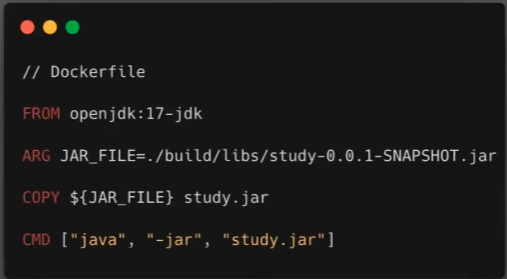
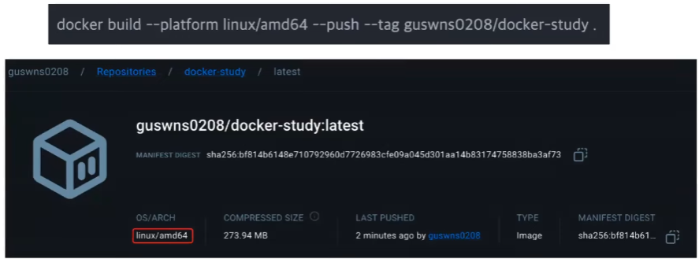
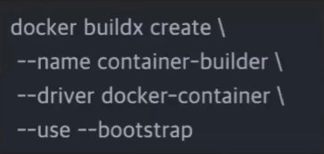
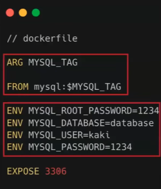
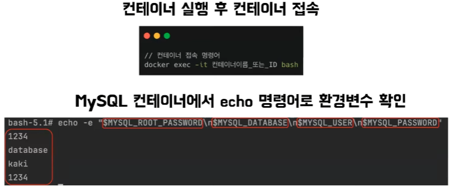
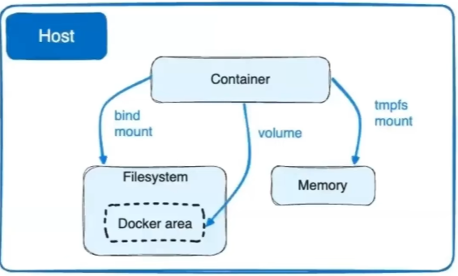
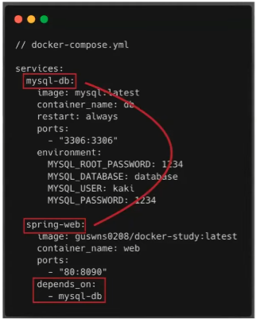
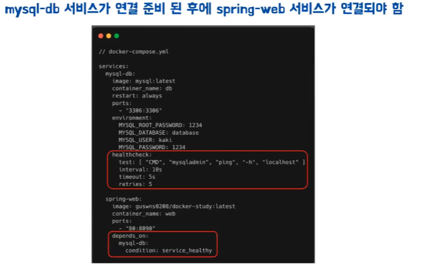

# 카키의 도커 맛있게 사용하기
[https://youtu.be/dLap7vclQvo?si=EbyIKgYY3YXo3uH9](https://youtu.be/dLap7vclQvo?si=EbyIKgYY3YXo3uH9)

# 카키의 도커 맛있게 사용하기
* toc
{:toc}

## 플랫폼 (platform)
+ 
+ Docker 이미지를 빌드하면 기본적으로 호스트 시스템 아키텍처에 맞는 플랫폼으로 빌드가 된다 
+ 맥북 노트북에서 이미지를 빌드하고 푸시하면 맥북 아키텍처에 맞는 ARM64 아키텍처로 이미지가 빌드 된다
+ AMD64 아키텍처를 가진 EC2가 ARM64 아키텍처를 가진 이미지를 풀을 받고 이 이미지로 컨테이너를 실행하면 EC2의 아키텍처와 이미지 아키텍처가 맞지 않아
  에러가 발생하게 된다
  + 
+ 플랫폼 옵션으로 아키텍처를 설정할 수 있다 다음과 같이 플랫폼 옵션 그리고 원하는 아키텍처를 지정해줘서 이미지를 빌드하면
  맥북 노트북에서도 AMD64 아키텍처를 가진 이미지를 빌드할 수 있다
  + 

### 멀티 플랫폼 빌드
+ 멀티 플랫폼 빌드란 게 있는데 멀티 플랫폼 빌드는 여러 플랫폼에서 실행할 수 있는 단일 이미지를 만들 수 있다 
+ 멀티 플랫폼 빌드를 하기 위해서는 buildx를 설치하고 빌드X를 생성해야 되고 생성한 buildx로 이미지를 빌드하면 되는데
  동일하게 플랫폼 옵션을 사용하고 자기가 만들고자 하는 아키텍처를 쉼표로 구분해서 입력해줘서 이미지를 빌드하면 된다
  그러면 하나의 단일 이미지에 두 개, 여러 개의 아키텍처가 있는 걸 볼 수 있다
  + 
  + 호스트 아키텍처에 맞춰 풀을 받는 것이 도커의 기본 동작이기 때문에 풀받을 때는 아키텍처를 지정하지 않아도 된다 
+ buildx 설치
  + docker 빌드 엔진이 BuildKit 엔진을 쉽게 사용할 수 있는 도구 
  + Docker 엔진이 19.03 이상이면 기본 설치됨
+ buildx 생성
  + 

## 환경변수 (ARG, ENV)
+ 
+ 환경 변수는 key-value 형식으로 되어 있다

### ARG
+ ARG는 이미지가 빌드 되는 시점에만 유효한 환경 변수이다 
+ 이미지 빌드시 build-arg 옵션으로 값을 주입할 수 있다

### ENV
+ 도커파일로 생성된 이미지로 실행시킨 컨테이너에 사용될 환경 변수이다 
+ 환경 변수가 입력한 대로 잘 설정됐을지 확인
  + 
+ -e 옵션을 사용해 환경 변수를 주입할 수 있다
  + 

### ARG와 ENV 차이
+ ARG
  + arg는 dockerfile로 이미지가 빌드되는 시점에만 유효해서 이미지 파일 내부에 환경 변수를 설정하는데 사용되는 옵션
+ ENV
  + env는 dockerfile로 생성된 이미지로 실행시킨 컨테이너에서 사용될 환경 변수를 설정하는 옵션이다
+ 즉 생명주기로 보면 ARG는 이미지 빌드 시에만 env는 컨테이너 실행 동안 유지가 된다

## 네트워크 (Network)
+ 네트워크는 컨테이너 간 통신을 관리하고 컨테이너와 외부 네트워크 간의 연결을 제어하는 시스템
+ 
+ 도커에서는 기본적으로 다음과 같이 bridge, host, none 네트워크 세 가지를 제공하고 있다

### bridge
+ 브릿지 네트워크는 컨테이너 시작 시 기본적으로 할당되는 네트워크
+ 브릿지 네트워크에 연결되어 있는 컨테이너들마다 IP 주소를 할당해줘서 포트맵핑으로 외부와 통신이 가능해 진다 
  + 이름 그대로 다리 역할
+ 브릿지 네트워크는 여러 서비스를 독립적으로 실행하면서도 서로 통신하거나 외부에서 접근이 필요할 때 유용하게 사용

### host
+ 이름 그대로 별도의 격리 없이 호스트 네트워크 환경을 그대로 사용한다 
+ 그렇기 때문에 컨테이너 내에서 사용한 IP 주소는 로컬의 IP와 동일하고 포트는 실행된 애플리케이션의 포트와 동일하다
+ 이 네트워크를 사용하기 위해서는 네트워크 옵션 그리고 사용한 네트워크 이름을 지정해 주면 된다 그럼 포트 부분이 이 애플리케이션
  실행된 애플리케이션 포트에 기생을 하기 때문에 포트 맵핑이 되지 않는다 
+ 호스트 네트워크를 사용해서 이 호스트에서 포트를 점유하고 있는 프로세스를 확인하면 호스트에서 포트를 점유하고 있는 프로세스가 있는 걸 확인할 수 있다
+ 호스트 네트워크는 NAT으로 인한 오버헤드가 없어서 빠른 통신이 가능하지만 호스트 네트워크이므로 보안에 주의가 필요하다
+ 호스트 네트워크를 사용할 때 주의할 점 하나 있는데 원래 호스트 네트워크는 Linux 호스트에서만 사용할 수 있었다
  그런데 이제 Docker Desktop 4.19 버전부터 Mac, Windows도 베타 버전으로 사용할 수 있다 근데 베타 버전이기 때문에 추가 설정이 필요하다
+ Mac, Windows에서도 호스트 네트워크를 사용하려면 도커 데스크탑의 세팅에 들어가서 Resources, Network, 그리고 Enable host networking 체크 박스를 활성화 해줘야 한다
  그렇지 않으면 호스트 네트워크로 실행한 도커 컨테이너가 호스트와 연결이 되지 않을 것이다 

### none
+ 이름 그대로 네트워크가 없다
+ 네트워크를 사용하지 않아 컨테이너가 완전히 격리된 환경에서 실행된다
+ none 네트워크는 네트워크가 전혀 필요 없거나 네트워크 격리가 필요할 경우 사용할 수 있다
+ 네트워크가 아닌 링크 옵션으로 각 컨테이너를 연결하는 코드들이 종종 보이는데 링크 옵션은 레거시 기능으로 제거될 수 있어
  네트워크를 사용한 컨테이너 연결을 권장한다고 도커 공식 문서에서 말해주고 있다

## 컨테이너 데이터 관리 (volume, bind)
+ 컨테이너는 기본적으로 휘발성을 갖는다 
+ 컨테이너는 이미지를 기반으로 실행되는 읽기 쓰기가 가능한 계층이고 실행 중에 생성된 데이터는 컨테이너 내부에만 존재한다
  그렇기 때문에 컨테이너가 종료되거나 삭제되면 그 안에 데이터는 없어진다 
+ 그럼 이 안에 데이터들을 어떻게 영구적으로 보존할 수 있을까? -> Mount

### Mount
+ 마운트는 휘발되는 컨테이너의 데이터를 영구적으로 보존하고 백업하는 방법
+ 도커에서는 세 가지 마운트 타입을 제공
+ 
+ bind mount, volume, TMPFS mount

#### volume
+ 볼륨 마운트는 도커 공식 문서에서 가장 추천하는 마운트 타입
+ 도커에 의해 생성되고 관리되기 때문에 도커의 CLI 등 도커의 기능을 적극적으로 활용 가능
+ 도커 볼륨에 저장된 데이터는 호스트 파일 시스템의 ```/var/lib/docker/volumes``` 경로에 들어가면 해당 디렉터리에 저장이 되어 있다
+ 볼륨 생성 같은 경우는 ```docker volume create``` 명령을 사용해서 생성 볼륨 이름을 지정해 주면 된다
+ 연결 같은 경우는 컨테이너를 실행하는 시점에 vops를 사용해서 데이터를 저장할 볼륨 이름과 저장할 데이터가 있는 컨테이너의 디렉토리 경로를
  연결해 주면 된다

### bind mount
+ bind-mount는 호스트 머신에 지정된 디렉토리의 컨테이너 데이터를 저장
+ 볼륨 연결이 -v 옵션을 사용한 건 동일하지만 데이터를 저장할 호스트의 디렉토리 경로를 지정해주고 그리고 저장할 데이터가 있는
  컨테이너의 디렉토리 경로를 지정해줘야 된다 
+ 

### volume vs bind
+ volume
  + volume 마운트는 Docker에 의해 생성되고 관리돼서 Docker의 CLI를 적극적으로 활용 가능하다
  + 저장되는 데이터들이 있는 ```/var/lib/docker/volumes``` 경로는 기본적으로 루트 권한으로 보호가 되어 있다 그래서 보안을 유지하면서도 컨테이너와 데이터가 공유가 된다
+ bind
  + 지정한 호스트 디렉토리에 데이터를 저장 그래서 특정 경로들의 위치를 다 파악해야 한다
  + 도커와 독립적으로 관리되기 때문에 도커의 CLI를 활용할 수 없다
  + 호스트 파일이나 디렉토리에 보안을 위해 루트 권한을 부여했다 하면은 도커 컨테이너는 해당 디렉토리에 접근을 할 수가 없다
  + 바인드 마운트도 쓸 때가 있다 
    + 로컬에서 설정 파일을 관리하고 로컬의 데이터를 컨테이너로 마운트할 때 
      + 즉 역으로 마운트할 때
    + 로그 같은 특정 파일을 호스트의 특정 위치에 저장하고 싶을 때 등과 같이 필요에 맞게 사용할 수 있다

## 라벨 (Labels)
+ Label은 이미지나 컨테이너에 메타데이터를 추가할 수 있는 옵션
+ 키-값 쌍으로 이루어진 메타데이터로 이 메타데이터를 활용해 이미지에 대한 정보를 체계적으로 관리할 수가 있다

### 요구 사항
+ spring 애플리케이션 빌드에 docker hub에 푸쉬 하려 하는데 이때 Label에 이미지가 생성된 시간, 트리거가 된 커밋의 해시코드도 보고 싶다
+ 
+ Dockerfile을 보면 arg 환경 변수를 활용해서 이미지가 빌드 될 때 라벨의 createdAt과 버전의 build date와
  git commit hashcode가 담기도록 해줬다 
+ Docker 배포 스크립트는 (GitHub Actions의)워크플로우의 명령을 활용해서 스크립트가 작동할 때 현재 날짜와 git commit hashcode를 추출하고 build arg 옵션을 사용해서
  build date와 git commit hashcode에 arg 환경 변수를 주입해줬다
+ 
  + 적용 후 모습인데 생성 시간과 설명, 버전 정보, 커밋 해시코드 추가 정보들을 확인할 수 있다
    이렇게 활용하게 된다면 특정 버전의 이미지를 쉽게 식별 추적 가능하게 된다
  + 문제가 발생했을 때도 특정 시점의 이미지로 쉽게 롤백 가능하다

## Docker Compose의 depends_on 사용 시 발생할 수 있는 문제 
+ 
  + Spring Web과 MySQL DB를 연결하고 있는데 Spring Web은 MySQL DB 서비스가 시작이 되고 나서 연결이 되어야 된다 그래서 depends-on으로 의존성을 관리해줬다
  + 근데 depends-on으로 의존하는 서비스가 시작된 후 시작하도록 했는데 Spring Web 서비스를 MySQL 서비스에 연결할 때 에러가 발생하게 된다
    + 
    + 요약하면 애플리케이션과 데이터베이스 서버 사이에 네트워크 통신이 제대로 이루어지지 않아서 발생한 문제
  + depends-on은 MySQL DB 서비스가 시작은 됐지만 완전히 연결이 준비가 된 후에 Spring Web이 시작되도록 보장해 주지는 않는다
    그렇기 때문에 Spring Web 서비스가 MySQL DB에 연결 요청을 보내지 못해 에러가 발생
+ condition이란 옵션으로 해결
  + 

### condition
+ service_started
  + 의존하는 서비스가 시작되기만 하면 다음 서비스가 시작
  + 서비스가 준비되지 않았다고 해도 시작될 수 있다
+ service_healthy
  + 의존하는 서비스가 정상적으로 작동 중일 때만 다음 서비스가 시작
  + 헬스 체크를 통과해야만 시작
+ service_completed_successfully
  + 의존하는 서비스가 정상적으로 종료되었는지를 확인
  + 해당 서비스가 성공적으로 실행된 후 종료된 경우에만 다음 서비스가 시작
