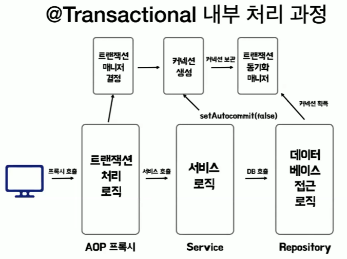
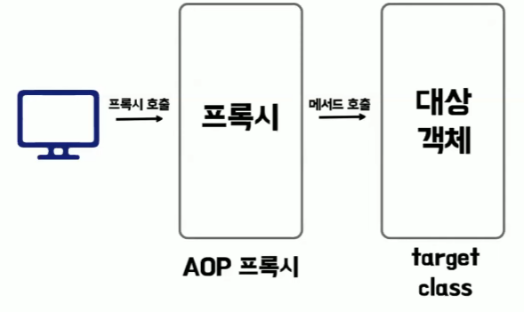

# 카피의 @Transactional
[https://youtu.be/XJo5O6GrFC0?si=H8Few6Z8mPNSHFtc](https://youtu.be/XJo5O6GrFC0?si=H8Few6Z8mPNSHFtc)

# 카피의 @Transactional
* toc
{:toc}

## @Transactional 이란
+ 클래스나 메서드에 붙혀서 선언적으로 트랜잭션을 관리하고 작업의 성공 여부에 따라 자동으로 커밋이나 롤백을 처리하는 annotation

### 프록시
+ 프록시는 실제 객체에 대한 대리 객체를 생성해서 호출을 가로챈 다음에 추가적인 작업을 실행하고
  실제 객체에 전달하는 기술
+ Transactional이 내부적으로 프록시를 사용한다

## @Transactional 내부 작동 원리
+ TransactionInterceptor.class
  + 먼저 TransactionInterceptor가 Transactional이 붙은 메서드의 호출을 감지하여 메서드 호출을 가로채 트랜잭션 준비
+ TransactionAspectSupport.class
  + 메서드와 클래스의 트랜잭션 속성에 따라서 어떤 트랜잭션 매니저를 사용할 것인지 선택
  + 보통 JPA를 사용하기 때문에 JPA 트랜잭션 매니저 사용
+ JpaTransactionManager.class
  + 데이터 소스 값을 가지고 커넥션을 새로 생성
+ AbstractPlatformTransactionManager.class
  + 트랜잭션 속성 정보를 바탕으로 트랜잭션 시작을 준비 
+ AbstractLogicalConnectionImplementor.class
  + 여러 Begin 메소드들을 타고 들어가다 보면 마주할 수 있는 것이 SetAutoCommit이 False로 설정되는 부분이다 
  + 이 부분은 JDBC 연결의 자동 커밋을 비활성화하는데 그래서 트랜잭션이 명시적으로 시작이 되는 것이다 
  + 트랜잭션을 명시적으로 시작하고 관리한 준비를 완료
+ JpaTransactionManager.class
  + 앞서 생성해놓은 커넥션을 트랜잭션 동기화 매니저라는 것에 등록
  + 그 이유는 트랜잭션 동안 여러 번의 데이터 작업이 있을 텐데 그 작업마다 동일한 커넥션을 사용해야 하나의 트랜잭션으로 관리가 되기 때문이다
  + 트랜잭션 동안 동일한 커넥션을 하나의 스레드에서 일관되게 사용하도록 보장
+ TransactionAspectSupport.class
  + 이 모든 작업이 완료된 후에 타겟 메소드가 호출
+ 
  1. 먼저 클라이언트가 프록시를 호출 그래서 프록시에서 트랜잭션 처리 로직을 수행
  2. 트랜잭션 매니저를 결정 그 안에 있는 데이터 소스 값을 바탕으로 커넥션을 생성
  3. setAutoCommit을 설정해서 트랜잭션을 시작
  4. 생성된 커넥션을 트랜잭션 동기화 매니저에 보관 그래서 데이터 베이스 접근 로직이 있을 때마다 동기화 매니저에서 커넥션을 획득해서 사용
  
## @Transactional 사용 시 주의할 점

### 프록시 내부 호출
+ 
+ 같은 클래스 내에서의 메서드 호출은 프록시를 거치지 않기 때문에 트랜잭션이 적용되지 않는다  
+ 이 문제를 해결하기 위한 가장 간단한 방법은 클래스를 분리하는 것이다 

### private 메서드에 적용 불가
+ 스프링은 내부적으로 CGLIB이라는 기술을 가지고 프록시를 생성 
+ CGLIB는 바이트 코드를 조작해서 프록시를 생성하는 라이브러리
+ CGLIB는 타겟의 클래스를 상속을 받아서 프록시를 생성하는데 private 접근 제어자는 상속받은 하이클래스에서 접근할 수 없기 때문에
  당연하게도 프록시가 생성되지 않는다 

## @Transactional 테스트
+ 롤백 테스트는 테스트 후에 트랜잭션을 자동으로 롤백해서 데이터 상태를 유지하고 또 테스트 간의 데이터 충돌을 막는 방식
+ Transactional을 붙은 테스트는 종료 후에 자동으로 트랜잭션이 종료돼서 롤백이 되는 것이다
+ 테스트 중에 발생한 데이터 변경 사항에 대해서 실제 데이터베이스에 적용되지 않기 때문에 DB를 클리어하거나 셋업했던 것을 초기화하는 작업 없이
  손쉽게 롤백 테스트를 할 수 있다

### 의도치 않은 트랜잭션 적용
+ 실제 서비스 코드에는 @Transactional이 없지만 테스트 코드에 사용한 @Transactional로 인하여 테스트가 성공한다
  따라서 실제 환경과 테스트 환경의 불일치로 인한 예상치 못한 상황이 발생할 가능성이 있다 
+ 실제 비즈니스 로직에서 트랜잭션 경계를 잘못 설정할 경우에 디버깅하기 어려울 수 있다

### 트랜잭션을 이용한 테스트의 장단점
+ 장점
  + 먼저 명시적으로 DB를 클리어하는 작업 없이 손쉽게 롤백 테스트가 가능하다
  + 만약 DB의 테이블이 많아질 경우에 DB 전체를 초기화하는 작업에 비해서 테스트 성능이 빠르다
+ 단점
  + 실제 서버 환경과 다르게 동작할 수 있고
  + 의도치 않은 트랜잭션이 테스트 코드에 적용되어 예상치 못한 문제 상황이 발생할 수 있다

