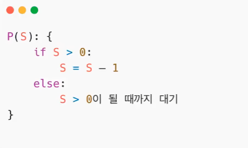
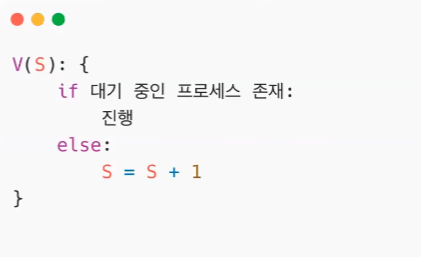
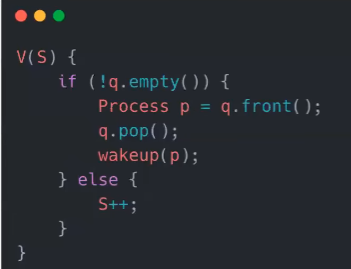
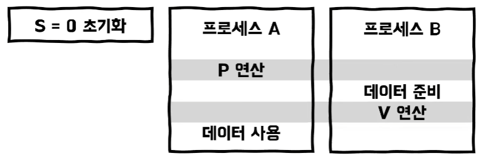

# 제리의 세마포어
[https://youtu.be/gbxOmKhzXmM?si=x8LoopUSdCtA3OSt](https://youtu.be/gbxOmKhzXmM?si=x8LoopUSdCtA3OSt)

# 제리의 세마포어
* toc
{:toc}

## 임계 영역, 상호배제
+ 공유 자원(Shared Resource)
  + 여러 프로세스가 공동으로 이용
+ 임계 영역 (Critical Section)
  + 공유 자원에 대해 접근하고 실행하는 프로그램 내 코드 부분
+ 상호배제 (Mutual Exclusion)
  + 임계 영역 내에는 한 번에 하나의 프로세스만 있어야 한다 
  + 임계 영역이 잘 수행되기 위해서는 상호 배제가 잘 지켜지는 것이 중요하다
+ 멀티 프로그래밍 환경에서 공유자원에 대한 접근을 제한하는 방법이 필요한데 이때 사용되는 방법이 바로 세마포어이다 

## 세마포어 알아보기
+ 세마포어(Semaphore)
  + 세마포어는 아주 간단히 말해서 변수 이다 이 변수는 사용 가능한 자원의 수를 의미하고 특수한 연산들만 접근할 수 있다
  + 특수한 연산은 P연산과 V연산 두 가지이고 경우에 따라서 세마포어의 값을 초기화하는 초기화 연산도 포함하기도 한다

### P연산, V연산 
+ P연산
  + 
  + P 연산은 S의 값이 0보다 크면 S의 값을 1 감소시키는 작업을 하고 그렇지 않으면 S의 값이 0보다 커질 때까지 기다린다
  + 자원의 수인 S를 감소시키니까 이 연산은 임계 영역에 들어가기 전에 수행되는 연산이다
+ V연산 
  + 
  + V연산은 대기 중인 프로세스가 존재하면 프로세스를 진행시키고 만약 그렇지 않으면 S의 값을 1 증가시키는 작업을 한다
  + 반대로 V연산은 임계 영역에서 나온 후에 수행되는 연산이다

### 세마포어의 동작 흐름

#### Busy-Wait 방법으로 구현
+ 
+ 코드 형태로 가져왔지만 두 연산은 실제로는 원자적으로 수행된다 즉 중단되지 않고 한 번에 실행되는 연산이다
+ P 연산에서 S의 값이 0보다 클 때까지 대기하는 과정을 위해서 S가 0보다 작거나 같다면 while문을 반복하고 있다
+ 이렇게 자원을 쓸 수 있는지만을 계속 확인하고 있는 상황을 보면 CPU가 쓸데없이 낭비되는 이런 스핀 락 형태는 별로 좋지 않은 것 같다
+ 
+ 바쁜 대기를 이용한 방법 대신에 조금 더 개선된 방법
+ 기다리는 작업을 대기 큐에 넣고 블록시킨다 
+ 
+ 자원을 다 사용한 작업이 있다면 V연산을 통해 큐에 있는 작업을 깨우고 자원을 사용할 수 있게 한다 
+ 세마포어에서는 이렇게 P연산과 V연산을 사용해서 프로세서들이 공유 자원에 접근하는 것을 제한하고 있다

### 세마포어 종류
+ 세마포어는 변수가 가질 수 있는 값의 범위에 따라서 0 또는 1의 값만을 가질 수 있다면 이진(Binary) 세마포어
+ 음이 아닌 모든 정수가 될 수 있다면 계수(Counting) 세마포어 분류하고 있다

## 뮤텍스와 세마포어는 무엇이 다를까?

### 뮤텍스(Mutex)
+ 뮤텍스는 한 번에 하나의 프로세스만 자원에 접근하도록 보장하는 데 사용한
+ 뮤텍스로 보호된 자원이 있다면 먼저 들어간 작업이 자원을 잠그고 자원을 사용한 다음 해제한다
+ 하나의 작업만 자원에 접근한다
+ Mutual Exclusion의 약자인 mutex를 이름으로 가진 것 답게 상호 배제를 제공한다 

### 뮤텍스와 세마포어의 차이
+ 세마포어는 지정된 한도까지 여러 프로세스가 접근하는 것을 허용한다
  + 만약 두 개의 자원이 있다면 자원의 한도는 2가 될 것이고 두 프로세스는 모두 자원을 사용할 수 있다 
  + 세마포어는 제한된 리소스에 여러 프로세스가 접근해야 할 때 유용하다
  + 만약 함께 이용하는 자원의 수가 한 개라면?
    + 세마포어의 종류 중에 이진 세마포어가 있다
  + 뮤텍스와 이진 세마포어는 동일한 것일까? 
  
### 뮤텍스와 이진 세마포어의 차이
+ 뮤텍스는 뮤텍스를 획득한 프로세스만 잠금을 해제할 수 있다
+ 세마포어에서의 획득과 반환은 독립적이다
  + 
  + 세마포어가 0으로 초기화되어 있고 프로세스 A는 데이터를 사용하고 프로세스 B는 데이터를 준비한다
  + 프로세스 A가 P 연산을 수행하면 S가 0이기 때문에 프로세스 A는 블록
  + 프로세스 B는 그동안 데이터를 준비하고 V 연산을 수행합니다 그럼 S의 값이 1로 바뀌게 된다
  + 프로세스 A가 P 연산을 수행하고 데이터를 사용
  + 이처럼 프로세스 간의 진행이 상호 의존적인 관계라서 동기화가 요구될 때 세마포어를 유용하게 사용할 수 있다

### 자바에서도 세마포어로 동기화를 하고 있을까?
+ 세마포어는 P와 V연산을 통해서 저 수준의 동기화를 제공하기 때문에 단순한 프로그래밍 실수에 취약하다
  + 연산을 깜빡해 버리거나
  + 동일한 연산을 두 번 사용해 버리거나
  + P연산과 V연산을 반대로 수행해 버리거나
+ 이럴 경우 자원을 올바르게 획득하고 해제하지 못할 수 있다 이런 작은 실수로 데드락이 발생할 수도 있기 때문에
  자바에서는 고수준의 동기화를 모니터를 사용해서 제공하고 있다
+ 따라서 자바의 모든 객체는 모니터를 가지고 있으며 자바의 코드를 작성하다가 wait()이나 notify(),
  notifyAll() 과 같은 메서드를 본적이 있을 것이다 
  + 모니터도 세마포어처럼 메서드가 제공하고 있는 것이다
  + wait() 같은 경우에는 스레드를 대기 상태로 전환하고 notify()나 notifyAll() 은 스레드 중 하나 혹은 대기 중인 모든 스레드를 깨운다

