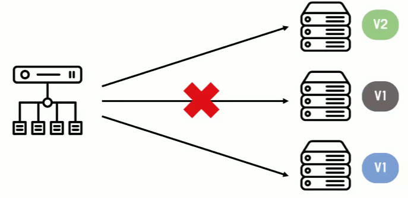
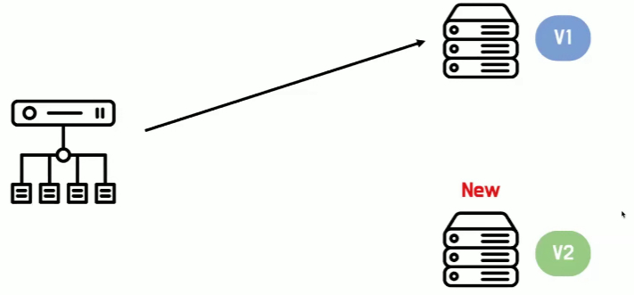
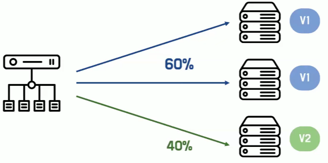
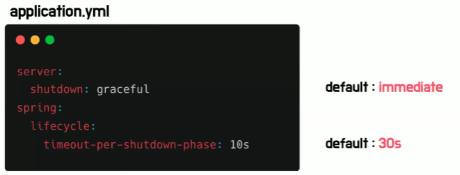

# 테니의 무중단 배포
[https://youtu.be/kgvBlruQEKU?si=ronBAwFARttN5gAi](https://youtu.be/kgvBlruQEKU?si=ronBAwFARttN5gAi)

# 테니의 무중단 배포
* toc
{:toc}

## 무중단 배포 개념
+ 새로운 버전의 소프트웨어를 배포하는 것
+ 사용자가 서비스를 사용하지 못하는 시간을 다운타임이라고 한다 다운타임은 기존의 어플리케이션을 종료하고 새로운 버전의 어플리케이션을
  배포하는 과정에서 발생하게 되는데 무중단 배포는 이런 다운타임 없이 사용자에게 서비스를 제공하기 위해 필요하다

## 무중단 배포 방식
+ 기본적으로 무중단 배포를 위해서는 어플리케이션 서버가 2대 이상 필요하다
+ 2대 이상의 서버가 하나는 기존의 서버를 배포하고 또 하나는 새로운 버전의 서버를 배포하면서 그 중간에 빈 텀이 없도록 하여 다운타임을 제거할 수 있다

### Rolling
+ 
+ 새 버전을 점진적으로 교체하는 방식
+ 첫 번째 서버로 보내는 요청을 중단하고 새로운 버전을 배포 그리고 요청을 중단했던 것을 다시 재개하고 요청을 처리
  이때 버전 1과 버전 2가 공존하는 시점이 있는데 그래서 이때 호환성 문제가 발생할 수 있으므로 주의해야 한다
+ 다음 서버 똑같이 요청을 중단하고 새롭게 배포하고 요청을 재개 이렇게 점진적으로 모든 서버의 버전을 교체하는 것을
  롤링 배포 방식이라고 한다

1. 새로운 자원을 필요로 하지 않기 때문에 가용 자원이 제한적일 경우 유용하게 사용할 수 있다
   + 배포 진행 서버는 요청을 받을 수 없기 때문에 각 서버가 부담하는 트래픽이 증가한다는 특징이 있다
2. 점진적으로 배포를 하는 것처럼 롤백이 필요한 경우에도 점진적으로 하기 때문에 큰 변화가 없거나 이미 충분히 테스트한 기능을 업데이트하는 경우 적절하게 사용할 수 있다
   + 점진적 배포 처럼 점진적 롤백

### Blue/Green
+ 신규 서버를 추가로 배포하는 방식
+ 
+ 기존에 있던 서버를 블루 환경 그리고 새로운 환경을 그린 환경이라고 부른다
+ 그린 환경에 새로운 버전의 어플리케이션을 배포를 하고 블루 환경으로 보내던 트래픽을 그린 환경으로 전환하기만 하면 완료된다

1. 간단하지만 그린 환경을 새로 배포를 해야 하는 만큼 시스템 자원이 충분한 경우에 사용할 수 있다
   + 트래픽을 전환하기 전에 올려놨던 그린 환경이 이제 곧 사용할 실제 환경이기 때문에 실제 서비스 환경에서
     신 버전을 테스트할 수 있다는 장점이 있다
1. 빠르고 안전한 롤백이 필요한 경우
   + 기존의 블루 환경을 내리지 않고 유지하고 있으므로 만약에 그린 환경에서 롤백을 해야 할 만한 문제가 발생했을 때 트래픽만 전환한다면
      빠르고 안전하게 롤백을 할 수 있다

### Canary
+ 새 버전의 점진적으로 트래픽을 전환하는 방식
+ 
+ 일부의 사용자들만 새로운 버전으로 트래픽을 전환 그리고 이 소수의 사용자들에게 피드백을 받아 이 서버가 안정적인지 판단 만약에 안정적이라는 평가를 받으면 점진적으로 그 트래픽을 증가
  모든 트래픽이 새로운 버전을 향해 있다면 나머지 서버들도 새 버전을 배포

1. 점진적으로 사용자를 늘리기 때문에 초반에 소수의 사용자들 문제가 생겨도 소수의 사용자들에게만 영향을 미치게 된다
   + 금융권처럼 안정성이 중요한 시스템인 경우 유용하게 사용할 수 있다
2. 새로운 기능 혹은 실험적 기능을 도입하는 경우
   + 문제 상황을 초기에 발견이 가능하기 때문에 기업의 이미지에 영향을 미칠 만한 새로운 기능이나 실험적 기능을 도입하는 경우에 사용하기 좋다

## 안정적으로 서비스 종료하기 
+ Hard Shutdown은 요청을 처리하고 있더라도 요청을 처리하고 있는 와중에 어플리케이션을 종료하겠다고 하면 그 즉시 종료
  + 요청은 제대로 응답을 반환하지 못한다
+ Graceful shutdown은 Hard Shutdown의 반대말인데 직역하면 우아한 종료 정도로 해석할 수 있다
  + 이 방식은 요청을 처리 중이라면 어플리케이션을 종료하라는 방식으로 명령이 떨어져도 그 즉시 종료하는 것이 아니라 처리하던 요청을 끝까지 처리한 후 종료하게 된다

### Graceful Shutdown
+ Spring Boot 2.3
  + 기존 요청은 완료할 수 있지만 새로운 요청은 허용되지 않는 유예 기간을 제공하는 타임아웃을 사용
+ 
+ application.yml 파일에서 server shutdown을 graceful로 설정하면 완료
+ default 값은 immediate로 즉시 바로 받는다는 의미인데 이는 Hard Shutdown이다
+ 요청을 받았을 때 무한으로 대기한다고 해서 해결되는 문제는 아니다 그래서 어느 정도 유예기간을 두고
  그 기간 내에 요청이 처리된다면 응답을 반환하지만 그 이상으로 대기가 길어진다면 스프링도 바로 종료를 한다
  그 시간을 설정하는 부분이 spring, lifecycle, timeout-per-shutdown-phase 이다

### Graceful Shutdown 고려할 점
+ Kill -9 PID
  + 이 명령어는 프로세스를 강제 종료하기 때문에 Graceful Shutdown 설정도 무시해버리고 즉시 종료
+ timeout
  + 너무 길게 설정하면 불필요한 대기시간이 발생할 수 있으며 너무 짧게 설정해도 요청이 처리되기 전에 종료되므로
    Graceful shutdown의 의미를 잘 가질 수 없다
