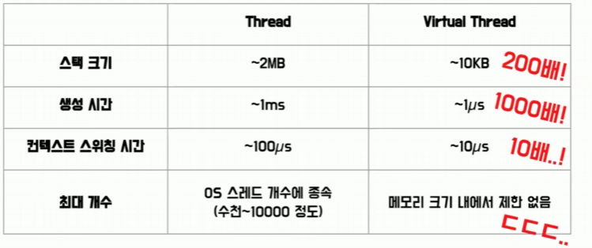
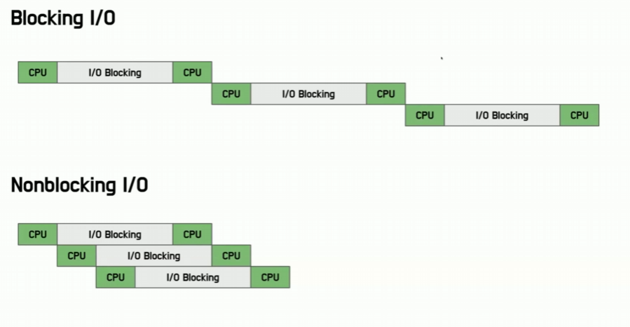
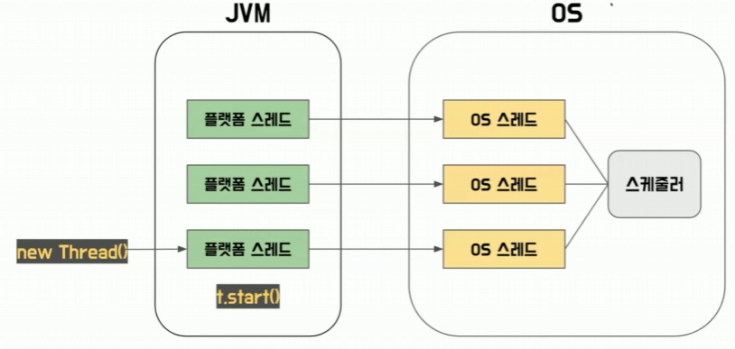
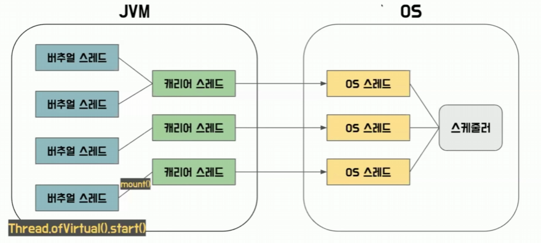
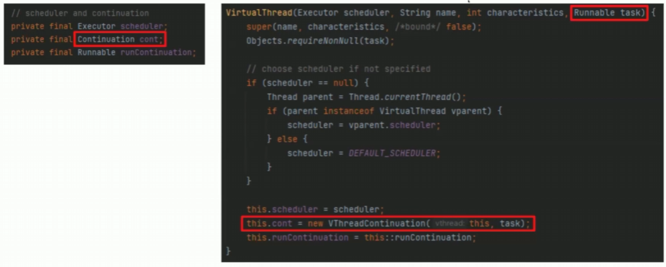
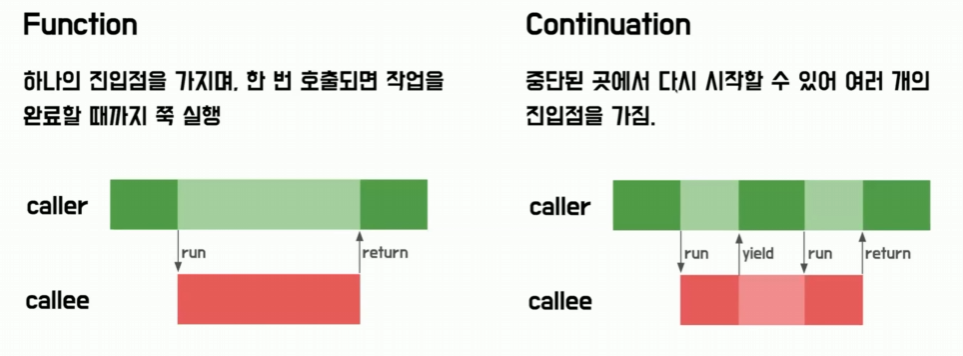
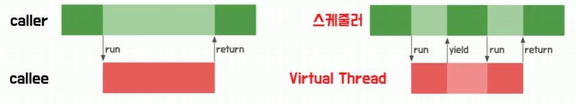
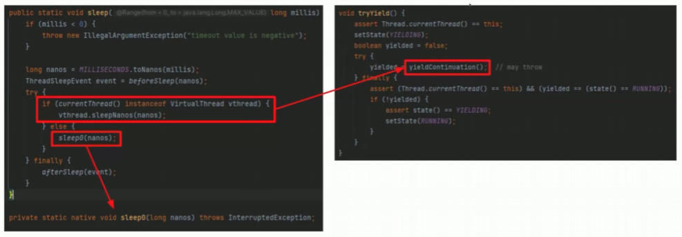
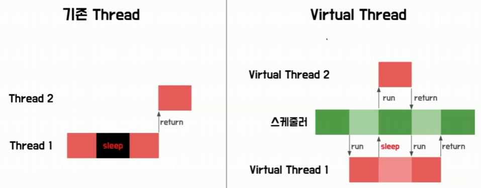

# 알파카의 자바 Virtual Thread 
[https://youtu.be/AlDBl7JuNkM?si=PHjZNmAsgSy-QULd](https://youtu.be/AlDBl7JuNkM?si=PHjZNmAsgSy-QULd)

# 알파카의 자바 Virtual Thread
* toc
{:toc}

## Virtual Thread란?
+ 자바 진영의 경량 스레드 모델 
+ 경량 스레드는 말 그대로 가벼운 스레드를 뜻한다
+ 기존 스레드의 단점을 보완해서 대규모의 스레드를 사용할 수 있도록 하는 것이 경량 스레드의 특징
+ 경량 스레드: 스레드의 실행 단위를 더 작게 나눠서 여러 비용을 낮춘 개념

## Virtual Thread의 특징
+ 메모리 사용량이 적다
+ 생성과 스케줄링 비용이 싸면서 많이 생성할 수가 있다
+ 최대 개수가 많다
+ 스레드 생성 비용이 싸다
+ 컨텍스트 스위치 및 스케줄링 비용이 싸다
+ Non-blocking IO를 지원
+ 결국에는 처리량이 높아진다는 것이 핵심
+ 많은 Thread를 동시에 처리할 수 있다
+ 보통 백엔드 서버에서 자주 사용하는 Spring MVC 같은 경우에는 한 요청을 한 Thread가 처리하는 Thread per Request 모델이다  
  많은 스레드를 동시에 처리할 수 있다는 말은 엄청 많은 요청을 동시에 처리할 수 있다는 말과 같다

### 비용 비교
+ 
+ 최대값 기준으로 스택 크기는 200배
+ 생성시간은 1000배
+ 컨텍스트 스위칭은 10배
+ 스레드 최대 개수도 기존 스레드랑 달리 메모리 크기 내에서 제한 없이 만들 수 있다

### Non-blocking IO
+ IO 작업으로 인한 Blocking 대기 시간 동안 다린 작업을 처리하는 것
+ 
+ IO가 포함된 작업의 경우 일반적으로 CPU 작업 시간보다 IO-blocking으로 인한 대기 시간이 훨씬 많은 비중을 차지하고 있다
+ Blocking IO 같은 경우는 작업을 순차적으로 처리
+ Non-blocking IO 같은 경우에는 Blocking 대기시간 동안 다른 작업을 처리를 할 수가 있다 그래서 빠른 시간 안에 작업들을 처리를 할 수가 있게 되고
  높은 처리량을 기대할 수 있게 된다 

## Virtual Thread의 동작 원리
+ 캐리어 스레드와 버추얼 스레드
+ Continuation
+ JVM에 의해 스케줄링
+ 기존 자바 스레드를 상속 

### 기존 Thread 모델
+ 
+ 자바에서 플랫폼 Thread는 OS Thread를 랩핑한 객체이다 
+ 즉 플랫폼 Thread와 OS Thread는 1대1 관계를 갖고 있고 OS의 스케줄러에 의해서 스케줄링된다
+ ```new Thread()``` 를 통해서 Thread를 생성하면 플랫폼 Thread 객체가 생성되고 그리고 Start를 호출하면
  Java Native Interface를 통해서 System Call을 호출해 OS Thread를 직접 사용하게 된다 

### 캐리어 스레드와 버추얼 스레드
+ 
+ Carrier Thread와 Virtual Thread라는 두 가지 개념이 등장한다
+ OS Thread에 맵핑되는 객체는 Carrier Thread가 되고 사용하게 되는 Virtual Thread는
  이 Carrier Thread에 필요할 때 맵핑돼서 OS Thread를 사용하게 된다
+ Virtual Thread를 생성하고 실행하면은 JVM의 스케줄러가 Carrier Thread에 마운트해서 OS Thread를 사용하게 되고
  또 나중에 필요에 따라서 Unmount하는 식으로 JVM이 이를 스케줄링한다 즉 생성과 스위칭이 시스템 콜 호출 없이 JVM 위에서만 이루어진다
+ OS Thread랑 1대 1로 맵핑되는 것이 아니기 때문에 실행에 필요한 데이터만 갖고 있으면 돼서 메모리 사용량이 훨씬 적다
  그리고 OS Thread 개수에 종속되지 않기 때문에 많이 생성을 할 수가 있다 
+ 시스템 콜 없이 JVM 위에서만 생성과 스케줄링이 이루어지기 때문에 더 비용싸다 

### Continuation: Virtual Thread의 실행 단위
+ 
+ 기존 Thread의 실행 단위는 Runnable이라는 건데 Virtual Thread에서는 Continuation이 실행 단위이다
+ 실제로 클래스의 필드를 확인해 보면 Continuation이라는 게 있고 생성자의 인자로 받은 Runnable을 통해서 Continuation을 생성하는 모습을 볼 수 있다

#### Continuation 
+ Continuation는 중단이 가능하고 중단 지점부터 재개가 가능한 실행 흐름이다
+ 
+ 기존의 함수는 한번 호출을 하면 작업을 끝날 때까지 쭉 실행이 되고 끝나고 나서 다시 호출자로 실행 흐름이 돌아온다
+ Continuation 같은 경우에는 한번 호출을 해도 중간에 잠깐 멈췄다가 다시 그 멈춤 부분부터 실행을 할 수 있게 된다 
+ 
+ 그래서 JVM의 스케줄러는 Continuation의 특징을 활용해서 여러 개의 Virtual Thread를 중단하거나 다시 실행하는 식으로 스케줄링을 진행할 수 있게 된다

### JVM에 의해 스케줄링
+ 
+ 실제로 블록이 되는 메서드인 sleep 메서드를 살펴보면 중간에 Virtual Thread인지 확인하는 분기 처리가 있고 만약에 분기 처리를 해서
  Virtual Thread가 아닐 경우 java native 함수인 sleep0라는 함수를 호출해서 이 스레드는 블록이 된다
+ Virtual Thread 같은 경우에 호출하는 메서드를 따라가 보면 블록을 시키지 않고 yieldContinuation이라는 메서드가 나온다 지금 현재 실행 중인
  continuation을 잠깐 중지하고 다른 버추얼 스레드를 갖고 와서 Carrier 스레드를 계속 사용할 수 있도록 스케줄링 할 수 있다
+ 
+ sleep을 호출했을 때 기존 스레드 같은 경우에는 블락이 됐다가 완전히 끝나면 다음 스레드가 이 실행 흐름을 갖고 가게 되는데
  Virtual Thread 같은 경우에는 sleep을 호출해도 실제로 블락되지 않고 다른 Virtual Thread를 갖고 와서 실행하는 식으로 Non-blocking IO를 지원하고 있다

### 기존 자바 스레드를 상속
+ 기존 스레드를 사용하던 서비스에서 이런 장점을 바로 누릴 수 있다 
+ 기존에도 스프링 Webflux 같은 리액티브 프로그래밍 모듈을 사용하면 Non-blocking IO를 사용할 수가 있었는데 러닝 커브 + 구조 변경
  이런 단점으로 인해서 실제로 바로 적용하기에는 좀 어려움이 있다 하지만 Virtual Thread를 적용을 하면
  이런 추가적인 큰 비용 없이 바로 Non-blocking IO의 장점을 활용할 수가 있다는 것도 장점이 된다 

### 결론
+ Virtual Thread는 기존 구조를 유지하면서 처리량을 엄청 높일 수가 있다

## 사용 시 유의사항
+ pinning
  + 실제 OS 스레드에 맵핑되는 Carrier 스레드가 블락당하는 현상 
  + synchronized 키워드를 만나게 되면 캐리어 스레드 자체가 블락당하기 때문에 non-blocking IO를 활용할 수가 없게 된다 
+ CPU bound 작업
  + Non-blocking IO의 장점을 활용할 수가 없기 때문에 그 Virtual Thread를 처리하기 위한 추가 작업이 오히려 오버헤드가 될 수 있다
+ 과조한 트래픽 전파
  + Virtual Thread를 사용하는 어플리케이션 같은 경우에는 높은 처리량을 갖고 있지만 DBMS와 같은 외부 서비스에서는
    이를 전부 다 처리하기 힘들 수 있다 타임아웃이 발생하는 그런 문제가 생길 수도 있다


