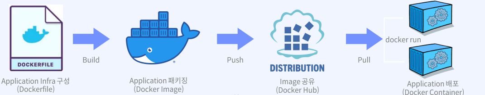
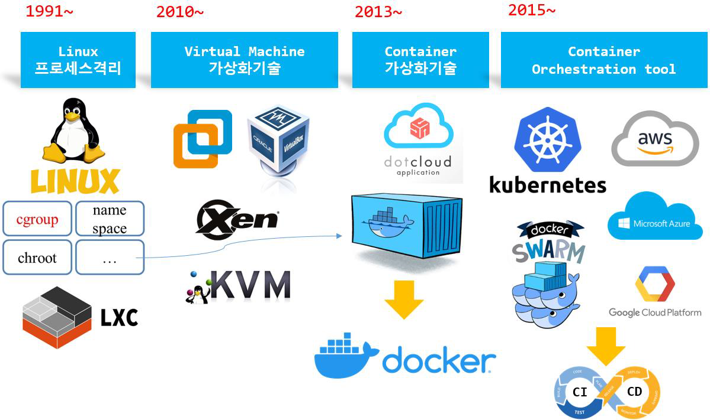
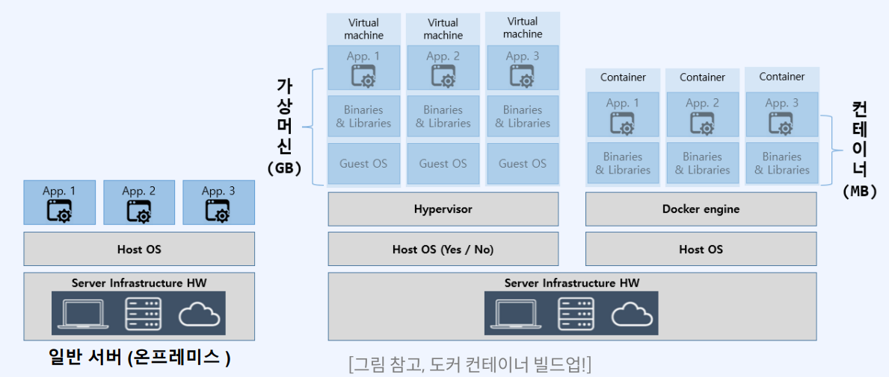
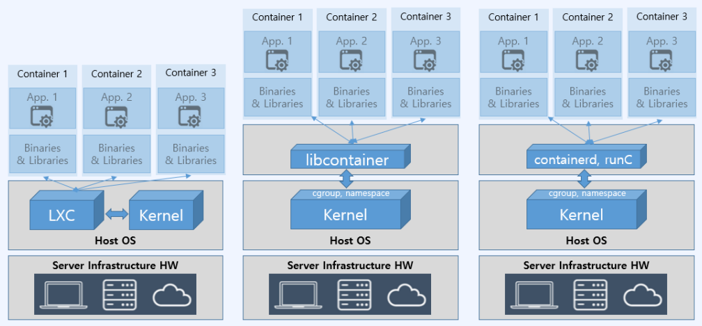
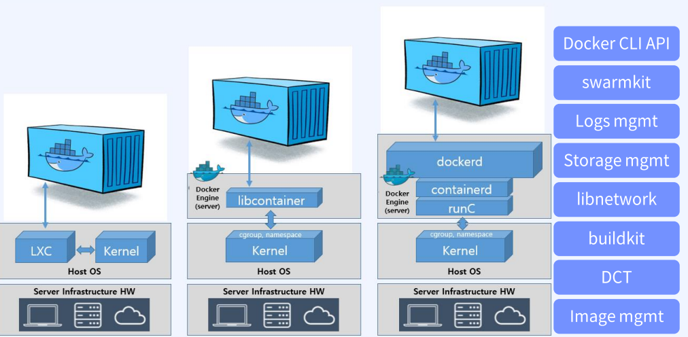
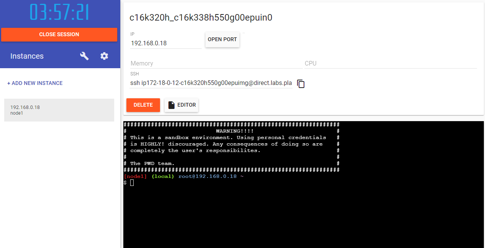
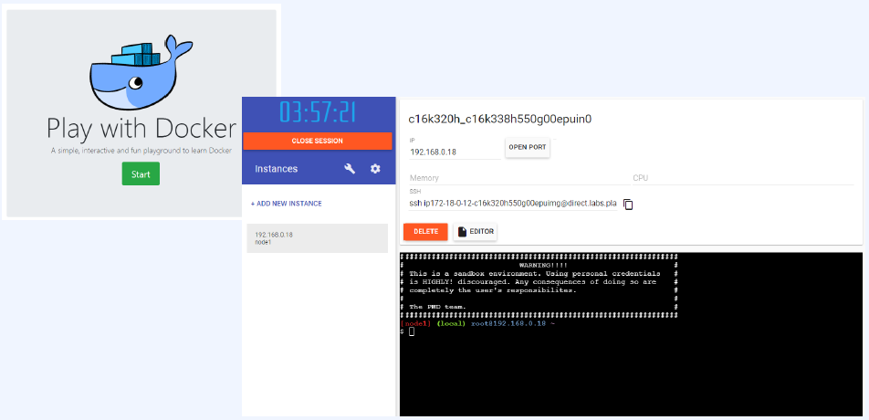
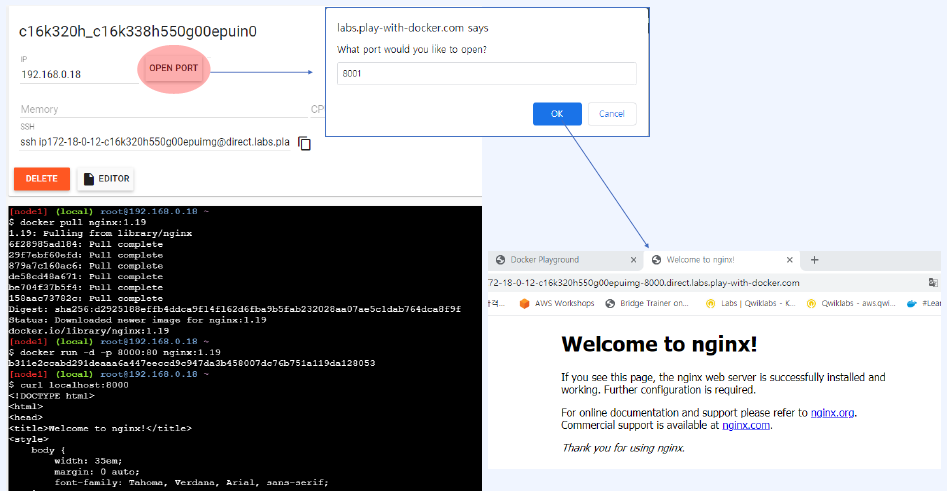
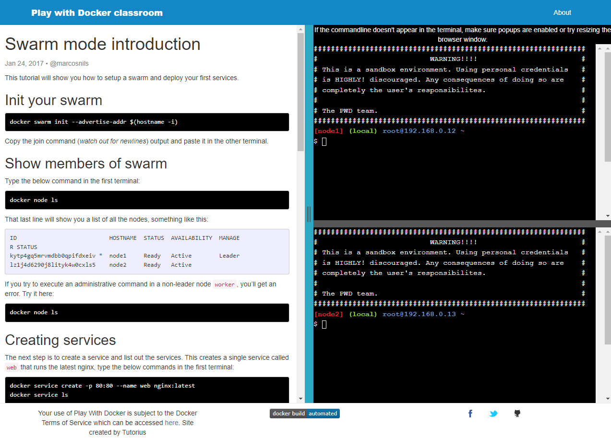

# 컨테이너 가상화 이해

# 컨테이너 가상화 이해
* toc
{:toc}

## 컨테이너 기술 이란?

### 컨테이너 기술은 무엇인가?
+ 컨테이너는 애플리케이션을 언제든 실행 가능하도록 필요한 모든 요소를 (소스코드, 구성요소, 종속성) 하나의 런타임 환경으로 패키징한 논리적 공간을 말한다
  + 이런한 패키징 기술을 docker에서는 Dockerfile build를 통해 구현 
+ 한마디로, 애플리케이션과 종속 항목을 하나로 묶어, 실행하게 해주는 운영 시스템을 가상화한 경량의 격리된 프로세스라고 볼 수 있다 
  + microVM 이라고도 한다
  + 운영체제 수준의 가상화 제공
  + 독립성을 갖기 때문에 다른 컨테이너에 영향을 주지 않는 stateless 환경 제공
+ 이 기술은 개인 데스크탑 뿐만 아니라 기업 내의 오프레미스 서버에서 AWS와 같은 퍼블릭 클라우드까지 언제 어디서든 빠르고 효율적으로 배포 가능하며, 확정성 또한 가지고 있다.
+ 이를 통해 서버구성, OS 설치, 네트워크, 개발 도구 구성 등의 반복적이고 불편한 작업에 시간을 낭비하지 않고 개발자는 애플리케이션 개발 그 자체에 집중할 수 있게 된다 

### 컨테이너 특징은 무엇인가?
+ 컨테이너는 우리가 개발한 최소한의 Image를 통해 실행되므로 경량이다
  + 컨테이너 이미지 생성의 Best practice 중 하나는 이미지 경량화 다 
+ 일반 서버 환경에서의 애플리케이션 실행과 달리 언제든 프로세스 수준의 속도로 빠르게 실행(run) 할 수 있고, 한번에 여러 개의 컨테이너를 동시에 실행 가능하다
  + Docker에서는 docker compose 기술을 통해 구현한다 
+ 개인 환경이던 클라우드 환경이던 어떤 OS, 어떤 환경에서도 동작 가능한 이식성을 보유하고 있다
+ 컨테이너 자체 애플리케이션 환경에 대한 관리만 요구되므로, 지속적 서버관리 비용을 절감할 수 있다. 
+ 개발팀과 운영팀의 업무 분리로 각자의 업무와 세분화된 관리에 집중할 수 있다. 즉. 컨테이너는 DevOps workflow 구성에 최적이다 

### 컨테이너 사례
+ 컨테이너의 특징을 활용할 수 있는 대규모 애플리케이션 서비스부터 앱 서비스까지 여러 기업의 다양한 애플리케이션 환경에서 사용 중이다 
  + 구글 웹, 앱 서비스
  + 에어비엔비 추천 서비스
  + 넷플릭스 추천 서비스
  + 당근마켓 딥러닝 기반 추천 서비스
  + 엔씨소프트 게임 서비스
  + 삼성전자 헬스 케어 서비스
  + 타다 배차 서비스
  + 토스 금융 서비스

## 컨테이는 어떤 타입으로 생성되나
+ 컨테이너 패키징 메커니즘: 시스템 / 애플리케이션 / 라우터 컨테이너
+ 시스템(or OS) 컨테이너
  + 호스트OS 위의 Ubuntu와 같은 배포판 리눅스 Image를 통해 배포되는 컨테이너다
  + 또다른 VM의 형태이고 내부에 다양한 애플리케이션 및 라이브러리 도구를 설치, 실행 가능하다
  + 대표적으로 LXC, LXD, OpenVZ, Linux VServer, BSD Jails 등이 있다 
+ 애플리케이션 컨터이너
  + 단일 애플리케이션 실행을 위해 해당 서비스를 패키징하고 실행하도록 설계된 컨테이너다
  + 3-tier 애플리케이션과 같은 경우 각 tier (frontend-backend-DB)를 개별 컨테이너로 실행하여 연결
  + 대표적으로 Doker container runtime, Rocket 등이 있다. 

### Docker는 무엇인가?
+ 여러 계층 Application을 container로 분리, 연결하여 실행하는 MSA (MicroService Architecture) 프로젝트에 유용하다 
+ Application의 Infra(runtime)는 Image를 통해 제공하고 Public or Private 하게 공유 가능
+ Github과 유사한 방식(open share)으로 Docker Hub 에서 제공 한다 [https://hub.docker.com](https://hub.docker.com)
+ 이렇게 제공된 Image를 기반으로 Application 서비스를 제공, 이를 컨테이너화 (Containerization)할 수 있다.
+ 

## docker 컨테이너 가상화와 VM 가상화 비교  docker

### 컨테이너 trend history
+ 

### 가상화 란

#### 가상화(virtualization)?
+ 일반적으로 서버, 스토리지, 네트워크, 애플리케이션 등을 가상화하여 하드웨어 리소스를 효율적으로 사용하는데 그 목적이 있고 이를 통해 기업은 효율적인 자원 활용, 자동화된 IT 관리, 빠른 재해 복구 등의 장점을 갖을 수 있다 
+ 물리적 하드웨어 유지 관리 대신 소프트웨어적으로 추상화된 가상화를 통해 제한된 부분을 쉽게 관리하고 유지할 수 있다 
+ 하이퍼바이저 기반의 가상머신(VM, Virtual Machine)을 통해 수행한다 
  + Vmware, VitualBox 등 

#### 컨테이너 가상화 vs VM 가상화
+ 두가지 가상화 모두 실행하고자 하는 애플리케이션 프로세스 및 종속 요소와 소스 등을 패키지 즉 이미지화 하여 HostOS와 격리된 환경을 제공한다.
+ 다만, VM 가상화는 실제 호스트 운영체제와 같이 별도의 GustOS를 두고 원한는 애플리케이션을 설치하는 하드웨어 수준의 가상화를 구현
+ 컨테이너 가상화는 VM 가상화에 비해 경량이면서 호스트 운영체제의 커널을 공유하는 운영체제(OS) 수준의 가상화를 구현한다 
+ 따라서 컨테이너 가상화는 원하는 애플리케이션 환경을 빠리게 번들링하여 패키징한다

### 서버 vs 가상머신 vs 컨테이너 

#### 애플리케이션 배포 방식 비교 
+ 

### 컨테이너화

#### 컨테이너화 (containerization) 기술
+ 리눅스 컨테이너 기술은 LXC(LinuX Container)를 이용한 시스템 컨테이너화로 시작 
  + OS 수준의 가상화 도구 
  + cgroup, namespase 등의 커널 기술을 공유하여 컨테이너 제공 
+ 이후 애플리케이션 컨테이너 기반의 Docker 출시가 되었고, 초기 Docker 법전은 LXC를 활용해 컨테이너를 생성
+ 지속된 컨테이너 엔진의 발전으로 Docker는 containerd, runC를 이용하는 방식으로 변경
  + 커널 기술의 공유를 통해 컨테이너 생성을 지원하는 runC
  + 생성된 컨테이너의 라이프사이클 관리를 지원하는 containerd
  + 사용자 환경에서의 명령을 전달하는 dockerd
+ 

#### dockerd 기능
+ 

## PWD(Play with Docker)

### PWD 사용해 보기 
+ Doker 컨테이너 놀이터 (Play with Docker)
+ Docker는 웹에서 제공하는 인스턴스 형태의 Docker 랩실을 제공
+ 한 인스턴스 당 4시간의 시간을 제공하며, 언제든 무료로 사용 가능
+ 외부에서 접근 가능한 웹 주소 제공
+ [https://www.docker.com/play-with-docker/](https://www.docker.com/play-with-docker/)
+ Lab Environment 선택 (hub.docker,com 계정 요구)
+ 
+ 
+ 
+ 
