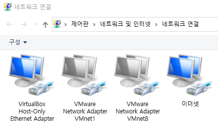
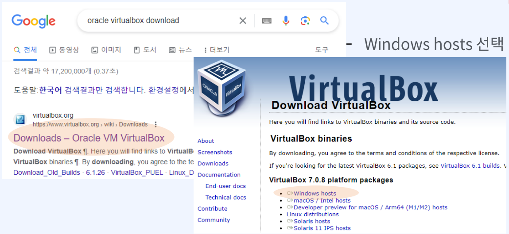

# docker 플랫폼 환경 구성

# docker 플랫폼 환경 구성
* toc
{:toc}

## Oracle VirtualBox 설치

### Docker Platform 구성을 위한 VM 설치

#### 기본 Requirements
+ 가상화 프로그램 사용시 설치되는 운영체제의 가상화 기능 활성화 요구
  + 부팅시 CMOS 설정에서 CPU 기능중 VT-x / AMD-V / VMX 등 (메인보드에 따라 다르다)
+ 설치 시 신규 가상 네트워크 인터페이스 설정이 추가 되므로 설치
  + 새로 설치되는 가상 NIC는 윈도우에서의 접속 IP or VM에 설치되는 OS의 gateway 역활 수행
  + 설치 후 확인 필요 (Virtual Host-Only Ethernet Adapter)
  + 
  + 가상머신(VM) 설치 후 되도록 완벽한 OS 적용을 위해 rebooting 권고 

#### VirtualBox download
+ 
+ 기본 설정된 값으로 Next 설치
