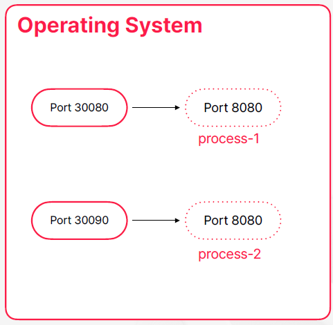
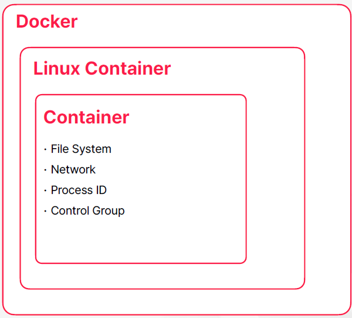
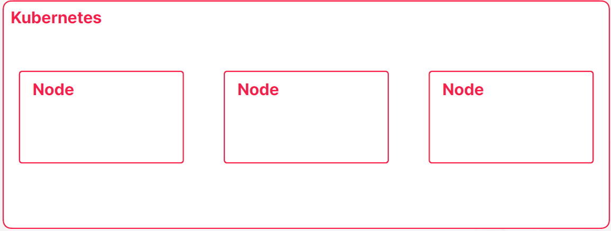
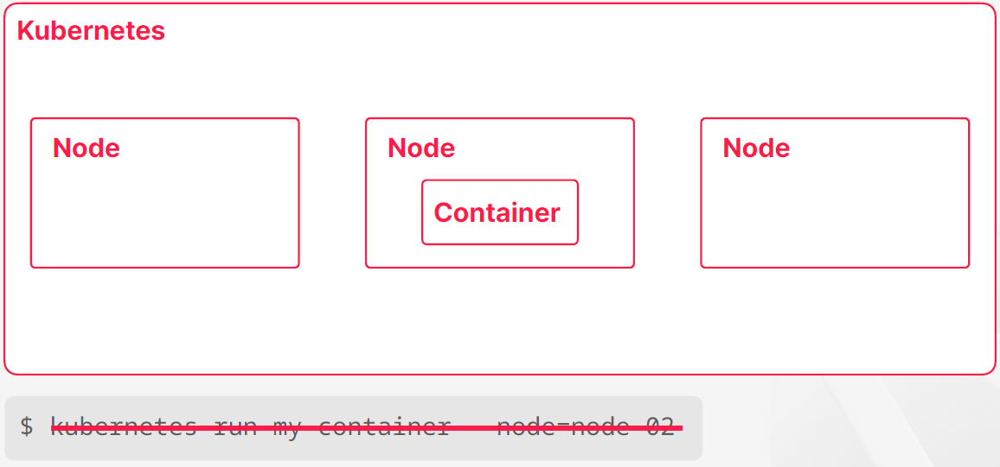
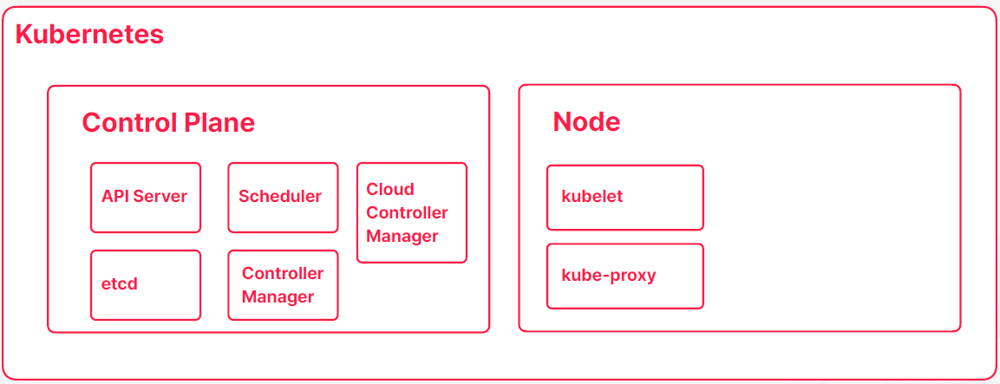

# Ch 2. Kubernetes의 주요 컨셉

# Ch 2. Kubernetes의 주요 컨셉
* toc
{:toc}

## 01. 컨테이너 오케스트레이션
+ 컨테이너 Container 
  + 운영체제 레벨의 가상화 기술
  + 컨테이너는 진짜 운영체제가 있고 그 내부에 가상의 운영체제를 만들어주는 기술이고 컨테이너 내부에서 돌아가는 프로세스들이 가상의 운영체제를 진짜 운영체제라고 믿으면서 동작을 하게 되는 것 
  + 가상의 운영체제를 만들어준다 
+ 가상 머신 Virtual Machine
  + 하드웨어 레벨의 가상화 기술
  + 가상의 하드웨어를 만든다는 걸 의미한다 
  + 가상의 하드웨어를 만들어준다

### 예: 파일 시스템의 격리 
+ 
+ 어떤 디렉토리가 프로세스에서만 접근 가능하도록 권한 설정
+ 프로세스는 해당 디렉토리를 루트로 사용
+ 프로세스 레벨에서 각 디렉토리는 격리된 공간
      
### 예: 네트워크 포트 매핑
+ 
+ 프로세스의 네트워크 포트를 실제로는 다른 포트로 매핑
+ 각각의 프로세스가 가지고 있는 네트워크 공간의 분리

### Docker
+ 리눅스 컨테이너는 네임페이스를 분리하고 파일 시스템이나 네트워크 같은 하드웨어 자원들에 대한 격리도 할 수 있도록 지원해주는 패키지이다 이 리눅스 컨테이너를 더 사용자들이 쓰기 쉽게 만들어서 배포한 게 도커라는 소프트웨어 이다 
+ 컨테이너를 쉡게 사용하도록 도와주는 소프트웨어
+ 

**예: Docker를 이용한 mysql 실행**
+ 로컬에서 mysql 서버를 실행하고 싶다면 직접 다운 받아서 설치하고 실행할 수 있다 
  + 고전적이고 전통적인 방법으로 설치하고 실행하는 방법 
+ docker 가 설치 되어 있다면 별다른 설치 과정 없이 docker run 명령을 통해서 mysql 서버를 실행할 수도 있다 
  + 명령어를 주면은 내부적으로는 도커가 mysql 컨테이너가 이미지가 로컬에 있는지 찾고 없으면은 레파지토리 또는 도커 허브 같은 곳에서 다운로드를 받고 이미지가 준비되었을 때 운영체제에서 제공한 자원들을 격리 시켜서 컨테이너에 할당 시켜주고 mysql 서버를 실행한다

~~~shell

$ docker run -p33306:3306 mysql
...
[Server] /usr/sbin/mysqld: ready
for connections.

~~~

**Docker Containerization**
+ 개발한 애플리케이션도 컨테이너로 만들어서 배포하고 실행하는 과정을 도커라이즈라고 보통 부르는데 보통 이 과정은 만든 어플리케이션이 도커 이미지가 될 수 있도록 변환해 주는 규칙 그거를 이제 도커 파일을 만들어 주는 걸로 시작을 한다 
+ openjdk가 설치된 이미지를 베이스로 해서 빌드가 끝나서 만들어진 자르 파일을 컨테이너 이미지 내부로 복사하고 그다음에 실제로 docker run 명령이 주어졌을 때 수행할 명령어를 ```java -jar /app.jar``` 이렇게 명령어를 줬다
  이렇게 명령어를 명시해서 도커 파일을 만들면은 도커 빌드 명령어를 통해서 도커 파일을 해석하고 도커 컨테이너 이미지를 생성할 수가 있다 이거를 해당 로컬 환경에 저장해도 되고 아니면 원격 저장소에 별도의 레지스트라든지 레파지토리라든지
  이런 곳에다가 이미지를 푸시 할 수도 있다 이렇게 이미지를 저장을 하게 되면은 도커 런 명령을 통해서 이미지를 푸시한 저장소에 접근 가능한 모든 머신이 개발한 애플리케이션을 실행할 수 있게 된다 
+ 만들어진 이미지는 어떤 환경에서든 동작의 일관성이 보장된다 
+ 컨테이너가 실행되는 환경이 사용하는 자원들을 모두 독립적으로 초기화돼서 할당되는 것이기 때문에 이시스템에 어디에 어떤 파일이 있는지 없는지 또는 8080포트를 사용하는 프로그램이 실행 중이다 이미 있는지 없는지 자바가 설치되어 있다 자바가 버전을 어떤
  버전이다 이런 것들과는 무관하게 환경에서 동작의 일관성이 보장된다  

~~~shell

FROM openjdk
COPY target/app.jar /app.jar
ENTRYPOINT ["java", "-jar", "/app.jar"]

~~~

~~~shell

$ docker build -t my-app .

~~~

~~~shell

$ docker run -p 8080:8080 my-app

~~~

### 애플리케이션 빌드 및 실행 구조의 변화
1. 
   + 과거에 평범한 애플리케이션을 빌드하고 배포하는 과정은 보통 로컬 환경에서 개발하고 젠킨스 같은 빌드 서버에서 gradle이나 이런 명령어 도구를 이용해서 애플리케이션을 빋드하고 scp 같은 명령어로 원격으로 전달하고 실행했다 
2. 
   + 도커가 나오고 나서는 흐름은 유사하긴 한데 빌드된 애플리케이션을 도커를 이용해서 컨테이너 이미지로 변환하는 과정이 추가가 되었고 배포나 실행 과정이 도커 중심으로 바뀌게 되었다 

### MSA 개발과 컨테이너 
+ 마이크로 서비스 아키텍처의 관점에서 컨테이너와 도커는 특별한 장점을 가지지 못함
  + 애플리케이션과 애플리케이션을 연결해주는 과정에서는 도커가 해주는 일이 없다 
  + 컨테이너 자체가 애플리케이션 프로세스를 격리시키는 데에 중점을 뒀기 때문에 반대로 실행된 컨테이너들끼리 서로 통신을 하거나 목적에 따라서 컨테이너를 그룹화한다던지 이런 컨셉들에 대해서는 별다를 지원이 없었다  
  + 컨테이너를 기반으로 MSA 환경을 구성한다? 컨테이너를 쓰지 않고 구성하는 거랑 다를 거는 없었다 컨테이너가 도입되고 나서 환경적으로 변화나 장점들이 발전이 많았는데 MSA에서는 큰 발전은 없었다 
  + 이런 약점을은 보안하기 위해서 도커에서도 도커 컴포즈와 같은 도구를 이용
+ docker compose를 이용한 멀티 컨테이너 구동 환경을 지원
  + 여러 컨테이너를 한 번에 실행하거나 제거해주고, 네트워크 브릿지를 연결해주는 역할
  + 호스트가 하나의 머신이어야 했기 때문에 로컬 개발 환경 구성에 최적
  + 여러 서버에 컨테이너를 나누어서 실행해야 하는 운영 환경에서는 제약이 많았음
+ 컨테이너를 더 적극적으로 운영 환경에 활용하기 위해 더 많은 기능이 필요했음

### 컨테이너를 이용한 운영 환경 구성
+ 컨테이너의 실행과 종료
+ 컨테이너를 실행하고 종료할 호스트는 여러 개로 구성될 수 있으며, 추가와 삭제가 가능해야 함
+ 컨테이너의 상태를 조회하고 관리
+ 컨테이너의 네트워크와 저장소 등 연관된 자원에 대한 관리
+ 

### 컨테이너 오케스트레이션
+ 컨테이너와 이와 관련된 모든 자원에 대한 통합 관리
+ 쿠버네티스는 가장 많이 사용되는 컨테이너 오케스트레이션 도구
+ 애플리케이션 개발 및 운영에 필요한 대부분의 요구사항을 지원

## 02. Control Plane과 Node

+ 컨테이너는 운영체제 레벨의 가상화 기술이기 때문에 컨테이너 입장에서는 자기한테만 운영체제가 존재한다고 생각할 수 있다 
+ 운영체제가 실제 운영체제는 아니고 자원들을 분리하고 격리시켜서 만든 가상의 운영체제이다 컨테이너 입장에서는 이게 가상이라는 걸 알기는 어렵겠지만 개발자는 가상의 운영체제를 만들어내는 실제 운영체제가 있나는 걸 알고 있다 
+ 실제 운영체제도 하드웨어에 설치돼서 실행되고 있을 텐데 물론 이 하드웨어도 실제 물리적인 하드웨어일 수도있고 가상머신에 의해서 만들어진 가상의 하드웨어일 수 있지만 컨테이너가 자기가 실행되는 가상의 운영체제가 가상인지 실제인지 구분하기 
  어려운것 처럼 운영체제 입장에서는 가상의 하드웨어와 실제 하드웨어를 구분하기 어렵고 구분할 이유가 딱히 없다 


+ 쿠버네티스가 여러 컨테이너를 실행하고 관리하는 컨테이너 오케스트레이터의 역할을 수행한다고 한다면 필연적으로 쿠버네티스는 컨테이너를 실행할 수 있는 하나 이상의 하드웨어를 관리하고 있어야 된다는 추론을 할 수 있다 
+ 결국에는 컨테이너를 실행할 수 잇는 하드웨어면 된다 


+ 이런 하드웨어들을 서버, 호스트 라고도 부를 수도 있는데 쿠버네티스에서는 노드라는 이름으로 불린다
+ 주의할 점은 오랜 기간 동안 노드를 쿠버네티스에서는 워커 노드라는 이름으로 불렀다 되게 옛날에는 미니언이라는 이름으로 부르던 시절도 있는데 워커 노드라고 부르는 시가가 좀 길었다 그래서 이게 조금 다른 역할을 하는 마스터 노드라는게 있는데 
  마스터 노드랑 분리하기 위해 워커 노드라는 이름으로 불렀는데 마스터 노드라는 개념이 바뀌기도 했고 마스터랑 워커라는 명칭 자체가 최근에 IT 용어 네이밍 트렌드랑 좀 맞지 않는 측면이 있어가지고 지금은 분명하게 노드의 역할을 분리해가지고 강조하는 경우가 
  아니라면 보통 노드라고 부른다 
+ 노드라는게 과거에 워커 노드라고 불렀던 그 용어랑 매칭이 보통은 된다라고 생각할 수 있는데 워커 노드라는 용어를 오랜 기간 동안 사용이돼가지고 책이나 인터넷 자료를 찾아보면 워커 노드라는 용어가 많을 것이다 


+ 쿠버네티스에서 컨테이너를 하나 실행하도록 구성할 때 쿠버네티스들이 관리하는 노도들이 보통 몇 개가 있는데 다수의 노드들 중 하나의 컨테이너를 실행을 시켜준다 
+ 컨테이너늘 실행할 때 대부분의 경우에는 사용자가 직접 어떤 노드에서 컨테이너를 실행해달라고 명령을 내리지는 않는다 
+ 보통 쿠버네티스는 컨테이너가 만들어져야 되는 상황이되면은 만들어주고 컨테이너가 제거가 되어야되는 상황이 오면은 컨테이너를 제거해준다 그래서 이때 적절한 노드를 선태하거나 아니면 컨테이너를 실행하거나 어떤 컨테이너를 
  제거하거나 하는 거는 컨테이너 오케스트레이션 도구인 쿠버네티스가 알아서 하는 일에 속한다 


+ 쿠버네티스가 컨테이너 오케스트레이션의 컨셉을 유지하고 이제 필요한 동작을 하기 위해서는 컨테이너가 실행될 노드 외에도 노드나 컨테이너 상태를 관리하고 유지해주고 사용자들의 명령을 받아가지고 처리할 Control Plane이 있다
+ Control Plane 컨테이와 노드를 관리해주는 영역을 Control Plane이라고 부른다
+ 컨테이너의 상태가 어떤 변동이 생기거나 문제가 문제가 생겼을 때 이를 감지해가지고 필요한 조치들을 취해주는 그런 역할도 수행하고 있다 


+ Control Plane에는 쿠버네티스의 관리하고 컨트롤하고자하는 목적에 맞춰서 여러 구성요들이 포함되어있다
+ Control Plan이 예전에는 master node 라고 불렸다 영역이다 
+ 어떤 물리적인 노드가 아니라 Control Plan이 하는 영역이 어떤 물리적인 노드라고 칭하기에는 안 맞는 개념이 있어서 최근에는 Control Plan 명칭을 사용한다 

+ API Server
  + 사용자의 명령을 받아서 상태를 저장하고, Node와 통신하며 필요한 동작들을 수행
+ etcd
  + 쿠버네티스 클러스터 및 컨테이너와 관련된 모든 데이터를 저장하는 데이터 저장소
  + 레디스랑 비슷하게 메모리 스토어랑 파일 스토어를 혼용해서 사용하고 있다 
  + 성능이 좋고 특히나 중점을 두고 있는게 분산 시스템 환경에서 가용성이 굉장히 좋은 저장소이다 
  + 쿠버네티스의 모든 클러스터랑 컨테이너들이 다 날라가는 상황이더라도 etcd에 저장된 데이터들만 백업을 해줬다면 클러스터 다시 만들고 etcd에 백업된 시섬으로 클러스터 상태를 되돌리 수도 있다 
  + etcd가 제대로 동작을 하지 않는다면 쿠버네티스 클러스트들은 그때부터는 읽기 전용 모드밖에 안된다 
+ Scheduler
  + 컨테이너가 생성될 때 적합한 노드를 선택해주는 역할을 수행
+ Controller Manager
  + 쿠버네티스의 다양한 컨트롤러들을 관리하며 API Server가 해야할 일을 알려주는 역할
+ Cloud Controller Manager
  + 클라우드 서비스의 다양한 API를 쿠버네티스와 통합해주는 역할
+ kubelet
  + 컨테이너를 실행하거나 종료하고, 상태를 모니터링해주는 역할
+ kube-proxy
  + 컨테이너의 네트워크를 관리해주는 역할
+ 사용자가 컨테이너를 만들어 달라고 요청을 하면 동작하는 순서
  1. 사용자가 API Server에다가 컨테이너 생성 요청
  2. API Server가 사용자의 요청을 검토 (인증, 명령 자격, 컨테이너의 스펙 문법)
  3. etcd 에다가 전달 받은 스펙 저장 
  4. 컨테이서의 생성이 필요하다는 정보가 Scheduler에도 저장, 스펙들을 검토하고 현재 노드들의 상태를 고려해서 컨테이너가 생성될 노드를 결정하고 스펙에다가 해당 노드를 기록 
  5. 컨테이너를 생성해야되는 노드에 실행중인 kubelet 역시 API Server를 통해서 컨테이너 생성이 되어야 된다는 정보를 인지하게 되고 kubelet은 주어진 스펙에 따라서 이미지를 받아온 다음에 컨테이너 런타임을 통해 컨테이너 실행을 한다 
  6. 컨테이너가 실행되는 과정들을 따라가서 kubelet이 지속적으로 컨테이너 상태를 모니터링하면서 API Server에다가 상태를 업데이트하고 API Server는 etcd에 기록한다 
  7. kube-proxy 같은 경우는 API Server를 통해서 컨테이너가 생로 생겼는데 이 컨테이너가 네트워크에 연결되어야 되는 시점이다라는 걸 인지하고 그 타이밍이 됐을 때 라우팅 규칙을 업데이트해서 컨테이너가 네트워크에 연결될 수 있도록 작업을 해준다 
  8. 컨테이너 생성이 완료되가지고 정상적인 상태가 됐으면은 kubelet은 상태를 계속 모니터링 하면서 API Server를 톻해서 상태 업데이트를 하게 된다 
+ 쿠버네티스의 구성요소들을 크게 살펴보면은 Control Plane이랑 노드로 구성되어 있고 Control Plane은 쿠버네티스를 관리해주는 역할을 하고 노드는 컨테이너가 실행될 수 있는 공간을 제공해준다 

