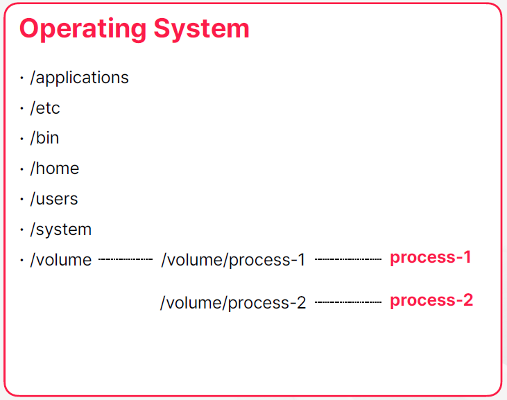

# Ch 2. Kubernetes의 주요 컨셉

# Ch 2. Kubernetes의 주요 컨셉
* toc
{:toc}

## 01. 컨테이너 오케스트레이션
+ 컨테이너 Container 
  + 운영체제 레벨의 가상화 기술
  + 컨테이너는 진짜 운영체제가 있고 그 내부에 가상의 운영체제를 만들어주는 기술이고 컨테이너 내부에서 돌아가는 프로세스들이 가상의 운영체제를 진짜 운영체제라고 믿으면서 동작을 하게 되는 것 
  + 가상의 운영체제를 만들어준다 
+ 가상 머신 Virtual Machine
  + 하드웨어 레벨의 가상화 기술
  + 가상의 하드웨어를 만든다는 걸 의미한다 
  + 가상의 하드웨어를 만들어준다

### 예: 파일 시스템의 격리 
+ 
+ 어떤 디렉토리가 프로세스에서만 접근 가능하도록 권한 설정
+ 프로세스는 해당 디렉토리를 루트로 사용
+ 프로세스 레벨에서 각 디렉토리는 격리된 공간
      
### 예: 네트워크 포트 매핑
+ 
+ 프로세스의 네트워크 포트를 실제로는 다른 포트로 매핑
+ 각각의 프로세스가 가지고 있는 네트워크 공간의 분리

### Docker
+ 리눅스 컨테이너는 네임페이스를 분리하고 파일 시스템이나 네트워크 같은 하드웨어 자원들에 대한 격리도 할 수 있도록 지원해주는 패키지이다 이 리눅스 컨테이너를 더 사용자들이 쓰기 쉽게 만들어서 배포한 게 도커라는 소프트웨어 이다 
+ 컨테이너를 쉡게 사용하도록 도와주는 소프트웨어
+ 

**예: Docker를 이용한 mysql 실행**
+ 로컬에서 mysql 서버를 실행하고 싶다면 직접 다운 받아서 설치하고 실행할 수 있다 
  + 고전적이고 전통적인 방법으로 설치하고 실행하는 방법 
+ docker 가 설치 되어 있다면 별다른 설치 과정 없이 docker run 명령을 통해서 mysql 서버를 실행할 수도 있다 
  + 명령어를 주면은 내부적으로는 도커가 mysql 컨테이너가 이미지가 로컬에 있는지 찾고 없으면은 레파지토리 또는 도커 허브 같은 곳에서 다운로드를 받고 이미지가 준비되었을 때 운영체제에서 제공한 자원들을 격리 시켜서 컨테이너에 할당 시켜주고 mysql 서버를 실행한다

~~~shell

$ docker run -p33306:3306 mysql
...
[Server] /usr/sbin/mysqld: ready
for connections.

~~~

**Docker Containerization**
+ 개발한 애플리케이션도 컨테이너로 만들어서 배포하고 실행하는 과정을 도커라이즈라고 보통 부르는데 보통 이 과정은 만든 어플리케이션이 도커 이미지가 될 수 있도록 변환해 주는 규칙 그거를 이제 도커 파일을 만들어 주는 걸로 시작을 한다 
+ openjdk가 설치된 이미지를 베이스로 해서 빌드가 끝나서 만들어진 자르 파일을 컨테이너 이미지 내부로 복사하고 그다음에 실제로 docker run 명령이 주어졌을 때 수행할 명령어를 ```java -jar /app.jar``` 이렇게 명령어를 줬다
  이렇게 명령어를 명시해서 도커 파일을 만들면은 도커 빌드 명령어를 통해서 도커 파일을 해석하고 도커 컨테이너 이미지를 생성할 수가 있다 이거를 해당 로컬 환경에 저장해도 되고 아니면 원격 저장소에 별도의 레지스트라든지 레파지토리라든지
  이런 곳에다가 이미지를 푸시 할 수도 있다 이렇게 이미지를 저장을 하게 되면은 도커 런 명령을 통해서 이미지를 푸시한 저장소에 접근 가능한 모든 머신이 개발한 애플리케이션을 실행할 수 있게 된다 
+ 만들어진 이미지는 어떤 환경에서든 동작의 일관성이 보장된다 
+ 컨테이너가 실행되는 환경이 사용하는 자원들을 모두 독립적으로 초기화돼서 할당되는 것이기 때문에 이시스템에 어디에 어떤 파일이 있는지 없는지 또는 8080포트를 사용하는 프로그램이 실행 중이다 이미 있는지 없는지 자바가 설치되어 있다 자바가 버전을 어떤
  버전이다 이런 것들과는 무관하게 환경에서 동작의 일관성이 보장된다  

~~~shell

FROM openjdk
COPY target/app.jar /app.jar
ENTRYPOINT ["java", "-jar", "/app.jar"]

~~~

~~~shell

$ docker build -t my-app .

~~~

~~~shell

$ docker run -p 8080:8080 my-app

~~~

### 애플리케이션 빌드 및 실행 구조의 변화
1. 
   + 과거에 평범한 애플리케이션을 빌드하고 배포하는 과정은 보통 로컬 환경에서 개발하고 젠킨스 같은 빌드 서버에서 gradle이나 이런 명령어 도구를 이용해서 애플리케이션을 빋드하고 scp 같은 명령어로 원격으로 전달하고 실행했다 
2. 
   + 도커가 나오고 나서는 흐름은 유사하긴 한데 빌드된 애플리케이션을 도커를 이용해서 컨테이너 이미지로 변환하는 과정이 추가가 되었고 배포나 실행 과정이 도커 중심으로 바뀌게 되었다 

### MSA 개발과 컨테이너 
+ 마이크로 서비스 아키텍처의 관점에서 컨테이너와 도커는 특별한 장점을 가지지 못함
  + 애플리케이션과 애플리케이션을 연결해주는 과정에서는 도커가 해주는 일이 없다 
  + 컨테이너 자체가 애플리케이션 프로세스를 격리시키는 데에 중점을 뒀기 때문에 반대로 실행된 컨테이너들끼리 서로 통신을 하거나 목적에 따라서 컨테이너를 그룹화한다던지 이런 컨셉들에 대해서는 별다를 지원이 없었다  
  + 컨테이너를 기반으로 MSA 환경을 구성한다? 컨테이너를 쓰지 않고 구성하는 거랑 다를 거는 없었다 컨테이너가 도입되고 나서 환경적으로 변화나 장점들이 발전이 많았는데 MSA에서는 큰 발전은 없었다 
  + 이런 약점을은 보안하기 위해서 도커에서도 도커 컴포즈와 같은 도구를 이용
+ docker compose를 이용한 멀티 컨테이너 구동 환경을 지원
  + 여러 컨테이너를 한 번에 실행하거나 제거해주고, 네트워크 브릿지를 연결해주는 역할
  + 호스트가 하나의 머신이어야 했기 때문에 로컬 개발 환경 구성에 최적
  + 여러 서버에 컨테이너를 나누어서 실행해야 하는 운영 환경에서는 제약이 많았음
+ 컨테이너를 더 적극적으로 운영 환경에 활용하기 위해 더 많은 기능이 필요했음

### 컨테이너를 이용한 운영 환경 구성
+ 컨테이너의 실행과 종료
+ 컨테이너를 실행하고 종료할 호스트는 여러 개로 구성될 수 있으며, 추가와 삭제가 가능해야 함
+ 컨테이너의 상태를 조회하고 관리
+ 컨테이너의 네트워크와 저장소 등 연관된 자원에 대한 관리
+ 

### 컨테이너 오케스트레이션
+ 컨테이너와 이와 관련된 모든 자원에 대한 통합 관리
+ 쿠버네티스는 가장 많이 사용되는 컨테이너 오케스트레이션 도구
+ 애플리케이션 개발 및 운영에 필요한 대부분의 요구사항을 지원
