# Ch 2. Kubernetes의 주요 컨셉

# Ch 2. Kubernetes의 주요 컨셉
* toc
{:toc}

## 01. 컨테이너 오케스트레이션

### 컨테이너 오케스트레이션

컨테이너 오케스트레이션을 이해하려면 먼저 컨테이너와 가상 머신의 차이를 이해해야 한다.

컨테이너와 가상 머신은 모두 애플리케이션을 독립된 환경에서 실행하기 위한 기술이지만, 가상화하는 대상이 다르다.

---

#### 컨테이너(Container)

컨테이너는 **운영체제 레벨의 가상화 기술**이다.

실제 운영체제 위에서 실행되지만, 컨테이너 내부에서 동작하는 프로세스는 자신만의 독립된 운영체제 환경을 가지고 있다고 인식한다.

즉 컨테이너는 실제 운영체제 안에 격리된 가상의 운영체제 환경을 만들어주는 기술이라고 볼 수 있다.

컨테이너는 다음과 같은 자원을 격리한다.

* 파일 시스템
* 네트워크
* 프로세스
* CPU / Memory 사용량
* 환경 변수
* 실행 권한

정리하면 컨테이너는 애플리케이션 프로세스가 독립된 환경에서 실행되는 것처럼 만들어준다.

---

#### 가상 머신(Virtual Machine)

가상 머신은 **하드웨어 레벨의 가상화 기술**이다.

가상 머신은 실제 하드웨어 위에 가상의 하드웨어를 만들고, 그 위에 별도의 운영체제를 설치하여 애플리케이션을 실행한다.

즉 가상 머신은 다음과 같은 자원을 가상화한다.

* CPU
* Memory
* Disk
* Network Interface

컨테이너가 운영체제 안에서 격리된 실행 환경을 만드는 기술이라면, 가상 머신은 운영체제를 실행할 수 있는 가상의 컴퓨터를 만드는 기술이라고 볼 수 있다.

---

#### 컨테이너와 가상 머신의 차이

| 구분     | 컨테이너              | 가상 머신                       |
| ------ | ----------------- | --------------------------- |
| 가상화 수준 | 운영체제 레벨           | 하드웨어 레벨                     |
| 실행 단위  | 프로세스              | 운영체제                        |
| 부팅 속도  | 빠름                | 상대적으로 느림                    |
| 자원 사용량 | 적음                | 많음                          |
| 격리 방식  | 네임스페이스, cgroup 기반 | 하이퍼바이저 기반                   |
| 대표 도구  | Docker            | VMware, VirtualBox, Hyper-V |

---

### 예: 파일 시스템의 격리

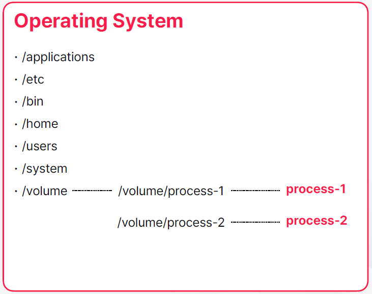

컨테이너는 파일 시스템을 격리할 수 있다.

특정 디렉토리를 프로세스만 접근할 수 있도록 제한하면, 해당 프로세스는 그 디렉토리를 자신의 루트 파일 시스템처럼 사용한다.

예를 들어 실제 운영체제에는 여러 디렉토리가 존재하더라도, 컨테이너 내부 프로세스는 자신에게 허용된 디렉토리만 볼 수 있다.

이렇게 하면 프로세스 레벨에서 각 디렉토리는 서로 격리된 공간처럼 동작한다.

즉 컨테이너 내부에서는

```text
/
```

가 실제 운영체제의 루트 디렉토리가 아니라, 컨테이너를 위해 격리된 파일 시스템의 루트일 수 있다.

---

### 예: 네트워크 포트 매핑

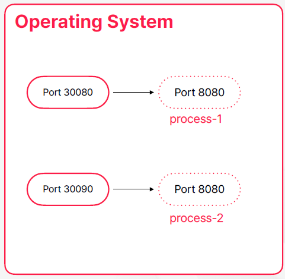

컨테이너는 네트워크 공간도 격리할 수 있다.

컨테이너 내부 프로세스가 사용하는 포트를 실제 호스트의 다른 포트로 매핑할 수 있다.

예를 들어 MySQL 컨테이너 내부에서는 3306 포트를 사용하지만, 호스트에서는 33306 포트로 접근하도록 만들 수 있다.

```shell
docker run -p 33306:3306 mysql
```

이 명령어의 의미는 다음과 같다.

```text
Host Port 33306
      ↓
Container Port 3306
```

즉 호스트의 33306 포트로 들어온 요청이 컨테이너 내부의 3306 포트로 전달된다.

이처럼 각각의 컨테이너는 자신만의 네트워크 공간을 가지고, 필요에 따라 호스트의 포트와 연결된다.

---

### Docker

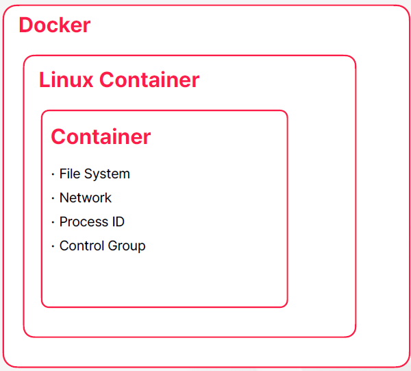

리눅스 컨테이너는 네임스페이스를 분리하고, 파일 시스템이나 네트워크 같은 자원을 격리할 수 있도록 지원하는 기술이다.

Docker는 이러한 리눅스 컨테이너 기술을 사용자가 쉽게 사용할 수 있도록 만든 소프트웨어이다.

Docker는 다음 기능을 제공한다.

* 컨테이너 이미지 생성
* 컨테이너 실행
* 컨테이너 중지
* 컨테이너 삭제
* 컨테이너 로그 확인
* 이미지 저장소 연동
* 포트 매핑
* 볼륨 연결

즉 Docker는 컨테이너를 쉽게 사용하도록 도와주는 도구라고 볼 수 있다.

---

#### 예: Docker를 이용한 MySQL 실행

로컬에서 MySQL 서버를 실행하고 싶다면 전통적으로는 다음 과정을 거쳐야 한다.

1. MySQL 설치 파일 다운로드
2. MySQL 설치
3. 설정 파일 수정
4. 서버 실행
5. 포트 확인

하지만 Docker가 설치되어 있다면 다음 명령어 하나로 MySQL 서버를 실행할 수 있다.

```shell
docker run -p33306:3306 mysql
```

실행 과정에서 Docker는 내부적으로 다음 작업을 수행한다.

1. 로컬에 `mysql` 이미지가 있는지 확인
2. 이미지가 없으면 Docker Hub 같은 저장소에서 다운로드
3. 운영체제 자원을 격리하여 컨테이너 실행 환경 구성
4. MySQL 컨테이너 실행
5. 호스트 포트와 컨테이너 포트 연결

실행 후 MySQL 서버가 정상적으로 준비되면 다음과 같은 로그를 볼 수 있다.

```shell
[Server] /usr/sbin/mysqld: ready for connections.
```

Docker를 사용하면 직접 설치 과정을 거치지 않고도 필요한 서버 프로그램을 빠르게 실행할 수 있다.

---

#### Docker Containerization

개발한 애플리케이션도 컨테이너 이미지로 만들어 배포하고 실행할 수 있다.

이 과정을 보통 **Dockerize** 또는 **Containerization**이라고 부른다.

일반적으로 Dockerize 과정은 Dockerfile을 작성하는 것에서 시작한다.

---

##### Dockerfile 예시

```dockerfile
FROM openjdk
COPY target/app.jar /app.jar
ENTRYPOINT ["java", "-jar", "/app.jar"]
```

---

##### Dockerfile 설명

###### FROM

```dockerfile
FROM openjdk
```

OpenJDK가 설치된 이미지를 베이스 이미지로 사용한다.

즉 Java 애플리케이션이 실행될 수 있는 기본 환경을 가져온다.

---

###### COPY

```dockerfile
COPY target/app.jar /app.jar
```

빌드된 JAR 파일을 컨테이너 이미지 내부로 복사한다.

호스트의 `target/app.jar` 파일이 컨테이너 내부의 `/app.jar` 위치에 저장된다.

---

###### ENTRYPOINT

```dockerfile
ENTRYPOINT ["java", "-jar", "/app.jar"]
```

컨테이너가 실행될 때 수행할 명령어를 지정한다.

즉 컨테이너가 실행되면 다음 명령어가 실행된다.

```shell
java -jar /app.jar
```

---

##### Docker 이미지 빌드

Dockerfile을 작성했다면 다음 명령어로 이미지를 생성할 수 있다.

```shell
docker build -t my-app .
```

`my-app`이라는 이름의 컨테이너 이미지가 생성된다.

---

##### Docker 컨테이너 실행

생성한 이미지는 다음 명령어로 실행할 수 있다.

```shell
docker run -p 8080:8080 my-app
```

호스트의 8080 포트와 컨테이너 내부의 8080 포트를 연결하여 애플리케이션을 실행한다.

---

##### 컨테이너 이미지의 장점

컨테이너 이미지로 만든 애플리케이션은 어떤 환경에서든 비교적 일관되게 동작한다.

예를 들어 다음과 같은 차이에 영향을 덜 받는다.

* 서버에 Java가 설치되어 있는지
* Java 버전이 무엇인지
* 특정 파일이 서버에 존재하는지
* 8080 포트를 이미 다른 프로그램이 사용 중인지
* 운영체제 설정이 어떻게 되어 있는지

컨테이너 이미지는 애플리케이션 실행에 필요한 환경을 함께 포함하기 때문에 개발 환경과 운영 환경의 차이를 줄일 수 있다.

---

### 애플리케이션 빌드 및 실행 구조의 변화

#### 전통적인 애플리케이션 빌드 및 배포 구조

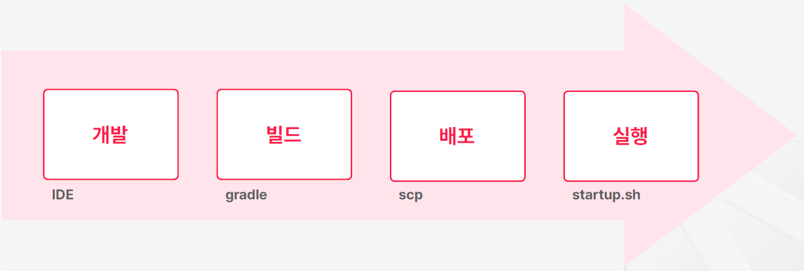

과거에는 애플리케이션을 빌드하고 배포하는 과정이 보통 다음과 같았다.

```text
개발자 PC
    ↓
빌드 서버
    ↓
Gradle / Maven 빌드
    ↓
JAR 또는 WAR 생성
    ↓
SCP 등으로 서버에 전송
    ↓
서버에서 직접 실행
```

Jenkins 같은 빌드 서버에서 Gradle이나 Maven 명령어를 이용해 애플리케이션을 빌드하고, 생성된 파일을 원격 서버로 전달한 뒤 실행하는 방식이 일반적이었다.

이 방식에서는 서버에 Java 런타임이 설치되어 있어야 하고, 실행에 필요한 디렉토리나 설정이 서버마다 맞춰져 있어야 했다.

---

#### Docker 이후의 애플리케이션 빌드 및 배포 구조

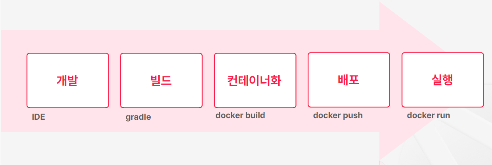

Docker 이후에는 빌드된 애플리케이션을 컨테이너 이미지로 변환하는 과정이 추가되었다.

```text
소스 코드
    ↓
애플리케이션 빌드
    ↓
JAR 생성
    ↓
Docker Image 생성
    ↓
Image Registry Push
    ↓
Docker Run
```

배포와 실행의 중심이 서버 파일 복사에서 컨테이너 이미지 실행으로 바뀌게 되었다.

이제 서버는 애플리케이션 실행 환경을 직접 구성하기보다, 컨테이너 이미지를 가져와 실행하는 역할에 가까워졌다.

---

### MSA 개발과 컨테이너

컨테이너와 Docker는 애플리케이션 실행 환경을 일관되게 만드는 데 큰 장점이 있다.

하지만 MSA 관점에서 보면 컨테이너와 Docker 자체가 애플리케이션 간 연결 문제를 모두 해결해주지는 않는다.

컨테이너는 기본적으로 애플리케이션 프로세스를 격리하는 데 초점이 맞춰져 있다.

따라서 다음과 같은 문제는 Docker 단독으로 해결하기 어렵다.

* 애플리케이션 간 통신
* 컨테이너 그룹 관리
* 서비스 디스커버리
* 로드밸런싱
* 장애 복구
* 여러 서버에 걸친 컨테이너 배치

즉 컨테이너를 사용한다고 해서 MSA 운영 문제가 자동으로 해결되는 것은 아니다.

---

#### Docker Compose

Docker는 이러한 약점을 보완하기 위해 Docker Compose를 제공한다.

Docker Compose는 여러 컨테이너를 하나의 설정 파일로 정의하고 실행할 수 있게 해준다.

Docker Compose가 제공하는 기능은 다음과 같다.

* 여러 컨테이너 동시 실행
* 컨테이너 일괄 중지
* 컨테이너 간 네트워크 연결
* 환경 변수 설정
* 볼륨 연결

하지만 Docker Compose는 기본적으로 하나의 호스트 머신에서 여러 컨테이너를 실행하는 데 적합하다.

그래서 로컬 개발 환경 구성에는 매우 유용하지만, 여러 서버에 컨테이너를 나누어 실행해야 하는 운영 환경에서는 제약이 많다.

---

### 컨테이너를 이용한 운영 환경 구성

컨테이너를 운영 환경에서 적극적으로 활용하려면 단순히 컨테이너를 실행하는 것 이상의 기능이 필요하다.

필요한 기능은 다음과 같다.

* 컨테이너 실행과 종료
* 컨테이너를 실행할 호스트 선택
* 여러 호스트의 추가와 삭제
* 컨테이너 상태 조회
* 비정상 컨테이너 복구
* 컨테이너 네트워크 관리
* 컨테이너 저장소 관리
* 컨테이너와 연관된 자원 관리

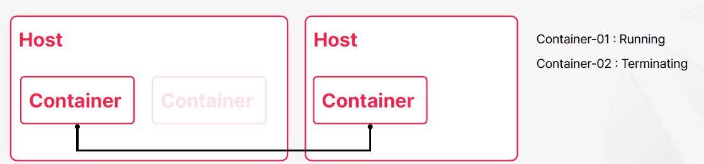

컨테이너가 소수일 때는 직접 명령어로 관리할 수 있지만, 운영 환경에서 컨테이너 수가 많아지면 사람이 직접 관리하기 어렵다.

---

### 컨테이너 오케스트레이션

컨테이너 오케스트레이션은 컨테이너와 컨테이너 실행에 필요한 모든 자원을 통합적으로 관리하는 것을 의미한다.

오케스트레이션 도구는 다음과 같은 역할을 수행한다.

* 어떤 서버에서 컨테이너를 실행할지 결정
* 컨테이너가 죽으면 다시 실행
* 컨테이너 수량 유지
* 컨테이너 간 네트워크 연결
* 저장소 연결
* 설정값 주입
* 배포와 롤백
* 상태 모니터링

Kubernetes는 현재 가장 많이 사용되는 컨테이너 오케스트레이션 도구이다.

Kubernetes는 애플리케이션 개발 및 운영에 필요한 대부분의 요구사항을 지원한다.

정리하면 Docker가 컨테이너를 쉽게 사용할 수 있게 만든 도구라면, Kubernetes는 여러 컨테이너와 관련 자원을 운영 환경에서 안정적으로 관리하기 위한 플랫폼이라고 볼 수 있다.


## 02. Control Plane과 Node

### Control Plane과 Node

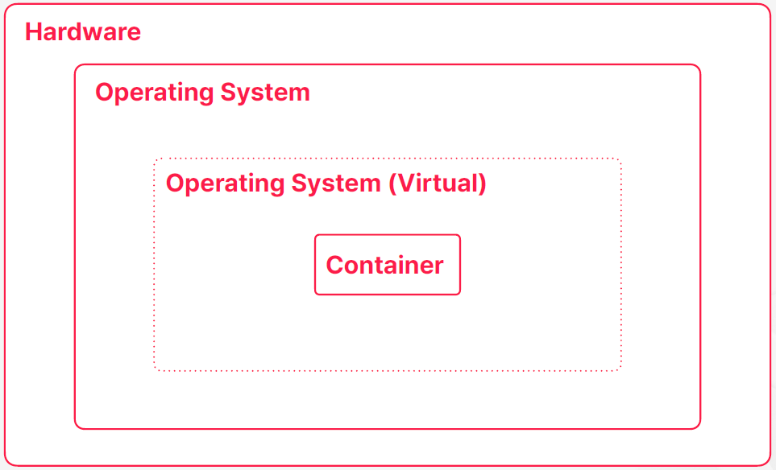

Kubernetes는 여러 컨테이너를 실행하고 관리하는 컨테이너 오케스트레이션 플랫폼이다.

컨테이너는 운영체제 레벨의 가상화 기술이기 때문에, 컨테이너 내부에서 실행되는 프로세스는 자신에게만 독립된 운영체제 환경이 존재한다고 인식한다.

하지만 실제로는 진짜 운영체제가 하나 있고, 그 운영체제가 파일 시스템, 네트워크, 프로세스, 자원 사용량 등을 격리하여 컨테이너마다 독립된 환경처럼 보이도록 만들어준다.

즉 컨테이너 입장에서는 자신이 사용하는 운영체제가 실제 운영체제처럼 보이지만, 개발자 입장에서는 그 환경이 실제 운영체제가 만든 격리된 실행 공간이라는 것을 알고 있어야 한다.

---

#### 컨테이너가 실행되는 기반

실제 운영체제는 하드웨어 위에서 실행된다.

이 하드웨어는 실제 물리 서버일 수도 있고, 가상 머신에 의해 만들어진 가상의 하드웨어일 수도 있다.

컨테이너 입장에서 자신이 사용하는 운영체제가 진짜인지 가짜인지 구분하기 어려운 것처럼, 운영체제 입장에서도 자신이 실행되는 하드웨어가 물리 서버인지 가상 머신인지 구분할 필요가 크지 않다.

중요한 것은 컨테이너를 실행할 수 있는 운영체제와 자원이 존재한다는 점이다.

---

### Kubernetes가 관리하는 실행 공간

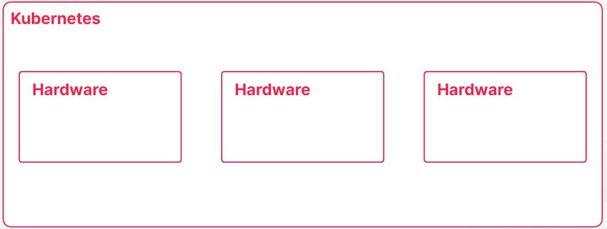

Kubernetes가 컨테이너 오케스트레이터의 역할을 수행하려면, 컨테이너를 실행할 수 있는 하나 이상의 실행 공간을 관리해야 한다.

결국 Kubernetes는 컨테이너를 실행할 수 있는 서버들을 관리하는 시스템이라고 볼 수 있다.

이 서버는 물리 서버일 수도 있고, 클라우드에서 생성한 가상 머신일 수도 있다.

Kubernetes 입장에서 중요한 것은 다음 조건이다.

* 컨테이너 런타임이 동작할 수 있는가
* 네트워크에 연결되어 있는가
* Kubernetes 구성 요소와 통신할 수 있는가
* CPU, Memory 같은 자원을 제공할 수 있는가

---

### Node

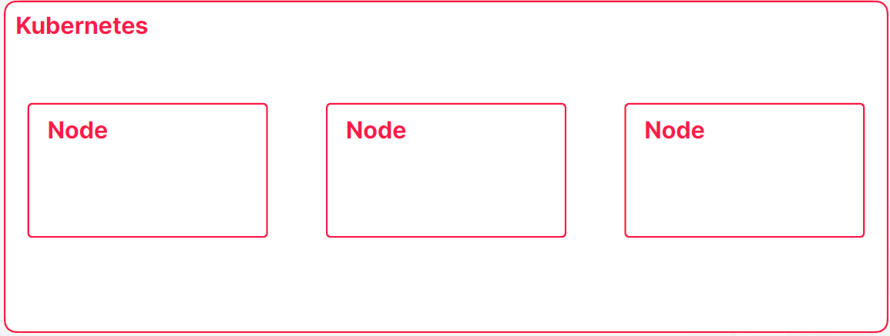

Kubernetes에서 컨테이너를 실행할 수 있는 서버를 **Node**라고 부른다.

Node는 다음과 같은 형태일 수 있다.

* 물리 서버
* 가상 머신
* 클라우드 인스턴스
* 로컬 개발용 가상 노드

과거에는 컨테이너를 실행하는 노드를 **Worker Node**라고 부르는 경우가 많았다.

더 오래전에는 Minion이라는 용어도 사용되었다.

또 Control Plane 영역을 Master Node라고 부르던 시기도 있었다.

하지만 최근에는 Master / Worker라는 표현보다 **Control Plane / Node**라는 표현을 더 많이 사용한다.

따라서 예전 자료에서 Worker Node라는 표현을 보더라도, 대부분 현재의 Node 개념과 연결해서 이해하면 된다.

---

### 컨테이너 배치

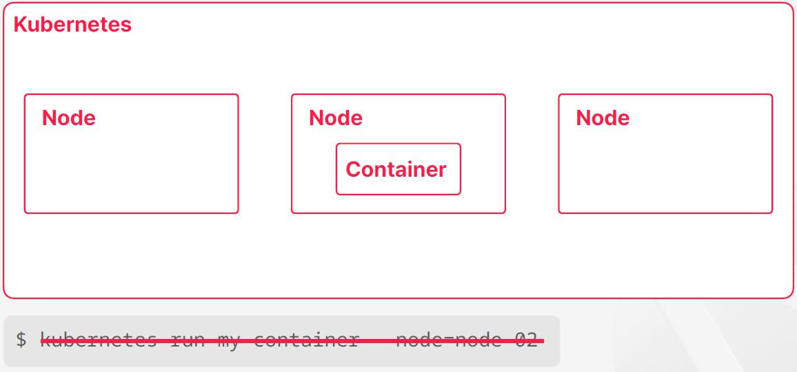

Kubernetes 클러스터에는 여러 Node가 존재할 수 있다.

사용자가 컨테이너 실행을 요청하면 Kubernetes는 여러 Node 중 하나를 선택하여 컨테이너를 실행한다.

대부분의 경우 사용자는 특정 Node를 직접 지정하지 않는다.

사용자는 다음과 같이 원하는 상태만 정의한다.

```text
이 애플리케이션 컨테이너가 실행되어야 한다.
```

그러면 Kubernetes가 다음을 판단한다.

* 어느 Node에 자원이 충분한가
* 어떤 Node가 현재 사용 가능한가
* 스케줄링 조건을 만족하는가
* 이미 비슷한 Pod가 어디에 배치되어 있는가

이후 적절한 Node를 선택해 컨테이너를 실행한다.

즉 컨테이너를 어느 Node에 배치할지 결정하는 일은 Kubernetes가 담당한다.

---

### Control Plane

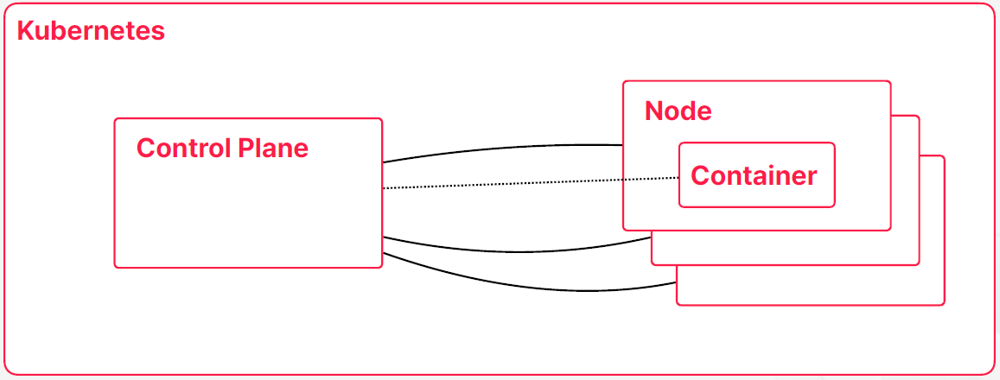

Kubernetes가 컨테이너 오케스트레이션을 수행하려면 단순히 컨테이너를 실행할 Node만 있어서는 부족하다.

클러스터 전체를 관리하고, 사용자 명령을 처리하며, 컨테이너와 Node의 상태를 지속적으로 확인하는 관리 영역이 필요하다.

이 영역을 **Control Plane**이라고 부른다.

Control Plane은 Kubernetes 클러스터의 두뇌 역할을 한다.

주요 역할은 다음과 같다.

* 사용자 요청 처리
* 클러스터 상태 저장
* 컨테이너 배치 결정
* Node 상태 확인
* 컨테이너 상태 감지
* 장애 발생 시 복구 조치
* 네트워크 및 자원 상태 관리

즉 Control Plane은 컨테이너와 Node를 직접 실행하는 영역이라기보다, 전체 클러스터를 관리하고 조정하는 영역이다.

---

### Control Plane의 구성 요소

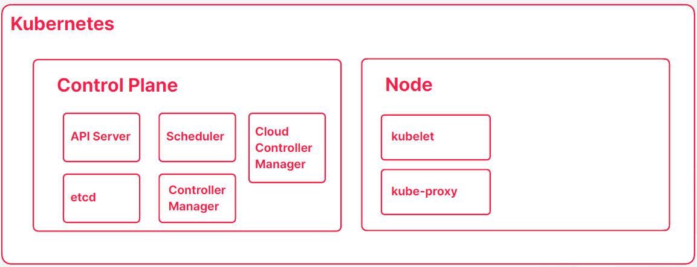

Control Plane에는 Kubernetes를 관리하고 제어하기 위한 여러 구성 요소가 포함된다.

과거에는 이 영역을 Master Node라고 부르기도 했다.

하지만 Control Plane은 단순히 하나의 물리적인 노드라기보다, Kubernetes 클러스터를 제어하는 논리적인 관리 영역에 가깝다.

그래서 최근에는 Control Plane이라는 표현을 사용한다.

---

#### API Server

API Server는 Kubernetes 클러스터의 진입점이다.

사용자가 `kubectl` 명령어를 실행하거나 외부 시스템이 Kubernetes API를 호출하면, 대부분의 요청은 API Server로 전달된다.

API Server의 역할은 다음과 같다.

* 사용자 요청 수신
* 인증(Authentication)
* 권한 확인(Authorization)
* 요청 스펙 검증
* etcd에 상태 저장
* 다른 구성 요소와 통신

예를 들어 사용자가 Pod 생성 요청을 보내면 API Server는 먼저 요청이 유효한지 확인하고, 문제가 없으면 해당 스펙을 etcd에 저장한다.

---

#### etcd

etcd는 Kubernetes 클러스터의 모든 상태 정보를 저장하는 데이터 저장소이다.

저장되는 데이터는 다음과 같다.

* Pod 스펙과 상태
* Deployment 스펙과 상태
* Service 정보
* ConfigMap
* Secret
* Node 정보
* 클러스터 전체 설정

etcd는 단순한 캐시가 아니라 Kubernetes의 핵심 저장소이다.

Kubernetes는 사용자가 원하는 상태와 현재 상태를 계속 비교하면서 동작하는데, 이때 기준이 되는 정보가 etcd에 저장된다.

etcd는 분산 시스템 환경에서 높은 일관성과 가용성을 제공하도록 설계된 저장소이다.

만약 클러스터의 구성 요소가 모두 문제가 생기더라도 etcd 데이터가 백업되어 있다면, 클러스터 상태를 복구하는 데 사용할 수 있다.

반대로 etcd가 제대로 동작하지 않으면 Kubernetes는 새로운 상태 변경을 안정적으로 처리하기 어렵다.

---

#### Scheduler

Scheduler는 새로 생성되어야 하는 Pod를 어떤 Node에 배치할지 결정한다.

Scheduler는 다음 정보를 고려한다.

* Node의 CPU / Memory 여유
* Pod가 요구하는 자원
* Node Selector
* Node Affinity
* Taint / Toleration
* 이미 배치된 Pod 상태
* 스케줄링 제약 조건

Scheduler는 직접 컨테이너를 실행하지 않는다.

역할은 적절한 Node를 선택하고, 해당 Pod 스펙에 선택된 Node 정보를 기록하는 것이다.

실제 컨테이너 실행은 선택된 Node의 kubelet이 수행한다.

---

#### Controller Manager

Controller Manager는 Kubernetes의 다양한 Controller를 실행하고 관리한다.

Controller는 현재 상태와 원하는 상태를 비교하고, 차이가 있으면 이를 조정하는 역할을 한다.

예를 들어 Deployment에서 replicas를 3으로 설정했는데 현재 Pod가 2개만 실행 중이라면, Controller는 Pod를 하나 더 생성해야 한다고 판단한다.

Controller Manager는 다음과 같은 컨트롤러들을 관리한다.

* Deployment Controller
* ReplicaSet Controller
* Node Controller
* Job Controller
* EndpointSlice Controller

즉 Controller Manager는 Kubernetes의 선언적 동작을 실제로 유지시키는 핵심 구성 요소이다.

---

#### Cloud Controller Manager

Cloud Controller Manager는 클라우드 서비스의 API와 Kubernetes를 연결해주는 역할을 한다.

클라우드 환경에서는 Kubernetes 객체가 클라우드 리소스와 연결되는 경우가 많다.

예를 들어 다음과 같은 작업이 필요할 수 있다.

* LoadBalancer 타입 Service 생성 시 클라우드 Load Balancer 생성
* PersistentVolume 사용 시 클라우드 Disk 연결
* Node 정보와 클라우드 인스턴스 정보 동기화

이러한 클라우드 특화 작업을 처리하는 구성 요소가 Cloud Controller Manager이다.

---

#### kubelet

kubelet은 각 Node에서 실행되는 에이전트이다.

Control Plane이 명령을 내리는 역할이라면, kubelet은 Node에서 실제 컨테이너 실행을 담당하는 역할이다.

kubelet의 역할은 다음과 같다.

* Pod 생성 요청 확인
* 컨테이너 이미지 다운로드
* 컨테이너 런타임을 통해 컨테이너 실행
* 컨테이너 상태 모니터링
* 컨테이너 재시작
* 상태를 API Server에 보고

즉 kubelet은 Node와 Control Plane을 연결하는 핵심 구성 요소이다.

---

#### kube-proxy

kube-proxy는 Node의 네트워크 규칙을 관리한다.

Kubernetes에서 Service를 통해 Pod로 트래픽을 전달하려면 각 Node의 네트워크 라우팅 규칙이 적절히 구성되어야 한다.

kube-proxy는 API Server를 통해 Service와 Endpoint 정보를 확인하고, 트래픽이 적절한 Pod로 전달될 수 있도록 네트워크 규칙을 업데이트한다.

즉 kube-proxy는 Kubernetes Service 네트워크가 동작할 수 있도록 도와주는 구성 요소이다.

---

### 컨테이너 생성 요청 흐름

사용자가 컨테이너를 만들어달라고 요청하면 Kubernetes 내부에서는 여러 구성 요소가 함께 동작한다.

흐름은 다음과 같다.

#### 1. 사용자가 API Server에 요청

사용자는 `kubectl apply` 또는 Kubernetes API를 통해 컨테이너 생성 요청을 보낸다.

```text
kubectl apply -f pod.yaml
```

요청은 API Server로 전달된다.

---

#### 2. API Server가 요청 검증

API Server는 요청을 검토한다.

검토 대상은 다음과 같다.

* 사용자가 인증된 사용자인가
* 해당 명령을 실행할 권한이 있는가
* 스펙 문법이 올바른가
* 필수 필드가 존재하는가

문제가 없으면 요청을 받아들인다.

---

#### 3. etcd에 스펙 저장

API Server는 전달받은 스펙을 etcd에 저장한다.

이때 저장되는 것은 단순 실행 명령이 아니라 Kubernetes가 유지해야 할 목표 상태이다.

---

#### 4. Scheduler가 Node 선택

Scheduler는 새 Pod가 생성되어야 한다는 정보를 확인한다.

그리고 현재 Node들의 상태와 Pod의 요구 조건을 고려하여 적절한 Node를 선택한다.

선택 결과는 Pod 스펙에 기록된다.

---

#### 5. kubelet이 컨테이너 실행

선택된 Node에서 실행 중인 kubelet은 API Server를 통해 자신이 실행해야 할 Pod가 있다는 것을 확인한다.

이후 kubelet은 다음 작업을 수행한다.

1. 컨테이너 이미지 다운로드
2. 컨테이너 런타임 호출
3. 컨테이너 실행
4. Pod 상태 확인

---

#### 6. kubelet이 상태 모니터링

컨테이너가 실행된 이후에도 kubelet은 계속 상태를 모니터링한다.

그리고 상태 정보를 API Server에 보고한다.

API Server는 이 상태를 etcd에 기록한다.

---

#### 7. kube-proxy가 네트워크 규칙 업데이트

새로운 Pod가 Service의 대상이 되어야 한다면 kube-proxy가 네트워크 규칙을 업데이트한다.

이 과정을 통해 Service로 들어온 트래픽이 새로 생성된 Pod에도 전달될 수 있다.

---

#### 8. 상태 지속 관리

컨테이너 생성이 완료된 이후에도 kubelet은 계속 상태를 확인한다.

문제가 발생하면 Control Plane은 현재 상태와 원하는 상태의 차이를 감지하고 필요한 조치를 수행한다.

---

### 전체 구조 정리

Kubernetes 구성 요소는 크게 두 영역으로 나눌 수 있다.

#### Control Plane

클러스터를 관리하고 조정하는 영역이다.

포함 구성 요소는 다음과 같다.

* API Server
* etcd
* Scheduler
* Controller Manager
* Cloud Controller Manager

#### Node

컨테이너가 실제로 실행되는 공간이다.

포함 구성 요소는 다음과 같다.

* kubelet
* kube-proxy
* container runtime

---

### 핵심 정리

Kubernetes는 Control Plane과 Node로 구성된다.

Control Plane은 클러스터 전체를 관리하고, Node는 컨테이너가 실행되는 공간을 제공한다.

사용자가 컨테이너 실행을 요청하면 API Server, etcd, Scheduler, kubelet, kube-proxy가 함께 동작하여 컨테이너를 실행하고 네트워크에 연결한다.

즉 Kubernetes는 단순히 컨테이너를 실행하는 도구가 아니라, 여러 Node 위에서 컨테이너의 배치, 실행, 상태 관리, 네트워크 연결까지 자동으로 처리하는 플랫폼이다.


## 03. Reconciliation과 Self-Healing

### Reconciliation과 Self-Healing

Kubernetes를 이해할 때 가장 중요한 개념 중 하나가 **Reconciliation**이다.

Kubernetes는 단순히 사용자의 명령을 받아 컨테이너를 실행하는 시스템이 아니다. 사용자가 원하는 상태를 저장하고, 현재 상태를 지속적으로 관찰하면서 두 상태가 일치하도록 조정하는 시스템이다.

이 구조 덕분에 Kubernetes는 Self-Healing, Rolling Update, 장애 복구 같은 기능을 자연스럽게 제공할 수 있다.

---

### etcd의 존재 의문

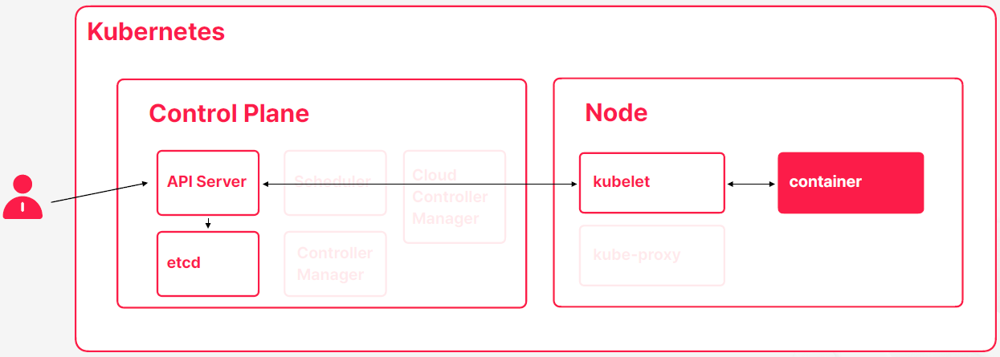

Kubernetes의 전체 동작 과정을 처음 보면 etcd가 단순히 스펙이나 상태를 저장하는 보조 저장소처럼 보일 수 있다.

예를 들어 사용자가 컨테이너 생성을 요청하면 API Server가 요청을 받고, Scheduler가 Node를 선택하고, kubelet이 컨테이너를 실행한다.

이 흐름만 보면 etcd가 없어도 동작할 수 있을 것처럼 느껴질 수 있다.

---

#### 단순 명령 실행 구조로 생각해보기

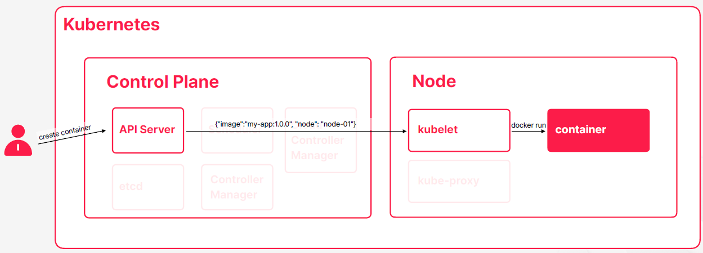

만약 Kubernetes와 비슷한 시스템을 일반적인 백엔드 API 서버처럼 만든다고 생각해보자.

흐름은 다음과 같을 수 있다.

```text
사용자
  ↓
API Server
  ↓
kubelet
  ↓
docker run
```

이 구조에서는 사용자가 API Server에 컨테이너 생성을 요청하고, API Server가 kubelet에 명령을 전달하고, kubelet이 `docker run` 같은 명령을 실행하면 된다.

즉 사용자의 요청이 결국 특정 Node에서 컨테이너 실행 명령으로 이어지는 구조다.

이런 구조에서는 etcd가 단순히 상태를 백업하는 용도로만 사용될 수 있다.

하지만 Kubernetes는 이런 방식으로 동작하지 않는다.

---

### Imperative System - 명령형 시스템

명령형 시스템은 사용자가 원하는 작업을 직접 명령하는 방식이다.

대부분의 프로그램과 서비스는 명령형 방식으로 동작한다.

예를 들어 Docker 명령어는 대표적인 명령형 방식이다.

```shell
docker run mysql
```

이 명령은 다음 의미를 가진다.

```text
mysql 컨테이너를 지금 하나 실행해라.
```

명령형 시스템에서는 사용자가 구체적인 동작을 지시하고, 시스템은 그 명령을 수행한다.

---

### Declarative System - 선언적 시스템

선언적 시스템은 구체적인 명령을 내리는 것이 아니라, 원하는 최종 상태를 제시하는 방식이다.

즉 사용자는 방법을 지시하지 않고 목표 상태를 선언한다.

그 상태에 도달하기 위한 방법은 시스템이 결정한다.

예를 들어 다음 두 문장은 비슷해 보이지만 의미가 다르다.

```text
컨테이너를 2개 생성해라.
```

이 문장은 명령형에 가깝다.

반면 다음 문장은 선언형에 가깝다.

```text
컨테이너가 2개 있어야 한다.
```

Kubernetes는 후자에 가까운 방식으로 동작한다.

---

### Imperative vs Declarative

#### 명령형 표현

```text
컨테이너를 2개 생성해라.
```

이 표현은 현재 컨테이너가 몇 개 있는지와 관계없이 새로운 컨테이너 2개를 추가로 생성하라는 의미에 가깝다.

예를 들어 현재 컨테이너가 이미 1개 있어도 2개를 더 만들 수 있다.

결과적으로 3개가 될 수 있다.

---

#### 선언형 표현

```text
컨테이너가 2개 있어야 한다.
```

이 표현은 현재 상태에 따라 다르게 동작한다.

* 현재 0개라면 2개 생성
* 현재 1개라면 1개 추가 생성
* 현재 2개라면 아무 작업도 하지 않음
* 현재 3개라면 1개 종료

즉 선언형 시스템은 현재 상태와 목표 상태를 비교한 뒤 필요한 작업만 수행한다.

---

### Reconciliation 패턴

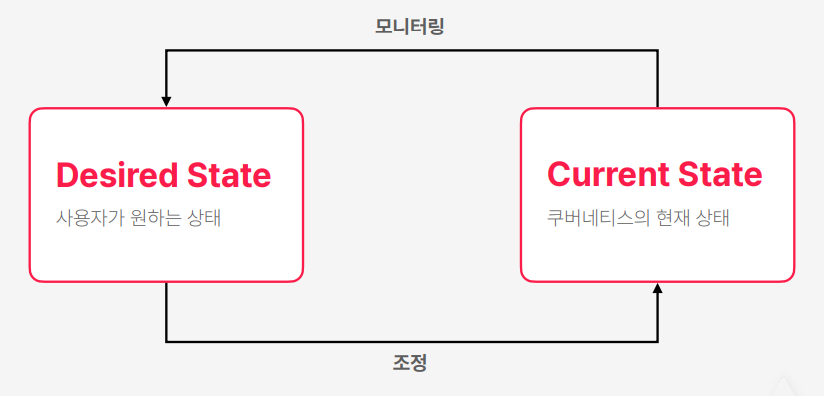

Reconciliation은 원하는 상태와 현재 상태를 비교하고, 두 상태가 다르면 이를 일치시키는 패턴이다.

Kubernetes는 다음 과정을 계속 반복한다.

```text
원하는 상태 확인
    ↓
현재 상태 확인
    ↓
차이 비교
    ↓
조정
    ↓
다시 확인
```

사용자는 Kubernetes에 원하는 상태를 전달한다.

Kubernetes는 현재 클러스터 상태를 지속적으로 모니터링한다.

만약 원하는 상태와 현재 상태 사이에 불일치가 발생하면 Kubernetes는 조정 작업을 수행해 두 상태가 일치하도록 만든다.

---

#### 원하는 상태와 현재 상태의 차이

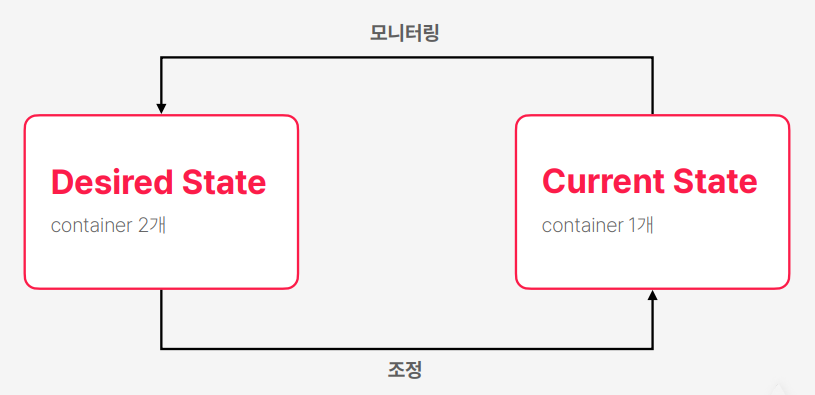

예를 들어 사용자가 원하는 상태를 다음과 같이 정의했다고 하자.

```text
컨테이너가 2개 있어야 한다.
```

Kubernetes는 이 목표 상태를 저장한다.

이후 현재 상태를 확인했는데 컨테이너가 1개만 실행 중이라면, 원하는 상태와 현재 상태 사이에 불일치가 발생한다.

```text
원하는 상태: 2개
현재 상태: 1개
```

이 경우 Kubernetes는 컨테이너를 1개 더 실행한다.

---

#### 예기치 않은 종료와 복구

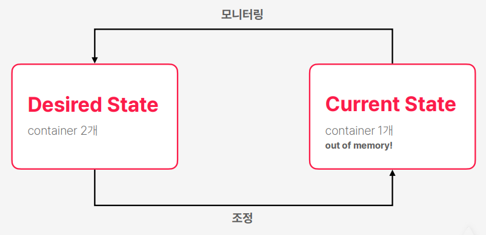

사용자가 아무 요청을 하지 않았더라도 실행 중인 컨테이너 하나가 OOM(Out Of Memory) 같은 문제로 종료될 수 있다.

그러면 현재 상태는 다음과 같이 바뀐다.

```text
원하는 상태: 2개
현재 상태: 1개
```

Kubernetes는 이 차이를 감지하고 목표 상태를 맞추기 위해 새로운 컨테이너를 하나 더 실행한다.

이것이 Kubernetes의 Self-Healing 동작으로 이어진다.

---

### Self-Healing

Self-Healing은 Kubernetes의 선언적 특징에서 자연스럽게 나타나는 기능이다.

컨테이너의 상태가 목표 상태에서 벗어나면 Kubernetes가 이를 자동으로 수정한다.

예를 들어 다음과 같은 상황에서 Self-Healing이 동작한다.

* 컨테이너 프로세스 종료
* 컨테이너 비정상 상태
* OOM으로 인한 종료
* Node 장애
* Pod 삭제
* 이미지 Pull 실패 후 재시도

운영 환경에서는 이 기능이 매우 강력하다.

개발자나 운영자가 직접 컨테이너를 다시 실행하지 않아도 Kubernetes가 목표 상태를 기준으로 복구를 시도하기 때문이다.

---

#### 버전 업데이트와 Self-Healing

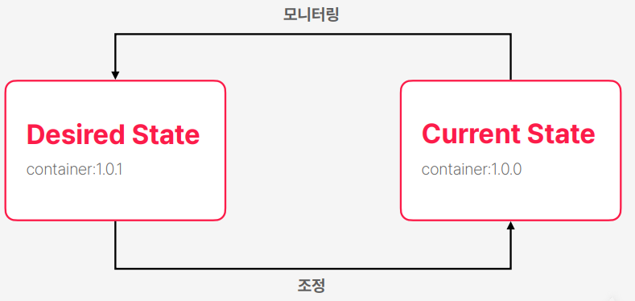

현재 1.0.0 버전의 컨테이너가 실행 중이라고 하자.

사용자가 목표 상태를 1.0.1 버전으로 변경하면 Kubernetes는 현재 상태가 목표 상태와 다르다고 판단한다.

```text
원하는 상태: 1.0.1
현재 상태: 1.0.0
```

이 경우 Kubernetes는 새로운 버전의 컨테이너를 실행하고 기존 버전의 컨테이너를 제거하는 방식으로 상태를 맞춘다.

일반적으로는 새로운 컨테이너를 먼저 실행하고, 정상 상태가 확인되면 이전 컨테이너를 제거하는 방식으로 진행된다.

다만 실제 종료와 생성 순서는 Deployment 전략 설정에 따라 달라질 수 있다.

---

#### 이미지가 없을 때의 동작

만약 목표 상태가 1.0.1인데 이미지 저장소에 1.0.1 이미지가 없다면 Kubernetes는 목표 상태에 도달하지 못한다.

이 경우 Kubernetes는 계속 재시도한다.

```text
1.0.1 이미지 Pull 시도
    ↓
실패
    ↓
다시 시도
    ↓
실패
    ↓
반복
```

사용자가 목표 상태를 다시 1.0.0으로 되돌리거나, 1.0.1 이미지를 저장소에 Push하기 전까지 Kubernetes는 계속 목표 상태에 도달하려고 시도한다.

---

### Restarting the Container

Kubernetes에서 "컨테이너를 재시작한다"는 표현은 조금 애매하다.

Kubernetes는 선언형 시스템이기 때문에 "재시작"이라는 명령 자체가 목표 상태로 표현되기 어렵다.

컨테이너가 2개 있어야 한다는 목표 상태가 이미 만족되고 있다면, Kubernetes 입장에서는 추가 작업을 할 이유가 없다.

그래도 실무에서는 재시작이 필요할 때가 있다.

이 경우 명령형 커맨드를 사용하거나 목표 상태를 변경하는 방식으로 재시작을 유도한다.

---

#### rollout restart

Deployment를 재시작할 때 가장 자주 사용하는 명령어는 다음과 같다.

```shell
kubectl rollout restart deployment my-app
```

이 명령은 Deployment의 Pod들을 순차적으로 새로 생성하도록 만든다.

---

#### replicas를 0으로 줄였다가 다시 늘리기

또 다른 방식은 replicas를 0으로 줄였다가 다시 늘리는 것이다.

```shell
kubectl scale deployment my-app --replicas=0
kubectl scale deployment my-app --replicas=2
```

이 방식은 모든 Pod를 종료한 뒤 다시 생성하므로 서비스 중단이 발생할 수 있다.

---

### 컨테이너 실행 과정

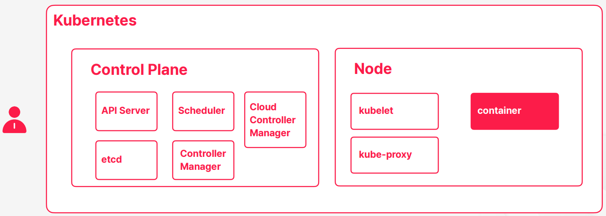

Kubernetes를 사용할 때 개발자가 하는 일은 원하는 스펙을 작성해 Kubernetes에 전달하는 것이다.

---

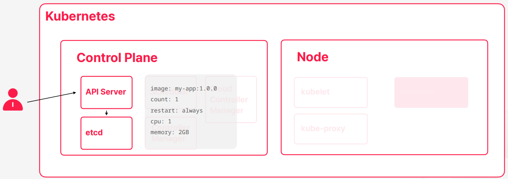

전달된 스펙은 etcd에 목표 상태로 저장된다.

Kubernetes는 이 목표 상태를 기준으로 현재 클러스터 상태를 맞춰간다.

---

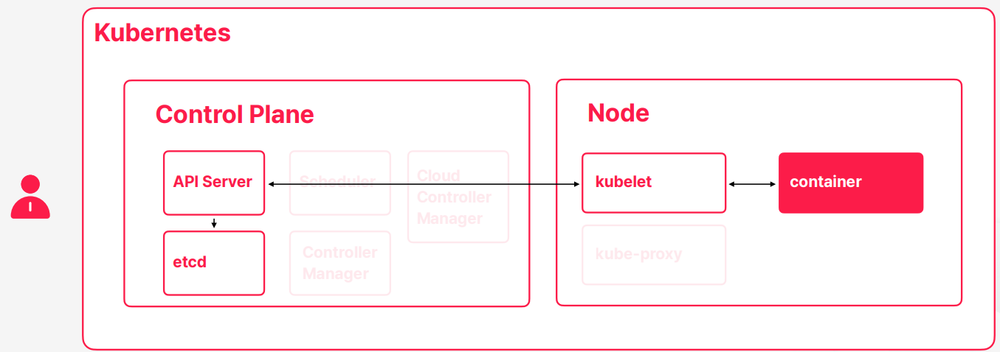

목표 상태를 현재 상태에 맞추기 위해 Kubernetes는 필요한 컨테이너를 실행한다.

이 과정에서 Scheduler는 적절한 Node를 찾고, kubelet은 해당 Node에서 컨테이너를 실행한다.

이후 kubelet은 컨테이너 상태를 지속적으로 모니터링하고 API Server를 통해 상태를 업데이트한다.

---

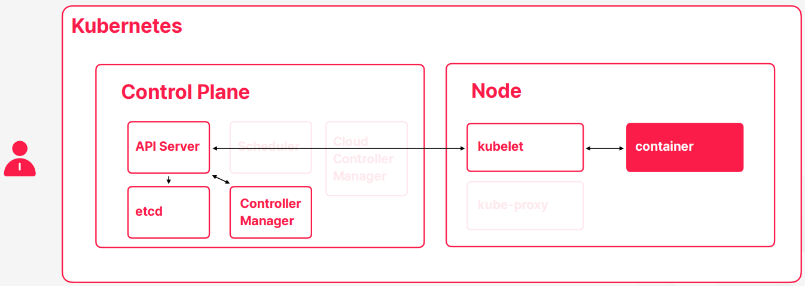

컨테이너가 이상한 동작을 하거나 비정상 상태가 되면 kubelet이 이를 감지한다.

kubelet은 API Server를 통해 현재 상태가 정상적이지 않다는 정보를 업데이트한다.

Controller Manager는 API Server를 통해 상태 불일치를 확인하고, 목표 상태로 복구하기 위한 조치를 예약한다.

즉 Kubernetes는 한 번 컨테이너를 실행하고 끝나는 것이 아니라, 계속 상태를 관찰하고 목표 상태를 유지하려고 동작한다.

---

### Reconciliation for Application Developer

Kubernetes의 Reconciliation 구조는 애플리케이션 개발자에게도 중요한 의미를 가진다.

#### Declarative

Kubernetes에서는 대부분의 동작이 선언적으로 이루어진다.

개발자는 "무엇을 할지"보다 "어떤 상태가 되어야 하는지"를 정의한다.

---

#### Idempotency

같은 정의를 여러 번 적용해도 항상 같은 결과가 나와야 한다.

예를 들어 같은 Deployment YAML을 여러 번 적용해도 Pod가 계속 추가로 늘어나는 것이 아니라, 정의된 replicas 수에 맞춰져야 한다.

---

#### Self-Healing

현재 상태에 예상하지 못한 불일치가 생겨도 Kubernetes는 이를 스스로 복구한다.

예를 들어 Pod 하나가 죽어도 목표 상태가 replicas 2라면 Kubernetes는 다시 Pod를 생성한다.

---

#### Consistency

Kubernetes는 현재 상태나 중간 동작과 관계없이 최종적으로 목표 스펙에 상태를 맞추려고 한다.

즉 일시적으로 실패하거나 지연이 발생해도 최종적으로 원하는 상태에 도달하려는 방향으로 동작한다.

---

### 개발자들이 신경써야 할 것들

Kubernetes가 Reconciliation과 Self-Healing을 잘 수행하려면 애플리케이션도 그에 맞게 설계되어야 한다.

#### 관측하기 좋은 애플리케이션 만들기

Kubernetes가 애플리케이션 상태를 판단할 수 있도록 다음 기능을 제공하는 것이 좋다.

* Health Check
* Readiness Probe
* Liveness Probe
* Metrics
* Logging

---

#### 목표 상태를 잘 정의하기

Deployment, Service, ConfigMap, Secret 등 Kubernetes 객체의 스펙을 명확하게 정의해야 한다.

잘못된 목표 상태를 정의하면 Kubernetes는 잘못된 상태를 계속 유지하려고 시도한다.

---

#### 체계적인 버전 관리

이미지 태그를 명확하게 관리해야 한다.

예를 들어 운영 환경에서는 다음과 같은 태그가 좋다.

```text
my-app:1.0.0
my-app:1.0.1
my-app:2025.03.01
my-app:git-a1b2c3
```

반대로 `latest` 태그만 사용하면 어떤 버전이 실행 중인지 추적하기 어렵다.

---

#### 자동화된 빌드와 배포

Kubernetes는 선언형 스펙을 기반으로 동작하기 때문에 CI/CD와 잘 결합된다.

일반적인 흐름은 다음과 같다.

```text
Code Commit
    ↓
Build
    ↓
Image Push
    ↓
Manifest Update
    ↓
kubectl apply 또는 GitOps
```

---

#### 갑자기 종료되거나 새로 실행되어도 문제없는 애플리케이션

Kubernetes는 Pod를 언제든 종료하고 새로 실행할 수 있다.

따라서 애플리케이션은 다음 특성을 가져야 한다.

* Stateless 구조
* Graceful Shutdown 지원
* 외부 저장소 사용
* 중복 실행에 안전한 처리
* 재시도에 안전한 API 설계

---

### 정리

Kubernetes는 명령형 시스템이 아니라 선언형 시스템에 가깝다.

사용자는 원하는 상태를 정의하고, Kubernetes는 현재 상태와 원하는 상태를 지속적으로 비교하면서 두 상태를 일치시키려고 한다.

이 과정이 Reconciliation이고, 이 구조를 통해 Self-Healing이 가능해진다.

결국 Kubernetes를 잘 사용하려면 단순히 YAML 문법을 아는 것보다 다음 개념을 이해하는 것이 더 중요하다.

* 원하는 상태
* 현재 상태
* 상태 불일치
* 조정
* 자동 복구
* 반복적인 상태 확인

이 개념을 이해하면 Deployment, ReplicaSet, Service, Probe, Rolling Update 같은 Kubernetes 기능들이 훨씬 자연스럽게 이해된다.


## 04. Selector와 Label

### Selector와 Label

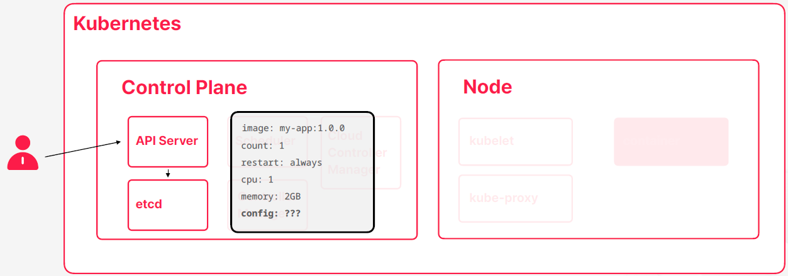

Kubernetes에는 컨테이너뿐만 아니라 컨테이너와 관련된 다양한 객체들이 존재한다.

* Pod
* Service
* Deployment
* ReplicaSet
* ConfigMap
* Secret
* Ingress
* Job
* StatefulSet

이러한 객체들은 서로 독립적으로 존재하는 것이 아니라 서로 연결되어 동작한다.

Kubernetes에서 객체의 스펙을 정의할 때는 단순히 객체 하나를 만드는 것이 아니라, 다른 객체와 어떤 관계를 가지는지를 함께 정의하는 것이 매우 중요하다.

---

#### 정적인 관계 정의

Kubernetes는 선언형 시스템이기 때문에 대부분의 설정이 배포 전에 결정된다.

예를 들어 다음과 같은 내용들이 미리 정의된다.

* 어떤 Pod를 사용할 것인가
* 어떤 네트워크를 사용할 것인가
* 어떤 설정 값을 사용할 것인가
* 어떤 객체와 연결할 것인가

이러한 관계들은 애플리케이션이 실행된 이후 동적으로 연결되는 것이 아니라 YAML 스펙을 작성하는 시점에 이미 정의된다.

즉 Kubernetes에서는 객체 간의 관계 역시 선언적으로 관리된다.

---

### 쿠버네티스를 사용하지 않을 때

기존 인프라 환경에서는 서버를 IP 주소로 식별하는 경우가 많다.

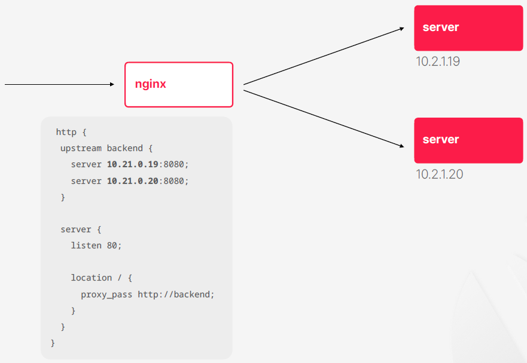

예를 들어 Nginx가 두 대의 서버로 트래픽을 분산한다고 가정해보자.

```text
192.168.0.10
192.168.0.11
```

일반적인 서버 환경에서는 서버가 먼저 생성되고 IP 주소가 부여된다.

그 이후에 애플리케이션이 해당 서버 위에서 실행된다.

즉 서버의 IP는 애플리케이션이 배포되기 전에 이미 결정되어 있다.

---

#### 기존 구조의 문제점

Nginx 설정은 다음과 같이 구체적이다.

```nginx
upstream app {
    server 192.168.0.10;
    server 192.168.0.11;
}
```

이 구조의 문제는 서버가 추가되거나 제거될 때마다 설정을 수정해야 한다는 점이다.

예를 들어 서버가 한 대 추가되면 다음 작업이 필요하다.

1. 서버 생성
2. IP 확인
3. Nginx 설정 수정
4. Nginx 재시작

즉 인프라의 변화가 애플리케이션 설정 변경으로 이어진다.

---

### 쿠버네티스 사용

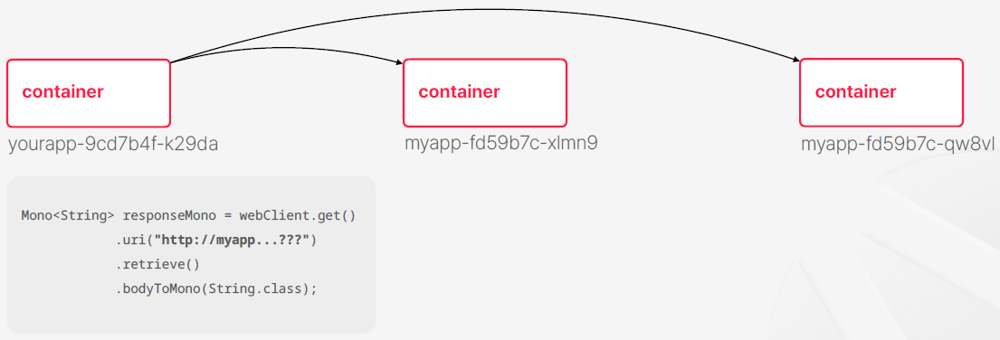

Kubernetes에서도 객체가 생성되면 고유한 식별자가 생성된다.

예를 들어 Pod 이름은 다음처럼 생성될 수 있다.

```text
user-app-78fc7c59db-jh6k8
user-app-78fc7c59db-v1f2m
```

이러한 식별자는 객체가 생성되는 순간 결정된다.

경우에 따라 사용자가 직접 이름을 지정할 수도 있지만 대부분의 Pod는 랜덤한 해시값이 포함된다.

---

#### 왜 랜덤한 이름을 사용할까?

Pod는 다음 상황에서 계속 바뀔 수 있다.

* 스케일 아웃
* 롤링 업데이트
* 장애 복구
* 노드 장애
* 재스케줄링

따라서 개발자가 미리 Pod 이름을 알 수 없다.

```text
user-app-abc123
user-app-def456
user-app-xyz789
```

어떤 Pod가 생성될지는 실행 시점에 결정된다.

---

### 특정 Pod를 직접 호출하면 안 될까?

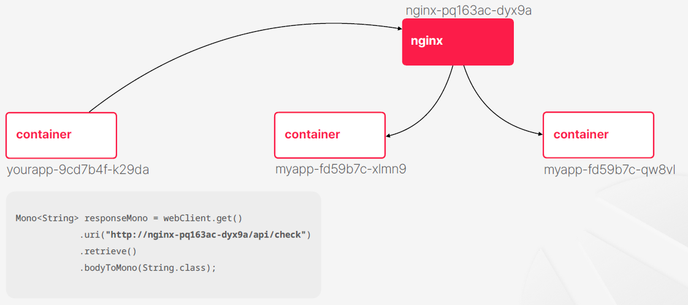

다음과 같이 생각할 수도 있다.

```text
Nginx 하나만 고정으로 띄워두고
Nginx가 모든 Pod를 관리하면 되지 않을까?
```

과거 인프라에서는 실제로 이런 구조를 많이 사용했다.

하지만 Kubernetes에서는 문제가 발생한다.

Nginx 역시 컨테이너다.

그렇다면 Nginx는 다음 문제를 해결해야 한다.

```text
어떤 Pod로 요청을 보낼 것인가?
```

Pod가 계속 생성되고 삭제되기 때문에 Nginx 역시 계속 설정을 변경해야 한다.

결국 동일한 문제가 반복된다.

---

### IP를 사용하면 안 될까?

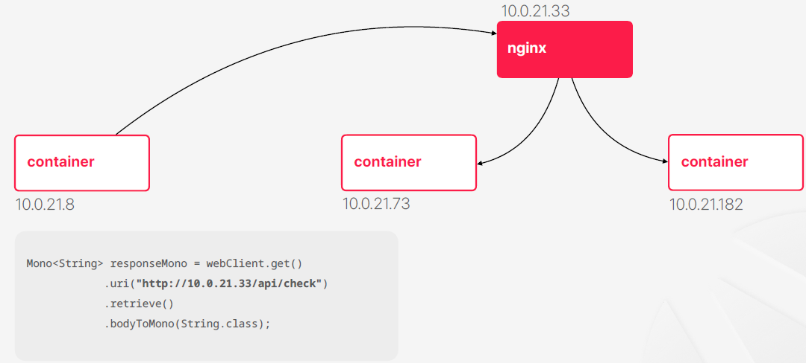

Kubernetes의 Pod는 모두 내부 IP를 가진다.

예를 들면 다음과 같다.

```text
10.244.0.12
10.244.1.8
10.244.2.5
```

이론적으로는 IP를 사용해서 통신할 수 있다.

하지만 Kubernetes에서는 거의 사용하지 않는다.

그 이유는 다음과 같다.

* Pod가 재생성되면 IP가 변경된다.
* 노드가 변경되면 IP가 변경된다.
* 스케일 아웃 시 IP가 추가된다.
* 장애 복구 시 새로운 IP가 생성된다.

즉 IP는 매우 불안정한 식별자이다.

실제로 Kubernetes 기반 개발에서는 Pod IP를 알지 못해도 전혀 문제가 없다.

오히려 Pod IP에 의존하는 구조는 Kubernetes스럽지 않은 설계라고 볼 수 있다.

---

### Label과 Selector

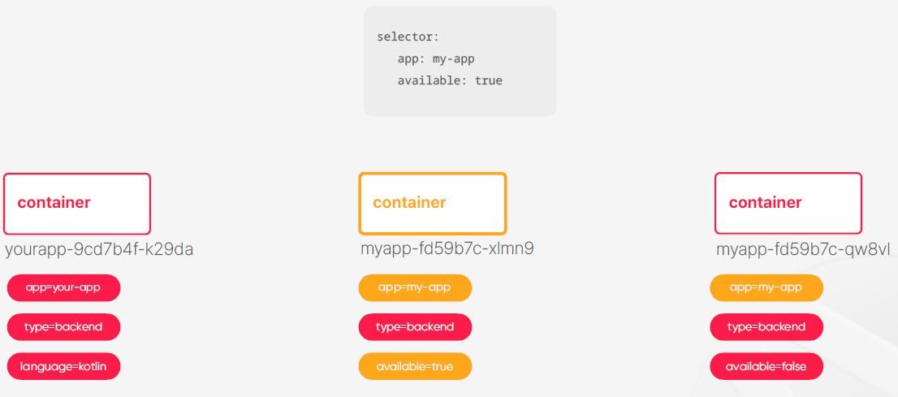

Kubernetes는 객체를 식별하기 위해 Label을 사용한다.

Label은 객체에 붙이는 태그라고 생각하면 된다.

예를 들어 다음과 같이 정의할 수 있다.

```yaml
labels:
  app: user
  tier: backend
  env: production
```

Label은 Key-Value 형태로 구성된다.

```text
app=user
tier=backend
env=production
```

---

#### Label

Label은 객체에 붙어 있는 데이터이다.

```yaml
metadata:
  labels:
    app: user
    env: prod
```

---

#### Selector

Selector는 Label을 검색하는 조건이다.

```yaml
selector:
  app: user
```

즉 다음 의미가 된다.

```text
app=user 라는 Label을 가진 객체를 찾아라.
```

데이터베이스 관점으로 보면 다음과 비슷하다.

```sql
SELECT *
FROM pod
WHERE app = 'user'
```

Label이 데이터라면 Selector는 쿼리라고 생각해도 좋다.

---

### Service와 Selector

가장 대표적인 예가 Service이다.

```yaml
apiVersion: v1
kind: Service
metadata:
  name: user-service
spec:
  selector:
    app: user
```

Pod가 다음과 같다면

```yaml
metadata:
  labels:
    app: user
```

Service는 해당 Pod들을 자동으로 찾는다.

---

Pod가 2개라면

```text
user-pod-1
user-pod-2
```

Pod가 10개로 늘어나면

```text
user-pod-1
user-pod-2
...
user-pod-10
```

Service는 아무 설정 변경 없이 새로운 Pod들을 자동으로 연결한다.

이것이 Kubernetes가 IP가 아닌 Label을 사용하는 가장 큰 이유이다.

---

### Deployment와 Selector

Deployment 역시 Selector를 사용한다.

```yaml
selector:
  matchLabels:
    app: user
```

```yaml
template:
  metadata:
    labels:
      app: user
```

Deployment는 자신의 Label을 가진 Pod들을 관리한다.

따라서 다음 작업들이 가능해진다.

* Pod 생성
* Pod 삭제
* Pod 복구
* Pod 교체
* Rolling Update

---

### Label 설계 예시

실무에서는 다음과 같은 Label 구조를 많이 사용한다.

```yaml
labels:
  app: payment
  component: api
  env: production
  version: v1
```

예시:

```text
app=payment
component=api
env=production
version=v1
```

이를 이용하면 다음과 같은 Selector가 가능하다.

```yaml
selector:
  app: payment
  env: production
```

---

### 쿠버네티스의 추상화 컨셉

Kubernetes는 매우 추상적인 방식으로 객체를 다룬다.

---

#### 특정 대상을 다루지 않는다.

```text
192.168.0.10 서버
```

를 다루지 않는다.

---

#### 동일한 역할을 하는 집단을 다룬다.

```text
app=user 라는 역할을 가진 Pod들
```

을 다룬다.

---

#### 인스턴스보다 클래스에 가깝다.

객체지향 관점에서 보면 다음과 비슷하다.

```text
Pod 하나 = 객체(Instance)

app=user = 클래스(Class)
```

Service는 특정 객체를 바라보는 것이 아니라 특정 특성을 가진 객체 집합을 바라본다.

---

### 개발자가 이해해야 할 핵심

Kubernetes에서는 다음과 같은 방식으로 생각하는 것이 중요하다.

❌ 잘못된 사고

```text
10.0.0.15 서버를 호출해야 한다.
```

```text
pod-abc123을 호출해야 한다.
```

---

⭕ Kubernetes 방식

```text
user-service를 호출한다.
```

```text
app=user인 Pod들을 사용한다.
```

```text
backend 역할을 하는 Pod들을 연결한다.
```

---

### 정리

Selector와 Label은 Kubernetes 객체 관계의 핵심이다.

* Label은 객체에 붙는 태그이다.
* Selector는 Label을 검색하는 조건이다.
* Service는 Selector로 Pod를 찾는다.
* Deployment는 Selector로 Pod를 관리한다.
* Kubernetes는 IP나 Pod 이름이 아니라 역할을 기준으로 객체를 연결한다.

결국 Kubernetes는 특정 인스턴스를 다루는 플랫폼이 아니라, 동일한 역할을 수행하는 집합을 추상적으로 다루는 플랫폼이라고 이해하면 된다.

만약 "인스턴스가 아니라 클래스를 다루는 느낌", "특정 서버가 아니라 역할을 가진 집단을 다루는 느낌"이 든다면 Kubernetes의 핵심 개념을 제대로 이해한 것이다.


## 05. Kubernetes의 네트워크

### Kubernetes의 네트워크

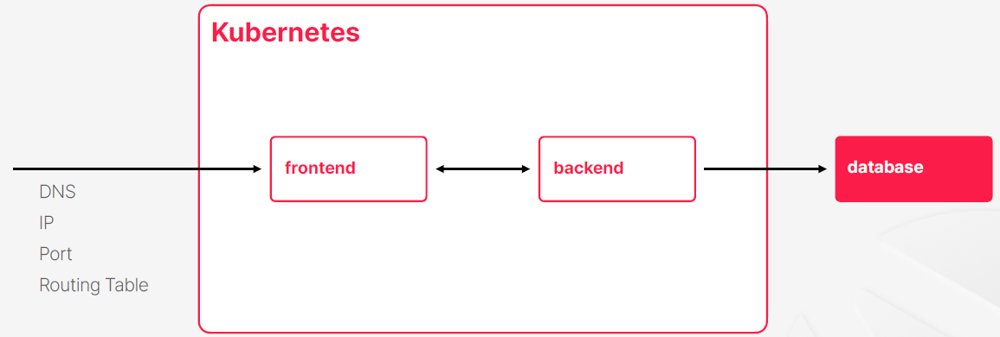

Kubernetes 네트워크는 크게 세 가지 영역으로 나눌 수 있다.

* 외부에서 클러스터 내부로 들어오는 네트워크
* 클러스터 내부 Pod 간 통신을 위한 네트워크
* 클러스터 내부에서 외부 시스템으로 나가는 네트워크

기존 인프라에서는 IP, 포트, 라우팅과 같은 물리적인 네트워크 개념을 직접 사용했다.

반면 Kubernetes는 Service, Ingress, Pod와 같은 객체를 이용하여 네트워크를 추상화한다.

즉 개발자는 IP 주소나 실제 포트를 직접 다루기보다 Kubernetes가 제공하는 가상 네트워크를 사용하게 된다.

Kubernetes를 사용한다는 것은 Kubernetes가 정의한 네트워크 객체와 통신 모델을 새롭게 배우는 것이라고 볼 수 있다.

---

### 왜 Kubernetes는 독자적인 네트워크를 만들었을까?

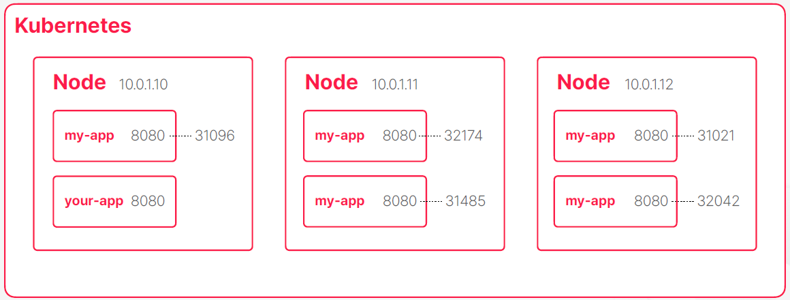

Kubernetes의 노드는 물리 서버일 수도 있고 가상 머신일 수도 있다.

각 노드는 일반적인 서버처럼 다음 기능들을 가지고 있다.

* 고유한 IP 주소
* 외부 네트워크 연결
* 노드 간 통신
* 외부 시스템 호출

문제는 컨테이너가 여러 노드에 분산되어 실행된다는 점이다.

예를 들어 다음과 같은 상황을 생각해볼 수 있다.

* 노드 3개
* 동일한 애플리케이션 컨테이너 5개

이 경우 일부 노드에는 동일한 애플리케이션이 여러 개 실행될 수 있다.

---

#### 동일한 포트 문제

모든 애플리케이션이 8080 포트를 사용한다고 가정해보자.

```text
Node-1
 ├─ app-a : 8080
 └─ app-b : 8080

Node-2
 ├─ app-c : 8080
 └─ app-d : 8080
```

하나의 운영체제에서는 동일한 포트를 여러 프로세스가 사용할 수 없다.

즉 다음과 같은 방식은 불가능하다.

```text
192.168.0.10:8080
```

이 주소만으로는 어떤 컨테이너인지 구분할 수 없다.

---

#### 랜덤 포트 매핑 방식의 문제

Docker처럼 다음과 같이 호스트 포트를 랜덤하게 매핑할 수도 있다.

```text
8081 -> app-a
8082 -> app-b
8083 -> app-c
```

하지만 이런 방식은 애플리케이션이 실행되기 전에는 포트를 알 수 없다.

즉 개발 시점에 다음과 같은 코드를 작성할 수 없다.

```java
http://192.168.0.10:8083
```

왜냐하면 8083이라는 포트가 언제 할당될지 알 수 없기 때문이다.

---

### Overlay Network

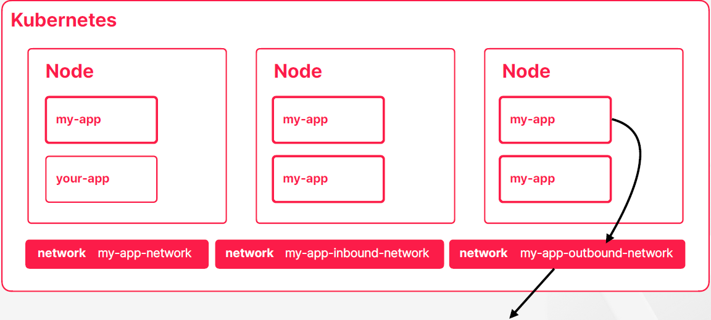

Kubernetes는 이러한 문제를 해결하기 위해 가상의 네트워크 계층을 제공한다.

실제 네트워크 위에 또 하나의 가상 네트워크를 만든다.

이를 오버레이 네트워크(Overlay Network)라고 부른다.

```text
애플리케이션
        ↓
Kubernetes Service
        ↓
Overlay Network
        ↓
실제 노드 네트워크
```

개발자는 실제 노드의 IP나 포트를 알 필요가 없다.

---

### Label을 이용한 대상 식별

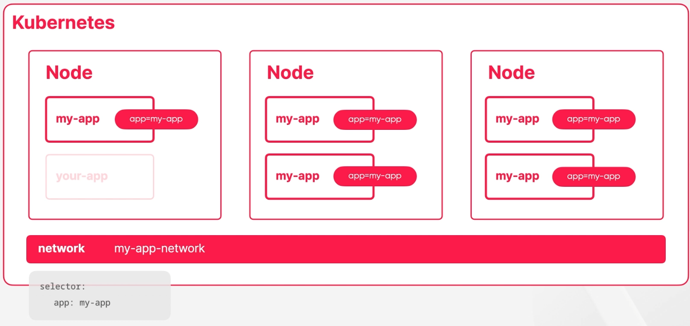

Kubernetes는 Label과 Selector를 이용하여 트래픽 대상을 찾는다.

```yaml
labels:
  app: my-app
```

Service는 Selector를 이용해 Pod를 찾는다.

```yaml
selector:
  app: my-app
```

이렇게 되면 Pod가 어느 노드에서 실행되는지는 중요하지 않다.

* Pod가 이동해도 된다.
* Pod가 추가되어도 된다.
* Pod가 삭제되어도 된다.

트래픽을 보내야 할 대상을 Label만으로 식별할 수 있기 때문이다.

---

### Service와 가상 IP

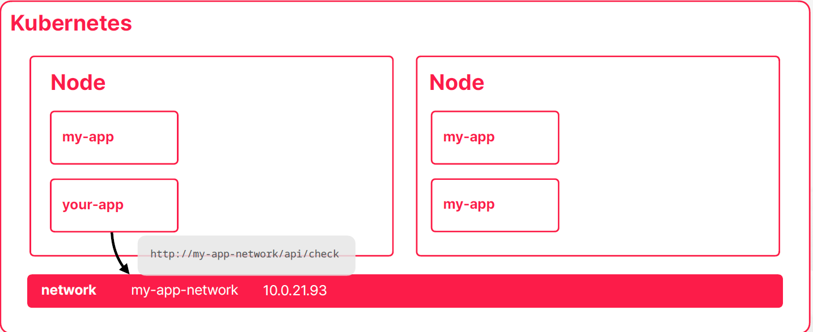

예를 들어 다음 Service가 있다고 하자.

```text
my-app-network
```

이 Service는 내부적으로 다음과 같은 Cluster IP를 가진다.

```text
10.0.21.93
```

즉 다음 두 호출은 동일한 의미를 가진다.

```text
my-app-network
```

```text
10.0.21.93
```

---

하지만 이 IP는 실제 서버의 IP가 아니다.

Service 자체도 실제 프로세스가 아니다.

Service는 각 노드에 설정된 라우팅 규칙들의 집합이라고 볼 수 있다.

---

#### kube-proxy의 역할

Kubernetes는 Service가 생성되거나 삭제될 때 다음 작업을 수행한다.

* iptables 갱신
* netfilter 갱신
* 라우팅 규칙 변경

즉 트래픽 분산은 Nginx 같은 애플리케이션이 하는 것이 아니다.

운영체제 수준의 네트워크 규칙이 트래픽을 전달한다.

```text
Service
    ↓
iptables
    ↓
Pod 중 하나 선택
```

따라서 매우 빠른 성능을 제공할 수 있다.

---

### 내부 Service를 외부에 노출하면?

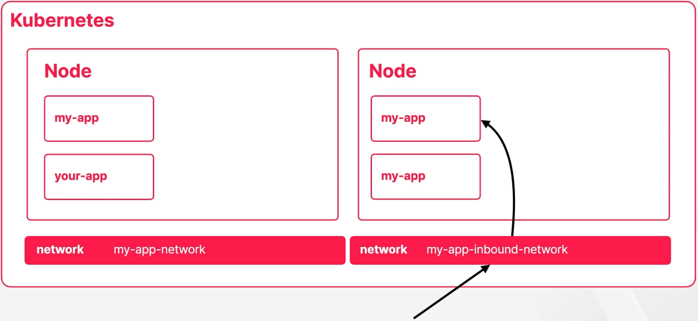

Service가 트래픽을 분산해주니 외부에서도 Service를 직접 호출하면 좋을 것처럼 보인다.

하지만 Service는 실제 서버가 아니다.

Service는 단순한 라우팅 규칙이다.

외부 요청은 결국 특정 노드에 먼저 도착해야 한다.

```text
외부
   ↓
어떤 노드?
   ↓
Service
   ↓
Pod
```

만약 모든 요청이 하나의 노드로 들어간다면 병목이 발생한다.

그래서 이런 방식은 일반적으로 사용하지 않는다.

---

### NodePort 방식

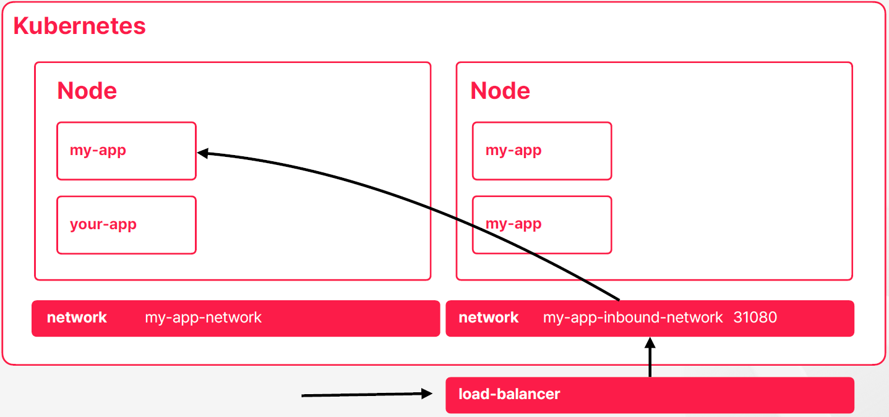

초기 Kubernetes에서는 NodePort를 많이 사용했다.

모든 노드가 동일한 포트를 열어준다.

```text
Node-1 : 30080
Node-2 : 30080
Node-3 : 30080
```

외부 Load Balancer가 노드들을 대상으로 트래픽을 보낸다.

```text
Load Balancer
      ↓
Node-1
Node-2
Node-3
      ↓
Service
      ↓
Pod
```

이 방식은 지금도 사용할 수 있지만 최근에는 많이 사용하지 않는다.

---

### Ingress 방식

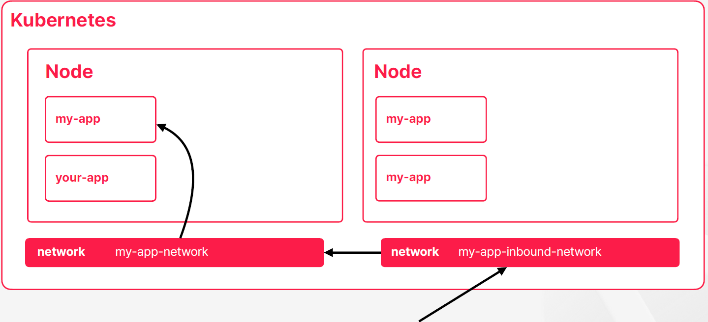

현재 가장 많이 사용하는 방식이다.

Kubernetes는 외부 트래픽 처리를 위한 Ingress 객체를 제공한다.

Ingress는 다음 역할을 수행한다.

* Reverse Proxy
* URL 라우팅
* SSL 종료
* 트래픽 분산

---

예를 들어 다음과 같이 구성할 수 있다.

```text
/user → user-service
/order → order-service
/payment → payment-service
```

외부 요청이 들어오면 다음 순서로 처리된다.

```text
Client
   ↓
Ingress
   ↓
Service
   ↓
Pod
```

---

Ingress는 실제 구현체가 존재한다.

대표적인 구현체는 다음과 같다.

* NGINX Ingress Controller
* AWS ALB Controller
* Traefik
* HAProxy

즉 Ingress는 실제로 트래픽을 처리하는 프로세스를 가진다.

반면 Service는 단순한 네트워크 규칙이다.

---

### Kubernetes 네트워크 구조

```text
외부 사용자
      ↓
Ingress
      ↓
Service
      ↓
Pod
```

---

내부 통신은 다음과 같다.

```text
Application A
      ↓
Service
      ↓
Application B
```

---

### 개발자를 위한 Kubernetes 네트워크

Kubernetes 환경에서는 다음 특징을 반드시 이해해야 한다.

---

#### 모든 요청은 다른 Pod로 갈 수 있다.

```text
요청 1 → pod-a
요청 2 → pod-c
요청 3 → pod-b
```

항상 같은 서버가 응답한다는 보장이 없다.

---

#### 상태를 가지지 않는 구조가 중요하다.

세션이나 메모리 상태에 의존하면 문제가 발생한다.

```text
사용자 A → pod-1 로그인
사용자 A → pod-2 요청
```

세션이 pod-1에만 있다면 인증이 실패할 수 있다.

따라서 다음 방식이 필요하다.

* JWT
* Redis Session
* Database Session

---

#### 요청은 독립적으로 처리되어야 한다.

모든 요청은 어느 Pod가 처리하더라도 동일한 결과가 나와야 한다.

---

#### 재시도는 애플리케이션이 처리한다.

Kubernetes Service는 단순히 트래픽만 분산한다.

다음 기능들은 기본적으로 제공하지 않는다.

* Retry
* Timeout
* Circuit Breaker

따라서 애플리케이션에서 처리해야 한다.

예를 들어 다음과 같은 라이브러리를 사용할 수 있다.

* Resilience4j
* Spring Retry

---

#### 모니터링이 중요하다.

Kubernetes는 Pod가 계속 생성되고 삭제된다.

따라서 다음 정보들을 수집할 수 있어야 한다.

* 로그
* 메트릭
* 트레이싱
* 헬스체크

관측 가능한 애플리케이션일수록 Kubernetes와 잘 어울린다.

---

### 정리

Kubernetes 네트워크의 핵심은 물리적인 네트워크를 추상화하는 것이다.

* Pod IP를 직접 사용하지 않는다.
* Service가 내부 통신을 담당한다.
* Ingress가 외부 트래픽을 담당한다.
* Label과 Selector로 대상을 식별한다.
* 모든 Pod는 언제든 교체될 수 있다.
* 애플리케이션은 상태를 가지지 않는 구조가 유리하다.

개발자는 IP, 포트, 서버보다 Service, Label, Ingress와 같은 Kubernetes 객체를 중심으로 시스템을 바라보는 것이 중요하다.


---

## 06. 저장소와 볼륨

컨테이너 환경을 처음 접할 때 많은 사람이 공통적으로 겪는 문제가 있다. 컨테이너 내부에서 파일을 저장했다가, 컨테이너를 재시작하는 순간 파일이 흔적도 없이 사라지는 경험이다.

도커에서는 이런 문제를 피하기 위해 “호스트 디렉토리 ↔ 컨테이너 디렉토리”를 연결하는 방식(바인드 마운트)을 많이 사용한다. 컨테이너는 사라져도 파일은 호스트에 남아 있으니 데이터가 유실되지 않는다.

그런데 쿠버네티스 환경에서는 이야기가 조금 달라진다. 쿠버네티스는 Pod를 스케줄링하면서 언제든 **다른 노드로 Pod를 옮길 수 있기 때문**이다.
호스트 디렉토리를 그대로 사용한다면, 노드가 바뀌는 순간 저장한 파일도 함께 사라지거나 전혀 다른 데이터를 바라보게 된다.

그래서 쿠버네티스는 저장소를 직접 다루는 방식을 권장하지 않고, 대신 자체적인 저장소 추상화 방식을 제공한다. 이를 통해 개발자는 저장소 타입과 위치에 상관없이 **일관된 방식으로 파일 시스템을 다룰 수 있다.**

---

### 쿠버네티스가 저장소를 추상화하는 이유

쿠버네티스의 저장소 추상화는 단순한 편의 기능이 아니다. 다음과 같은 목적에서 출발한다.

* 저장소 타입이 무엇이든(PVC, 블록 스토리지, NAS, 클라우드 디스크 등) 동일한 인터페이스 제공
* Pod가 노드를 이동해도 동일한 파일 시스템을 사용할 수 있도록 보장
* 애플리케이션 로직이 “저장소의 물리 위치”에 의존하지 않도록 분리
* 인프라팀은 스토리지를 관리하고, 앱 개발자는 추상화된 볼륨만 바라보도록 역할 구분

실제 저장소는 네트워크 스토리지일 수도 있고, 클라우드 블록 디스크일 수도 있다. 그러나 Pod는 단지 “볼륨”이라는 추상화된 객체만 바라본다. Pod 내부의 특정 경로와 볼륨 객체를 연결해두면, 스케줄링이 어떻게 움직이든 컨테이너는 늘 동일한 파일 시스템을 사용하는 것처럼 동작할 수 있다.

---

### 볼륨의 두 가지 큰 분류: 임시 볼륨 vs 영구 볼륨

쿠버네티스의 볼륨은 크게 **임시 볼륨(Temporary Volume)**과 **영구 볼륨(Persistent Volume)**로 나눌 수 있다.
둘은 목적도, 특성도, 쓰임새도 완전히 다르다.

---

### 1) 임시 볼륨 (Ephemeral Volume)

임시 볼륨은 Pod의 생명주기와 함께 존재하는 저장소다.
Pod가 삭제되면 함께 삭제되기 때문에 **지워져도 괜찮은 데이터**를 저장할 때 사용한다.

특징은 다음과 같다.

* Pod가 살아있는 동안만 유지
* 컨테이너가 재시작해도 유지되지만, Pod 자체가 삭제되면 사라짐
* 캐싱 용도, 임시 작업 파일 등 일회성 데이터에 적합
* 여러 컨테이너가 파일을 공유해야 할 때도 사용 가능 (예: 사이드카 패턴)
* 예: `emptyDir`, `configMap`, `secret`, `downwardAPI` 등

로그 저장을 파일 기반으로 할 때 `emptyDir`에 저장하는 경우도 많다.

---

### 2) 영구 볼륨 (Persistent Volume, PV)

영구 볼륨은 Pod의 생명주기와 완전히 독립적인 저장소다.
Pod가 삭제되거나 새로운 노드로 옮겨가도 **데이터는 그대로 유지**된다.

이 저장소는 보통 노드 외부에 존재한다. 예를 들어:

* 클라우드 블록 스토리지(EBS, GCE Persistent Disk 등)
* NAS, NFS, Ceph 같은 네트워크 스토리지
* 사내 SAN(Storage Area Network) 인프라

특징은 다음과 같다.

* PV → 실제 물리/클라우드 저장소
* PVC → 애플리케이션이 요청하는 스토리지 요구사항
* 필요한 만큼 동적 프로비저닝 가능
* 여러 Pod가 같은 스토리를 공유할 수도 있음(ReadWriteMany 스토리지 타입에서 가능)
* 네트워크 기반이므로 비용, IOPS, 레이턴시 등 성능을 신중히 고려해야 함

DB, 메시지 큐, 파일 저장 서비스 같은 **Stateful 애플리케이션**이 대표적인 사용 대상이다.

---

## 07. CRD를 이용한 Kubernetes의 확장과 플러그인

쿠버네티스는 기본적으로 애플리케이션을 운영하는 데 필요한 대부분의 자원을 잘 제공한다. CPU, 메모리, 네트워크, 스토리지 같은 핵심 리소스를 합리적으로 추상화해주기 때문에, 많은 서비스는 기본 기능만으로도 충분히 운영할 수 있다.

하지만 실제 운영에 익숙해질수록 “조금 더 세밀하게 제어하고 싶은 부분”이 생긴다.
예를 들어,

* 서비스 간 트래픽을 단순 라운드 로빈이 아니라 가중치 기반으로 라우팅하고 싶다
* 클라우드에서 새로운 저장소 타입을 내렸는데 Kubernetes가 아직 이를 지원하지 않는다
* 특정 조건(CPU 사용률 등)에 따라 특정 작업(Job)을 자동으로 실행하고 싶다

이런 요구들은 쿠버네티스의 기본 기능만으로는 해결할 수 없다.
그래서 쿠버네티스는 처음부터 **확장 가능한 구조**를 목표로 설계되었다.
심지어 쿠버네티스의 소스 코드를 건드리지 않고도 새로운 기능을 추가할 수 있다.

---

### Kubernetes 확장의 기본 개념

쿠버네티스는 다음과 같은 철학으로 확장을 지원한다.

* 기본 제공 객체 외에도 **새로운 리소스 타입을 만들어 사용할 수 있다**
* 새로운 리소스도 기존 쿠버네티스 객체처럼 **선언형(Declarative)** 으로 관리할 수 있다
* Kubernetes 코드를 직접 수정하지 않고 기능을 추가할 수 있다
* 이렇게 만들어진 확장은 다양한 오픈소스 생태계와 결합되어 빠르게 성장하는 중이다

확장 방식은 크게 세 가지로 나뉜다:

1. **Custom Resource (CRD 기반)**
2. **API Aggregation**
3. **Plugins (CSI, CNI, Device Plugin 등)**

---

### Custom Resource: 쿠버네티스 객체를 직접 확장하기

+ 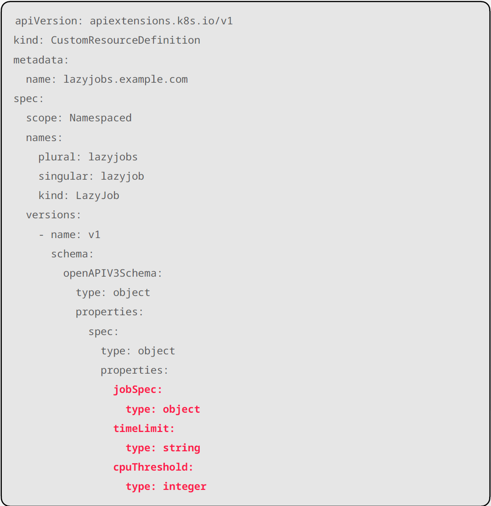
+ 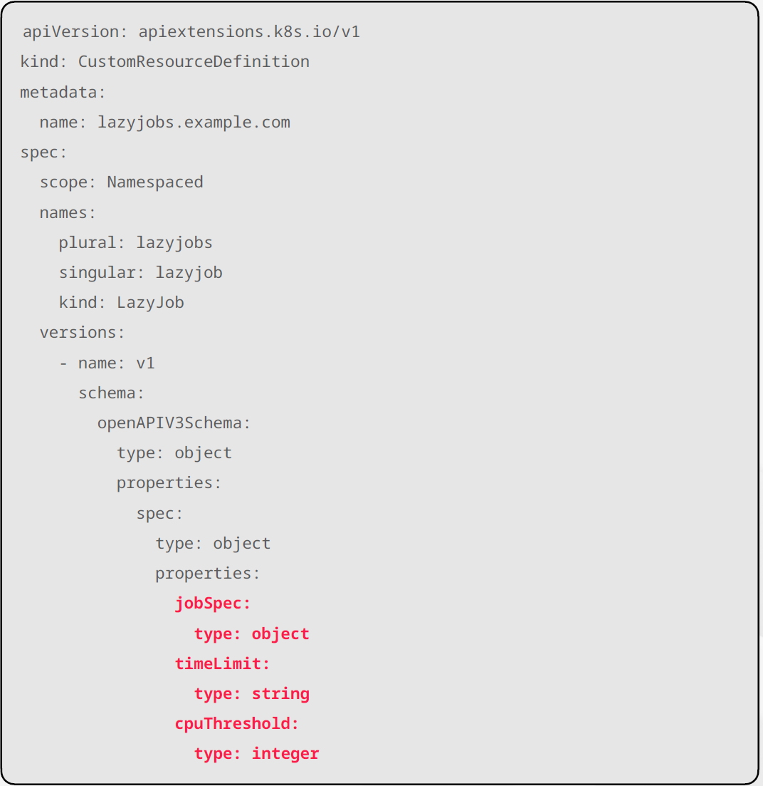
+ 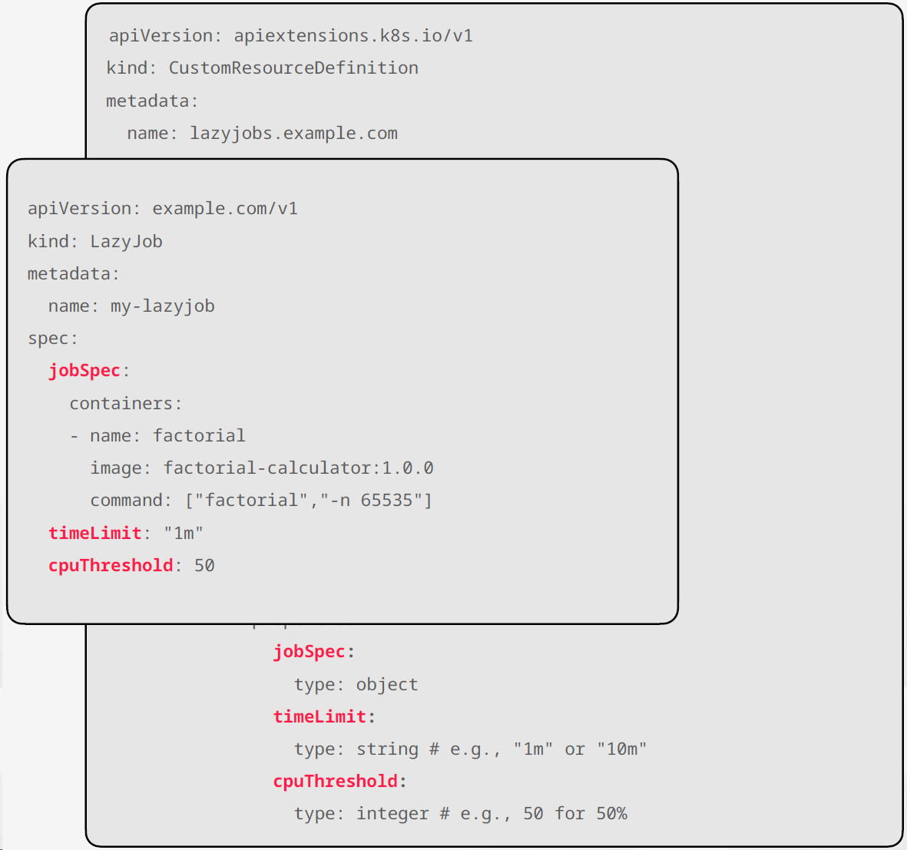

Custom Resource는 말 그대로 “사용자가 직접 정의한 쿠버네티스 객체”다.
Deployment, Pod, Service처럼 생겼지만, 사용자 도메인에 맞는 전혀 새로운 타입의 리소스를 만들 수 있다.

예를 들어보자.

“노드의 CPU가 일정 수준 이하일 때만 동작하는 작업(Job)을 만들고 싶다”고 가정해보자.
이 객체는 다음과 같은 정보를 필요로 한다.

* 실제로 실행할 작업의 정의
* CPU가 어느 임계값 이하일 때 실행할지
* CPU가 계속 바쁘면 얼마나 기다리다가 포기할지

이런 요구사항을 Custom Resource Definition(CRD)으로 선언해두면, 쿠버네티스는 이 새로운 리소스를 기존 객체처럼 다룬다.

즉,

* 사용자가 YAML로 객체를 생성하면
* 해당 객체는 Kubernetes API 안에서 정식 리소스처럼 취급된다
* kubectl로 조회·적용·삭제까지 모두 가능하다

하지만 여기까지는 “데이터 구조는 만들어졌지만 행동은 없는 상태”다.

---

### Operator: Custom Resource에 ‘동작’을 부여하는 존재
+ 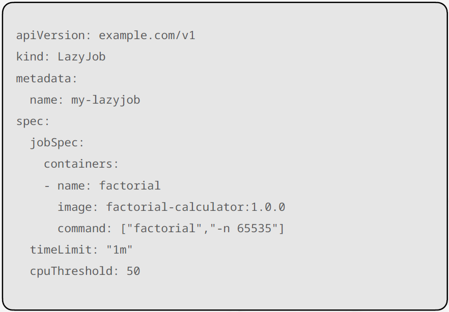
+ 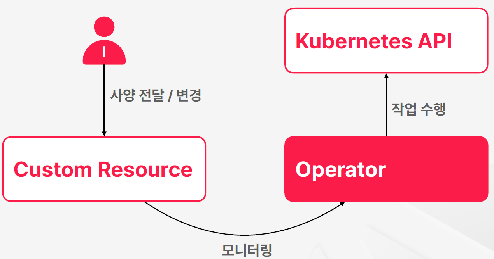

Custom Resource가 데이터(스펙)를 정의한다면,
Operator는 그 데이터를 ‘보고 판단해서 행동하는 로직’을 담당한다.

Operator는 다음 역할을 한다.

* CR이 생성되거나 변경될 때 이를 관찰
* 스펙을 확인하고 필요한 작업을 자동으로 수행
* Kubernetes API를 호출해 리소스를 생성/변경/삭제

즉, **CRD는 새로운 객체를 정의하는 것이고, Operator는 그 객체가 실제로 원하는 동작을 수행하도록 만드는 컨트롤러**다.

앞의 예시라면 Operator는 이런 행동을 한다.

* 노드들의 CPU 상태를 지속적으로 모니터링
* 조건을 만족하면 Job을 생성
* 조건을 만족하지 않으면 Job 생성을 대기 또는 취소
* 사용자가 CR 스펙을 수정하면 즉시 반영

Kubernetes의 많은 고급 기능(예: Cert-Manager, ArgoCD, Prometheus Operator 등)이 모두 CRD + Operator 조합으로 구현돼 있다.
이 조합이 쿠버네티스 확장 생태계를 폭발적으로 키운 핵심 요소다.

---

### API Aggregation: API Server를 직접 확장하는 방식

API Aggregation은 조금 더 깊은 단계의 확장이다.

Custom Resource는 “기존 API Server에 새로운 객체 타입을 추가”하는 것이라면,
API Aggregation은 **별도의 API Server를 띄우고 이를 쿠버네티스의 API 체인에 편입시키는 방식**이다.

그래서 다음과 같이 동작한다.

* kubectl이 API 요청을 보냄
* 메인 API Server가 일부 요청을 외부 확장 API Server로 프록시
* 외부 API Server가 자신만의 로직을 처리하여 응답

Custom Resource보다 더 깊숙한 확장을 가능하게 하지만,
그만큼 복잡하고 운영 난이도도 높다.

일반적으로는 **특수 목적의 기능을 쿠버네티스와 거의 동등 수준으로 확장해야 할 때** 사용된다.

---

### Custom Resource VS API Aggregation
+ Custom Resource
  + 선언적으로 동작
+ API Aggregation
  + 확장된 API를 명령어 형태로 사용

### Plugin: 하드웨어·네트워크·스토리지를 Kubernetes에 연결하기

Plugin은 CRD/Operator와는 존재 목적이 다르다.

Plugin은 “쿠버네티스에 하드웨어나 인프라 자원을 연결할 수 있게 만드는 확장”이다.

예를 들면:

* **CSI (Container Storage Interface)**
  → 쿠버네티스의 볼륨을 실제 스토리지 하드웨어와 연결하는 드라이버
  → EBS, NFS, Ceph, iSCSI 등 다양한 스토리지가 CSI 플러그인 기반
* **CNI (Container Network Interface)**
  → 쿠버네티스 네트워킹 구현체 (Calico, Flannel, Cilium 등)
* **Device Plugin**
  → GPU, TPU 등 특수 하드웨어를 Kubernetes에서 자원으로 사용하게 하는 드라이버

개발자는 “볼륨을 사용한다”, “GPU를 요청한다”는 선언만 하면 된다.
그 뒤에서 실제 하드웨어와 연결해주는 역할을 Plugin이 담당한다.

즉,

* Custom Resource / Operator는 “쿠버네티스 기능 자체를 확장하는 구조”
* Plugin은 “쿠버네티스가 외부 하드웨어를 활용할 수 있도록 하는 구조”

라고 이해하면 구분이 명확해진다.

---


