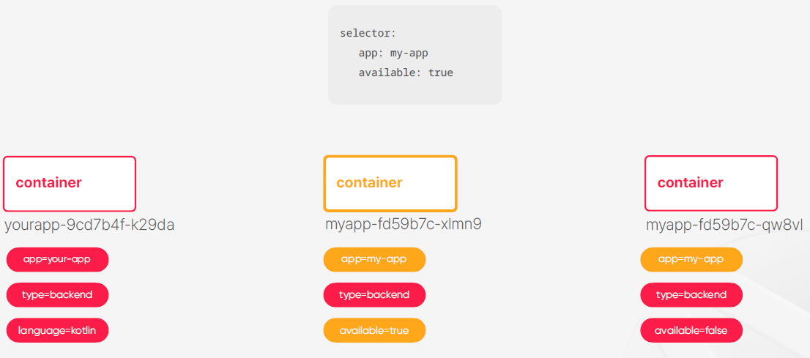

# Ch 2. Kubernetes의 주요 컨셉

# Ch 2. Kubernetes의 주요 컨셉
* toc
{:toc}

## 01. 컨테이너 오케스트레이션
+ 컨테이너 Container 
  + 운영체제 레벨의 가상화 기술
  + 컨테이너는 진짜 운영체제가 있고 그 내부에 가상의 운영체제를 만들어주는 기술이고 컨테이너 내부에서 돌아가는 프로세스들이 가상의 운영체제를 진짜 운영체제라고 믿으면서 동작을 하게 되는 것 
  + 가상의 운영체제를 만들어준다 
+ 가상 머신 Virtual Machine
  + 하드웨어 레벨의 가상화 기술
  + 가상의 하드웨어를 만든다는 걸 의미한다 
  + 가상의 하드웨어를 만들어준다

### 예: 파일 시스템의 격리 
+ 
+ 어떤 디렉토리가 프로세스에서만 접근 가능하도록 권한 설정
+ 프로세스는 해당 디렉토리를 루트로 사용
+ 프로세스 레벨에서 각 디렉토리는 격리된 공간
      
### 예: 네트워크 포트 매핑
+ 
+ 프로세스의 네트워크 포트를 실제로는 다른 포트로 매핑
+ 각각의 프로세스가 가지고 있는 네트워크 공간의 분리

### Docker
+ 리눅스 컨테이너는 네임페이스를 분리하고 파일 시스템이나 네트워크 같은 하드웨어 자원들에 대한 격리도 할 수 있도록 지원해주는 패키지이다 이 리눅스 컨테이너를 더 사용자들이 쓰기 쉽게 만들어서 배포한 게 도커라는 소프트웨어 이다 
+ 컨테이너를 쉡게 사용하도록 도와주는 소프트웨어
+ 

**예: Docker를 이용한 mysql 실행**
+ 로컬에서 mysql 서버를 실행하고 싶다면 직접 다운 받아서 설치하고 실행할 수 있다 
  + 고전적이고 전통적인 방법으로 설치하고 실행하는 방법 
+ docker 가 설치 되어 있다면 별다른 설치 과정 없이 docker run 명령을 통해서 mysql 서버를 실행할 수도 있다 
  + 명령어를 주면은 내부적으로는 도커가 mysql 컨테이너가 이미지가 로컬에 있는지 찾고 없으면은 레파지토리 또는 도커 허브 같은 곳에서 다운로드를 받고 이미지가 준비되었을 때 운영체제에서 제공한 자원들을 격리 시켜서 컨테이너에 할당 시켜주고 mysql 서버를 실행한다

~~~shell

$ docker run -p33306:3306 mysql
...
[Server] /usr/sbin/mysqld: ready
for connections.

~~~

**Docker Containerization**
+ 개발한 애플리케이션도 컨테이너로 만들어서 배포하고 실행하는 과정을 도커라이즈라고 보통 부르는데 보통 이 과정은 만든 어플리케이션이 도커 이미지가 될 수 있도록 변환해 주는 규칙 그거를 이제 도커 파일을 만들어 주는 걸로 시작을 한다 
+ openjdk가 설치된 이미지를 베이스로 해서 빌드가 끝나서 만들어진 자르 파일을 컨테이너 이미지 내부로 복사하고 그다음에 실제로 docker run 명령이 주어졌을 때 수행할 명령어를 ```java -jar /app.jar``` 이렇게 명령어를 줬다
  이렇게 명령어를 명시해서 도커 파일을 만들면은 도커 빌드 명령어를 통해서 도커 파일을 해석하고 도커 컨테이너 이미지를 생성할 수가 있다 이거를 해당 로컬 환경에 저장해도 되고 아니면 원격 저장소에 별도의 레지스트라든지 레파지토리라든지
  이런 곳에다가 이미지를 푸시 할 수도 있다 이렇게 이미지를 저장을 하게 되면은 도커 런 명령을 통해서 이미지를 푸시한 저장소에 접근 가능한 모든 머신이 개발한 애플리케이션을 실행할 수 있게 된다 
+ 만들어진 이미지는 어떤 환경에서든 동작의 일관성이 보장된다 
+ 컨테이너가 실행되는 환경이 사용하는 자원들을 모두 독립적으로 초기화돼서 할당되는 것이기 때문에 이시스템에 어디에 어떤 파일이 있는지 없는지 또는 8080포트를 사용하는 프로그램이 실행 중이다 이미 있는지 없는지 자바가 설치되어 있다 자바가 버전을 어떤
  버전이다 이런 것들과는 무관하게 환경에서 동작의 일관성이 보장된다  

~~~shell

FROM openjdk
COPY target/app.jar /app.jar
ENTRYPOINT ["java", "-jar", "/app.jar"]

~~~

~~~shell

$ docker build -t my-app .

~~~

~~~shell

$ docker run -p 8080:8080 my-app

~~~

### 애플리케이션 빌드 및 실행 구조의 변화
1. 
   + 과거에 평범한 애플리케이션을 빌드하고 배포하는 과정은 보통 로컬 환경에서 개발하고 젠킨스 같은 빌드 서버에서 gradle이나 이런 명령어 도구를 이용해서 애플리케이션을 빋드하고 scp 같은 명령어로 원격으로 전달하고 실행했다 
2. 
   + 도커가 나오고 나서는 흐름은 유사하긴 한데 빌드된 애플리케이션을 도커를 이용해서 컨테이너 이미지로 변환하는 과정이 추가가 되었고 배포나 실행 과정이 도커 중심으로 바뀌게 되었다 

### MSA 개발과 컨테이너 
+ 마이크로 서비스 아키텍처의 관점에서 컨테이너와 도커는 특별한 장점을 가지지 못함
  + 애플리케이션과 애플리케이션을 연결해주는 과정에서는 도커가 해주는 일이 없다 
  + 컨테이너 자체가 애플리케이션 프로세스를 격리시키는 데에 중점을 뒀기 때문에 반대로 실행된 컨테이너들끼리 서로 통신을 하거나 목적에 따라서 컨테이너를 그룹화한다던지 이런 컨셉들에 대해서는 별다를 지원이 없었다  
  + 컨테이너를 기반으로 MSA 환경을 구성한다? 컨테이너를 쓰지 않고 구성하는 거랑 다를 거는 없었다 컨테이너가 도입되고 나서 환경적으로 변화나 장점들이 발전이 많았는데 MSA에서는 큰 발전은 없었다 
  + 이런 약점을은 보안하기 위해서 도커에서도 도커 컴포즈와 같은 도구를 이용
+ docker compose를 이용한 멀티 컨테이너 구동 환경을 지원
  + 여러 컨테이너를 한 번에 실행하거나 제거해주고, 네트워크 브릿지를 연결해주는 역할
  + 호스트가 하나의 머신이어야 했기 때문에 로컬 개발 환경 구성에 최적
  + 여러 서버에 컨테이너를 나누어서 실행해야 하는 운영 환경에서는 제약이 많았음
+ 컨테이너를 더 적극적으로 운영 환경에 활용하기 위해 더 많은 기능이 필요했음

### 컨테이너를 이용한 운영 환경 구성
+ 컨테이너의 실행과 종료
+ 컨테이너를 실행하고 종료할 호스트는 여러 개로 구성될 수 있으며, 추가와 삭제가 가능해야 함
+ 컨테이너의 상태를 조회하고 관리
+ 컨테이너의 네트워크와 저장소 등 연관된 자원에 대한 관리
+ 

### 컨테이너 오케스트레이션
+ 컨테이너와 이와 관련된 모든 자원에 대한 통합 관리
+ 쿠버네티스는 가장 많이 사용되는 컨테이너 오케스트레이션 도구
+ 애플리케이션 개발 및 운영에 필요한 대부분의 요구사항을 지원

## 02. Control Plane과 Node

+ 컨테이너는 운영체제 레벨의 가상화 기술이기 때문에 컨테이너 입장에서는 자기한테만 운영체제가 존재한다고 생각할 수 있다 
+ 운영체제가 실제 운영체제는 아니고 자원들을 분리하고 격리시켜서 만든 가상의 운영체제이다 컨테이너 입장에서는 이게 가상이라는 걸 알기는 어렵겠지만 개발자는 가상의 운영체제를 만들어내는 실제 운영체제가 있나는 걸 알고 있다 
+ 실제 운영체제도 하드웨어에 설치돼서 실행되고 있을 텐데 물론 이 하드웨어도 실제 물리적인 하드웨어일 수도있고 가상머신에 의해서 만들어진 가상의 하드웨어일 수 있지만 컨테이너가 자기가 실행되는 가상의 운영체제가 가상인지 실제인지 구분하기 
  어려운것 처럼 운영체제 입장에서는 가상의 하드웨어와 실제 하드웨어를 구분하기 어렵고 구분할 이유가 딱히 없다 


+ 쿠버네티스가 여러 컨테이너를 실행하고 관리하는 컨테이너 오케스트레이터의 역할을 수행한다고 한다면 필연적으로 쿠버네티스는 컨테이너를 실행할 수 있는 하나 이상의 하드웨어를 관리하고 있어야 된다는 추론을 할 수 있다 
+ 결국에는 컨테이너를 실행할 수 잇는 하드웨어면 된다 


+ 이런 하드웨어들을 서버, 호스트 라고도 부를 수도 있는데 쿠버네티스에서는 노드라는 이름으로 불린다
+ 주의할 점은 오랜 기간 동안 노드를 쿠버네티스에서는 워커 노드라는 이름으로 불렀다 되게 옛날에는 미니언이라는 이름으로 부르던 시절도 있는데 워커 노드라고 부르는 시가가 좀 길었다 그래서 이게 조금 다른 역할을 하는 마스터 노드라는게 있는데 
  마스터 노드랑 분리하기 위해 워커 노드라는 이름으로 불렀는데 마스터 노드라는 개념이 바뀌기도 했고 마스터랑 워커라는 명칭 자체가 최근에 IT 용어 네이밍 트렌드랑 좀 맞지 않는 측면이 있어가지고 지금은 분명하게 노드의 역할을 분리해가지고 강조하는 경우가 
  아니라면 보통 노드라고 부른다 
+ 노드라는게 과거에 워커 노드라고 불렀던 그 용어랑 매칭이 보통은 된다라고 생각할 수 있는데 워커 노드라는 용어를 오랜 기간 동안 사용이돼가지고 책이나 인터넷 자료를 찾아보면 워커 노드라는 용어가 많을 것이다 


+ 쿠버네티스에서 컨테이너를 하나 실행하도록 구성할 때 쿠버네티스들이 관리하는 노도들이 보통 몇 개가 있는데 다수의 노드들 중 하나의 컨테이너를 실행을 시켜준다 
+ 컨테이너늘 실행할 때 대부분의 경우에는 사용자가 직접 어떤 노드에서 컨테이너를 실행해달라고 명령을 내리지는 않는다 
+ 보통 쿠버네티스는 컨테이너가 만들어져야 되는 상황이되면은 만들어주고 컨테이너가 제거가 되어야되는 상황이 오면은 컨테이너를 제거해준다 그래서 이때 적절한 노드를 선태하거나 아니면 컨테이너를 실행하거나 어떤 컨테이너를 
  제거하거나 하는 거는 컨테이너 오케스트레이션 도구인 쿠버네티스가 알아서 하는 일에 속한다 


+ 쿠버네티스가 컨테이너 오케스트레이션의 컨셉을 유지하고 이제 필요한 동작을 하기 위해서는 컨테이너가 실행될 노드 외에도 노드나 컨테이너 상태를 관리하고 유지해주고 사용자들의 명령을 받아가지고 처리할 Control Plane이 있다
+ Control Plane 컨테이와 노드를 관리해주는 영역을 Control Plane이라고 부른다
+ 컨테이너의 상태가 어떤 변동이 생기거나 문제가 문제가 생겼을 때 이를 감지해가지고 필요한 조치들을 취해주는 그런 역할도 수행하고 있다 


+ Control Plane에는 쿠버네티스의 관리하고 컨트롤하고자하는 목적에 맞춰서 여러 구성요들이 포함되어있다
+ Control Plan이 예전에는 master node 라고 불렸다 영역이다 
+ 어떤 물리적인 노드가 아니라 Control Plan이 하는 영역이 어떤 물리적인 노드라고 칭하기에는 안 맞는 개념이 있어서 최근에는 Control Plan 명칭을 사용한다 

+ API Server
  + 사용자의 명령을 받아서 상태를 저장하고, Node와 통신하며 필요한 동작들을 수행
+ etcd
  + 쿠버네티스 클러스터 및 컨테이너와 관련된 모든 데이터를 저장하는 데이터 저장소
  + 레디스랑 비슷하게 메모리 스토어랑 파일 스토어를 혼용해서 사용하고 있다 
  + 성능이 좋고 특히나 중점을 두고 있는게 분산 시스템 환경에서 가용성이 굉장히 좋은 저장소이다 
  + 쿠버네티스의 모든 클러스터랑 컨테이너들이 다 날라가는 상황이더라도 etcd에 저장된 데이터들만 백업을 해줬다면 클러스터 다시 만들고 etcd에 백업된 시섬으로 클러스터 상태를 되돌리 수도 있다 
  + etcd가 제대로 동작을 하지 않는다면 쿠버네티스 클러스트들은 그때부터는 읽기 전용 모드밖에 안된다 
+ Scheduler
  + 컨테이너가 생성될 때 적합한 노드를 선택해주는 역할을 수행
+ Controller Manager
  + 쿠버네티스의 다양한 컨트롤러들을 관리하며 API Server가 해야할 일을 알려주는 역할
+ Cloud Controller Manager
  + 클라우드 서비스의 다양한 API를 쿠버네티스와 통합해주는 역할
+ kubelet
  + 컨테이너를 실행하거나 종료하고, 상태를 모니터링해주는 역할
+ kube-proxy
  + 컨테이너의 네트워크를 관리해주는 역할
+ 사용자가 컨테이너를 만들어 달라고 요청을 하면 동작하는 순서
  1. 사용자가 API Server에다가 컨테이너 생성 요청
  2. API Server가 사용자의 요청을 검토 (인증, 명령 자격, 컨테이너의 스펙 문법)
  3. etcd 에다가 전달 받은 스펙 저장 
  4. 컨테이서의 생성이 필요하다는 정보가 Scheduler에도 저장, 스펙들을 검토하고 현재 노드들의 상태를 고려해서 컨테이너가 생성될 노드를 결정하고 스펙에다가 해당 노드를 기록 
  5. 컨테이너를 생성해야되는 노드에 실행중인 kubelet 역시 API Server를 통해서 컨테이너 생성이 되어야 된다는 정보를 인지하게 되고 kubelet은 주어진 스펙에 따라서 이미지를 받아온 다음에 컨테이너 런타임을 통해 컨테이너 실행을 한다 
  6. 컨테이너가 실행되는 과정들을 따라가서 kubelet이 지속적으로 컨테이너 상태를 모니터링하면서 API Server에다가 상태를 업데이트하고 API Server는 etcd에 기록한다 
  7. kube-proxy 같은 경우는 API Server를 통해서 컨테이너가 생로 생겼는데 이 컨테이너가 네트워크에 연결되어야 되는 시점이다라는 걸 인지하고 그 타이밍이 됐을 때 라우팅 규칙을 업데이트해서 컨테이너가 네트워크에 연결될 수 있도록 작업을 해준다 
  8. 컨테이너 생성이 완료되가지고 정상적인 상태가 됐으면은 kubelet은 상태를 계속 모니터링 하면서 API Server를 톻해서 상태 업데이트를 하게 된다 
+ 쿠버네티스의 구성요소들을 크게 살펴보면은 Control Plane이랑 노드로 구성되어 있고 Control Plane은 쿠버네티스를 관리해주는 역할을 하고 노드는 컨테이너가 실행될 수 있는 공간을 제공해준다 

## 03. Reconciliation과 Self-Healing

### etcd의 존재 의문
+ 
+ 전체적인 과정에서는 etcd가 스펙이나 상태를 저장하는 보조적인 역할을 수행하는 것처럼 보인다
+ etcd가 없어도 동작에 별 문제가 없을 것 처럼 보인다 
+ 
+ 만약에 쿠버네티스 비슷하게 만든가고 하면은 이렇게 사용자가 API 서버에다가 컨테이너를 만들어달라고 요청하고 API 서버가 요청을 큐블렛 전달하고 
  도커런 같은 명령어로 컨테이너를 실행하고 이런 일반적인 백엔드 개발할 때 API 서버를 이용해서 실행하는 프로그램을 만들때 사주 사용하는 패턴중 
  하나이다 
+ 이과정에서 etcd가 상태를 백업하는 용도로 쓸 수는 있지만 코어한 이패스에서는 그렇게 중요한 역할을 수행하기가 어렵기도 하다 
+ 결국에는 사용자 요청을 API 서버가 받아서 큐블렛에서 실행을 해주면 사용자 요청이 결과적으로는 노드에서 도커런 명령으로 이어질 수 있게 된다 
 
### Imperative System - 명령형 시스템 
+ 명령을 통해 원하는 작업을 수행하는 방식
+ 대부분의 프로그램과 서비스가 이 방식으로 수행됨
+ ```$ docker run my-sql```

### Declarative System - 선언적 시스템 
+ 프로그램에 명령을 주는 것이 아니라 목표로 하는 상태를 제시해주는 방식
+ 그 상태에 도달하기 위한 방법은 프로그램에 위임
+ 컨테이너를 2개 생성해라 Imperative
+ 컨테이너를 2개 있어야 한다 Declarative

### Imperative vs Declarative
+ 컨테이너를 2개 생성해라 
  + 지금 컨테이너가 몇 개 생성되어 있든 상관하지 말고 2개를 추가로 생성해라
+ 컨테이너를 2개 있어야 한다 
  + 지금 컨테이너가 없으면 2개 생성, 1개만 있다면 하나 더 생성, 3개 있다면 하나 종료 시켜라
    
### Reconciliation 패턴
+ 
+ 사용자는 쿠버네티스한태 원하는 상태를 전달한다 
+ 쿠버네티스는 지속적으로 현재 클러스터 상태를 모니터링을 계속한다 
+ 만약에 사용자가 원하는 상태랑 쿠버네티스의 현재 상태 사이에서 불일치가 발생하면은 조정을 해서 두 상태가 일치하도록 만든다  
+ Reconciliation 단어가 조정이라는 뜻을 가지고 있다 이런 패턴이 Reconciliation 패턴이다 
+ 
+ 사용자가 원하는 상태는 2개여야 한다고 요청을 하면 해당 상태로 기록  
+ 쿠버네티스가 현재 상태를 모니터링하고 현재 컨테이너는 1개다 확인을하고 원하는 상태는 컨테이너가 2개 여서 불이치가 발생하면 조정 과정에서 하나를 추가로 실행을 한다 
+ 
+ 사용자는 아무 요청을 하지 않았지만 실행 중인 컨테이너 하나가 out of memory 에러가 발생해서 종료가 돼버렸을 때 쿠버네티스는 목표를 일치 시키기 위해서 다시 컨테이너 하나를 추가로 실행


### Self-healing
+ 쿠버네티스의 선언적 특징에서 나타나는 기능
+ 컨테이너의 상태가 목표에서 벗어난다면 이를 자동으로 수정
+ 프로세스가 종료거나 컨테이너가 비정상이라면 새로운 컨테이너로 교체
+ 운영 환경에서 활용하면 굉장히 강력한 기능
+ 
+ 현재 1.0.0 컨테이너가 실행 중인데 1.0.1 버전으로 목표 상태를 업데이트를 하게 되면은 쿠버네티스는 교체를 진행한다 
+ 종료가 먼저, 실행이 먼저 또는 두개 동시에 이루지는지는 스펙에서 조정을 해줄 수 있는데 일반적으로는 새로운 컨테이너를 먼저 실행을 시키고 
  완료가 되면은 그 이전 버전의 컨테이너를 제거하는 설정으로 진행
+ 1.0.1 버전의 이미지가 없으면 목표 상태가 맞추기 위해서 계속 재시도를 진행한다 사용자가 목표 상태를 1.0.0으로 돌리거나 1.0.1을 이미지 저장소에 푸시하기 전까지
  계속 리트라일하고 루프를 돌면서 반복한다 

### Restarting the container
+ 컨테이너를 '재시작'하는 명령은 쿠버네티스에서 조금 애매함
+ 컨테이너를 재시작 시킨다는 개념 자체가 선언적으로는 정의되기 어렵기 때문
+ 쿠버네티스에서도 명령형 커맨드를 지원하기 때문에 이를 이용해 재시작 가능
+ 혹은 컨테이너 수량을 0으로 지정했다가 다시 늘려주는 방식으로 재시작

### 컨테이너 실행 과정
+ 
+ 
+ 쿠버네티를 사용하면서 할 일은 원하는 스펙을 쿠버네티스에 전달해주는 것이다 
+ 스펙을 etcd에가가 목표 상태를 저장하게 된다 
+ 
+ 목표 상태를 현재 상태에 맞추기 위해서 컨테이너를 하나 실행하게 되는데 이과정에서 스케줄러가 노드를 찾고 큐블렛이 컨테이너를 실행해주고 
  컨테이너 상태를 모니터링해서 상태를 계속 갱신하는 작업들을 진행한다
+ 
+ 컨테이너가 이상핸 동작을해서 상태가 브릿지하게 된다 그러면은 큐블렛이 컨테이너 상태가 정상이 아님을 확인하게 된다 그러면 API 서버를 통해서
  현재 상태가 정상이 아님을 업데이트 한다 
+ 컨트롤러 매니저 역시 API 서버를 통해서 상태가 브릿지 한다는 걸 확인하고 해결하기 위한 해결책을 생각을 하고 해결 책을 API 서버에다가 예약을 하게 된다 

### Reconciliation for Application Developer
+ Declarative: 모든 동작이 선언적으로 이루어짐
+ Idempotency: 같은 정의를 여러 번 적용해도 항상 같은 결과가 나옴
+ Self-Healing: 현재 상태에 예상하지 못한 불일치가 생겨도 스스로 이를 복구하는 것
+ Consistency: 쿠버네티스의 현재 상태나 동작과 관계 없이 최종 스펙에 상태를 맞추는 것

### 개발자들이 신경써야 할 것들
+ 쿠버네티스가 관측하기 좋은 애플리케이션을 만들기
+ 목표로 하는 상태를 잘 정의하기
+ 체계적인 버전 관리 혹은 자동화 된 빌드와 배포
+ 갑자기 종료되거나 새로 실행되어도 동작에 문제가 없는 애플리케이션

## 04. Selector와 Label
+ 
  + 컨테이너 말고도 그 컨테이너와 관련된 객체들이 굉장히 많다 쿠버네티스에는 다 객체 형태로 제공을 해주고 있다  
  + 쿠버네티에서 어떤 객체의 스펙을 정의할 때는 연관된 객체들하고 만들고자 하는 객체 그 사이에 관계를 정의하는 것들이 굉장히 중요하다 
  + 중요한 건 이 설정들이 굉장히 정적으로 이루어진다 그래서 쿠버네티스는 선언적으로 필요한 것들을 전달한다 이런 컨셉 자체가 굉장히 정적인 영역의
    비중의 큰 작업인데 이런 객체 간의 관계성을 정의하는 건 역시 이 스펙을 선언할 때 같이 관계성이 정의가 되기 때문에 마찬가지로 정적인 영역에 속하게 된다
  + 배포하기 전에 이 스펙을 작성할 때 어떤 설정 값들을 사용할 거고 어떤 네트워크를 사용할 거고 이런 것들이 정이가 되는 거지 실행하고 나서 거기다가 
    주입 시켜 주거나 연결하는 그런 동작은 아니다 

### 쿠버네티스를 사용하지 않을 때
+ 쿠버네티스를 사용하지 않을 때 객체를 어떻게 식별하고 지정하는지 확인
+ 
+ nginx를 통해서 두 개의 서버에다가 트래픽을 분배
+ 서버에는 고유한 IP가 있을 것이다 일반적인 구조에서는 내부 서버의 IP는 보통 서버를 띄우기 전에 사전에 식별이 가능한 주소가 된다 
  그래서 컨테이너를 쓸 때랑 다르게 물리 서버나 가상 머신이 먼저 생성돼서 네트워크에 연결이 되고 IP 주소를 이미 받은 상태에서 그 위에서
  애플리케이션을 실행하는 경우가 많다 
+ nginx 설정이 구체적이고 자세하다는 점이 문제가 될 수 있다 만약에 스케일아웃이 발생해서 서버가 늘어나면 nginx 설정도 수정을 해서 재기동을 시켜야 된다  

### 쿠버네티스 사용
+ 
+ 쿠버네티스도 개체들을 만들게 되면 개체들을 고유하게 지정하는 식별자들 일종에 아이다 같은 것들이 생성이 된다 
+ 식별자들은 개체가 생성되는 순간 부여가 되고 스펙에 정의한 값을 쓸 수도 있고 아니면 쿠버네티스가 랜덤한 해시값을 포함해서 부여를 해줄 수도 있다
  + 일반적으로는 랜덤한 해시값을 포함해서 부여해주는 경우가 많다 컨테이너가 몇개가 생성될 지 늘어날지 줄어들지 모르기 때문에  
+ 코드를 작성하는 시점에서는 식별자들을 미리 알아내가 쉽지 않다 
+ 
+ 이렇게 생각할 수도 있을거 같다 nginx를 컨테이너를 하나 실행을 해주고 nginx 컨테이너는 그 식별자를 고정을 시켜서 nginx가 트래픽 분배해 주면 
  http 호출할 때 nginx만 바로 호출해주면 되는거 아니야? 
  + 기존의 인프라 구조에서는 이런 식으로 해결하는 경우가 많았다
  + 쿠버네티스에서는 문제 해결책이 되지 않는게 쿠버네티스 내부에서 트래픽 분배하자고 nginx 같은 웹서버를 컨테이로 띄워주거나 하는 경우도 거의 
    없고 사용한다고 하더라도 nginx의 타겟으로 저 컨테이너들이 지정돼야 되는데 같은 문제가 반복되게 되는 것이다
  + nginx는 타겟들을 어떻게 식별할 거냐? 하는 문제들이 계속 남아있게 된다 
+ 
+ 그럼 기존에도 IP를 사용 했으니깐 IP 주소를 이용해서 구성하면 안돼?
  + 이론적으로 쿠버네티스의 컨테이너들이 전부 내부 IP를 부여받게 된다 이런 구조가 절대 안 돼 불가능해 이런 건 아니다 그치만 쿠버네트스의 특징은 
    컨테이너가 자주 생성되고 제거될 수도 있고 이 과정에서 물리적인 서버들 노드가 계속 바뀔 수도 있다 이런 과정들을 반복하면서 IP는 계속 바뀔수 밖에 없다
  + IP를 사용해서 컨테이너 이런 것들을 식별하는 방식은 쿠버네티스에서 사용하지 않는 방식이다 
  + 극단적으로 쿠버네티스 기반으로 개발을 할 때 IP가 뭔지 몰라도 상관은 없다 이 정도로 사용을 안한다  
+ 
+ 쿠버네티스는 기본적으로 레이블을 이용해서 객체를 식별하게 된다
+ 레이블은 다루는 객체들 한태 태그들을 부여해 식별 가능한 기준을 만든다 
+ 쿠버네티스의 레이블은 키와 벨류의 쌍으로 이루어져 있다
+ 레이블들이 객체들 한태 붙어 있으면은 그것을 식별해주는 문법을 selector라고 할 수 있다 
+ 레이블들이 일종의 데이터라고 한다면은 selector가 쿼리 역할을 수행한다고 생각해도 좋다  

### 쿠버네티스의 추상화 컨셉
+ 구체적이고 실질적이기 보다는 추상적인 개념 위주로 정의가 이루어짐
+ 어떤 특정 대상보다는 동일한 역할을 수행하는 미상의 집단을 대상으로 지정하는 느낌
+ 인스턴스를 다룬다기 보다는 클래스를 다루는 느낌
+ 이런 기분이 든다면 쿠버네티스의 컨셉을 잘 이해하고 있는 것

## 05. Kubernetes의 네트워크
+ 
  + 내부로 들어오는 네트워크
  + 쿠버네티스 내부에서 컨테이너 끼리 서로 통실할 때 사용하는 네트워크
  + 쿠버네티스 내부에서 외부로 나가는 네트워크
  + 쿠버네티스는 네트워크를 익숙한 도메인, ip, 라우팅, 포트 이런 개념들을 직접 사용하기 보다는 쿠버네티스 내부의 규칙이랑 
    쿠버네티스에서 제공해주는 객체들로 처리하는 일종의 가상 네트워크를 제공을 하고 있다 
  + 쿠버네티스에서 사용하는 네트워크의 개념들은 쿠버네티스의 객체에 의해서 처리되기 때문에 쿠버네티스에서 정의한 네트워크를 새로 배워야 한다
+ 
  + 쿠버네티스가 독자적인 개념을 만든 이유는 쿠버네티스의 노드들은 어딘가에 설치된 물리적인 서버이거나 가상 머신이다 클러스터를 구성할 때 해당 
    노드들도 보통 일반적인 네트워크 구성을 가지고 있다 다시 말해 각각 노드마다 ip가 있고 외부에서 들어오는 트래픽을 받거나 
    노드끼로 서로 통신하거나 노드에서 트랙픽이 나가거나 한는 것들이 다 가능한 구조일 것이다 
  + 쿠버네티스 안에 노드가 3개가 있는데 동일한 컨테이너를 5개 띄웠다고 가정을하면 이 경우에 몇몇 노드에서는 같은 컨테이너가 중복해서 
    여러개 실행될 수 있다 
  + 하나의 호스트에 동일한 포트를 가진 컨테이너가 여러 존재한다면은 포트 번호를 가지고 대상이 되는 컨테이너 프로세스를 식별을 할 수 없게 된다 
    실제로 이렇게 네트워크를 사용하는건 불가능하고 같은 호스트에서 동일한 포트를 가진 프로세스가 여러개 실행될 수 있고  심지어 다른 종류의 프로세스가
    같은 포트를 사용할 가능성도 있다 
  + 컨테이너가 내부 포트를 그대로 유지하면서 실제로 컨테이너가 실해되는 호스트에 랜덤한 별개의 포트랑 서로 매핑해줘서 이 문제를 해결할 수 있는 방법도 있다
    하지만 포트가 컨테이너가 실해돼서 네트워크에 연결될 때 그 순간에 부여되는 것이라서 코드를 작성할 때는 컨테이너가 실행되기 전이여서 포트들을 알 수가 없다
+ 
  + 쿠버네티스가 가상의 네트워크 객체를 이용해서 네트워크 영역을 추상화해서 제공하고 있다 
  + 어떤 IP나 포트와 같은 물리적인 네트워크 위에 가상의 네트워크 객체를 하나 더 만들어서 가상의 네트워크를 통해서 통신을 할 수 있게 제공하고 있다
  + 물리적인 네트워크 위에 가상의 네트워크 레이어를 설정해서 사용하는 구조를 오버레이 네트워크라고 부른다 
+ 
  + 컨테이너들이 고유한 레이블이 있고 네트워크 객체가 이 네트워크 객체로 들어오는 트래픽을 라우팅해 줄 대상들을 셀렉터를 이용해서 식별하고 있다면 
    컨테이너가 쿠버네티스의 어떤 노트에서 실행되건 컨테이너 숫자가 변경되거나 제거되어도 네트워크 트래픽이 라우팅해야 될 대상들을 식별하는 데는 
    문제가 없다 
  + 일반적으로 이렇게 쓰는 경우가 많지는 않다 
+ 
  + ```my-app-network``` 를 호출 한다는 것은  ```10.0.21.93``` 을 호출 한다는 것과 동일한 의미를 가진다
  + ```10.0.21.93``` 네트워크 주소도 가상으로 잡혀있는 주소이고 네트워크 객체라는 거는 실제로는 어떤 인스턴스가 떠 있는 게 아니라  
    쿠버네티스 각 노드에 존재하는 라우팅 규칙들의 집합이라고 불 수 있다 
  + 쿠버네티스는 내부적으로 네트워크 객체가 생기거나 네트워크 객체가 사라질 때마다 혹은 네트워크 객체의 대상이되는 컨테이너들 라우팅에 대한 타켓들의
    변화가 생길 때마다 내부적으로 ip 테이블이랑 넷필터를 이용해서 라우팅해야 되는 규칙들을 테이블에 계속 업데이트를 해준다 
  + 트래픽이 컨테이너 3개 중에 하나로 라우팅 되는 거는 애플리케이션(예를 들어 nginx) 레벨에서 어떤 프로세스가 해주는 동작이 아니라 
    네트워크 규칙에 의해서 라우팅 테이블에 가서 이동을 하게 된다 
  + 애플리케이션이 쿠버네티스 내부에서 다른 애플리케이션과 통신할 때는 추상화된 네트워크 레이어를 호출하고 그 레이어에서 응답을 받는 개념이다 
+ 
  + 외부에서 어떤 특정한 네트워크 객체로 요청을 보내고 네트워크 객체가 적절하게 트래픽을 분배할 수 있다면 간단할텐데 내부 통신에 쓰는 네트워크
    객체는 어떤 프로세스가 떠 있는게 아니고 라우팅 규칙에 집합이다
  + 라우팅 규칙을 타려면 결국에는 어떤 노드로 트래픽이 들어가야 하는데 외부 요청들이 어떤 노드에 들어가야지 트랙픽이 분배된다는 말은
    외부의 요청들이 다 한 노드로 집중이 되는 구조라고 이해할 수 있다 그래서 이런 구조를 사용하기는 어렵다 
+ 
  + 쿠버네티스에서는 내부 네트워크 객체가 모두 노드상에서 같은 포트를 가지도록 만들어줄 수도 있다 그래서 이렇게 하면은 외부에서 노출을 할 수 
    있는데 이렇게 구성이 되면은 어떤 클러우드 서비스에서 제공해주는 로드 밸러서라든지 nginx같은 외부에 위치한 리버스 프록시가 각 노드들을
    타겟으로 관리하면서 외부 트래픽을 내부 컨테이너로 라우팅하는 방식도 가능하다
  + 초창기 방식이다 
+ 
  + 지금 더 일반적으로 많이 사용하는 방식이다
  + 쿠버네티스에서 외부 요청을 처리하기 위한 전용 네트워크 객체를 따로 제공을 해주고 있다 
  + 이 객체가 리버시 프록시의 역할을 수행해주면서 동시에 외부 트래픽을 정해진 규칙에 따라서 내부의 네트워크 객체로 전달을 해주는 역할을 한다 
  + 외부 트래픽이 들어오면 외부 트래픽을 처리하기 위한 객체가 먼저 요청을 받고 요청을 내부 네트워크 객체로 보내고 컨테이너 중 하나로 트래픽을 
    라우팅할 수 있다
  + 외부 요청을 처리하는 객체는 내부 요청을 처리하는 객체와 달리 실체가 있다 보통 nginx를 사용할 수도 있고 아니면 클라우드 서비스에 있는 
    로드밸런스를 구현체로 사용할 수도 있는데 그래서 실제로 트래픽을 처리해주는 프로세스들이 있다는 것이다 

### 개발자를 위한 Kubernetes 네트워크
+ 모든 요청은 서로 다른 컨테이너로 라우팅 될 수 있음
+ 애플리케이션이 요청을 독립적으로 처리할 수 있도록 개발해야 함
+ 기본적으로 요청의 재시도나 Circuit Breaker 등은 애플리케이션 레벨에서 처리
+ 모니터링 하기 쉬운 애플리케이션이 네트워크와도 잘 결합됨

---

## 06. 저장소와 볼륨

컨테이너 환경을 처음 접할 때 많은 사람이 공통적으로 겪는 문제가 있다. 컨테이너 내부에서 파일을 저장했다가, 컨테이너를 재시작하는 순간 파일이 흔적도 없이 사라지는 경험이다.

도커에서는 이런 문제를 피하기 위해 “호스트 디렉토리 ↔ 컨테이너 디렉토리”를 연결하는 방식(바인드 마운트)을 많이 사용한다. 컨테이너는 사라져도 파일은 호스트에 남아 있으니 데이터가 유실되지 않는다.

그런데 쿠버네티스 환경에서는 이야기가 조금 달라진다. 쿠버네티스는 Pod를 스케줄링하면서 언제든 **다른 노드로 Pod를 옮길 수 있기 때문**이다.
호스트 디렉토리를 그대로 사용한다면, 노드가 바뀌는 순간 저장한 파일도 함께 사라지거나 전혀 다른 데이터를 바라보게 된다.

그래서 쿠버네티스는 저장소를 직접 다루는 방식을 권장하지 않고, 대신 자체적인 저장소 추상화 방식을 제공한다. 이를 통해 개발자는 저장소 타입과 위치에 상관없이 **일관된 방식으로 파일 시스템을 다룰 수 있다.**

---

### 쿠버네티스가 저장소를 추상화하는 이유

쿠버네티스의 저장소 추상화는 단순한 편의 기능이 아니다. 다음과 같은 목적에서 출발한다.

* 저장소 타입이 무엇이든(PVC, 블록 스토리지, NAS, 클라우드 디스크 등) 동일한 인터페이스 제공
* Pod가 노드를 이동해도 동일한 파일 시스템을 사용할 수 있도록 보장
* 애플리케이션 로직이 “저장소의 물리 위치”에 의존하지 않도록 분리
* 인프라팀은 스토리지를 관리하고, 앱 개발자는 추상화된 볼륨만 바라보도록 역할 구분

실제 저장소는 네트워크 스토리지일 수도 있고, 클라우드 블록 디스크일 수도 있다. 그러나 Pod는 단지 “볼륨”이라는 추상화된 객체만 바라본다. Pod 내부의 특정 경로와 볼륨 객체를 연결해두면, 스케줄링이 어떻게 움직이든 컨테이너는 늘 동일한 파일 시스템을 사용하는 것처럼 동작할 수 있다.

---

### 볼륨의 두 가지 큰 분류: 임시 볼륨 vs 영구 볼륨

쿠버네티스의 볼륨은 크게 **임시 볼륨(Temporary Volume)**과 **영구 볼륨(Persistent Volume)**로 나눌 수 있다.
둘은 목적도, 특성도, 쓰임새도 완전히 다르다.

---

### 1) 임시 볼륨 (Ephemeral Volume)

임시 볼륨은 Pod의 생명주기와 함께 존재하는 저장소다.
Pod가 삭제되면 함께 삭제되기 때문에 **지워져도 괜찮은 데이터**를 저장할 때 사용한다.

특징은 다음과 같다.

* Pod가 살아있는 동안만 유지
* 컨테이너가 재시작해도 유지되지만, Pod 자체가 삭제되면 사라짐
* 캐싱 용도, 임시 작업 파일 등 일회성 데이터에 적합
* 여러 컨테이너가 파일을 공유해야 할 때도 사용 가능 (예: 사이드카 패턴)
* 예: `emptyDir`, `configMap`, `secret`, `downwardAPI` 등

로그 저장을 파일 기반으로 할 때 `emptyDir`에 저장하는 경우도 많다.

---

### 2) 영구 볼륨 (Persistent Volume, PV)

영구 볼륨은 Pod의 생명주기와 완전히 독립적인 저장소다.
Pod가 삭제되거나 새로운 노드로 옮겨가도 **데이터는 그대로 유지**된다.

이 저장소는 보통 노드 외부에 존재한다. 예를 들어:

* 클라우드 블록 스토리지(EBS, GCE Persistent Disk 등)
* NAS, NFS, Ceph 같은 네트워크 스토리지
* 사내 SAN(Storage Area Network) 인프라

특징은 다음과 같다.

* PV → 실제 물리/클라우드 저장소
* PVC → 애플리케이션이 요청하는 스토리지 요구사항
* 필요한 만큼 동적 프로비저닝 가능
* 여러 Pod가 같은 스토리를 공유할 수도 있음(ReadWriteMany 스토리지 타입에서 가능)
* 네트워크 기반이므로 비용, IOPS, 레이턴시 등 성능을 신중히 고려해야 함

DB, 메시지 큐, 파일 저장 서비스 같은 **Stateful 애플리케이션**이 대표적인 사용 대상이다.

---

## 07. CRD를 이용한 Kubernetes의 확장과 플러그인

쿠버네티스는 기본적으로 애플리케이션을 운영하는 데 필요한 대부분의 자원을 잘 제공한다. CPU, 메모리, 네트워크, 스토리지 같은 핵심 리소스를 합리적으로 추상화해주기 때문에, 많은 서비스는 기본 기능만으로도 충분히 운영할 수 있다.

하지만 실제 운영에 익숙해질수록 “조금 더 세밀하게 제어하고 싶은 부분”이 생긴다.
예를 들어,

* 서비스 간 트래픽을 단순 라운드 로빈이 아니라 가중치 기반으로 라우팅하고 싶다
* 클라우드에서 새로운 저장소 타입을 내렸는데 Kubernetes가 아직 이를 지원하지 않는다
* 특정 조건(CPU 사용률 등)에 따라 특정 작업(Job)을 자동으로 실행하고 싶다

이런 요구들은 쿠버네티스의 기본 기능만으로는 해결할 수 없다.
그래서 쿠버네티스는 처음부터 **확장 가능한 구조**를 목표로 설계되었다.
심지어 쿠버네티스의 소스 코드를 건드리지 않고도 새로운 기능을 추가할 수 있다.

---

### Kubernetes 확장의 기본 개념

쿠버네티스는 다음과 같은 철학으로 확장을 지원한다.

* 기본 제공 객체 외에도 **새로운 리소스 타입을 만들어 사용할 수 있다**
* 새로운 리소스도 기존 쿠버네티스 객체처럼 **선언형(Declarative)** 으로 관리할 수 있다
* Kubernetes 코드를 직접 수정하지 않고 기능을 추가할 수 있다
* 이렇게 만들어진 확장은 다양한 오픈소스 생태계와 결합되어 빠르게 성장하는 중이다

확장 방식은 크게 세 가지로 나뉜다:

1. **Custom Resource (CRD 기반)**
2. **API Aggregation**
3. **Plugins (CSI, CNI, Device Plugin 등)**

---

### Custom Resource: 쿠버네티스 객체를 직접 확장하기

+ 
+ 
+ 

Custom Resource는 말 그대로 “사용자가 직접 정의한 쿠버네티스 객체”다.
Deployment, Pod, Service처럼 생겼지만, 사용자 도메인에 맞는 전혀 새로운 타입의 리소스를 만들 수 있다.

예를 들어보자.

“노드의 CPU가 일정 수준 이하일 때만 동작하는 작업(Job)을 만들고 싶다”고 가정해보자.
이 객체는 다음과 같은 정보를 필요로 한다.

* 실제로 실행할 작업의 정의
* CPU가 어느 임계값 이하일 때 실행할지
* CPU가 계속 바쁘면 얼마나 기다리다가 포기할지

이런 요구사항을 Custom Resource Definition(CRD)으로 선언해두면, 쿠버네티스는 이 새로운 리소스를 기존 객체처럼 다룬다.

즉,

* 사용자가 YAML로 객체를 생성하면
* 해당 객체는 Kubernetes API 안에서 정식 리소스처럼 취급된다
* kubectl로 조회·적용·삭제까지 모두 가능하다

하지만 여기까지는 “데이터 구조는 만들어졌지만 행동은 없는 상태”다.

---

### Operator: Custom Resource에 ‘동작’을 부여하는 존재
+ 
+ 

Custom Resource가 데이터(스펙)를 정의한다면,
Operator는 그 데이터를 ‘보고 판단해서 행동하는 로직’을 담당한다.

Operator는 다음 역할을 한다.

* CR이 생성되거나 변경될 때 이를 관찰
* 스펙을 확인하고 필요한 작업을 자동으로 수행
* Kubernetes API를 호출해 리소스를 생성/변경/삭제

즉, **CRD는 새로운 객체를 정의하는 것이고, Operator는 그 객체가 실제로 원하는 동작을 수행하도록 만드는 컨트롤러**다.

앞의 예시라면 Operator는 이런 행동을 한다.

* 노드들의 CPU 상태를 지속적으로 모니터링
* 조건을 만족하면 Job을 생성
* 조건을 만족하지 않으면 Job 생성을 대기 또는 취소
* 사용자가 CR 스펙을 수정하면 즉시 반영

Kubernetes의 많은 고급 기능(예: Cert-Manager, ArgoCD, Prometheus Operator 등)이 모두 CRD + Operator 조합으로 구현돼 있다.
이 조합이 쿠버네티스 확장 생태계를 폭발적으로 키운 핵심 요소다.

---

### API Aggregation: API Server를 직접 확장하는 방식

API Aggregation은 조금 더 깊은 단계의 확장이다.

Custom Resource는 “기존 API Server에 새로운 객체 타입을 추가”하는 것이라면,
API Aggregation은 **별도의 API Server를 띄우고 이를 쿠버네티스의 API 체인에 편입시키는 방식**이다.

그래서 다음과 같이 동작한다.

* kubectl이 API 요청을 보냄
* 메인 API Server가 일부 요청을 외부 확장 API Server로 프록시
* 외부 API Server가 자신만의 로직을 처리하여 응답

Custom Resource보다 더 깊숙한 확장을 가능하게 하지만,
그만큼 복잡하고 운영 난이도도 높다.

일반적으로는 **특수 목적의 기능을 쿠버네티스와 거의 동등 수준으로 확장해야 할 때** 사용된다.

---

### Custom Resource VS API Aggregation
+ Custom Resource
  + 선언적으로 동작
+ API Aggregation
  + 확장된 API를 명령어 형태로 사용

### Plugin: 하드웨어·네트워크·스토리지를 Kubernetes에 연결하기

Plugin은 CRD/Operator와는 존재 목적이 다르다.

Plugin은 “쿠버네티스에 하드웨어나 인프라 자원을 연결할 수 있게 만드는 확장”이다.

예를 들면:

* **CSI (Container Storage Interface)**
  → 쿠버네티스의 볼륨을 실제 스토리지 하드웨어와 연결하는 드라이버
  → EBS, NFS, Ceph, iSCSI 등 다양한 스토리지가 CSI 플러그인 기반
* **CNI (Container Network Interface)**
  → 쿠버네티스 네트워킹 구현체 (Calico, Flannel, Cilium 등)
* **Device Plugin**
  → GPU, TPU 등 특수 하드웨어를 Kubernetes에서 자원으로 사용하게 하는 드라이버

개발자는 “볼륨을 사용한다”, “GPU를 요청한다”는 선언만 하면 된다.
그 뒤에서 실제 하드웨어와 연결해주는 역할을 Plugin이 담당한다.

즉,

* Custom Resource / Operator는 “쿠버네티스 기능 자체를 확장하는 구조”
* Plugin은 “쿠버네티스가 외부 하드웨어를 활용할 수 있도록 하는 구조”

라고 이해하면 구분이 명확해진다.

---


