# Ch 8. Kubernetes 객체 - Network

# Ch 8. Kubernetes 객체 - Network
* toc
{:toc}

---

## 01. Pod 내부 Container간 통신

Kubernetes에서 Pod는
👉 **컨테이너를 묶는 가장 작은 배포 단위**다.

일반적으로 하나의 Pod에는 하나의 컨테이너를 사용하는 경우가 많지만,
👉 하나의 Pod 안에 여러 개의 컨테이너를 함께 실행할 수도 있다.

---

### Multi Container Pod

Multi Container Pod는

👉 **여러 컨테이너가 하나의 Pod 안에서 동시에 실행되는 구조**다.

---

### 왜 Multi Container를 사용할까?

다음과 같은 경우에 사용된다:

* 웹 서버 + 애플리케이션 서버 (예: nginx + backend)
* 로그 수집 사이드카
* 프록시 / 인증 처리

---

### 기본 YAML 예시

```yaml
apiVersion: v1
kind: Pod
metadata:
  name: my-web-application
spec:
  containers:
  - name: nginx-container
    image: nginx
  - name: django-container
    image: backend
```

---

### 핵심 개념: 컨테이너는 원래 격리되어 있다

기본적으로 컨테이너는

* 파일 시스템
* 네트워크
* 프로세스

👉 모두 격리되어 있다

하지만 Kubernetes는
👉 **같은 Pod 내부 컨테이너는 일부 자원을 공유하도록 설계**되어 있다

---

### Pod 내부에서 공유 가능한 것

#### 1. 네트워크 (가장 중요)

👉 같은 Pod의 컨테이너는 **네트워크 네임스페이스를 공유**

---

#### 결과

* 동일 IP 사용
* localhost 사용 가능

```bash
Container A → http://127.0.0.1:PORT → Container B
```

---

### 실제 예시 (nginx → backend)

```nginx
server {
  listen 80;

  location / {
    proxy_pass http://127.0.0.1:8000;
    proxy_set_header Host $host;
    proxy_set_header X-Remote $remote_addr;
  }
}
```

👉 nginx 컨테이너가
👉 같은 Pod 내부 backend 컨테이너로 요청 전달

---

### 2. Volume 공유

컨테이너 간 데이터 공유는

👉 Volume을 통해 이루어진다

* 같은 Volume을 mount
* 동일 파일 접근 가능

---

### 3. 프로세스 공유 (옵션)

기본적으로는 격리되어 있지만

* `shareProcessNamespace` 설정 시
* 다른 컨테이너 프로세스 확인 가능

---

### 4. IPC 통신

* Shared Memory
* IPC 메커니즘

👉 필요 시 사용 가능

---

### 중요한 설계 포인트

👉 Multi Container Pod는 “강하게 결합된 구조”

그래서 요즘 트렌드는:

* 대부분 **Single Container Pod**
* Multi Container는 제한적으로 사용

---

### Pod 내부 네트워크 구조

Kubernetes는 Pod를

👉 **하나의 논리적인 호스트처럼 동작하도록 설계**했다

---

### 만약 네트워크가 분리되어 있다면?

* 컨테이너마다 IP 필요
* 내부 통신도 네트워크 호출 필요
* 구조 복잡도 증가

---

### Kubernetes의 해결 방식

👉 같은 Pod = 같은 네트워크

```bash
Pod = 하나의 서버처럼 동작
```

---

### 주의할 점 (중요)

#### 포트 충돌

같은 Pod에서는

👉 모든 컨테이너가 동일 네트워크 사용

따라서:

```bash
Container A → port 8080
Container B → port 8080 ❌ (충돌)
```

👉 반드시 서로 다른 포트 사용

---

### Pod 내부 통신 특징

* TCP뿐 아니라 모든 프로토콜 사용 가능
* localhost 기반 통신
* 네트워크 오버헤드 거의 없음

---

### 언제 Multi Container를 사용할까?

#### 적합한 경우

* Sidecar 패턴 (로그, 프록시)
* tightly coupled 서비스
* 파일 공유 필요

---

#### 부적합한 경우

* 독립적인 서비스
* 개별 스케일링이 필요한 구조

👉 이런 경우는

→ **Pod 분리 + Service 통신**

---

### 핵심 정리

* 같은 Pod = 같은 네트워크
* localhost로 통신 가능
* Volume으로 데이터 공유 가능

---

### 한 줄 핵심 정리

👉 Pod 내부 컨테이너는
**“같은 서버처럼 동작하며 localhost로 통신한다”**

---


## 02. Service

### Service

Kubernetes에서 Service는
👉 **Pod 간 통신을 안정적으로 만들어주는 네트워크 추상화 객체**다.

---

### 왜 Service가 필요할까?

Pod는 다음과 같은 특징이 있다.

* IP가 계속 변경됨
* 언제든 삭제/생성됨
* 스케일링 시 개수가 변함

👉 그래서 Pod IP로 직접 통신하면 문제가 발생한다.

```text
❌ Pod IP 변경 → 연결 끊김
❌ Pod 증가 → 트래픽 분산 불가
```

---

### Service의 역할

* 고정된 IP 제공
* DNS 이름 제공
* 로드밸런싱 제공
* Pod 변경에도 안정적인 연결 유지

---

### Service 기본 구조

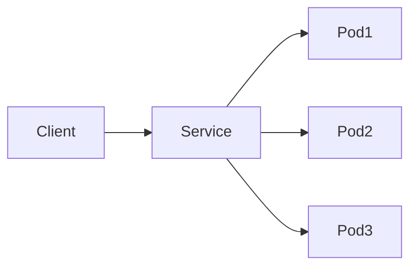

👉 Service는 여러 Pod를 하나의 엔드포인트로 묶는다.

---

### Service 타입 구조 (전체 그림)

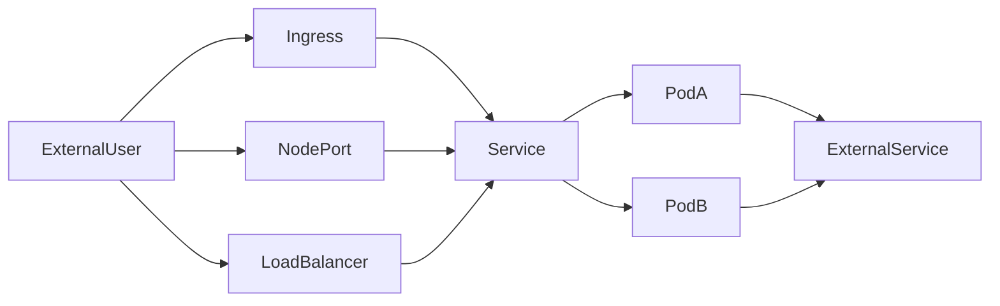

👉 외부/내부 흐름을 한 번에 이해할 수 있는 구조

---

### Service 타입 정리

#### ClusterIP (기본)

👉 내부 통신용

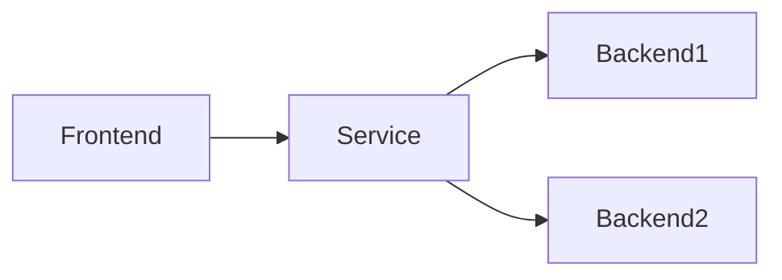

---

#### NodePort

👉 노드 IP + 포트로 외부 접근

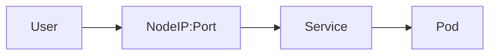

---

#### LoadBalancer

👉 클라우드 LB 연동

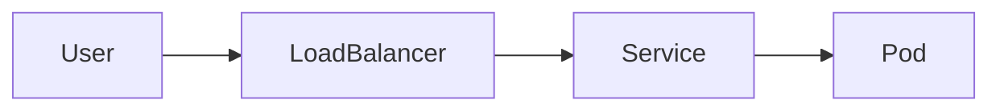

---

#### ExternalName

👉 외부 서비스 연결

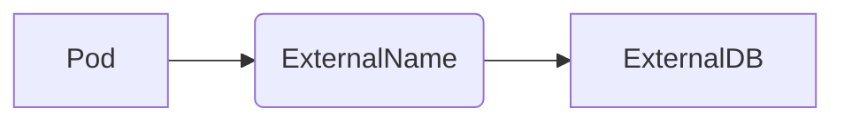

---

#### Headless Service

👉 직접 Pod 선택 (로드밸런싱 없음)

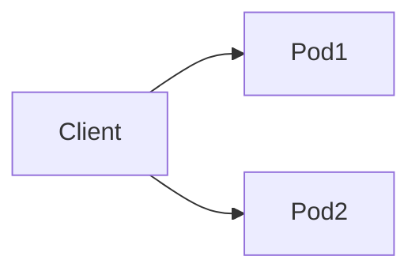

---

### Service YAML (ClusterIP)

```yaml
apiVersion: v1
kind: Service
metadata:
  name: my-service
spec:
  type: ClusterIP
  selector:
    app: my-app
  ports:
  - protocol: TCP
    port: 8080
```

---

### selector의 의미 (중요)

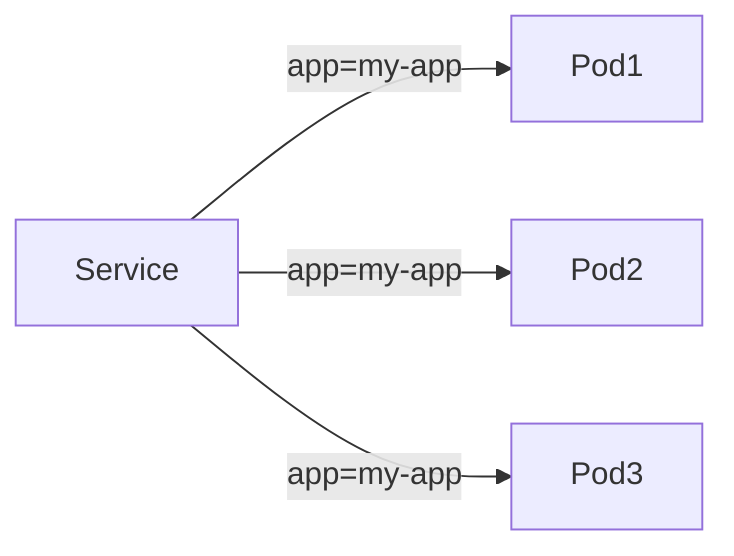

👉 label 기반으로 Pod 선택

---

### Deployment와 연결 구조

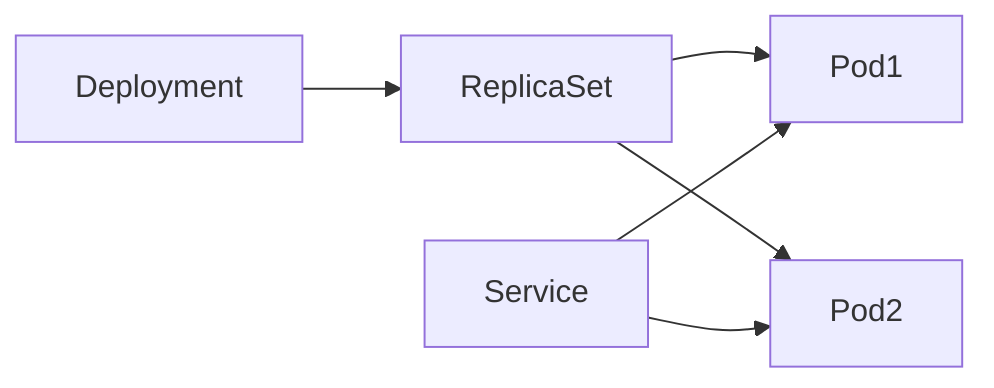

👉 Service는 Deployment가 아니라 Pod를 바라본다

---

### 실제 요청 흐름

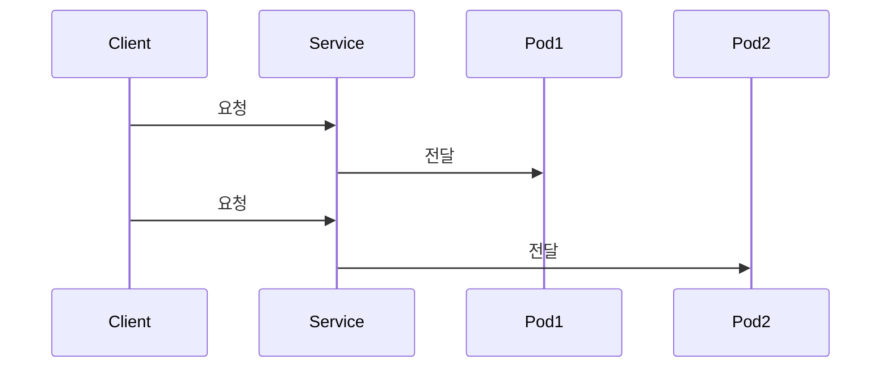

👉 기본적으로 라운드 로빈 방식

---

### Session Affinity

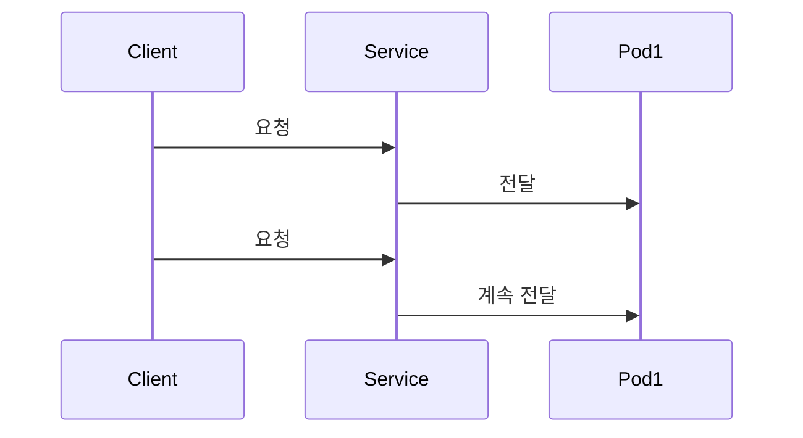

👉 같은 클라이언트 → 같은 Pod

---

### ExternalName 흐름


---

### 핵심 정리

* Service = Pod 앞에 있는 네트워크 게이트웨이
* selector = Pod 선택 기준
* 내부적으로 EndpointSlice로 Pod 관리
* DNS + LB + 안정성 제공

---

### 한 줄 핵심 정리

👉 Service는
**“변하는 Pod를 대신하는 고정된 네트워크 진입점”**

---

### 전체 흐름 연결

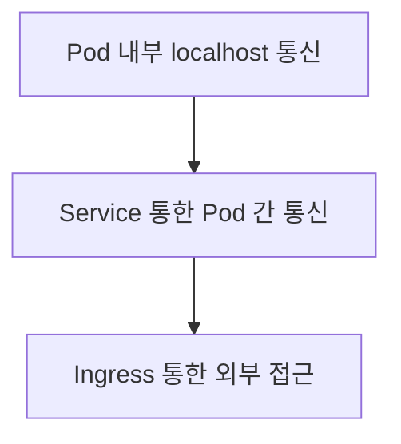

---


