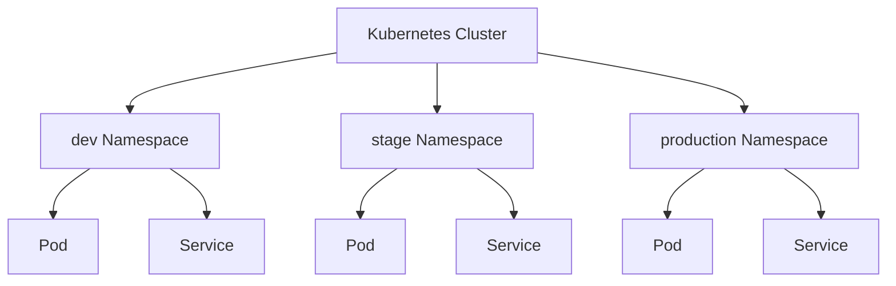
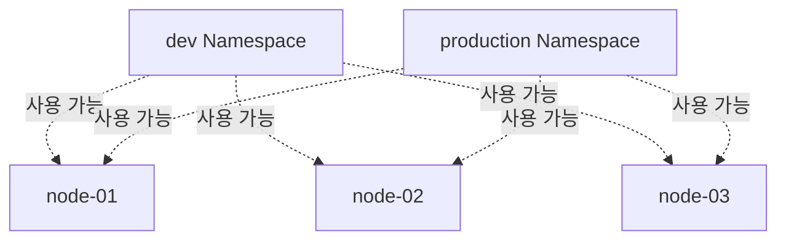
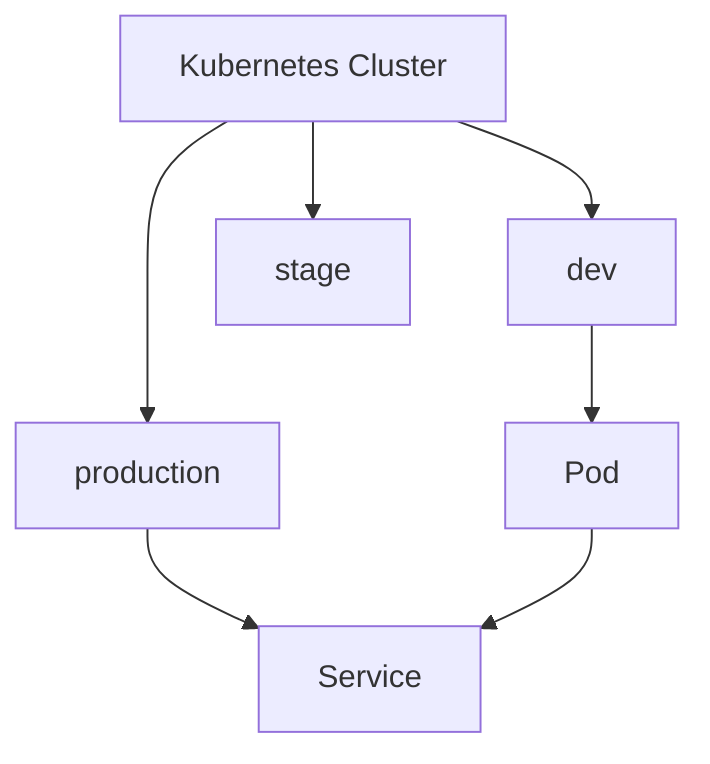

# Ch 9. Kubernetes 객체 - Security

# Ch 9. Kubernetes 객체 - Security
* toc
{:toc}

---

## 01. Namespace

Kubernetes 클러스터는 보통 하나의 서비스만 운영하는 것이 아니라
여러 서비스, 여러 프로젝트, 여러 팀이 함께 사용하는 경우가 많다.

특히 규모가 큰 환경에서는:

* 수십 ~ 수천 개의 노드
* 여러 부서
* 여러 개발 환경(dev/stage/prod)
* 다양한 서비스

들이 하나의 클러스터 안에서 함께 동작한다.

이때 가장 중요한 문제가 바로:

```text
- 객체 이름 충돌
- 잘못된 selector 연결
- 다른 팀 리소스 삭제
- 환경 간 설정 충돌
```

같은 문제들이다.

---

### Namespace란?

Namespace는

👉 Kubernetes 클러스터를 논리적으로 분리하는 단위

다.

---

### Namespace 구조



---

### Namespace의 목적

* 서비스 단위 분리
* 팀 단위 분리
* 프로젝트 단위 분리
* 환경(dev/stage/prod) 분리

---

### Namespace 특징

* 물리적 분리 ❌
* 논리적 분리 ✅
* 계층 구조 ❌
* 평면 구조 ✅

즉:

```text
dev
stage
production
```

은 서로 독립적인 Namespace이지,

```text
project
 └─ dev
```

같은 하위 Namespace 개념은 아니다.

---

### Namespace와 Node 관계

Namespace는 논리적 분리일 뿐
실제 Node 자체를 분리하는 개념은 아니다.



👉 같은 Node 위에서 서로 다른 Namespace의 Pod가 실행될 수 있다.

---

### Namespace 생성 (YAML)

```yaml
apiVersion: v1
kind: Namespace
metadata:
  name: my-namespace
```

---

### YAML 설명

#### kind: Namespace

* Namespace 객체 생성

---

#### metadata.name

```yaml
metadata:
  name: my-namespace
```

* Namespace 이름 지정
* 클러스터 내에서 고유해야 함

---

### Namespace 생성 (명령형)

```bash
kubectl create namespace my-namespace
```

---

### 생성 방식

| 방식             | 특징     |
| -------------- | ------ |
| YAML           | 선언형 관리 |
| kubectl create | 빠른 생성  |

---

### Namespace가 먼저 필요한 이유

Kubernetes 대부분 객체는 Namespace에 소속된다.

예:

* Pod
* Service
* Secret
* PVC

따라서:

```text
Namespace 생성
→ 이후 객체 생성 가능
```

순서가 된다.

---

### Namespace 삭제

```bash
kubectl delete namespace my-namespace
```

---

### 주의사항

Namespace 삭제 시:

```text
해당 Namespace 내부 모든 객체가 함께 삭제
```

된다.

---

### Pod에 Namespace 지정

```yaml
apiVersion: v1
kind: Pod
metadata:
  name: my-simple-pod
  namespace: dev
spec:
  containers:
  - name: my-container
    image: nginx
```

---

### 핵심 포인트

```yaml
metadata:
  namespace: dev
```

👉 객체가 어느 Namespace에 속할지 지정

---

### Namespace 조회

```bash
kubectl -n dev get pods
```

---

### 의미

* `-n` = namespace 지정
* dev namespace 내부 Pod 조회

---

### alias 활용

```bash
alias kd='kubectl -n dev'
```

---

### 사용 예시

```bash
kd get pods
```

👉 반복 입력 감소

---

### 전체 Namespace 조회

```bash
kubectl get pods --all-namespaces
```

---

### 기본 Namespace

Namespace를 지정하지 않으면:

```text
default
```

Namespace에 생성된다.

---

### Namespace 간 통신

Namespace가 다르다고 해서
완전히 통신이 차단되는 것은 아니다.

---

### 다른 Namespace Service 호출

```bash
curl http://my-service.production.svc.cluster.local:8080
```

---

### 통신 구조


---

### Kubernetes DNS 구조

```text
서비스명.네임스페이스.svc.cluster.local
```

---

### 예시 분석

```text
my-service.production.svc.cluster.local
```

| 구성            | 의미         |
| ------------- | ---------- |
| my-service    | Service 이름 |
| production    | Namespace  |
| svc           | Service    |
| cluster.local | 클러스터 도메인   |

---

### Namespace에 속하는 객체

대표적으로:

* Pod
* Service
* Secret
* ConfigMap
* PVC

등이 있다.

---

### Namespace에 속하지 않는 객체

대표적으로:

* Node
* PersistentVolume(PV)

같은 객체는 클러스터 전체 단위 객체다.

---

### 핵심 정리

* Namespace = 논리적 분리 단위
* 물리적 서버 분리 아님
* 대부분 객체는 Namespace 소속
* DNS 기반 cross-namespace 통신 가능

---

### 한 줄 핵심 정리

👉 Namespace는
**“하나의 Kubernetes 클러스터를 논리적으로 분리하기 위한 공간”**

---

### 전체 흐름



---


