# Ch 9. Kubernetes 객체 - Security

# Ch 9. Kubernetes 객체 - Security
* toc
{:toc}

---

## 01. Namespace

Kubernetes 클러스터는 보통 하나의 서비스만 운영하는 것이 아니라
여러 서비스, 여러 프로젝트, 여러 팀이 함께 사용하는 경우가 많다.

특히 규모가 큰 환경에서는:

* 수십 ~ 수천 개의 노드
* 여러 부서
* 여러 개발 환경(dev/stage/prod)
* 다양한 서비스

들이 하나의 클러스터 안에서 함께 동작한다.

이때 가장 중요한 문제가 바로:

```text
- 객체 이름 충돌
- 잘못된 selector 연결
- 다른 팀 리소스 삭제
- 환경 간 설정 충돌
```

같은 문제들이다.

---

### Namespace란?

Namespace는

👉 Kubernetes 클러스터를 논리적으로 분리하는 단위

다.

---

### Namespace 구조

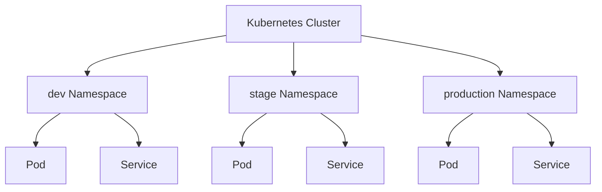

---

### Namespace의 목적

* 서비스 단위 분리
* 팀 단위 분리
* 프로젝트 단위 분리
* 환경(dev/stage/prod) 분리

---

### Namespace 특징

* 물리적 분리 ❌
* 논리적 분리 ✅
* 계층 구조 ❌
* 평면 구조 ✅

즉:

```text
dev
stage
production
```

은 서로 독립적인 Namespace이지,

```text
project
 └─ dev
```

같은 하위 Namespace 개념은 아니다.

---

### Namespace와 Node 관계

Namespace는 논리적 분리일 뿐
실제 Node 자체를 분리하는 개념은 아니다.

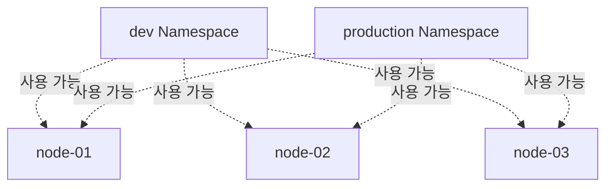

👉 같은 Node 위에서 서로 다른 Namespace의 Pod가 실행될 수 있다.

---

### Namespace 생성 (YAML)

```yaml
apiVersion: v1
kind: Namespace
metadata:
  name: my-namespace
```

---

### YAML 설명

#### kind: Namespace

* Namespace 객체 생성

---

#### metadata.name

```yaml
metadata:
  name: my-namespace
```

* Namespace 이름 지정
* 클러스터 내에서 고유해야 함

---

### Namespace 생성 (명령형)

```bash
kubectl create namespace my-namespace
```

---

### 생성 방식

| 방식             | 특징     |
| -------------- | ------ |
| YAML           | 선언형 관리 |
| kubectl create | 빠른 생성  |

---

### Namespace가 먼저 필요한 이유

Kubernetes 대부분 객체는 Namespace에 소속된다.

예:

* Pod
* Service
* Secret
* PVC

따라서:

```text
Namespace 생성
→ 이후 객체 생성 가능
```

순서가 된다.

---

### Namespace 삭제

```bash
kubectl delete namespace my-namespace
```

---

### 주의사항

Namespace 삭제 시:

```text
해당 Namespace 내부 모든 객체가 함께 삭제
```

된다.

---

### Pod에 Namespace 지정

```yaml
apiVersion: v1
kind: Pod
metadata:
  name: my-simple-pod
  namespace: dev
spec:
  containers:
  - name: my-container
    image: nginx
```

---

### 핵심 포인트

```yaml
metadata:
  namespace: dev
```

👉 객체가 어느 Namespace에 속할지 지정

---

### Namespace 조회

```bash
kubectl -n dev get pods
```

---

### 의미

* `-n` = namespace 지정
* dev namespace 내부 Pod 조회

---

### alias 활용

```bash
alias kd='kubectl -n dev'
```

---

### 사용 예시

```bash
kd get pods
```

👉 반복 입력 감소

---

### 전체 Namespace 조회

```bash
kubectl get pods --all-namespaces
```

---

### 기본 Namespace

Namespace를 지정하지 않으면:

```text
default
```

Namespace에 생성된다.

---

### Namespace 간 통신

Namespace가 다르다고 해서
완전히 통신이 차단되는 것은 아니다.

---

### 다른 Namespace Service 호출

```bash
curl http://my-service.production.svc.cluster.local:8080
```

---

### 통신 구조

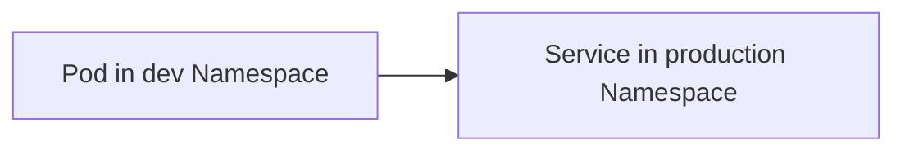

---

### Kubernetes DNS 구조

```text
서비스명.네임스페이스.svc.cluster.local
```

---

### 예시 분석

```text
my-service.production.svc.cluster.local
```

| 구성            | 의미         |
| ------------- | ---------- |
| my-service    | Service 이름 |
| production    | Namespace  |
| svc           | Service    |
| cluster.local | 클러스터 도메인   |

---

### Namespace에 속하는 객체

대표적으로:

* Pod
* Service
* Secret
* ConfigMap
* PVC

등이 있다.

---

### Namespace에 속하지 않는 객체

대표적으로:

* Node
* PersistentVolume(PV)

같은 객체는 클러스터 전체 단위 객체다.

---

### 핵심 정리

* Namespace = 논리적 분리 단위
* 물리적 서버 분리 아님
* 대부분 객체는 Namespace 소속
* DNS 기반 cross-namespace 통신 가능

---

### 한 줄 핵심 정리

👉 Namespace는
**“하나의 Kubernetes 클러스터를 논리적으로 분리하기 위한 공간”**

---

### 전체 흐름

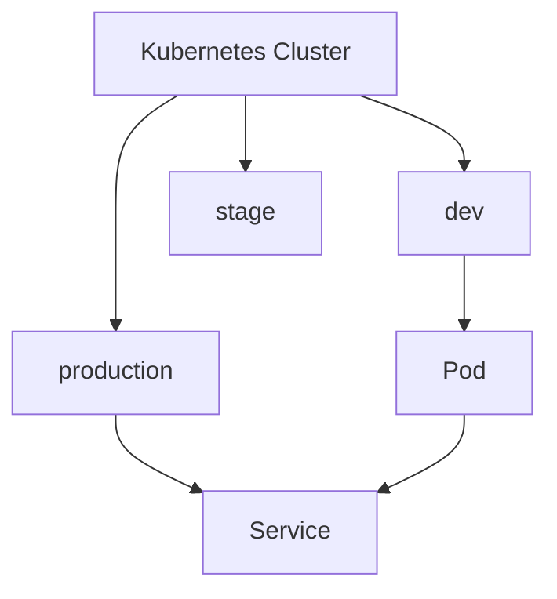

---


## NetworkPolicy

Kubernetes 클러스터 내부의 Pod들은 기본적으로
👉 Namespace를 넘어 서로 자유롭게 통신할 수 있다.

이 구조는 일반적인 Private Network처럼 동작하기 때문에 자연스러운 동작이지만,
클러스터 규모가 커지고 여러 팀이나 서비스가 함께 사용하는 환경에서는 문제가 될 수 있다.

예를 들면:

```text
- 다른 서비스 Pod 호출 가능
- 내부 API 무단 접근 가능
- 민감한 시스템 접근 가능
- 보안 정책 적용 어려움
```

같은 문제들이 발생할 수 있다.

---

### NetworkPolicy란?

NetworkPolicy는

👉 **Pod 간 네트워크 통신 허용 여부를 제어하는 보안 정책 객체**

다.

---

### 핵심 역할

* 특정 Pod만 접근 허용
* 특정 Namespace만 접근 허용
* 특정 포트만 허용
* 들어오는 트래픽(Ingress) 제어
* 나가는 트래픽(Egress) 제어

---

### 기본 특징

NetworkPolicy는

👉 **화이트리스트 방식**

으로 동작한다.

즉:

```text
명시적으로 허용하지 않은 트래픽은 차단
```

된다.

---

### 기본 구조

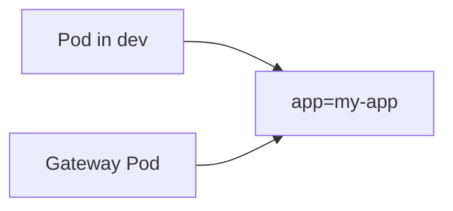

👉 특정 Pod로 들어오는 트래픽만 허용 가능

---

### Ingress 정책 예시

```yaml
apiVersion: networking.k8s.io/v1
kind: NetworkPolicy
metadata:
  name: my-netpol
spec:
  podSelector:
    matchLabels:
      app: my-app

  ingress:
  - from:
    - namespaceSelector:
        matchLabels:
          profile: dev

    - podSelector:
        matchLabels:
          role: gateway

    ports:
    - protocol: TCP
      port: 8080
```

---

### 전체 구조

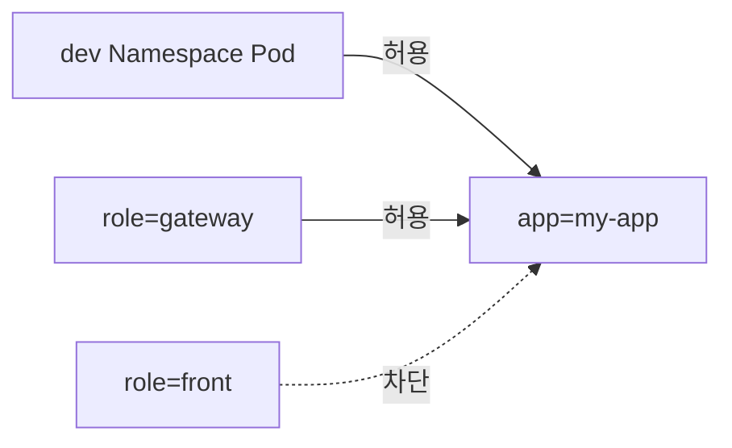

---

### YAML 핵심 설명

#### podSelector

```yaml
podSelector:
  matchLabels:
    app: my-app
```

👉 정책이 적용될 대상 Pod 선택

즉:

```text
app=my-app Pod에 대한 접근 정책
```

을 의미한다.

---

### ingress

```yaml
ingress:
```

👉 들어오는 트래픽 제어

---

### from

```yaml
from:
```

👉 어떤 대상이 접근 가능한지 정의

---

### namespaceSelector

```yaml
namespaceSelector:
  matchLabels:
    profile: dev
```

👉 특정 Namespace 허용

---

### 중요 포인트

NamespaceSelector는:

```text
Namespace의 label 기준
```

으로 동작한다.

즉 Namespace에도 label이 필요하다.

예:

```bash
kubectl label namespace dev profile=dev
```

---

### podSelector

```yaml
podSelector:
  matchLabels:
    role: gateway
```

👉 특정 Pod 허용

---

### ports

```yaml
ports:
- protocol: TCP
  port: 8080
```

👉 허용할 포트 지정

---

### 포트 제한 의미

```text
8080 포트만 허용
```

다른 포트는 차단된다.

---

### 포트 생략 시

```text
모든 포트 허용
```

---

### 허용/차단 흐름

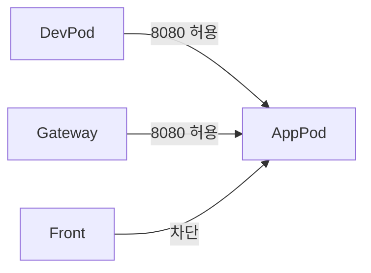

---

### AND / OR 조건

이 부분이 매우 중요하다.

---

### OR 조건

```yaml
- namespaceSelector:
    matchLabels:
      profile: dev

- podSelector:
    matchLabels:
      role: gateway
```

👉 서로 다른 항목으로 나뉘어 있으면 OR 조건

즉:

```text
dev Namespace 이거나
gateway Pod 이면 허용
```

---

### AND 조건

```yaml
- namespaceSelector:
    matchLabels:
      profile: production

  podSelector:
    matchLabels:
      role: front
```

👉 같은 항목 내부에 있으면 AND 조건

즉:

```text
production Namespace 이면서
role=front Pod
```

만 허용

---

### Egress 정책

Ingress는 들어오는 트래픽 제어였다면,

Egress는:

👉 나가는 트래픽 제어

다.

---

### Egress 예시

```yaml
apiVersion: networking.k8s.io/v1
kind: NetworkPolicy
metadata:
  name: my-netpol

spec:
  podSelector:
    matchLabels:
      app: my-app

  egress:
  - to:
    - namespaceSelector:
        matchLabels:
          profile: production

      podSelector:
        matchLabels:
          role: front
```

---

### Egress 구조

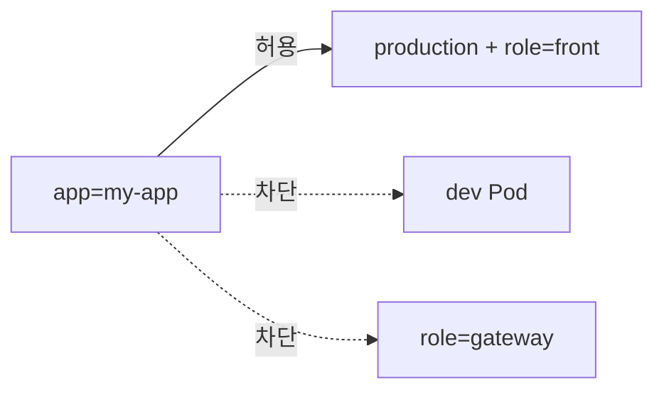

---

### ingress vs egress

| 정책      | 의미          |
| ------- | ----------- |
| ingress | 들어오는 트래픽 제한 |
| egress  | 나가는 트래픽 제한  |

---

### NetworkPolicy 적용 조건

중요한 점:

```text
CNI(Network Plugin)가 지원해야 동작
```

대표적으로:

* Calico
* Cilium

등이 지원한다.

---

### 실제 운영 패턴

실무에서는 보통:

```text
Deployment ↔ Deployment
```

형태로 정책을 만든다.

즉:

* frontend → backend 허용
* backend → database 허용

같은 구조

---

### 전체 구조 예시

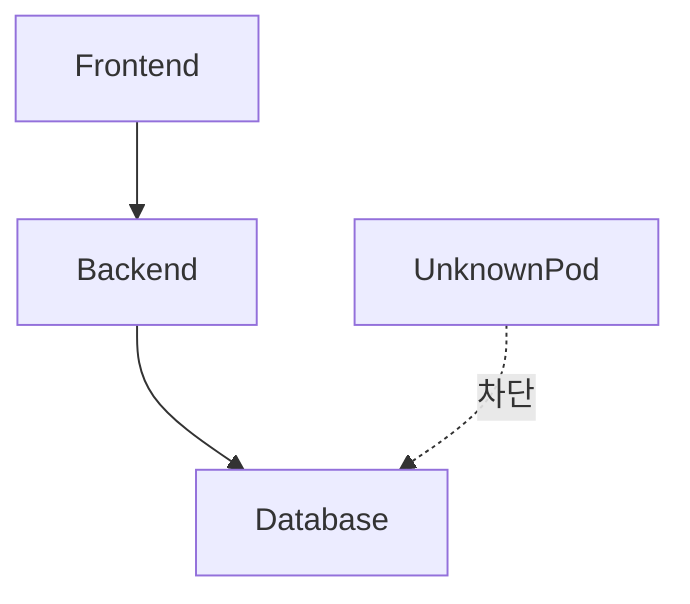

---

### 핵심 정리

* 기본 Kubernetes 네트워크는 모두 연결 가능
* NetworkPolicy로 제한 가능
* 화이트리스트 기반
* ingress / egress 분리 가능
* Namespace + Pod 기준 제어 가능

---

### 한 줄 핵심 정리

👉 NetworkPolicy는
**“Kubernetes Pod 간 통신을 제어하는 네트워크 방화벽 정책”**

---

### 전체 흐름

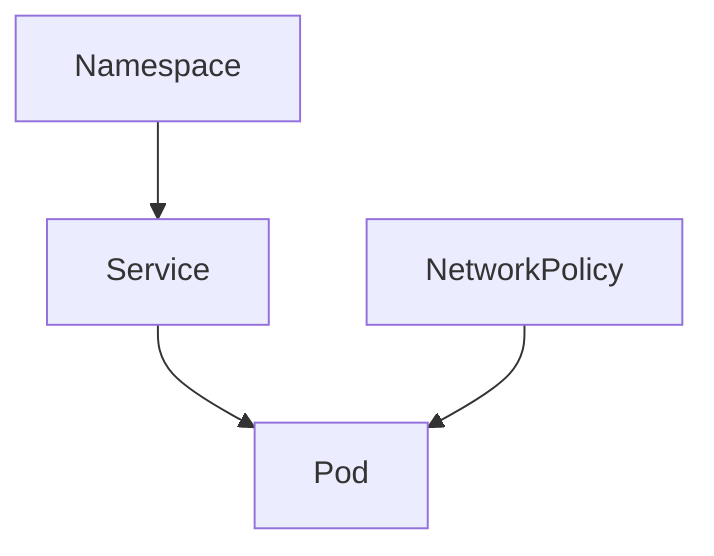

---

## 03.ServiceAccount와 RBAC

### ServiceAccount와 RBAC

Kubernetes에서는 사람뿐 아니라
애플리케이션도 Kubernetes API를 호출할 수 있다.

예를 들어:

* Pod 목록 조회
* ConfigMap 읽기
* Secret 조회
* Deployment 생성

같은 작업들을 프로그램이 자동으로 수행할 수 있다.

이때 Kubernetes는:

```text
누가 어떤 권한으로 API를 호출하는가?
```

를 매우 중요하게 관리한다.

---

### Account 종류

Kubernetes에는 크게 두 가지 계정 개념이 있다.

| 종류             | 설명                     |
| -------------- | ---------------------- |
| User Account   | 사람이 사용하는 계정            |
| ServiceAccount | 애플리케이션이나 프로세스가 사용하는 계정 |

---

### ServiceAccount란?

ServiceAccount는:

👉 Pod 내부 애플리케이션이 Kubernetes API를 호출할 때 사용하는 계정

이다.

예를 들면:

* Operator
* Controller
* CI/CD 시스템
* 모니터링 시스템

같은 것들이 ServiceAccount를 사용한다.

---

### 기본 구조

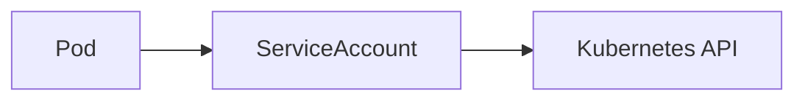

---

### ServiceAccount 생성

```yaml
apiVersion: v1
kind: ServiceAccount
metadata:
  name: my-service-account
  namespace: dev
```

---

### YAML 설명

#### kind: ServiceAccount

```yaml
kind: ServiceAccount
```

👉 ServiceAccount 객체 생성

---

#### metadata.name

```yaml
name: my-service-account
```

👉 ServiceAccount 이름

---

#### metadata.namespace

```yaml
namespace: dev
```

👉 ServiceAccount가 속할 Namespace

ServiceAccount는 Namespace 단위 객체다.

---

### RBAC란?

RBAC는:

👉 Role-Based Access Control

의 약자다.

즉:

```text
역할(Role) 기반 권한 관리
```

를 의미한다.

---

### Kubernetes RBAC 구조

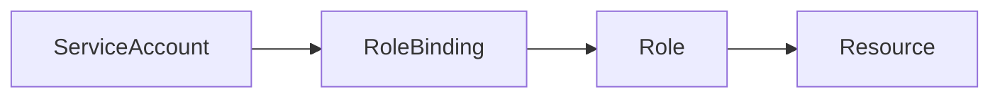

---

### 핵심 흐름

```text
ServiceAccount
→ RoleBinding
→ Role
→ 권한 획득
```

---

### Role

Role은:

👉 특정 리소스에 대한 권한 집합

이다.

예:

* Pod 조회
* Secret 읽기
* ConfigMap 수정

등

---

### Role 생성

```yaml
apiVersion: rbac.authorization.k8s.io/v1
kind: Role
metadata:
  namespace: dev
  name: pod-reader

rules:
- apiGroups: [""]
  resources: ["pods"]
  verbs: ["get", "watch", "list"]
```

---

### 전체 구조

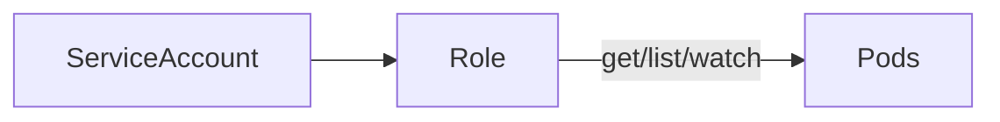

---

### YAML 핵심 설명

#### kind: Role

```yaml
kind: Role
```

👉 Namespace 범위 권한 정의

---

### ClusterRole

Role과 비슷하지만:

👉 클러스터 전체 범위 권한

을 가진다.

예:

* Node 조회
* Namespace 조회
* 전체 Pod 조회

등

---

### Role vs ClusterRole

| 객체          | 범위           |
| ----------- | ------------ |
| Role        | 특정 Namespace |
| ClusterRole | 클러스터 전체      |

---

### rules

```yaml
rules:
```

👉 권한 규칙 정의

---

### apiGroups

```yaml
apiGroups: [""]
```

👉 Core API 그룹 의미

대표적으로:

* pods
* services
* configmaps

등

---

### resources

```yaml
resources: ["pods"]
```

👉 어떤 리소스에 대한 권한인지 지정

---

### verbs

```yaml
verbs: ["get", "watch", "list"]
```

👉 허용할 작업 정의

---

### 주요 verbs

| verb   | 의미    |
| ------ | ----- |
| get    | 단일 조회 |
| list   | 목록 조회 |
| watch  | 변경 감시 |
| create | 생성    |
| update | 수정    |
| delete | 삭제    |

---

### RoleBinding

Role만 만든다고 권한이 적용되지는 않는다.

👉 누구에게 Role을 연결할지 지정해야 한다.

그 역할이 바로:

```text
RoleBinding
```

이다.

---

### RoleBinding 생성

```yaml
apiVersion: rbac.authorization.k8s.io/v1
kind: RoleBinding

metadata:
  name: read-pods
  namespace: dev

subjects:
- kind: ServiceAccount
  name: my-service-account

roleRef:
  kind: Role
  name: pod-reader
  apiGroup: rbac.authorization.k8s.io
```

---

### 전체 흐름

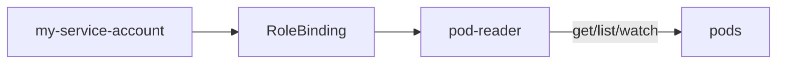

---

### subjects

```yaml
subjects:
```

👉 권한을 부여받을 대상

---

### ServiceAccount 연결

```yaml
- kind: ServiceAccount
  name: my-service-account
```

👉 해당 ServiceAccount에 Role 연결

---

### roleRef

```yaml
roleRef:
```

👉 어떤 Role을 연결할지 지정

---

### roleRef.kind

```yaml
kind: Role
```

* Role 연결 가능
* ClusterRole 연결 가능

---

### roleRef.name

```yaml
name: pod-reader
```

👉 연결할 Role 이름

---

### Pod에서 ServiceAccount 사용

ServiceAccount를 만들었다고 자동으로 사용되지는 않는다.

Pod에서 직접 지정해야 한다.

---

### Pod 설정

```yaml
apiVersion: v1
kind: Pod

metadata:
  name: my-pod
  namespace: default

spec:
  serviceAccountName: my-service-account

  containers:
  - name: my-container
    image: my-image
```

---

### 핵심 설정

```yaml
serviceAccountName: my-service-account
```

👉 Pod가 사용할 ServiceAccount 지정

---

### 전체 동작 흐름

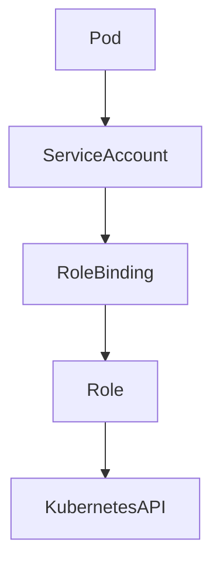

---

### 왜 중요한가?

만약 모든 Pod가 관리자 권한을 가진다면:

```text
- Secret 조회 가능
- 다른 Pod 삭제 가능
- Deployment 수정 가능
- 클러스터 전체 접근 가능
```

같은 심각한 보안 문제가 발생할 수 있다.

---

### Least Privilege 원칙

Kubernetes RBAC의 핵심은:

👉 최소 권한 원칙

이다.

즉:

```text
필요한 권한만 부여
```

하는 것이 중요하다.

---

### 실무 패턴

실무에서는 보통:

```text
Pod → ServiceAccount → RoleBinding → Role
```

구조를 사용한다.

그리고:

* Namespace 단위 권한 제한
* 읽기 전용 Role 분리
* 관리자 권한 최소화

같은 방식으로 운영한다.

---

### 핵심 정리

* ServiceAccount는 애플리케이션 계정
* Role은 권한 정의
* RoleBinding은 권한 연결
* Pod는 ServiceAccount 사용 가능
* RBAC는 최소 권한 원칙 기반

---

### 한 줄 핵심 정리

👉 RBAC는
**“누가 어떤 Kubernetes 리소스에 어떤 작업을 할 수 있는지 제어하는 권한 시스템”**

---

### 전체 흐름 요약

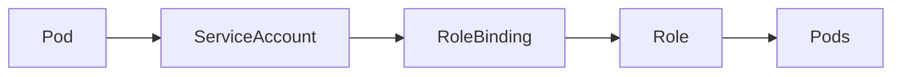

---


---


