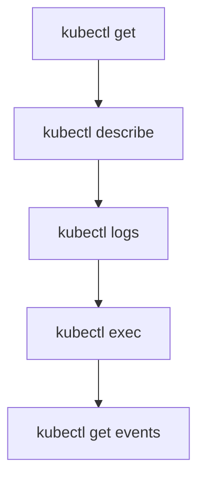
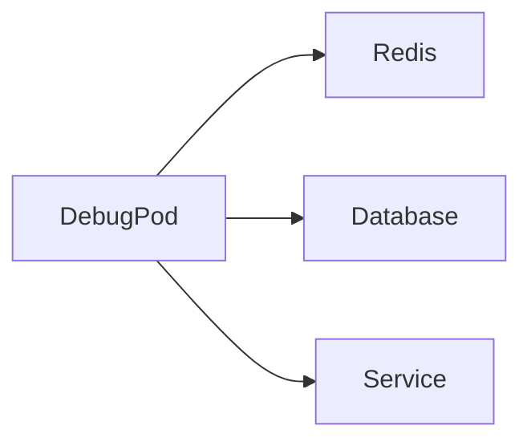

# Ch 10. Kubernetes 모니터링과 디버깅

# Ch 10. Kubernetes 모니터링과 디버깅
* toc
{:toc}

---

## 01. Kubernetes 모니터링과 디버깅

### Kubernetes 모니터링과 디버깅

Kubernetes는 수많은 Pod와 컨테이너가 동적으로 생성되고 삭제되는 환경이다.

따라서:

```text
- 현재 어떤 상태인지
- 어떤 문제가 발생했는지
- 왜 Pod가 실행되지 않는지
- 어떤 이벤트가 발생했는지
```

를 빠르게 파악하는 능력이 매우 중요하다.

Kubernetes에서는 기본적으로 `kubectl` 명령어를 통해
모니터링과 디버깅 기능을 제공한다.

---

### Kubernetes 디버깅 흐름

실무에서는 보통 다음 순서로 문제를 추적한다.



---

### kubectl version

클라이언트와 Kubernetes API 서버의 버전 및 연결 상태를 확인한다.

```shell
$ kubectl version

Client Version: v1.28.2
Kustomize Version: v5.0.4
Server Version: v1.27.3
```

---

### 주요 확인 포인트

| 항목                | 설명                   |
| ----------------- | -------------------- |
| Client Version    | kubectl 버전           |
| Server Version    | Kubernetes API 서버 버전 |
| Kustomize Version | 내장 Kustomize 버전      |

---

### 연결 오류 예시

```shell
error: Get "http://localhost:8080/version":
connection reset by peer
```

이런 오류는 보통:

* API 서버 다운
* kubeconfig 문제
* 네트워크 연결 문제

등이 원인이다.

---

### kubectl get

Kubernetes 객체 목록이나 상태를 조회한다.

가장 많이 사용하는 명령어 중 하나다.

---

### Pod 조회

```shell
$ kubectl get pod my-simple-pod

NAME            READY   STATUS    RESTARTS   AGE
my-simple-pod   1/1     Running   0          5m
```

---

### 주요 컬럼 설명

| 컬럼       | 설명           |
| -------- | ------------ |
| READY    | 준비 완료 컨테이너 수 |
| STATUS   | 현재 상태        |
| RESTARTS | 재시작 횟수       |
| AGE      | 생성 후 경과 시간   |

---

### STATUS 주요 상태

| 상태               | 의미     |
| ---------------- | ------ |
| Running          | 정상 실행  |
| Pending          | 스케줄 대기 |
| CrashLoopBackOff | 반복 크래시 |
| Error            | 실행 실패  |
| Completed        | 정상 종료  |

---

### YAML 형식 조회

```shell
$ kubectl get pod my-simple-pod -o yaml
```

---

### 예시

```yaml
apiVersion: v1
kind: Pod
metadata:
  name: my-simple-pod
  namespace: default
```

---

### 왜 중요한가?

`-o yaml` 옵션은:

```text
현재 Kubernetes 내부 실제 상태
```

를 그대로 보여준다.

따라서:

* 설정 확인
* 필드 디버깅
* 상태 분석

에 매우 중요하다.

---

### kubectl describe

객체의 상세 상태를 조회한다.

```shell
$ kubectl describe pod my-simple-pod
```

---

### 예시

```text
Name: my-simple-pod
Namespace: default
Node: kind-control-plane
Status: Running
```

---

### describe가 중요한 이유

실무에서 가장 많이 보는 정보 중 하나다.

특히:

```text
Events
```

영역이 매우 중요하다.

예를 들어:

* 이미지 Pull 실패
* 스케줄 실패
* 볼륨 마운트 실패
* Probe 실패

같은 원인을 바로 확인할 수 있다.

---

### kubectl logs

컨테이너 로그를 조회한다.

```shell
$ kubectl logs my-simple-pod
```

---

### 로그 예시

```text
Spring Boot :: (v2.2.1.RELEASE)

Starting Application on my-simple-pod
Tomcat initialized with port(s): 8080
```

---

### 자주 사용하는 옵션

#### 특정 컨테이너 로그

```shell
$ kubectl logs my-pod -c my-container
```

---

#### 실시간 로그

```shell
$ kubectl logs -f my-pod
```

---

#### 이전 크래시 로그

```shell
$ kubectl logs --previous my-pod
```

CrashLoopBackOff 디버깅 시 매우 중요하다.

---

### kubectl exec

실행 중인 컨테이너 내부로 진입한다.

```shell
$ kubectl exec -it my-simple-pod -- bash
```

---

### 내부 디버깅 가능

컨테이너 내부에서:

```text
- 파일 확인
- 환경 변수 확인
- curl 테스트
- 프로세스 확인
- 네트워크 확인
```

등을 수행할 수 있다.

---

### 실무에서 자주 하는 작업

#### 환경 변수 확인

```shell
env
```

---

#### DNS 확인

```shell
nslookup my-service
```

---

#### 네트워크 확인

```shell
curl http://my-service
```

---

### kubectl run

임시 Pod를 빠르게 생성한다.

디버깅 용도로 매우 많이 사용된다.

---

### 예시

```shell
$ kubectl run -it --rm redis-pod --image=redis -- sh
```

---

### 활용 사례

임시 컨테이너로:

* Redis 접속
* DB 연결 테스트
* DNS 확인
* 네트워크 확인

등을 수행한다.

---

### 디버깅 Pod 활용 구조



---

### kubectl get events

클러스터 이벤트를 조회한다.

```shell
$ kubectl get events
```

---

### 이벤트 예시

```text
Scheduled
Pulling image
Created container
Started container
```

---

### Events가 중요한 이유

Kubernetes는 내부적으로 수많은 이벤트를 발생시킨다.

따라서:

```text
왜 Pod가 실행되지 않는가?
```

를 분석할 때 매우 중요하다.

---

### 자주 발견되는 문제

| 이벤트              | 의미          |
| ---------------- | ----------- |
| FailedScheduling | 스케줄 실패      |
| FailedMount      | 볼륨 마운트 실패   |
| BackOff          | 재시작 반복      |
| ErrImagePull     | 이미지 다운로드 실패 |

---

### kubectl diff

현재 상태와 YAML 파일 차이를 비교한다.

```shell
$ kubectl diff -f my-simple-pod.yaml
```

---

### 예시

```diff
- image: ubuntu
+ image: ubuntu:23.10
```

---

### 왜 유용한가?

실제 apply 전에:

```text
무엇이 변경되는지
```

를 안전하게 검증할 수 있다.

GitOps 환경에서도 자주 사용된다.

---

### kubectl edit

실행 중인 객체를 직접 수정한다.

```shell
$ kubectl edit pod my-simple-pod
```

---

### 특징

내부적으로:

```text
현재 YAML 조회
→ 편집
→ 즉시 반영
```

과정으로 동작한다.

---

### 주의사항

실무에서는:

* 긴급 장애 대응
* 임시 수정

정도에만 사용하고

보통은:

```text
YAML 수정 → Git 반영 → apply
```

방식을 선호한다.

---

### Kubernetes 디버깅 핵심 흐름

실무에서 가장 자주 사용하는 패턴은 다음과 같다.

---

#### 1단계: 상태 확인

```shell
kubectl get pod
```

---

#### 2단계: 상세 정보 확인

```shell
kubectl describe pod
```

---

#### 3단계: 로그 확인

```shell
kubectl logs
```

---

#### 4단계: 컨테이너 진입

```shell
kubectl exec
```

---

#### 5단계: 이벤트 확인

```shell
kubectl get events
```

---

### 실무 운영 환경

kubectl만으로도 기본 디버깅은 가능하지만
실제 운영 환경에서는 전문 모니터링 도구를 함께 사용한다.

대표적으로:

| 도구            | 용도       |
| ------------- | -------- |
| Prometheus    | 메트릭 수집   |
| Grafana       | 대시보드 시각화 |
| Loki          | 로그 수집    |
| Elasticsearch | 로그 검색    |
| Jaeger        | 분산 트레이싱  |

등이 많이 사용된다.

---

### 핵심 정리

* `kubectl get` → 상태 확인
* `kubectl describe` → 상세 분석
* `kubectl logs` → 애플리케이션 로그 확인
* `kubectl exec` → 컨테이너 내부 진입
* `kubectl get events` → 클러스터 이벤트 확인
* `kubectl diff` → 변경점 비교
* `kubectl edit` → 즉시 수정

---

### 한 줄 핵심 정리

👉 Kubernetes 디버깅은
**“상태 확인 → 이벤트 확인 → 로그 분석 → 내부 진입” 흐름으로 진행된다.**

---


