# Ch 1. MSA를 위한 Kubernetes

# Ch 1. MSA를 위한 Kubernetes
* toc
{:toc}

---

## 01. 12 Factor App

---

### 12 Factor App

* SaaS 애플리케이션을 안정적이고 확장 가능하게 만들기 위한 설계 원칙 모음
* 현대적인 클라우드 네이티브 애플리케이션과 MSA 구조의 기반이 되는 개념
* Kubernetes 환경과도 매우 잘 어울리는 개발 철학이다
* 애플리케이션을 “언제든 확장 가능하고 쉽게 배포 가능하며 장애에 강한 구조”로 만들기 위한 가이드라고 볼 수 있다

---

### 12 Factor App이 등장한 배경

초기 서버 애플리케이션은 다음과 같은 특징이 많았다.

```text
- 서버마다 직접 설치
- 환경마다 다른 코드
- 로컬 파일 저장 의존
- 수동 배포
- 상태를 메모리에 저장
```

하지만:

* 클라우드 환경
* Docker
* Kubernetes
* MSA
* DevOps

등이 보편화되면서 애플리케이션도 “클라우드 친화적”이어야 할 필요가 생겼다.

12 Factor App은 이런 환경에 적합한 애플리케이션 설계 원칙이다.

---

### 전체 구조

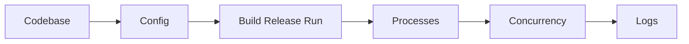

---

### Codebase

#### Codebase란?

* 하나의 애플리케이션은 하나의 코드베이스를 가져야 한다
* 개발/테스트/운영 환경이 서로 다른 코드가 되면 안 된다
* 동일한 코드베이스에서 환경별 설정만 달라져야 한다

---

#### 잘못된 방식

```text
dev-source/
prod-source/
```

환경마다 코드가 달라지는 구조는 유지보수가 매우 어려워진다.

---

#### 올바른 방식

```text
application/
 ├── src/
 ├── application-dev.yaml
 ├── application-prod.yaml
```

---

#### Spring Profile 예시

```java
@Bean
@Profile("local")
public DataSource localDataSource() {
    ...
}

@Bean
@Profile("production")
public DataSource productionDataSource() {
    ...
}
```

---

#### 핵심 개념

```text
코드는 하나
설정만 환경별 분리
```

---

### Dependencies

#### Dependencies란?

* 애플리케이션에서 사용하는 라이브러리와 의존성은 명시적으로 관리되어야 한다
* 서버에 우연히 설치된 라이브러리에 의존하면 안 된다

---

#### 잘못된 방식

```text
운영 서버에만 특정 라이브러리 설치
```

→ 환경마다 실행 결과가 달라질 수 있다.

---

#### 올바른 방식

의존성을 코드로 관리한다.

##### Maven

```xml
<dependency>
    <groupId>org.springframework.boot</groupId>
</dependency>
```

---

##### Gradle

```groovy
implementation 'org.springframework.boot:spring-boot-starter-web'
```

---

#### 핵심 개념

```text
애플리케이션이 필요한 모든 라이브러리는 코드로 선언
```

---

### Config

#### Config란?

* 설정값은 코드에 하드코딩하지 않고 외부 설정으로 분리해야 한다
* 환경별 차이는 Config로 관리한다

---

#### 잘못된 방식

```java
String password = "mypassword";
```

---

#### 올바른 방식

```yaml
spring:
  datasource:
    url: my.database.io:3306/mydb
    username: appuser
    password: ${DB_PASSWORD}
```

---

#### Kubernetes 환경에서의 Config

Kubernetes에서는 보통:

* ConfigMap
* Secret
* Environment Variable

등을 이용해서 설정을 외부화한다.

---

##### ConfigMap 예시

```yaml
apiVersion: v1
kind: ConfigMap
metadata:
  name: my-config
data:
  DB_HOST: mysql
```

---

##### Secret 예시

```yaml
apiVersion: v1
kind: Secret
metadata:
  name: my-secret
stringData:
  DB_PASSWORD: password
```

---

#### 왜 중요한가?

설정이 외부화되면:

```text
- 이미지 재빌드 없이 설정 변경 가능
- 운영 환경 분리 가능
- Git 유출 위험 감소
```

같은 장점이 생긴다.

---

### Backing Service

#### Backing Service란?

* 데이터베이스, 메시지 큐, 캐시 서버 같은 외부 리소스는 느슨하게 연결되어야 한다

---

#### 예시

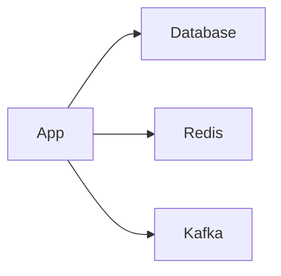

---

#### 핵심 개념

애플리케이션은:

```text
특정 서버에 강하게 의존하지 않아야 한다
```

---

### Build, Release, Run

#### Build / Release / Run 이란?

* 빌드, 릴리즈, 실행 단계를 명확히 분리해야 한다

---

#### 전체 흐름

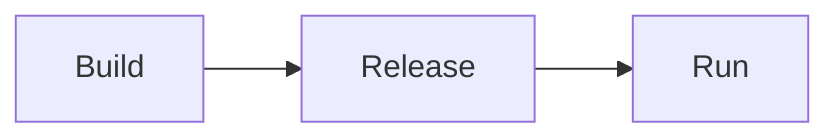

---

#### Build

* 코드와 라이브러리를 결합해 실행 가능한 결과물을 만든다

예시:

```shell
./gradlew build
```

---

#### Release

* 빌드 결과물과 설정을 결합한다
* 실행 직전 상태를 만드는 단계

예시:

```text
jar + config + secret
```

---

#### Run

* 실제 운영 환경에서 애플리케이션을 실행한다

예시:

```shell
java -jar app.jar
```

---

#### 왜 중요한가?

빌드와 운영이 섞이면:

```text
- 운영 환경마다 결과 달라짐
- 재현 불가능
- 롤백 어려움
```

문제가 발생한다.

---

### Processes

#### Processes란?

* 애플리케이션은 Stateless 프로세스로 실행되어야 한다
* 상태를 내부 메모리에 저장하지 않아야 한다

---

#### 잘못된 방식

```text
Application Memory Session
```

Pod 재시작 시 세션이 모두 사라진다.

---

#### 올바른 방식

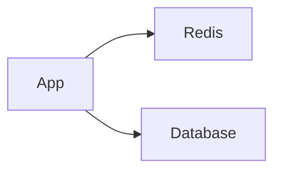

---

#### 핵심 개념

상태는:

* Redis
* Database
* External Storage

같은 외부 저장소에 보관한다.

---

#### Kubernetes와의 관계

Kubernetes에서는 Pod가 언제든 교체될 수 있다.

따라서:

```text
Stateless 구조
```

가 매우 중요하다.

---

### Port Binding

#### Port Binding이란?

* 애플리케이션은 포트를 통해 외부와 통신해야 한다

---

#### 예시

```text
Application :8080
```

---

#### Kubernetes 예시

```yaml
containers:
- name: my-app
  image: my-app
  ports:
  - containerPort: 8080
```

---

#### 핵심 개념

애플리케이션은:

```text
스스로 네트워크 서비스를 제공해야 한다
```

---

### Concurrency

#### Concurrency란?

* 여러 프로세스를 통해 확장 가능해야 한다

---

#### Kubernetes와의 관계

```yaml
replicas: 3
```

처럼 여러 Pod로 수평 확장 가능해야 한다.

---

#### 구조 예시

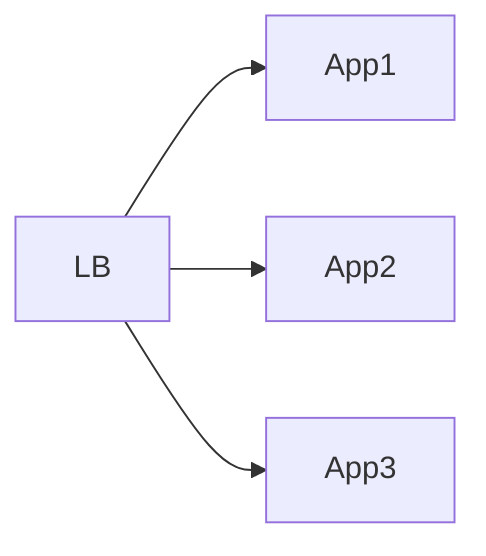

---

#### 핵심 개념

```text
Scale Up보다 Scale Out 친화적 구조
```

---

### Disposability

#### Disposability란?

* 애플리케이션은 빠르게 시작되고 안전하게 종료될 수 있어야 한다

---

#### Kubernetes와 매우 중요한 관계

Kubernetes는:

```text
- Pod 재시작
- Pod 교체
- Auto Scaling
```

을 매우 자주 수행한다.

---

#### 따라서 중요하다

```text
- SIGTERM 처리
- Graceful Shutdown
- 빠른 기동
```

---

#### Spring Boot 예시

```yaml
server:
  shutdown: graceful
```

---

### Dev/Prod Parity

#### Dev/Prod Parity란?

* 개발 환경과 운영 환경 차이를 최소화해야 한다

---

#### 잘못된 방식

```text
개발: H2
운영: Oracle
```

---

#### 문제점

```text
개발에서는 되는데 운영에서만 장애 발생
```

---

#### 권장 방식

```text
가능하면 운영과 유사한 환경 사용
```

---

#### Kubernetes에서의 장점

Docker + Kubernetes를 사용하면:

```text
로컬/개발/운영 환경 차이를 크게 줄일 수 있다
```

---

### Logs

#### Logs란?

* 로그는 파일이 아니라 스트림으로 처리해야 한다

---

#### 잘못된 방식

```text
/app/logs/server.log
```

컨테이너 재시작 시 로그 유실 가능성이 있다.

---

#### 올바른 방식

```text
stdout / stderr 출력
```

---

#### Kubernetes 로그 구조

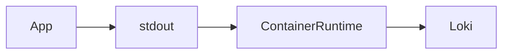

---

#### Spring Boot 예시

```java
log.info("application started");
```

---

#### Kubernetes 로그 확인

```shell
kubectl logs my-pod
```

---

### Admin Processes

#### Admin Processes란?

* 관리성 작업은 별도의 일회성 프로세스로 실행해야 한다

---

#### 예시

```text
- 데이터 마이그레이션
- 관리자 배치
- CSV Export
```

---

#### Kubernetes에서의 방식

보통:

* Job
* CronJob

으로 실행한다.

---

#### Job 예시

```yaml
apiVersion: batch/v1
kind: Job
metadata:
  name: export-job
spec:
  template:
    spec:
      containers:
      - name: exporter
        image: my-exporter
      restartPolicy: Never
```

---

#### 왜 중요한가?

관리 기능을:

```text
서버 내부 기능으로 넣어버리면
```

운영 복잡도가 매우 증가한다.

---

### Kubernetes와 12 Factor App의 관계

12 Factor App은 Kubernetes와 매우 잘 맞는다.

| 12 Factor       | Kubernetes 기능      |
| --------------- | ------------------ |
| Config          | ConfigMap / Secret |
| Processes       | Stateless Pod      |
| Concurrency     | ReplicaSet         |
| Logs            | kubectl logs       |
| Disposability   | Graceful Shutdown  |
| Admin Processes | Job / CronJob      |

---

### 핵심 정리

12 Factor App은:

```text
클라우드 네이티브 애플리케이션을 만들기 위한 기본 원칙
```

이다.

특히 Kubernetes 환경에서는:

```text
- Stateless
- 설정 외부화
- 수평 확장
- 빠른 배포
```

구조가 매우 중요하다.

---

### 한 줄 핵심 정리

👉 12 Factor App은
**“클라우드 환경에서 안정적으로 확장 가능한 애플리케이션을 만들기 위한 설계 원칙”** 이다.


## 02. Kubernetes 기반의 MSA

### Kubernetes 기반의 MSA

Kubernetes는 단순히 컨테이너를 실행하는 플랫폼이 아니라,
MSA(Microservice Architecture)를 안정적으로 운영하기 위한 다양한 기능들을 제공하는 플랫폼이다.

특히 12 Factor App의 철학과 Kubernetes의 구조는 굉장히 잘 맞물린다.

* 설정 외부화
* Stateless 애플리케이션
* 수평 확장
* 서비스 디스커버리
* 로그 스트림 처리
* 일회성 프로세스 실행

같은 현대적인 SaaS 애플리케이션 구조를 자연스럽게 지원한다.

---

### Kubernetes 기반 MSA의 핵심 영역

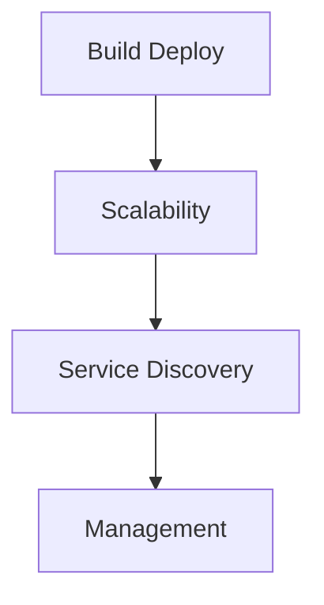

---

### Build / Deploy

#### 관련되는 12 Factor 원칙

* Codebase
* Dependencies
* Config
* Build-Release-Run
* Dev/Prod Parity

---

#### Kubernetes와 Build / Deploy

12 Factor App에서는 하나의 코드베이스를 기준으로 여러 환경이 운영되어야 한다고 이야기한다.

즉:

```text
하나의 코드
→ 하나의 빌드 결과물
→ 환경별 설정만 변경
```

구조를 지향한다.

Kubernetes는 이 구조를 굉장히 잘 지원한다.

---

#### 일반적인 Kubernetes 배포 흐름

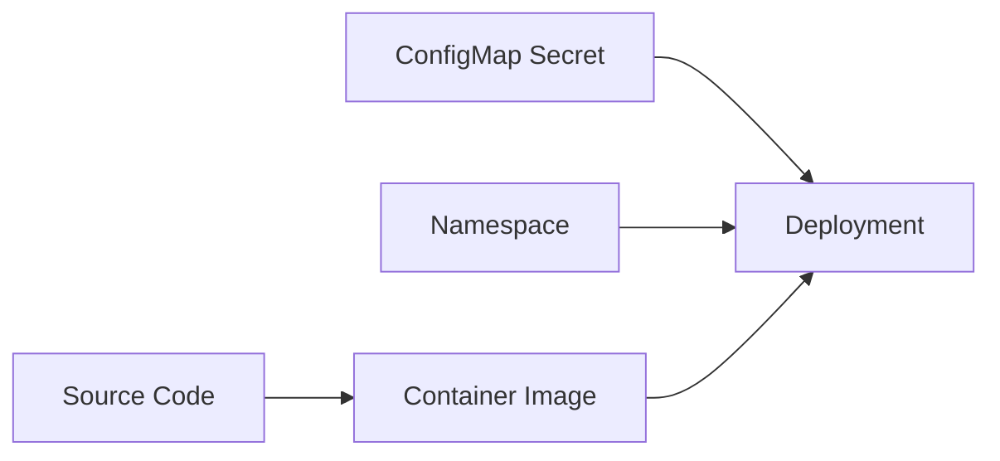

---

#### Build 단계

Build 단계에서는:

* 코드
* 라이브러리
* 의존성

들을 결합하여 실행 가능한 결과물을 만든다.

일반적으로:

```shell
./gradlew build
docker build -t my-app:1.0.0 .
```

형태로 진행된다.

---

#### Container Image

빌드 결과물은 보통 Container Image 형태로 만들어진다.

```text
my-app:1.0.0
```

같은 형태다.

컨테이너 이미지는 불변(Immutable) 특성을 가지기 때문에:

```text
한 번 빌드된 이미지는 변경하지 않는 구조
```

를 지향한다.

---

#### Release 단계

Release 단계에서는:

```text
Container Image
+ ConfigMap
+ Secret
```

을 결합한다.

즉 실행 환경 직전 상태를 구성하는 단계다.

---

#### ConfigMap / Secret

Kubernetes는 설정을 이미지에 포함하지 않는다.

대신:

* ConfigMap
* Secret

을 통해 설정을 외부화한다.

---

#### ConfigMap 예시

```yaml
apiVersion: v1
kind: ConfigMap

metadata:
  name: my-config

data:
  PROFILE: production
  DB_HOST: mysql
```

---

#### Secret 예시

```yaml
apiVersion: v1
kind: Secret

metadata:
  name: my-secret

type: Opaque

stringData:
  DB_PASSWORD: password
```

---

#### Deployment 단계

Deployment는 실제 배포 단위다.

```yaml
apiVersion: apps/v1
kind: Deployment

metadata:
  name: my-app

spec:
  replicas: 3

  selector:
    matchLabels:
      app: my-app

  template:
    metadata:
      labels:
        app: my-app

    spec:
      containers:
      - name: my-app
        image: my-app:1.0.0
```

---

#### replicas

```yaml
replicas: 3
```

* 동일한 Pod를 3개 실행
* 수평 확장 구조 구성

---

#### selector

```yaml
selector:
  matchLabels:
    app: my-app
```

* Deployment가 관리할 Pod 선택

---

#### template

```yaml
template:
```

* 실제 생성될 Pod 템플릿 정의

---

#### Namespace 기반 환경 분리

Kubernetes에서는 보통 Namespace 단위로 환경을 분리한다.

예시:

```text
dev namespace
test namespace
production namespace
```

---

#### Helm 기반 Release 관리

Kubernetes에서는 Helm을 많이 사용한다.

Helm은:

```text
Kubernetes 패키지 매니저
```

역할을 수행한다.

---

#### Helm의 장점

* 배포 자동화
* 환경별 values 관리
* 릴리즈 버전 관리
* 롤백 지원

---

### Scalability

#### 관련되는 12 Factor 원칙

* Processes
* Concurrency
* Disposability

---

#### Kubernetes와 Scalability

Kubernetes는 Stateless 기반 수평 확장 구조를 매우 잘 지원한다.

---

#### Pod 기반 실행 구조

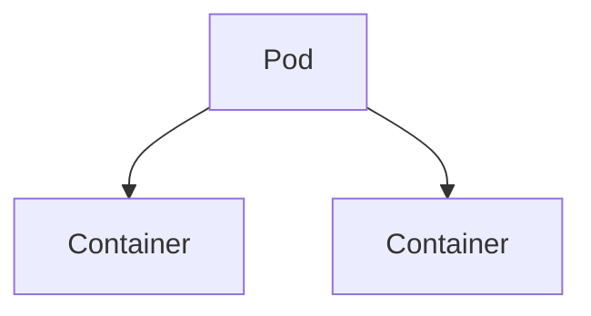

---

#### Processes 원칙

컨테이너 내부에는 반드시 실행 중인 프로세스가 존재해야 한다.

프로세스가 종료되면:

```text
컨테이너 종료
→ Pod 재시작
```

구조가 된다.

즉 Kubernetes에서는 자연스럽게:

```text
프로세스 기반 실행 구조
```

가 강제된다.

---

#### Stateless 구조

Kubernetes에서는:

* Pod 재시작
* Node 장애
* Auto Scaling
* Rolling Update

같은 상황이 매우 자주 발생한다.

따라서:

```text
언제든 교체 가능한 구조
```

가 매우 중요하다.

---

#### Deployment 기반 확장

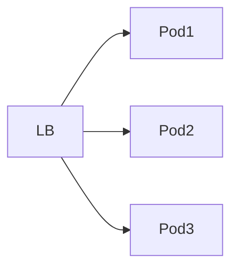

Deployment는 ReplicaSet을 통해 Pod를 여러 개 실행한다.

이를 통해:

```text
Concurrency
```

원칙이 자연스럽게 구현된다.

---

#### Self Healing

Kubernetes는 장애 발생 시 자동 복구 기능을 제공한다.

예시:

```text
- 컨테이너 종료
- Pod 장애
- Node 장애
```

↓

```text
자동 재시작 및 재스케줄링
```

---

#### Graceful Shutdown

Pod 종료 시 Kubernetes는 먼저:

```text
SIGTERM
```

신호를 전달한다.

---

#### 종료 흐름

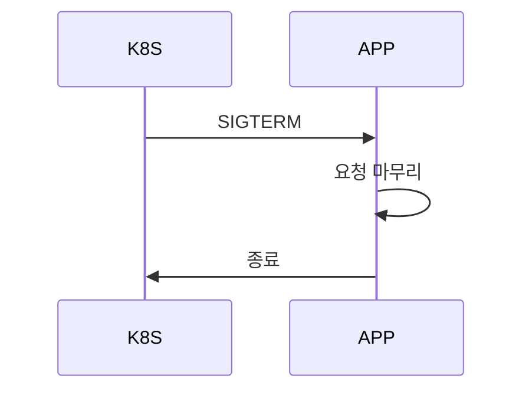

---

#### Spring Boot 예시

```yaml
server:
  shutdown: graceful
```

---

### Service Discovery

#### 관련되는 12 Factor 원칙

* Backing Service
* Port Binding

---

#### Kubernetes와 Service Discovery

Kubernetes는 매우 강력한 네트워크 레이어를 제공한다.

---

#### 일반적인 구조

보통:

```text
Deployment ↔ Service
```

1:1 형태로 구성한다.

---

#### 구조 예시

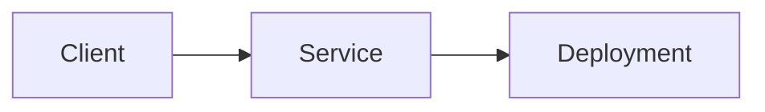

---

#### Service의 역할

Service는:

* Pod 로드밸런싱
* DNS 제공
* 서비스 디스커버리
* 안정적인 네트워크 엔드포인트 제공

역할을 수행한다.

---

#### Service 예시

```yaml
apiVersion: v1
kind: Service

metadata:
  name: my-service

spec:
  selector:
    app: my-app

  ports:
  - port: 8080
```

---

#### selector

```yaml
selector:
  app: my-app
```

* 트래픽을 전달할 Pod 선택

---

#### ports

```yaml
ports:
- port: 8080
```

* Service가 노출할 포트 지정

---

#### Kubernetes DNS

Kubernetes는 자동으로 DNS를 제공한다.

예시:

```text
http://my-service
```

---

#### Service Discovery의 장점

* 별도 Discovery 서버 불필요
* 별도 클라이언트 라이브러리 불필요
* 언어 독립적 구조 가능

---

#### Backing Service 연결

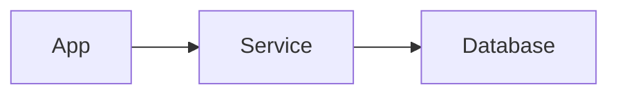

데이터베이스 주소가 변경되거나 인스턴스 개수가 늘어나도:

```text
애플리케이션 수정 없이
Service가 연결 처리
```

를 수행한다.

---

### Management

#### 관련되는 12 Factor 원칙

* Logs
* Admin Processes

---

#### Kubernetes와 로그 처리

Kubernetes는 기본적으로:

```text
stdout / stderr
```

기반 로그 구조를 사용한다.

---

#### 로그 확인

```shell
kubectl logs my-pod
```

---

#### 로그 처리 흐름


---

#### 로그 파일 저장보다 스트림 방식이 중요한 이유

Kubernetes 환경에서는:

* Pod 교체
* 컨테이너 재시작
* 노드 이동

등이 자주 발생한다.

따라서 특정 파일 경로에 로그를 저장하는 방식은 불안정할 수 있다.

그래서:

```text
로그 스트림 기반 구조
```

가 훨씬 적합하다.

---

#### Admin Processes

Kubernetes는 일회성 작업 처리에도 강하다.

대표 객체:

* Job
* CronJob

---

#### Job 예시

```yaml
apiVersion: batch/v1
kind: Job

metadata:
  name: batch-job

spec:
  template:
    spec:
      containers:
      - name: batch
        image: my-batch

      restartPolicy: Never
```

---

#### Job의 장점

* 병렬 처리 가능
* 실패 시 재시도 가능
* 남는 리소스 활용 가능
* 종료 후 리소스 회수 가능

---

#### Job 실행 구조

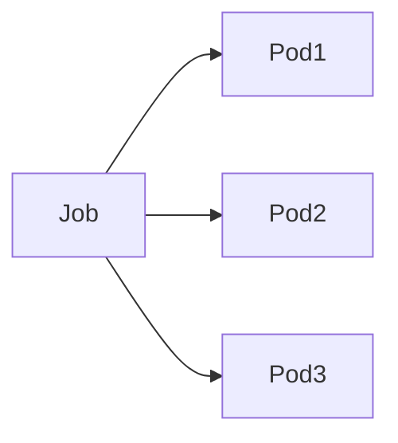

---

### Kubernetes for MSA

Kubernetes는:

```text
언어와 프레임워크 제약 없이
MSA 운영 환경 제공
```

을 목표로 한다.

---

#### Kubernetes 이후 줄어든 기술들

예전 Spring Cloud Netflix 계열:

* Eureka
* Ribbon
* Zuul

등은 Kubernetes 등장 이후 사용 빈도가 줄어든 편이다.

Kubernetes 자체가:

* Service Discovery
* Load Balancing

기능을 제공하기 때문이다.

---

#### 여전히 필요한 기술들

하지만 Kubernetes만으로 모든 문제가 해결되지는 않는다.

예시:

| 영역              | 대표 기술                |
| --------------- | -------------------- |
| API Gateway     | Spring Cloud Gateway |
| Circuit Breaker | Resilience4j         |
| Service Mesh    | Istio                |
| Monitoring      | Prometheus           |
| Visualization   | Grafana              |

---

#### Ingress와 API Gateway 차이

Ingress는:

* Path 기반 라우팅
* TLS 처리

에는 강하지만,

다음 기능은 부족하다:

* JWT 인증
* Rate Limit
* Custom Filter
* 세밀한 API 정책 처리

이런 경우에는 API Gateway가 필요하다.

---

### 핵심 정리

Kubernetes는:

```text
MSA를 위한 운영 플랫폼
```

에 가깝다.

특히:

* Stateless 구조
* 수평 확장
* Service Discovery
* Self Healing
* 로그 스트림 처리
* 설정 외부화

같은 클라우드 네이티브 개발 방식과 매우 잘 어울린다.

