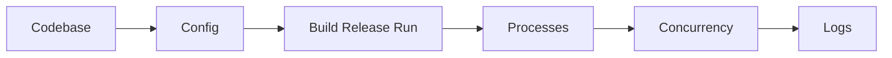
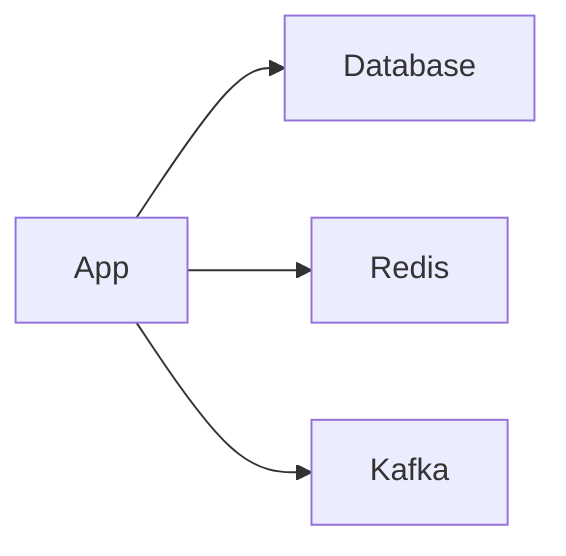
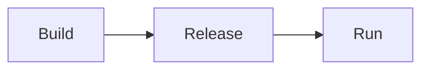
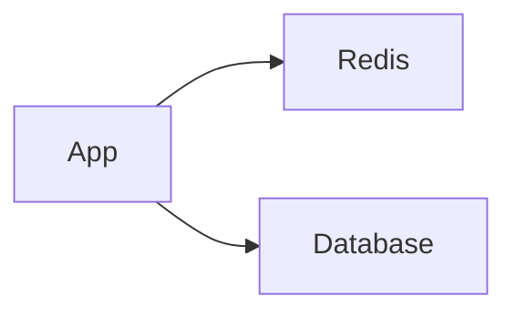
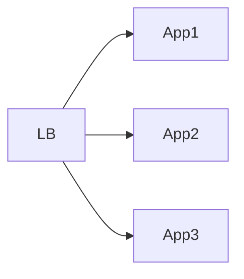
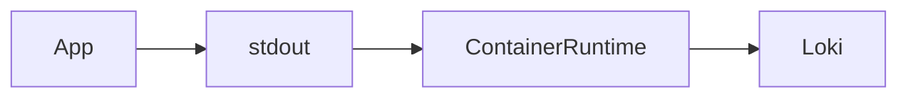

# Ch 1. MSA를 위한 Kubernetes

# Ch 1. MSA를 위한 Kubernetes
* toc
{:toc}

---

## 01. 12 Factor App

### 12 Factor App

* SaaS 애플리케이션을 안정적이고 확장 가능하게 만들기 위한 설계 원칙 모음
* 현대적인 클라우드 네이티브 애플리케이션과 MSA 구조의 기반이 되는 개념
* Kubernetes 환경과도 매우 잘 어울리는 개발 철학이다
* 애플리케이션을 “언제든 확장 가능하고 쉽게 배포 가능하며 장애에 강한 구조”로 만들기 위한 가이드라고 볼 수 있다

---

### 12 Factor App이 등장한 배경

초기 서버 애플리케이션은 다음과 같은 특징이 많았다.

```text
- 서버마다 직접 설치
- 환경마다 다른 코드
- 로컬 파일 저장 의존
- 수동 배포
- 상태를 메모리에 저장
```

하지만:

* 클라우드 환경
* Docker
* Kubernetes
* MSA
* DevOps

등이 보편화되면서
애플리케이션도 “클라우드 친화적”이어야 할 필요가 생겼다.

12 Factor App은 이런 환경에 적합한 애플리케이션 설계 원칙이다.

---

### 전체 구조



---

### Codebase

* 하나의 애플리케이션은 하나의 코드베이스를 가져야 한다
* 개발/테스트/운영 환경이 서로 다른 코드가 되면 안 된다
* 동일한 코드베이스에서 환경별 설정만 달라져야 한다

---

### 잘못된 방식

```text
dev-source/
prod-source/
```

환경마다 코드가 달라지는 구조는 유지보수가 매우 어려워진다.

---

### 올바른 방식

```text
application/
 ├── src/
 ├── application-dev.yaml
 ├── application-prod.yaml
```

---

### Spring Profile 예시

```java
@Bean
@Profile("local")
public DataSource localDataSource() {
    ...
}

@Bean
@Profile("production")
public DataSource productionDataSource() {
    ...
}
```

---

### 핵심 개념

```text
코드는 하나
설정만 환경별 분리
```

---

### Dependencies

* 애플리케이션에서 사용하는 라이브러리와 의존성은 명시적으로 관리되어야 한다
* 서버에 우연히 설치된 라이브러리에 의존하면 안 된다

---

### 잘못된 방식

```text
운영 서버에만 특정 라이브러리 설치
```

→ 환경마다 실행 결과가 달라질 수 있다.

---

### 올바른 방식

의존성을 코드로 관리한다.

#### Maven

```xml
<dependency>
    <groupId>org.springframework.boot</groupId>
</dependency>
```

---

#### Gradle

```groovy
implementation 'org.springframework.boot:spring-boot-starter-web'
```

---

### 핵심 개념

```text
애플리케이션이 필요한 모든 라이브러리는 코드로 선언
```

---

### Config

* 설정값은 코드에 하드코딩하지 않고 외부 설정으로 분리해야 한다
* 환경별 차이는 Config로 관리한다

---

### 잘못된 방식

```java
String password = "mypassword";
```

---

### 올바른 방식

```yaml
spring:
  datasource:
    url: my.database.io:3306/mydb
    username: appuser
    password: ${DB_PASSWORD}
```

---

### Kubernetes 환경에서의 Config

Kubernetes에서는 보통:

* ConfigMap
* Secret
* Environment Variable

등을 이용해서 설정을 외부화한다.

---

### ConfigMap 예시

```yaml
apiVersion: v1
kind: ConfigMap
metadata:
  name: my-config
data:
  DB_HOST: mysql
```

---

### Secret 예시

```yaml
apiVersion: v1
kind: Secret
metadata:
  name: my-secret
stringData:
  DB_PASSWORD: password
```

---

### 왜 중요한가?

설정이 외부화되면:

```text
- 이미지 재빌드 없이 설정 변경 가능
- 운영 환경 분리 가능
- Git 유출 위험 감소
```

같은 장점이 생긴다.

---

### Backing Service

* 데이터베이스, 메시지 큐, 캐시 서버 같은 외부 리소스는 느슨하게 연결되어야 한다

---

### 예시



---

### 핵심 개념

애플리케이션은:

```text
특정 서버에 강하게 의존하지 않아야 한다
```

---

### Build, Release, Run

* 빌드, 릴리즈, 실행 단계를 명확히 분리해야 한다

---

### 전체 흐름



---

### Build

* 코드와 라이브러리를 결합해 실행 가능한 결과물을 만든다

예시:

```shell
./gradlew build
```

---

### Release

* 빌드 결과물과 설정을 결합한다
* 실행 직전 상태를 만드는 단계

예시:

```text
jar + config + secret
```

---

### Run

* 실제 운영 환경에서 애플리케이션을 실행한다

예시:

```shell
java -jar app.jar
```

---

### 왜 중요한가?

빌드와 운영이 섞이면:

```text
- 운영 환경마다 결과 달라짐
- 재현 불가능
- 롤백 어려움
```

문제가 발생한다.

---

### Processes

* 애플리케이션은 Stateless 프로세스로 실행되어야 한다
* 상태를 내부 메모리에 저장하지 않아야 한다

---

### 잘못된 방식

```text
Application Memory Session
```

Pod 재시작 시 세션이 모두 사라진다.

---

### 올바른 방식



---

### 핵심 개념

상태는:

* Redis
* Database
* External Storage

같은 외부 저장소에 보관한다.

---

### Kubernetes와의 관계

Kubernetes에서는 Pod가 언제든 교체될 수 있다.

따라서:

```text
Stateless 구조
```

가 매우 중요하다.

---

### Port Binding

* 애플리케이션은 포트를 통해 외부와 통신해야 한다

---

### 예시

```text
Application :8080
```

---

### Kubernetes 예시

```yaml
containers:
- name: my-app
  image: my-app
  ports:
  - containerPort: 8080
```

---

### 핵심 개념

애플리케이션은:

```text
스스로 네트워크 서비스를 제공해야 한다
```

---

### Concurrency

* 여러 프로세스를 통해 확장 가능해야 한다

---

### Kubernetes와의 관계

```yaml
replicas: 3
```

처럼 여러 Pod로 수평 확장 가능해야 한다.

---

### 구조 예시



---

### 핵심 개념

```text
Scale Up보다 Scale Out 친화적 구조
```

---

### Disposability

* 애플리케이션은 빠르게 시작되고 안전하게 종료될 수 있어야 한다

---

### Kubernetes와 매우 중요한 관계

Kubernetes는:

```text
- Pod 재시작
- Pod 교체
- Auto Scaling
```

을 매우 자주 수행한다.

---

### 따라서 중요하다

```text
- SIGTERM 처리
- Graceful Shutdown
- 빠른 기동
```

---

### Spring Boot 예시

```yaml
server:
  shutdown: graceful
```

---

### Dev/Prod Parity

* 개발 환경과 운영 환경 차이를 최소화해야 한다

---

### 잘못된 방식

```text
개발: H2
운영: Oracle
```

---

### 문제점

```text
개발에서는 되는데 운영에서만 장애 발생
```

---

### 권장 방식

```text
가능하면 운영과 유사한 환경 사용
```

---

### Kubernetes에서의 장점

Docker + Kubernetes를 사용하면:

```text
로컬/개발/운영 환경 차이를 크게 줄일 수 있다
```

---

### Logs

* 로그는 파일이 아니라 스트림으로 처리해야 한다

---

### 잘못된 방식

```text
/app/logs/server.log
```

컨테이너 재시작 시 로그 유실 가능성이 있다.

---

### 올바른 방식

```text
stdout / stderr 출력
```

---

### Kubernetes 로그 구조



---

### Spring Boot 예시

```java
log.info("application started");
```

---

### Kubernetes 로그 확인

```shell
kubectl logs my-pod
```

---

### Admin Processes

* 관리성 작업은 별도의 일회성 프로세스로 실행해야 한다

---

### 예시

```text
- 데이터 마이그레이션
- 관리자 배치
- CSV Export
```

---

### Kubernetes에서의 방식

보통:

* Job
* CronJob

으로 실행한다.

---

### Job 예시

```yaml
apiVersion: batch/v1
kind: Job
metadata:
  name: export-job
spec:
  template:
    spec:
      containers:
      - name: exporter
        image: my-exporter
      restartPolicy: Never
```

---

### 왜 중요한가?

관리 기능을:

```text
서버 내부 기능으로 넣어버리면
```

운영 복잡도가 매우 증가한다.

---

### Kubernetes와 12 Factor App의 관계

12 Factor App은 Kubernetes와 매우 잘 맞는다.

| 12 Factor       | Kubernetes 기능      |
| --------------- | ------------------ |
| Config          | ConfigMap / Secret |
| Processes       | Stateless Pod      |
| Concurrency     | ReplicaSet         |
| Logs            | kubectl logs       |
| Disposability   | Graceful Shutdown  |
| Admin Processes | Job / CronJob      |

---

### 핵심 정리

12 Factor App은:

```text
클라우드 네이티브 애플리케이션을 만들기 위한 기본 원칙
```

이다.

특히 Kubernetes 환경에서는:

```text
- Stateless
- 설정 외부화
- 수평 확장
- 빠른 배포
```

구조가 매우 중요하다.

---

### 한 줄 핵심 정리

👉 12 Factor App은
**“클라우드 환경에서 안정적으로 확장 가능한 애플리케이션을 만들기 위한 설계 원칙”** 이다.

---


