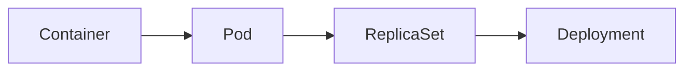
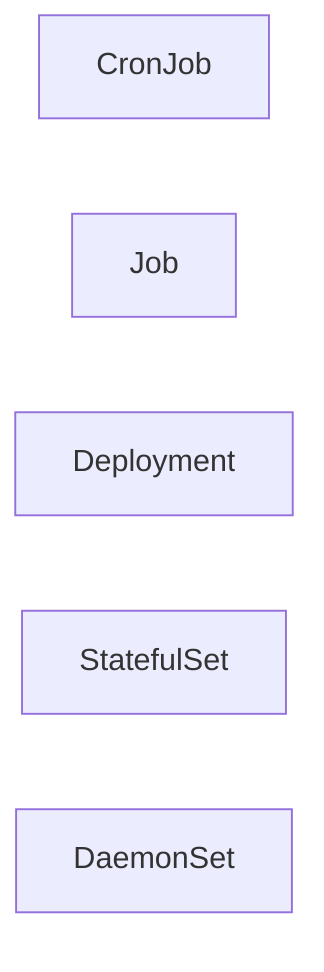
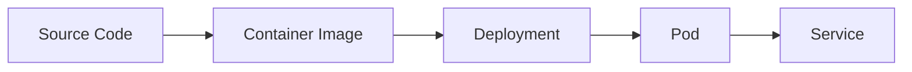
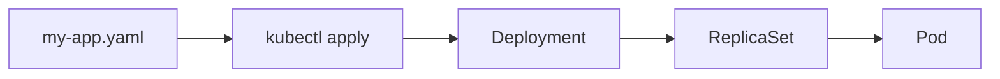
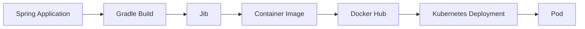

# Ch 2. Kubernetes를 위한 애플리케이션 생성

# Ch 2. Kubernetes를 위한 애플리케이션 생성
* toc
{:toc}

---

## 01. Kubernetes를 위한 애플리케이션 생성

### Kubernetes를 위한 애플리케이션 생성

쿠버네티스에서 애플리케이션을 실행하기 위해서는 먼저 애플리케이션을 컨테이너 이미지로 만들어야 한다.

과거에는 서버에 직접 JDK를 설치하고, 빌드된 JAR 파일을 복사한 뒤 실행하는 방식이 일반적이었다. 하지만 Docker가 대중화된 이후에는 애플리케이션 실행에 필요한 모든 구성 요소를 하나의 컨테이너 이미지에 포함하는 방식이 보편화되었다.

```text
Spring Project
      ↓
application.jar
      ↓
Container Image
      ↓
Container
```

이렇게 생성된 컨테이너 이미지는 Docker와 같은 컨테이너 런타임을 통해 실행될 수 있다.

---

### Kubernetes에서의 실행 단위

컨테이너는 애플리케이션 실행의 기본 단위이지만 Kubernetes에서는 컨테이너를 직접 배포하지 않는다.

Kubernetes가 관리하는 가장 작은 배포 단위는 **Pod** 이다.



Pod는 하나 이상의 컨테이너를 포함할 수 있으며, 같은 Pod 내부의 컨테이너들은 네트워크와 저장소를 비교적 자유롭게 공유할 수 있다.

---

### Kubernetes의 주요 Workload

Kubernetes는 다양한 실행 목적에 맞는 Workload 객체를 제공한다.



각 객체의 역할은 다음과 같다.

| 객체          | 역할                |
| ----------- | ----------------- |
| Deployment  | 일반적인 서버 애플리케이션 배포 |
| StatefulSet | 상태를 가지는 애플리케이션 실행 |
| DaemonSet   | 모든 노드에 하나씩 Pod 실행 |
| Job         | 일회성 작업 실행         |
| CronJob     | 스케줄 기반 작업 실행      |

실제 운영 환경에서는 대부분 Deployment를 사용하며, ReplicaSet은 Deployment 내부에서 자동으로 관리된다. Deployment는 ReplicaSet의 기능에 더해 버전 관리, 롤링 업데이트, 롤백 기능까지 제공한다.

---

### 애플리케이션의 Kubernetes 배포 과정

일반적인 배포 과정은 다음과 같다.



1. 애플리케이션을 컨테이너 이미지로 생성
2. Deployment 작성
3. Pod 생성
4. Service 연결
5. 외부 또는 내부 네트워크에 노출

배포 과정에서 필요에 따라 다음과 같은 설정을 추가할 수 있다.

* Label
* Node Selector
* Affinity
* Environment Variable
* ConfigMap
* Secret
* Volume


---

### 애플리케이션의 Containerization

컨테이너 이미지를 생성하는 방법은 여러 가지가 있지만 대표적으로 Dockerfile과 Gradle Jib를 많이 사용한다.

---

#### Dockerfile 사용

```dockerfile
FROM openjdk:19

COPY ./build/libs/my-app-*.jar /app.jar

CMD ["java", "-jar", "/app.jar"]
```

##### 설정 설명

###### FROM

```dockerfile
FROM openjdk:19
```

컨테이너 이미지의 베이스 이미지를 지정한다.

위 예제에서는 OpenJDK 19가 설치된 이미지를 사용한다.

---

###### COPY

```dockerfile
COPY ./build/libs/my-app-*.jar /app.jar
```

빌드된 JAR 파일을 컨테이너 내부로 복사한다.

```text
호스트 파일
↓
./build/libs/my-app.jar

컨테이너 내부
↓
/app.jar
```

---

###### CMD

```dockerfile
CMD ["java", "-jar", "/app.jar"]
```

컨테이너가 실행될 때 수행할 명령어를 지정한다.

---

#### Docker 이미지 빌드

```shell
docker build -t my-repo/my-app:0.0.1 .
```

##### 옵션 설명

###### -t

```shell
-t my-repo/my-app:0.0.1
```

생성될 이미지 이름과 태그를 지정한다.

```text
Repository : my-repo/my-app
Tag        : 0.0.1
```

---

### Gradle Jib 사용

Docker를 설치하지 않고도 이미지를 생성할 수 있다.

```groovy
jib {
    from {
        image = "openjdk:19"
    }

    to {
        image = "my-repo/my-app"
        tags = ['latest', '0.0.1']
    }

    container {
        creationTime = "USE_CURRENT_TIMESTAMP"
    }
}
```

##### 설정 설명

###### from

```groovy
from {
    image = "openjdk:19"
}
```

베이스 이미지를 지정한다.

---

###### to

```groovy
to {
    image = "my-repo/my-app"
}
```

생성될 이미지 이름을 지정한다.

---

###### tags

```groovy
tags = ['latest', '0.0.1']
```

하나의 이미지에 여러 태그를 부여할 수 있다.

---

###### creationTime

```groovy
creationTime = "USE_CURRENT_TIMESTAMP"
```

이미지 생성 시간을 현재 시각으로 설정한다.

---

### Deployment 스펙 작성

이미지를 만들었다면 이제 Kubernetes에 배포할 Deployment를 작성한다.

```yaml
apiVersion: apps/v1
kind: Deployment

metadata:
  name: my-app

spec:
  replicas: 2

  selector:
    matchLabels:
      app: my-app

  template:
    metadata:
      labels:
        app: my-app

    spec:
      containers:
      - name: my-container
        image: my-repo/my-app:0.0.1
```

---

#### Deployment 설정 설명

##### apiVersion

```yaml
apiVersion: apps/v1
```

Deployment API 버전

---

##### kind

```yaml
kind: Deployment
```

생성할 객체 유형

---

##### metadata.name

```yaml
metadata:
  name: my-app
```

Deployment 이름

---

##### replicas

```yaml
replicas: 2
```

동시에 실행할 Pod 개수

```text
replicas: 2

→ Pod 2개 생성
```

---

##### selector

```yaml
selector:
  matchLabels:
    app: my-app
```

Deployment가 관리할 Pod를 식별하는 기준

---

##### template.metadata.labels

```yaml
labels:
  app: my-app
```

생성될 Pod의 Label

selector와 동일해야 한다.

---

##### containers

```yaml
containers:
- name: my-container
```

Pod 내부에서 실행될 컨테이너 정의

---

##### image

```yaml
image: my-repo/my-app:0.0.1
```

실행할 컨테이너 이미지

---

### 환경 변수 추가

애플리케이션 실행 시 환경 변수를 주입할 수도 있다.

```yaml
containers:
- name: my-container
  image: my-repo/my-app:0.0.1

  env:
  - name: SPRING_PROFILES_ACTIVE
    value: "dev"
```

#### env

```yaml
env:
```

컨테이너 환경 변수 정의

---

#### SPRING_PROFILES_ACTIVE

```yaml
- name: SPRING_PROFILES_ACTIVE
  value: "dev"
```

Spring Boot의 활성 프로파일 지정

```text
application-dev.yml
```

설정이 적용된다.

---

### Kubernetes 적용

Deployment YAML 작성이 완료되었다면 다음 명령어로 클러스터에 적용할 수 있다.

```shell
kubectl apply -f my-app.yaml
```

실행 흐름은 다음과 같다.



Deployment가 생성되면 내부적으로 ReplicaSet이 생성되고, ReplicaSet이 실제 Pod를 생성 및 관리하게 된다.

---

### 정리

Kubernetes에서 애플리케이션을 배포하는 과정은 크게 다음 순서로 이루어진다.

```text
Spring Project
↓
Jar Build
↓
Container Image 생성
↓
Deployment 작성
↓
Pod 생성
↓
Service 연결
↓
운영
```

실제 운영 환경에서는 Deployment를 중심으로 ConfigMap, Secret, Volume, Service, Ingress 등을 함께 사용하여 완전한 애플리케이션 실행 환경을 구성하게 된다.

## 02. 기본 스프링 애플리케이션 생성 및 컨테이너화 

### 기본 스프링 애플리케이션 생성 및 컨테이너화

스프링 애플리케이션을 Kubernetes에 배포하려면 먼저 애플리케이션을 **컨테이너 이미지** 형태로 만들어야 한다.

Kubernetes는 소스 코드나 JAR 파일을 직접 실행하는 플랫폼이 아니다.
Kubernetes는 컨테이너 이미지를 기반으로 Pod를 생성하고, Pod 안에서 컨테이너를 실행한다.

따라서 전체 흐름은 다음과 같다.

```text
Spring Application
↓
JAR Build
↓
Container Image
↓
Image Repository Push
↓
Kubernetes Deployment
```

---

### 컨테이너 이미지 저장소

컨테이너 이미지를 만들었다면 Kubernetes 클러스터가 이미지를 가져올 수 있는 저장소에 이미지를 올려야 한다.

대표적인 방식은 다음과 같다.

#### 로컬 이미지 저장소 사용

로컬 실습 환경에서는 Docker Desktop, kind, minikube 환경에서 로컬 이미지를 사용할 수 있다.

다만 실제 운영 환경에서는 로컬 이미지를 사용하는 방식이 적합하지 않다.

---

#### Private Registry 사용

회사 내부 환경에서는 보통 사설 이미지 저장소를 사용한다.

예를 들면:

* Harbor
* AWS ECR
* Google Artifact Registry
* Azure Container Registry

같은 저장소를 사용할 수 있다.

---

#### Docker Hub 사용

가장 쉽게 실습할 수 있는 방식은 Docker Hub를 사용하는 것이다.

Docker Hub를 사용하는 흐름은 다음과 같다.

```text
hub.docker.com 접속
↓
회원가입 / 로그인
↓
Repositories 이동
↓
Repository 생성
↓
이미지 Push
↓
Kubernetes에서 이미지 Pull
```

---

### 컨테이너 이미지 생성 방식

스프링 애플리케이션을 컨테이너 이미지로 만드는 대표적인 방법은 두 가지다.

#### Dockerfile 사용

Dockerfile을 직접 작성해서 이미지를 생성하는 방식이다.

```dockerfile
FROM openjdk:19

COPY ./build/libs/my-app-*.jar /app.jar

CMD ["java", "-jar", "/app.jar"]
```

---

#### Dockerfile 방식의 특징

* Dockerfile을 직접 관리해야 한다
* 이미지 구조를 세밀하게 제어할 수 있다
* Docker build 명령어를 직접 실행해야 한다

```shell
docker build -t my-repo/my-app:0.0.1 .
```

---

#### Gradle Jib 사용

Gradle Jib는 Dockerfile 없이 Java 애플리케이션을 컨테이너 이미지로 만들어주는 Gradle 플러그인이다.

스프링 애플리케이션에서는 Jib를 사용하면 Dockerfile을 직접 작성하지 않아도 되고, Gradle Task만으로 이미지를 빌드하고 Registry에 Push할 수 있다.

---

### Gradle Jib 설정

#### 플러그인 추가

```groovy
plugins {
    id 'java'
    id 'org.springframework.boot' version '3.2.0'
    id 'io.spring.dependency-management' version '1.1.4'
    id 'com.google.cloud.tools.jib' version '3.4.0'
}
```

또는 기존 plugins 블록을 쓰지 않는 구조라면 다음과 같이 추가할 수 있다.

```groovy
buildscript {
    dependencies {
        classpath 'com.google.cloud.tools:jib-gradle-plugin:3.4.0'
    }
}
```

---

### Jib 기본 설정 예시

```groovy
jib {
    from {
        image = "openjdk:19"
    }

    to {
        image = "my-dockerhub-id/my-app"
        tags = ["latest", "0.0.1"]
    }

    container {
        creationTime = "USE_CURRENT_TIMESTAMP"
    }
}
```

---

### Jib 설정 설명

#### from

```groovy
from {
    image = "openjdk:19"
}
```

컨테이너 이미지의 기반이 되는 베이스 이미지를 지정한다.

Java 애플리케이션이 실행되어야 하므로 JDK 또는 JRE가 포함된 이미지를 사용한다.

---

#### to

```groovy
to {
    image = "my-dockerhub-id/my-app"
    tags = ["latest", "0.0.1"]
}
```

빌드된 이미지를 어떤 Repository에 Push할지 지정한다.

예를 들어 Docker Hub 계정이 `siksik`이고 Repository 이름이 `my-app`이라면 다음과 같이 작성할 수 있다.

```groovy
to {
    image = "siksik/my-app"
    tags = ["latest", "0.0.1"]
}
```

---

#### tags

```groovy
tags = ["latest", "0.0.1"]
```

하나의 이미지에 여러 태그를 부여한다.

다만 운영 환경에서는 `latest`만 사용하는 것은 권장되지 않는다.
배포 버전을 명확하게 추적하기 어렵기 때문이다.

운영에서는 보통 다음과 같이 명확한 버전 태그를 사용한다.

```text
0.0.1
1.0.0
2025.03.01
git-commit-hash
```

---

#### container

```groovy
container {
    creationTime = "USE_CURRENT_TIMESTAMP"
}
```

컨테이너 이미지의 생성 시간을 설정한다.

Jib는 기본적으로 재현 가능한 빌드를 위해 이미지 생성 시간을 고정된 과거 시점으로 설정하는 경우가 있다.
실습이나 이미지 생성 시각 확인이 필요한 경우에는 `USE_CURRENT_TIMESTAMP`를 지정해서 현재 시간을 사용하도록 설정할 수 있다.

---

### Jib Task 실행

Jib 플러그인을 추가하면 Gradle Task에 `jib` 작업이 생긴다.

```shell
./gradlew jib
```

이 명령어를 실행하면 다음 작업이 한 번에 수행된다.

```text
애플리케이션 빌드
↓
컨테이너 이미지 생성
↓
Registry Push
```

즉 Dockerfile을 직접 작성하거나 `docker build`, `docker push`를 따로 실행하지 않아도 된다.

---

### Docker Hub 인증

Docker Hub에 이미지를 Push하려면 인증이 필요하다.

#### Docker CLI 로그인

```shell
docker login
```

로그인 후 `./gradlew jib`를 실행하면 Docker 인증 정보를 사용해서 이미지를 Push할 수 있다.

---

#### Jib에서 직접 인증 정보 지정

필요하다면 Jib 설정에 인증 정보를 직접 지정할 수도 있다.

```groovy
jib {
    to {
        image = "my-dockerhub-id/my-app"
        auth {
            username = "my-dockerhub-id"
            password = "my-password"
        }
    }
}
```

다만 비밀번호를 `build.gradle`에 직접 작성하는 것은 피해야 한다.

실무에서는 보통 다음과 같은 방식을 사용한다.

```text
- 환경 변수
- Gradle properties
- CI/CD Secret
```

---

### 환경 변수를 이용한 인증 예시

```groovy
jib {
    to {
        image = "my-dockerhub-id/my-app"
        auth {
            username = System.getenv("DOCKER_USERNAME")
            password = System.getenv("DOCKER_PASSWORD")
        }
    }
}
```

---

### 이미지 Push 이후 Kubernetes에서 사용

이미지를 Repository에 Push했다면 Deployment에서 해당 이미지를 사용할 수 있다.

```yaml
apiVersion: apps/v1
kind: Deployment
metadata:
  name: my-app

spec:
  replicas: 2

  selector:
    matchLabels:
      app: my-app

  template:
    metadata:
      labels:
        app: my-app

    spec:
      containers:
      - name: my-container
        image: my-dockerhub-id/my-app:0.0.1
```

---

### Deployment 적용

```shell
kubectl apply -f my-app.yaml
```

---

### 배포 확인

```shell
kubectl get pods
```

```shell
kubectl get deployment
```

---

### 전체 흐름 정리



---

### Dockerfile vs Jib

| 구분               | Dockerfile | Gradle Jib  |
| ---------------- | ---------- | ----------- |
| Dockerfile 필요    | 필요         | 불필요         |
| Docker Daemon 필요 | 필요         | 불필요         |
| Java 최적화         | 직접 구성      | 자동 최적화      |
| 빌드/Push          | 수동 명령      | Gradle Task |
| 세밀한 이미지 제어       | 높음         | 상대적으로 낮음    |

---

### 정리

스프링 애플리케이션을 Kubernetes에 올리기 위한 핵심 과정은 다음과 같다.

```text
1. Spring 애플리케이션 생성
2. JAR 빌드
3. 컨테이너 이미지 생성
4. 이미지 Repository Push
5. Deployment에서 이미지 참조
6. Kubernetes에 배포
```

Dockerfile 방식도 가능하지만, Java/Spring 애플리케이션에서는 Gradle Jib를 사용하면 훨씬 간단하게 이미지를 만들고 Registry에 Push할 수 있다.
